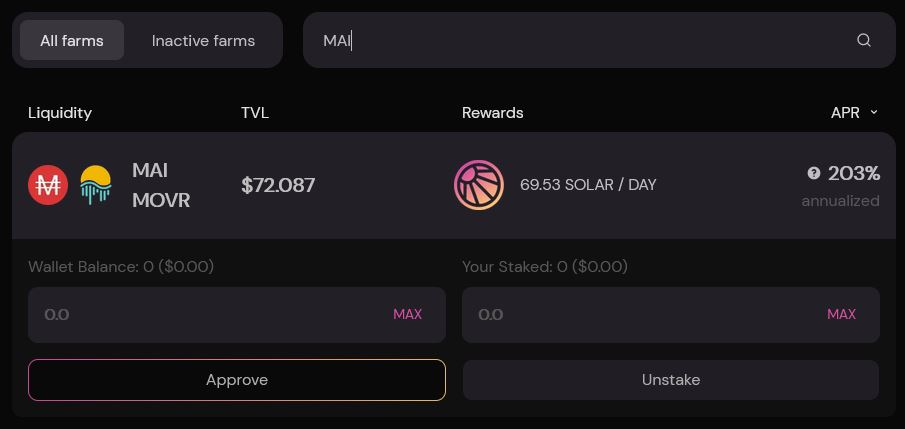
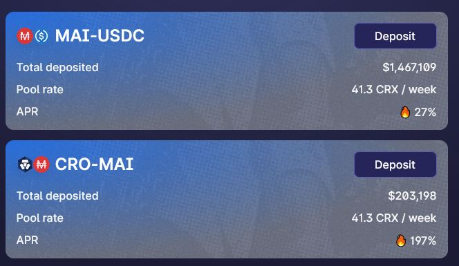

# MAI Metaverse Pt.2

## Harmony

### 什么是Harmony?

Harmony (ONE) 是一个去中心化的区块链平台，旨在作为可扩展性和去中心化工作之间的桥梁。它的发展遵循“大规模去中心化”的座右铭，重点是数据共享以及可替代代币和不可替代资产市场的创建。此外，Harmony 还承诺提供高吞吐量以及两个“低点”：延迟和费用。结合起来，他们应该将平台置于为未来去中心化去信任经济体奠定基础的努力的核心。

然而，Harmony 区块链的独特之处在于其深度分片系统。 shard \*\*\*\* 是一块或一部分的同义词。分片 \*\*\*\* Harmony 意味着将其节点分成四个相等的组。因此，总共有 1000 个节点，分为四个分片，一个分片由 250 个节点组成。此外，分片内的确切节点定期随机混合。这个数字设置得恰到好处，以提高系统的安全性并增加更多的可扩展性。如果你想了解更多关于这条链的信息，你可以阅读这篇[文章](https://guarda.com/academy/crypto/what-is-harmony/)。

### 在 Harmony 上获取 MAI

要将 MAI 从 Polygon 发送到 Harmony，你可以使用 [AnySwap](https://anyswap.exchange/#/router) 平台。 UI 非常简单，你唯一需要做的就是选择拥有 MAI 的链以及要将其发送到哪里。


请注意，在 Anyswap 页面的底部，有一些关于桥接 MAI 的重要信息，因此在进行任何交易之前请先查看。


### 在 Harmony 上使用 MAI

目前，Mai Finance 团队与 Harmony 上的任何收益农场都没有任何合作关系。一旦团队知道正在使用 MAI 的项目，就会更新此文档。敬请关注。

## Moonriver

### 什么是Moonriver?

Moonriver 是 **Moonbeam** 的姊妹网络。与其姐妹类似，Moonriver 是一个完整的类似以太坊的环境，并与行业标准的以太坊工具、DApps 和协议一起使用。 Moonriver 和 Moonbeam 之间的唯一区别是：

* Moonriver 是建立在 Kusama 中继链上的平行链。
* Moonbeam 属于 Polkadot Relay Chain.

Moonriver 是通向 Kusama Relay Chain的一条简单途径\*\*。\*\*它允许熟悉以太坊的团队和开发人员以很少或没有障碍的方式访问 Kusama 网络。它最大限度地减少了在网络上运行现有 Solidity 智能合约所需的更改。因此，以太坊项目可以简单地复制他们的 DApp 并使用流行的部署工具将其部署到 Moonriver。

### 在 Moonriver 上获取 MAI

要将 MAI 发送到 Moonriver，我们将使用 [Relaychain](https://app.relaychain.com/transfer#/cross-chain-bridge-transfer) 平台。它的 UI 与 Anyswap 的 UI 非常相似。当你想从 Polygon 转移 MAI 时，你必须先连接你的 MetaMask 钱包，然后选择你要桥接的资产 (MAI) 和目标网络 (Moonriver)。

### 在 Moonriver 上使用 MAI

你可以在 Polygon 上使用 MAI 来种植产量一样，你可以在 Moonriver 上使用 MAI。这样做的主要地方是 [Solarbeam](https://app.solarbeam.io/farm)。在撰写本文时，唯一可用的使用 MAI 的池是 MOVR/MAI。


请记住，要使用这个农场，你必须存入相同比例的 MOVR 和 MAI 才能创建 LP 代币。


## Cronos

### 什么是Cronos?

Cronos 是与 Crypto.org 链并行运行的 EVM 兼容侧链。在推出 Cronos 之前，Crypto.com 生态系统包括 Crypto.com 链和 Crypto.com 中心化交易所。

Cronos 运行在权威证明 (PoA) 共识算法上，并由 Ethermint 提供支持 - 一种可与以太坊互操作的 PoS 链。它旨在通过允许开发人员从以太坊和其他与 EVM 兼容的链中快速移植应用程序和智能合约来大规模扩展 Chain DeFi 生态系统。

### 在 Cronos 上获取 MAI

要将 MAI 发送到 Cronos，我们将使用 [Relaychain](https://app.relaychain.com/transfer#/cross-chain-bridge-transfer) 平台。步骤与 Moonriver 案例相同，只需选择要发送 MAI 的网络（Polygon）、要接收它的网络（Cronos）和要发送的资产（MAI）。

### 在 Cronos 上使用 MAI

你可以使用 MAI 在 Cronos 上种植产量的主要地方是[ Crodex](https://swap.crodex.app/#/rewards/pair) 平台。在这种情况下，有两对可用，CRO-MAI 对和 MAI-USDC 对。

Crodex 上的 UI 与 Quickswap 非常相似，请记住，如果要使用此农场，则必须存入相同比例的代币才能创建 LP 代币。另外，不要忘记有一些空闲的 CRO 来支付网络费用。

## 免责声明

本指南中提供的详细信息纯粹是教育性的，并未由维护本指南的团队直接测试。 Discord 服务器上的一些用户已经尝试将他们的资产桥接到 Moonriver 和/或 Cronos，因此你可以加入 Discord 社区来提问。请不要忘记做自己的研究，不同的网络会有不同的交易费用和执行时间，不同的奖励计划，桥接费等......如果您将你的 MAI 发送到其他网络，请确保你可以将它们桥接回来以防万一你需要它在多边形上。


请牢记在给定时间运行良好的策略可能在另一个时间表现不佳（或让你赔钱）。请保持消息灵通，监测市场，留意你的投资，并一如既往地，做你的研究。

