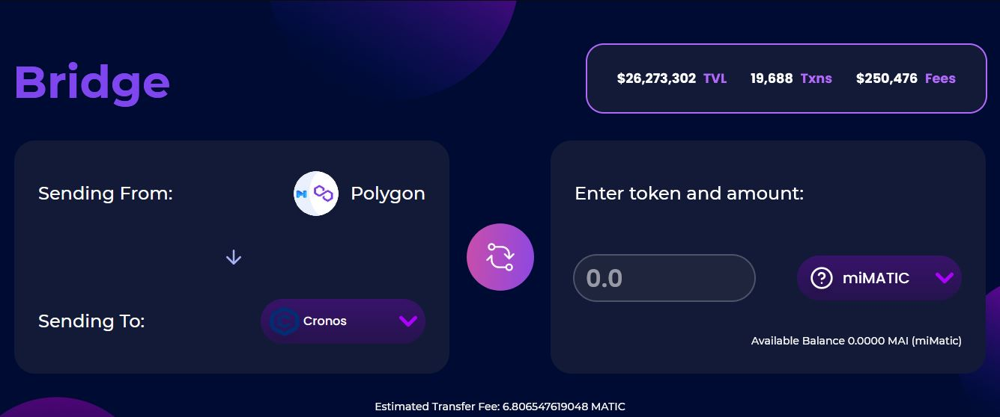

# Metaverso e MAI - Parte 2

## Harmony

### What's Harmony?

Harmony (ONE) is a decentralized blockchain platform designed as a bridge between scalability and decentralization efforts. Its development went under the motto of “decentralization at scale” with the focus on data sharing and the creation of marketplaces of fungible tokens and non-fungible assets. Furthermore, Harmony comes with an additional promise of delivering high throughput accompanied by two “lows”: latency and fees. Combined, they are supposed to put the platform at the heart of the efforts to lay the foundation of the future decentralized trustless economies.

However, what makes the Harmony blockchain unique, its their deep sharding system. A shard \*\*\*\* is a synonym for a piece or a part. By sharding \*\*\*\* Harmony means dividing its nodes in four equal groups. Hence, there are 1 000 nodes total divided into four shards making one shard consisting of 250 nodes. Moreover, the exact nodes within shards are regularly and randomly mixed. This number is set to be exactly so to increase the security of the system and to add more scalability. If you want to learn more about this chain, you can read this [article](https://guarda.com/academy/crypto/what-is-harmony/).

### Getting MAI on Harmony

To send MAI from Polygon to Harmony, you can use the [AnySwap ](https://anyswap.exchange/#/router)platform. The UI is pretty straightforward, the only thing that you will need to do is select the chain where you have the MAI and where do you want to send it.


Be aware that at the bottom of the Anyswap's page, there's some important information about bridging MAI, so check it out before doing any transaction.


### Using MAI on Harmony

Currently, the Mai Finance team does not have any partnership with any yield farm on Harmony. Once the team is aware of projects that are using MAI, this documentation will be updated. Stay tuned.

## Moonriver

### What's Moonriver?

Moonriver is a sister network of **Moonbeam**. Similar to its sister, Moonriver is a full Ethereum-like environment and works with industry-standard Ethereum tools, DApps, and protocols. The only difference between Moonriver and Moonbeam is that:

* Moonriver is a parachain built on Kusama Relay Chain.
* Moonbeam belongs to the Polkadot Relay Chain.

Moonriver is an easy route to Kusama Relay Chain\*\*.\*\* It allows teams and developers ,who are familiar with Ethereum, access to the Kusama Network with little or no barriers. It minimizes the changes required to run existing Solidity smart contracts on the network. Therefore, Ethereum projects can simply replicate their DApp and deploy it to Moonriver using popular deployment tools.

### Getting MAI on Moonriver

To send MAI to Moonriver, we'll use the [Relaychain ](https://app.relaychain.com/transfer#/cross-chain-bridge-transfer)platform. its UI is very similar to the one of Anyswap. When you want to transfer MAI from Polygon, you will have to connect your MetaMask wallet first, then select the asset you want to bridge (MAI) and the destination network (Moonriver).

### Using MAI on Moonriver

The same way you can use MAI to farm yields on Polygon, you can use MAI on Moonriver. The main place to do so is [Solarbeam](https://app.solarbeam.io/farm). As for the time of writing, the only available pool that uses MAI is the MOVR/MAI.


Remember that to use this farm, you will have to deposit the same ratio of MOVR and MAI to create a LP token.


## Cronos

### What's Cronos?

Cronos is an EVM compatible sidechain running in parallel with the Crypto.org Chain. Before launching Cronos, the Crypto.com ecosystem encompasses the Crypto.com chain and Crypto.com centralized exchange.

Cronos is running on a Proof of Authority (PoA) consensus algorithm and is powered by Ethermint - a PoS chain interoperable with Ethereum. It aims to massively scale the Chain DeFi ecosystem, by allowing developers to rapidly port apps & smart contracts from Ethereum and other EVM-compatible chains.

### Getting MAI on Cronos

To send MAI to Cronos, we'll use the [Relaychain ](https://app.relaychain.com/transfer#/cross-chain-bridge-transfer)platform. The steps are the same as in the Moonriver case, just select the network where you are sending the MAI (Polygon), the network where you want to receive it (Cronos) and the asset that you want to send (MAI).

### Using MAI on Cronos

The main place where you can farm yields on Cronos using MAI, is on the [Crodex ](https://swap.crodex.app/#/rewards/pair)platform. In this case, there are two pairs available, the CRO-MAI pair and the MAI-USDC pair.

The UI on Crodex is really similar to Quickswap, just remember that if you want to use this farms, you will have to deposit the same ratio of tokens to create a LP token. Also, don't forget to have some spare CRO to pay the fees of the network.

## Disclaimer

The details presented in this guide are purely educational and have not been tested directly by the team maintaining this guide. A few users on the discord server have already tried bridging their assets to Moonriver and/or Cronos, so you can join the Discord community to ask your questions. Please don't forget to do your own researches, different networks will have different transaction fees and execution times, different reward programs, bridging fees etc ... If you send your MAI to other networks, make sure you can bridge them back in case you need it on Polygon.


Keep in mind that a strategy that works well at a given time may perform poorly (or make you lose money) at another time. Please stay informed, monitor the markets, keep an eye on your investments, and as always, do your own research.

