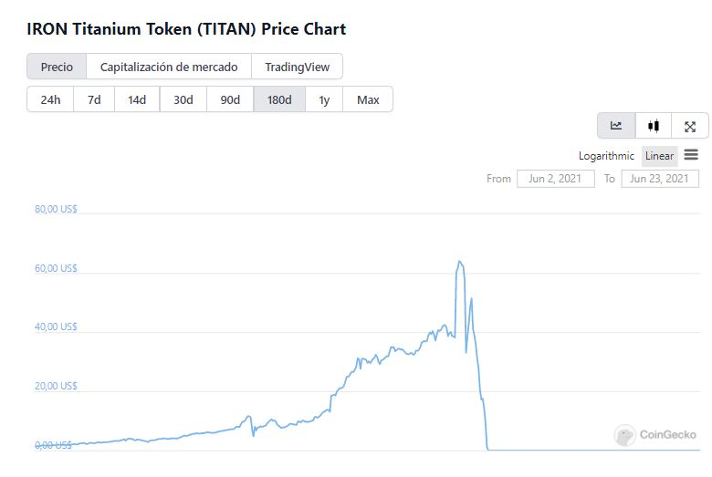

# Come funziona MAI?

## Cos'è una stable coin?

Prima di capire cos'è il MAI, dobbiamo capire cos'è una stable coin. Una stable coin è un tipo di crypto valuta pensata per mantenere un prezzo di mercato stabile. La maggior parte delle stable coin sono ancorate (significa che devono mantenere lo stesso valore di un asset designato) al dollaro USA esistono altre stable coin ancorate ad altre materie prime come l'oro (come EGold) o l'argento ( SilverCoin).

Al di là del tipo di ancoraggio, ci sono 2 categorie principali in cui possono essere classificate tutte le stable coin collateralizzate o non. Le stable coin collateralizzate sono quelle che detengono gli asset a cui sono ancorate mentre le non collateralizzate si avvalgono di algoritmi per controllare l'offerta di token al fine di mantenere il prezzo fisso ad un livello predeterminato.

## Il disastro di IRON Finance

Se sei nel mondo delle crypto valute da un po', potresti ricordare il disastro del token TITAN e IRON, ma per quelli di voi che sono nuovi ecco un breve riassunto. IRON Finance era un progetto che aveva 2 token, la stable coin IRON e il token TITAN, la stable coin IRON non era completamente collateralizzata, la proporzione per coniare IRON era per il 75% in USDC e per il 25% in token TITAN. La ricetta perfetta per il disastro.

Nel giugno del 2021 il token TITAN ha raggiunto un ATH di $65, il che ha fatto sì che un gruppo di investitori, che aveva investito molto nella moneta, ha deciso di vendere. Questo ha causato un problema perché il prezzo di TITAN, come per tutti i token classici, si basava su domanda e offerta. Quando l'offerta disponibile di TITAN è cresciuta notevolmente il suo prezzo ha iniziato a diminuire. Questo ha causato un'enorme pressione di vendita che ha portato il prezzo di TITAN a scendere ancora più velocemente, talmente tanto velocemente che TITAN letteralmente a crollare e di conseguenza la stable coin IRON ha perso il suo "supporto" (il 25% del suo collaterale come abbiamo detto sopra) e alla fine ha perso l'ancoraggio.

Le persone hanno iniziato ad acquistare la stable coin IRON per scambiarla USDC e guadagnare qualche soldo veloce, in un'enorme opportunità di arbitraggio (significa trarre profitto dalle variazioni di prezzo dei token) Per farla breve, è stato calcolato che quasi $1,75 MILIARDI sono stati persi in questo incidente . Ora, quali differenze ci sono tra la stable coin IRON e la stable coin MAI?

## Che cos'è MAI?

MAI è una stable coin supportata da token collateralizzati bloccati, la generazione di MAI può essere effettuata depositando i **collaterali approvati** in un vault o utilizzando **Anchor**.

Quando "coniate" MAI depositando collaterali approvate, il **CDR** (Collateral to Debt Ratio) deve essere compreso sopra il 150%, questo significa che se depositi $100 di collaterale, il MAI coniato può valere al massimo $66,6667. Arriveremo al motivo questa scelta più avanti in questo articolo.

Un altro modo per coniare MAI è attraverso la sezione **Anchor**, quando scambi una stable coin (a partire da settembre 2021 puoi coniare MAI usando **DAI**, **USDC** e **USDT**) per MAI, questa viene coniata dal Tesoro e la stable coin depositata è detenuta nella tesoreria come garanzia. Viceversa, quando scambi MAI per le tue stable coin, il MAI che fornisci viene bruciato.

.png>)

Come puoi vedere nell'immagine qui sotto, il prezzo della stable coin MAI è quasi sempre vicino a $1, questo perché come puoi leggere dalla [documentazione ufficiale](https://docs.mai.finance/stablecoin-economics) , la stable coin MAI consente agli utenti di fare arbitraggio senza rischi tramite Anchor quando il prezzo di MAI scende sotto $ 0,99 o sale sopra $ 1,01.

 (1) (1) (1).png>)

## Perchè è sempre vicina a $1?

L'ancoraggio a $1 è mantenuto da 2 meccanismi,, attraverso **Anchor** o **depositando collaterali** nei vaults.  In questa sezione dell'articolo capirai perché.

### Anchor

Anchor consente agli utenti di coniare MAI con stable coin e riscattare stable coin da MAI. Inoltre, come puoi vedere nell'immagine qui sotto, c'è una commissione dell'1% quando si scambiano le stable coin con MAI o viceversa, ci sono due ragioni principali che giustificano queste commissioni:

* La commissione dell'1% per coniare MAI fissa un prezzo massimo di $1.01
* La commissione dell'1% ri ottenere stable coin fissa un prezzo minimo di $0.99

.png>)

Avere un prezzo massimo e un prezzo minimo aiuta MAI a non divergere troppo dal suo ancoraggio, tuttavia, come hai visto nell'immagine del grafico MAI, puoi avere opportunità di arbitraggio a basso rischio (il che significa che puoi vendere le tue stable coin quando MAI è inferiore a $ 1 o vendere MAI quando è superiore a $ 1 per guadagnare qualche soldo veloce).

Sul che cosa possa causare la fluttuazione del prezzo di MAI possiamo individuare due motivazioni:

* Se il mercato è in un trend **rialzista**: le persone tenderanno ad acquistare asset più volatili utilizzando le loro stable coin. Ciò significa che le persone venderanno i loro MAI, abbassandone il prezzo.
* Se il mercato è in un trend **ribassista**: le persone tenderanno a vendere i loro asset volatili e ad acquistare stable coin per evitare di perdere valore. Ciò significa che le persone acquisteranno MAI, aumentandone il prezzo.

### Depositare collaterali nei vault

Per coniare MAI utilizzando i vault di Mai Finance è necessario depositare dei collaterali a garanzia e avere un **CDR** (**C**ollateral to **D**ebt **R**atio) superiore ad una certa soglia che in questo caso è del 150% (tuttavia questa percentuale può cambiare in futuro se la comunità dovesse decidere in merito). Ciò significa che i vault saranno sempre sovra-collateralizzati (del 150%) per garantire che ci sia sempre un valore del collaterale a sostegno delle stable coin coniate. Ricorda che se un vault ha un **CDR** inferiore al 150% potrebbe essere parzialmente liquidato dalla comunità quindi qualcuno potrebbe perdere parte della propria garanzia se un liquidatore paga parte del debito. 

All'aumentare del valore del collaterale è possibile emettere monete più stabili poiché un aumento del prezzo della garanzia aumenterà il rapporto garanzia/debito. Viceversa al diminuire del valore del collaterale, si possono emettere meno stable coin, questo per evitare che il **CDR** scenda al di sotto della soglia del 150%.

## In chiusura

Come hai potuto vedere in questo articolo, la stable coin MAI è un tipo di moneta stabile che è **sovra-collateralizzata,** il che significa che ci sarà sempre abbastanza collaterale e quindi garanzia per sostenere il prezzo del token MAI. Questo dovrebbe dare abbastanza sollievo agli investitori che esitano a investire in progetti che coniano stable coin. Inoltre, tieni presente che vista l'espansione di MAI ad altre blockchain, ci saranno sempre più MAI nel mercato con conseguente minore volatilità nel prezzo di MAI.

Di recente sono stati introdotti gli incentivi dei vault di Mai Finance, se volete capire di cosa si tratta, vi invito a leggere la guida [Prestiti MAI e Incentivi dei Vault](prestiti-mai-e-incentivi-per-i-vaults.md). Questo è un ulteriore step che aiuterà ancora di più a dare stabilità al prezzo di MAI.

## Disclaimer

Potete trovare l'articolo originale del team di Mai Finance su MAI [qui](https://docs.mai.finance/stablecoin-economics).

Questa guida non è un consiglio finanziario ed è stata realizzata a puro scopo educativo.


Tieni presente che una strategia che funziona bene in un dato momento potrebbe avere un rendimento peggiore (o farti perdere denaro) in un altro. Tieniti aggiornato, monitora i mercati, tieni d'occhio i tuoi investimenti e come sempre, fai le tue ricerche.

