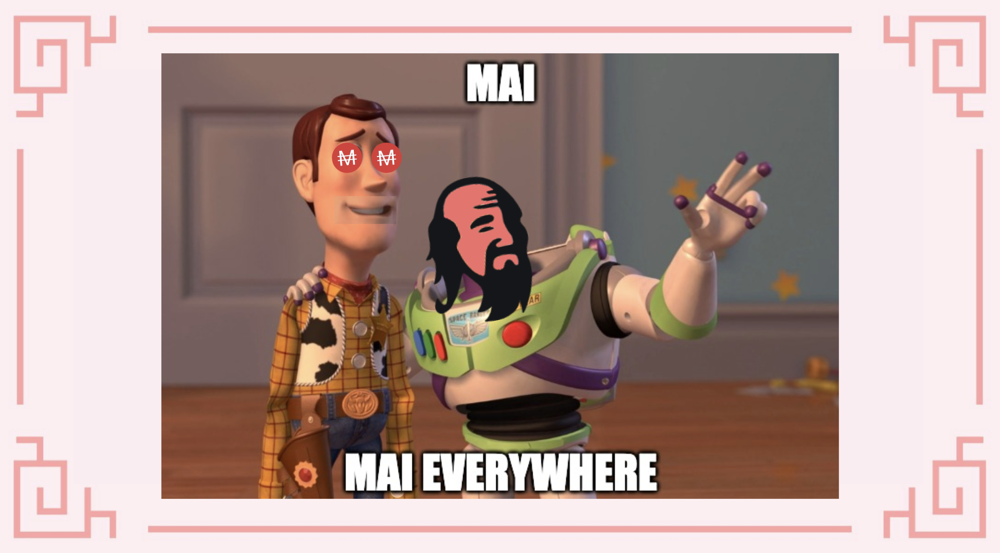
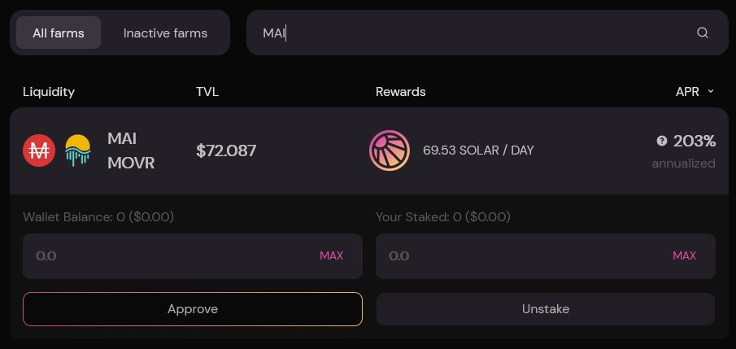
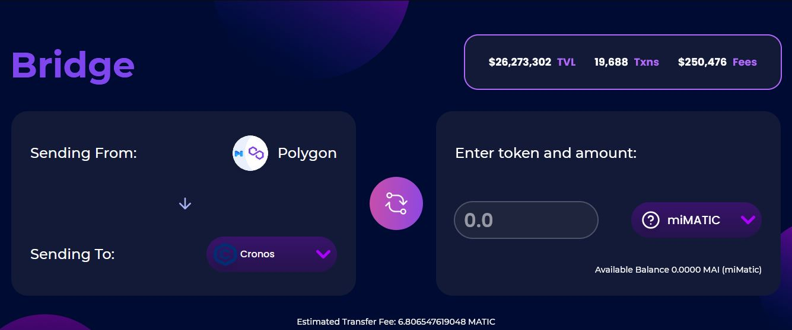
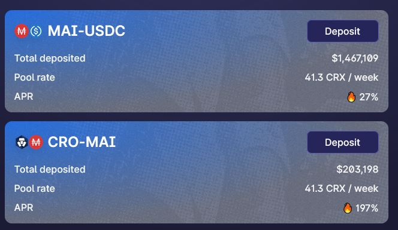

# MAI Metaverse Pt.2

## Harmony

### Cos'è Harmony?

Harmony (ONE) è una piattaforma blockchain decentralizzata progettata come l'unione tra la scalabilità e la decentralizzazione. Il suo sviluppo è nato sotto il motto di "decentralizzazione su larga scala" con l'attenzione alla condivisione dei dati e alla creazione di mercati di token fungibili e assets non fungibili. Inoltre, Harmony offre un'ulteriore promessa di fornire un throughput elevato accompagnato da due fattori molto bassi: latenza e commissioni. Insieme, dovrebbero mettere la piattaforma al centro degli sforzi per gettare le basi delle future economie decentralizzate.

Tuttavia, ciò che rende unica la blockchain di Harmony, è il suo sistema di sharding profondo. Un frammento \*\*\*\* è sinonimo di un pezzo o di una parte. Con sharding \*\*\*\* Harmony intende dividere i suoi nodi in quattro gruppi uguali. Quindi, ci sono 1000 nodi in totale divisi in quattro frammenti che formano ognuno un frammento composto da 250 nodi. Inoltre, i nodi esatti all'interno degli shard vengono mescolati regolarmente e casualmente. Questo numero è impostato esattamente così per aumentare la sicurezza del sistema e per raggiungere maggior scalabilità. Se vuoi saperne di più su questa blockchain, puoi leggere questo [articolo](https://guarda.com/academy/crypto/what-is-harmony/).

### Portare MAI su Harmony

Per trasferire $MAI da Polygon ad Harmony, potete utilizzare la piattaforma [AnySwap](https://anyswap.exchange/#/router). L'interfaccia utente è piuttosto semplice, l'unica cosa che dovrete fare è selezionare la chain in cui avete $MAI e la chain in cui volete trasferirlo.


Tenete presente che nella parte inferiore della pagina di Anyswap, ci sono alcune informazioni importanti sul bridging $MAI, quindi controllale prima di effettuare qualsiasi transazione.


### Usare MAI su Harmony

Attualmente, il team di Mai Finance non ha alcuna partnership con alcuna farm su Harmony. Una volta che il team sarà a conoscenza dei progetti che utilizzano $MAI, questa documentazione verrà aggiornata. Rimanete sintonizzati.

## Moonriver

### Cos'è Moonriver?

Moonriver è una chain "sorella" di Moonbeam. Simile a sua sorella, Moonriver è un ambiente completo simile a Ethereum e funziona con strumenti, DApp e protocolli Ethereum standard nel settore. L'unica differenza tra Moonriver e Moonbeam è che:

* Moonriver è una parachain creata sulla Relay Chain di Kusama.
* Moonbeam è una parachain creata sulla Relay Chain di Polkadot.

Moonriver è un percorso facile per sfruttare la chain Kusama\*\*.\*\* Consente a team e sviluppatori, che hanno familiarità con Ethereum, di accedere alla rete Kusama con poche o nessuna barriera. Riduce al minimo le modifiche necessarie per eseguire gli smart contracts Solidity già esistenti. Pertanto, i progetti Ethereum possono semplicemente replicare la loro DApp e distribuirla su Moonriver utilizzando strumenti di distribuzione popolari.

### Portare MAI su Moonriver

Per trasferire $MAI a Moonriver, useremo la piattaforma [Relaychain](https://app.relaychain.com/transfer#/cross-chain-bridge-transfer). La sua interfaccia utente è molto simile a quella di Anyswap. Quando desiderate trasferire $MAI da Polygon, dovrete prima connettere il vostro portafoglio MetaMask, quindi selezionare l'asset che desiderate trasferire ($MAI) e la rete di destinazione (Moonriver).

### Usare MAI su Moonriver

Allo stesso modo in cui potete usare $MAI per farmare su Polygon, potete usare $MAI su Moonriver. Il protocollo principale per farlo è [Solarbeam](https://app.solarbeam.io/farm). Per quanto riguarda il momento in cui scriviamo, l'unico pool disponibile che utilizza $MAI è $MOVR/$MAI.


Ricordate che per utilizzare questa farm, dovrete depositare lo stesso rapporto di $MOVR e $MAI per creare un token LP.


## Cronos

### Cos'è Cronos?

Cronos è una sidechain compatibile con EVM che funziona in parallelo con la chain Crypto.org. Prima di lanciare Cronos, l'ecosistema Crypto.com comprendeva la chain Crypto.org e lo scambio centralizzato Crypto.com.

Cronos funziona su un algoritmo di consenso Proof of Authority (PoA) ed è alimentato da Ethermint, una catena PoS interoperabile con Ethereum. Mira a scalare in modo massiccio l'ecosistema DeFi, consentendo agli sviluppatori di trasferire rapidamente app e smart contracts da Ethereum e altre chain compatibili con EVM.

### Portare MAI su Cronos

Per trasferire $MAI a Cronos, utilizzeremo la piattaforma [Relaychain](https://app.relaychain.com/transfer#/cross-chain-bridge-transfer). I passaggi sono gli stessi del caso Moonriver, basta selezionare la rete da cui si sta trasferendo $MAI (Polygon), la rete a cui si desidera inviarlo (Cronos) e l'asset che si desidera inviare ($MAI).

### Usare MAI su Cronos

Il luogo principale in cui è possibile farmare su Cronos utilizzando $MAI, è la piattaforma [Crodex](https://swap.crodex.app/#/rewards/pair). In questo caso sono disponibili due coppie, la coppia $CRO-$MAI e la coppia $MAI-$USDC.

L'interfaccia utente su Crodex è molto simile a Quickswap, ricordate solo che se volete utilizzare queste farm, dovrete depositare lo stesso rapporto di token per creare un token LP. Inoltre, non dimenticate di avere qualche CRO di riserva per pagare le gasfee della rete.

## Disclaimer

I dettagli presentati in questa guida sono puramente educativi e non sono stati testati direttamente dal team che gestisce questa guida. Alcuni utenti sul server discord hanno già provato a trasferire i loro assets su Moonriver e/o Cronos, quindi potete unirvi alla community di Discord per porre le vostre domande. Per favore, non dimenticate di fare le vostre ricerche, diverse reti avranno diverse commissioni di transazione e tempi di esecuzione, diversi programmi di ricompensa, commissioni di bridging ecc ... Se inviate $MAI ad altre reti, assicuratevi di poterli ritrasferire nel caso ne abbiate bisogno su Polygon.


Tieni presente che una strategia che funziona bene in un dato momento potrebbe avere un rendimento peggiore (o farti perdere denaro) in un altro. Tieniti aggiornato, monitora i mercati, tieni d'occhio i tuoi investimenti e come sempre, fai le tue ricerche.

