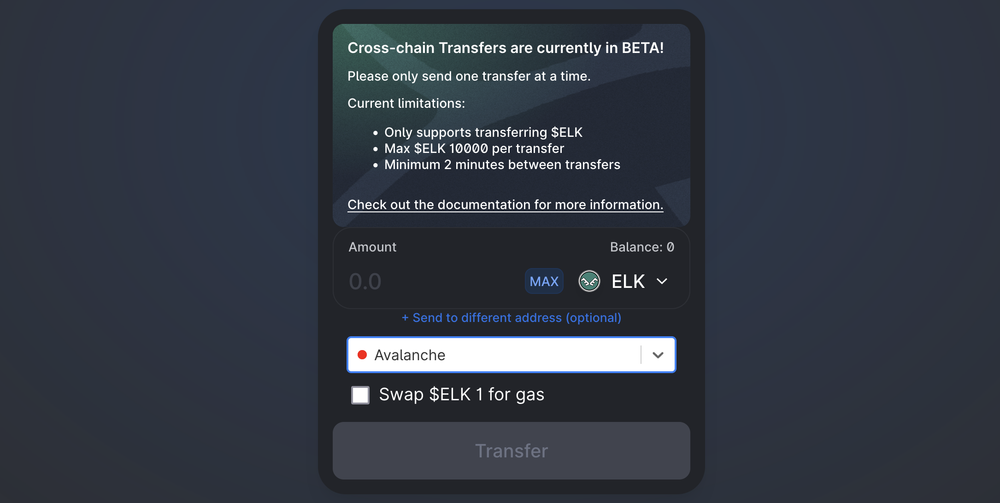
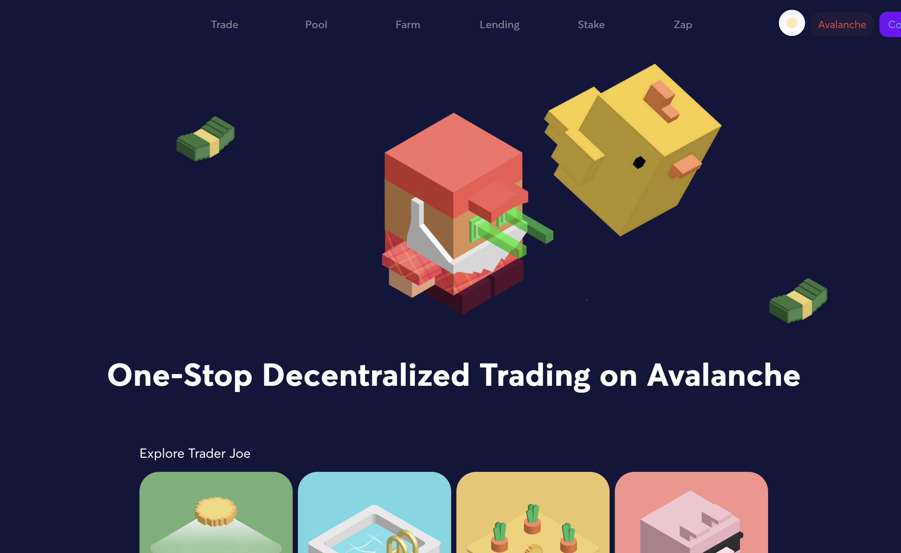

# How to get started on Avalanche

## What is Avalanche?

Avalanche is a layer-one blockchain that functions as a platform for decentralized applications and custom blockchain networks. The Avalanche network consists of three individual blockchains: the X-Chain, C-Chain and P-Chain. Each chain has a distinct purpose, which is radically different from the approach of other, namely having all nodes validate all transactions. Avalanche blockchains even use different consensus mechanisms based on their use cases.

Avalanche is 100% EVM compatible with the existing Ethereum toolchain, and its C-Chain offers all the same functionality as Ethereum but with higher throughput, sub-second finality, and much lower transaction fees. AVAX is the native gas token of the Avalanche network.

## Getting on Avalanche

Before using the Avalanche network, you will need to create a wallet address. There are different wallet types that can be used including **software wallets **such as Metamask or the native [Avalanche Wallet](https://wallet.avax.network), as well as **hardware wallets **such as [Trezor](https://trezor.io/coins/) or [Ledger](https://support.ledger.com/hc/en-us/articles/360020765779-Avalanche-AVAX-?docs=true). 

For the purpose of this tutorial, we'll be using Metamask. If you don't have Metamask installed, you can find instructions on [How to get started on Polygon](../polygon-tutorials/how-to-get-started-on-polygon.md#downloading-metamask).

### Adding Avalanche to Metamask

In order to use the Avalanche network, you'll need to add it to Metamask. To do so, click on the Network dropdown menu (it'll read Ethereum Mainnet if this is the first time you've set it up), then select custom RPC. You may then add the following values on the form that pops up:

* **Network Name**: Avalanche Network
* **New RPC URL**: [https://api.avax.network/ext/bc/C/rpc](https://api.avax.network/ext/bc/C/rpc)
* **ChainID**: 43114
* **Symbol**: AVAX
* **Explorer**: [https://cchain.explorer.avax.network/](https://cchain.explorer.avax.network)

Save the changes, and Metamask will automatically switch you over to the Avalanche network.

## Bridging to Avalanche

### Faucets

There are currently no faucets available on the Avalanche mainnet. If you need some AVAX to cover gas costs, you will have to send AVAX directly to your wallet from a centralized exchange, or by bridging tokens via the Elknet bridge. More on this second option in the [Bridges](how-to-get-started-on-avalanche.md#bridges) section below.

### Bridges

* [Official Avalanche bridge](https://bridge.avax.network) - Avalanche has its own bridge which can be used to bridge assets from the Ethereum mainnet to Avalanche. Gas fees are paid in the bridged token and can be high since you are bridging from Ethereum.
* [Anyswap](https://anyswap.exchange/#/bridge) also allows bridging assets to many different chains. There are minimum token amounts for bridging which will vary depending on the token, but bridging cost is a flat fee.
* [Celer Bridge](https://cbridge.celer.network/#/transfer) offers bridging services for many chains with a great user interface. Bridging fee is about 3% to Avalanche.
* [RelayChain](https://app.relaychain.com/#/cross-chain-bridge-transfer) offers an easy to use and intuitive interface with low fees. As a side note, Relay Chain is the solution officially supported to [bridge MAI to Avalanche](../MAI-university/mai-metaverse.md#avalanche).
* [Elknet](https://app.elk.finance/#/elknet) is a bridging service offered by Elk Finance, a decentralized exchange available on multiple networks including Avalanche, Binance, Fantom, Polygon, and xDai. What sets Elknet apart from the other bridges on this list is that no AVAX is required for bridging, but there is a catch which we will go over below. Bridging cost is just the gas fee for the transaction.
  * In order to move your tokens to Avalanche through Elknet, you will have to first convert them into Elk, Elk Finance's native token. 
  * You can then use the bridge to move your ELK from the supported networks to Avalanche, and if you check the "Swap $ELK 1 for gas", a portion of your transfer will be converted to AVAX. 
  * Once the bridging is complete (usually less than 10 minutes), you can switch your wallet to the Avalanche network and you'll see your ELK and a bit of AVAX ready to deploy. You can now swap your ELK directly on the site to any supported token on Avalanche.
  * The same can be done in reverse to move back to Polygon or any other supported chain.

## DeFI on Avalanche

Avalanche has seen a great deal of growth in recent months which has lead not only to great native projects being developed, but large deFi blue chips are beginning to make the move to the network, including Curve which has yet to launch there.

* [Aave](https://app.aave.com/dashboard) recently launched on Avalanche and has already seen $4b in total value locked. Supported collateral tokens on Avalanche include Aave, Avalanche, Dai, Tether, USDC, WBTC, and WETH.
* [Beefy Finance](https://app.beefy.finance/#/avax) is probably well known to most deFI users as it is available on other chains including Binance, Fantom, Harmony, Polygon, and more. Beefy is what is known as an autocompounder, and currently provides great farming APYs both for single token and dual token farms. Beefy does offer autocompounding functionality for the [MAI/AVAX](https://app.beefy.finance/#/avax/vault/joe-mai-wavax) and [MAI/USDC.e ](https://app.beefy.finance/#/avax/vault/joe-mai-usdc.e)LPs found on Trader Joe.
* [Benqi](https://app.benqi.fi/markets) is a market protocol similar to Aave and was the first of its kind on the network. Supported collateral tokens include Avalanche, Dai, Link, Tether, USDC, WBTC, and WETH.

* [TraderJoe](https://www.traderjoexyz.com/#/home) is a decentralized exchange and has become one of the top projects on Avalanche with an intuitive user interface, and a great zapping feature that allows users to convert a token directly into a liquidity pool token. TraderJoe is also the official partner with a [MAI-USDC LP pool on Avalanche](../MAI-university/mai-metaverse.md#using-mai-on-avax).

* [YieldYak](https://yieldyak.com/farms) is another autocompounder that also provides high farming APYs. Its single token farms work in conjuction with BenQI to leverage higher returns and are therefore to be considered risky.

## Other useful links

* [Avalanche Network](htts://avax)
* [Avalanche community links](https://www.avax.network/community) (Discord, Medium, Reddit, Twitter, etc)
* [Debank](https://debank.com), portfolio manager

## Disclaimer

This guide is NOT financial advice, and should simply be regarded as an educational tool. Always do your own research. Discussion of a project in this guide should not be considered as an endorsement of the project.
