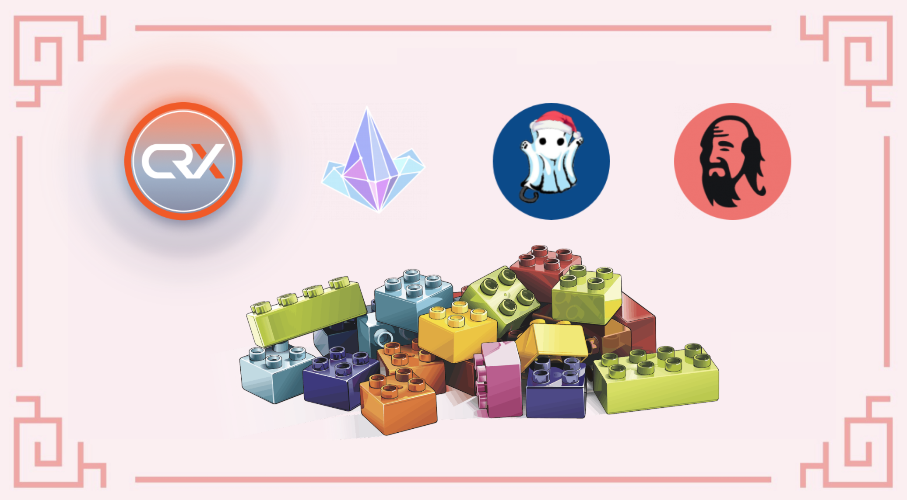

# Xếp Legos với CroDex

Canh tác lợi suất có thể dễ dàng. Bạn có 2 mã thông báo, bạn kết hợp chúng trong một cặp LP (Cung cấp tính thanh khoản), bạn gửi mã thông báo LP vào một bể và bạn bắt đầu nhận được phí hoán đổi và hầu hết thời gian, phần thưởng được trả bằng mã thông báo gốc của nền tảng bạn đang sử dụng. Hầu hết mọi người sẽ chỉ đơn giản là bán phần thưởng cho bất kỳ tài sản nào họ đang tìm kiếm, điều này phần lớn thời gian, hoàn toàn hợp lệ, nhưng rất xa so với một giải pháp được tối ưu hóa. Hôm nay, chúng ta sẽ xem cách bạn có thể kiếm lợi nhuận từ APR (Tỷ lệ phần trăm hàng năm) rất cao được đề xuất trên Cronos trên một số DApp, điều này sẽ biến APR 30% trên đồng ổn định thành tỷ lệ cao hơn nhiều.

## CroDex

### Cung cấp thanh khoản với MAI

Ngay cả khi ứng dụng cho vay của Mai Finance chưa được triển khai trên Cronos, vẫn có thể làm cầu nối MAI từ các chuỗi khác. Một trong những lý do để làm điều này là vì không có nhiều MAI trên Cronos, có nghĩa là bất kỳ ứng dụng nào đề xuất thanh khoản MAI cũng sẽ cung cấp APRs cao. Đây là trường hợp của CroDex, hiện là nơi duy nhất có thanh khoản MAI trên Cronos. Đối với hướng dẫn này, chúng tôi sẽ sử dụng nhóm MAI-USDC trên CroDex để giảm rủi ro Mất mát tạm thời đối với khoản đầu tư ban đầu của bạn, nhưng bạn có thể tăng lợi nhuận của mình bằng cách cung cấp thanh khoản cặp MAI-CRO.


Bất cứ khi nào bạn chọn một ứng dụng để canh tác lợi suất, điều quan trọng cần lưu ý là phần thưởng được hiển thị dưới dạng APR (Tỷ lệ phần trăm hàng năm) hoặc APY (Lợi nhuận phần trăm cộng dồn hàng năm). Phần sau giả định rằng tất cả phần thưởng bạn nhận được đều được cộng lại hàng ngày trong một năm hoàn chỉnh. Trong ví dụ của chúng tôi, 30% APR trên cặp MAI-USDC tương ứng với 34,97% APY.

Nếu bạn so sánh nó với cặp MAI-USDC trên Mai Finance, APR được đưa ra là 20,18% trên Polygon, 22,10% trên Fantom và nhóm MAI-av3CRV trên Avalanche đề xuất 23,24% APR. CroDex đề xuất tỷ lệ lãi tốt nhất trên MAI ổn định trên tất cả các chuỗi!


CroDex sẽ thanh toán cho bạn bằng mã thông báo gốc của họ, CRX. Kể từ tháng 12 năm 2021, 1 CRX = 127,56 USDC

### Đặt cọc đơn CRX

Đây là nơi mà có thể tìm được điều thú vị. CroDex có 2 nhóm khác nhau, nơi bạn có thể đặt cược mã thông báo CRX của mình để nhận thêm phần thưởng. Bạn có thể đặt cược để nhận thêm CRX, nhưng chúng tôi sẽ sử dụng bể để đặt cược CRX sẽ thưởng cho bạn bằng mã thông báo wCRO. wCRO là phiên bản được bọc của CRO, mã thông báo gas của mạng Cronos.

Bạn đã có thể thấy rằng bạn rất có thể bán CRX của mình để lấy thêm mã thông báo MAI-USDC LP và nhận được gần 35% APY trên cặp ổn định, nhưng rõ ràng tốt hơn là bạn nên đặt cược CRX của mình để nhận CRO. Nó không chỉ có thể được sử dụng để thanh toán phí giao dịch mà bạn còn có thể trang trại MAI-CRO trên CroDex. Và bạn càng nhận được nhiều CRX theo thời gian, thì bạn càng nhận được nhiều CRO nếu bạn đặt cược CRX của mình. Nhưng trong hướng dẫn này, chúng ta sẽ khám phá Cronos nhiều hơn một chút!

## CRYSTL Finance

CRYSTL Finance từng được biết đến với tên gọi Polycrystal. Đó là một bản fork đề xuất các hầm cặp LP và các bể đặt cọc đơn và nó hoạt động chính xác như Beefy Finance. Chúng tôi sẽ sử dụng cả hai cho chiến lược của mình.

### Canh tác CRYSTL với cặp CRX-WCRO

Chúng tôi sẽ sử dụng mã thông báo CRO do CRX tạo ra để hoán đổi 50% phần thưởng thành nhiều CRX hơn và kết hợp hai mã thông báo này thành một cặp CRX-WCRO trên CroDex, sau đó gửi mã thông báo LP vào một kho tiền trên Crystl Finance. Điều này sẽ giúp bạn có APY cao và sẽ được cộng lại.

Tỷ giá được hiển thị là một APY. APY 1,21k% tương ứng với 258,17% APR, nhưng bạn cũng có thể nhận được lợi nhuận ước tính hàng ngày trực tiếp trên thông tin vault và việc cung cấp thanh khoản cặp CRX-WCRO của bạn hiện sẽ giúp bạn nhận được 0,71% hàng ngày. Điều rất quan trọng là bạn phải theo dõi phần thưởng hàng ngày vì chúng ta sẽ trích xuất phần này của vị trí LP của chúng ta và chia nó thành các mã thông báo riêng biệt. CRX sẽ được đặt lại trên CroDex để nhận được nhiều mã thông báo CRO hơn và CRO sẽ được hoán đổi cho CRYSTL. Cũng xin lưu ý rằng có một khoản phí rút tiền đối với số tiền lãi mà chúng tôi sẽ trích ra mỗi ngày.

### Đặt cọc đơn CRYSTL

Với mã thông báo CRYSTL thu được ở bước trước, bạn sẽ có thể nhận được USDC từ nhóm đặt cược đơn của CRYSTL Finance. Chỉ cần đặt cược mã thông báo CRYSTL của bạn và bạn sẽ được thanh toán bằng USDC với APR khá cao.

Sau đó, bạn có thể chỉ cần hoán đổi 50% số USDC thành MAI và thêm trở lại vị thế ban đầu của bạn trên CroDex.

Ngoài ra, chúng ta có thể sử dụng phương pháp tương tự như trên và đặt cọc mã thông báo CRYSTL để kiếm mã thông báo SALEM, là mã thông báo gốc của Salem Finance

## Salem Finance

Salem Finance is another goose fork where you'll be able to farm the SALEM token. Most LP pools have a deposit fee, but we will actually not use the LP farms since CRYSTL Finance is already giving us the SALEM tokens we need. Instead, we will stake SALEMs in the pools to earn additional WCRO with, once again, a very high APR.

The (w)CRO token being the gas token of Cronos, it does have a lot of utility. You can also bridge it to the main Crypto.org chain if you want. In our case, and because we want to close our investment loop, we can simply sell the gains from Salem Finance and buy more USDC and MAI.

## Chiến lược canh tác lợi suất&#x20;

Bạn có thể thấy rằng chỉ với 3 giao thức, bạn có một số tùy chọn:

* Canh tác lợi suất cặp MAI-USDC để có CRX, đặt cược CRX để có WCRO, bán WCRO để có thêm MAI-USDC
* Canh tác cặp MAI-USDC để nhận CRX, đặt cược CRX để nhận WCRO, canh tác cặp CRX-WCRO để nhận CRYSTL, đặt cọc CRYSTL để nhận USDC, hoán đổi USDC để nhận thêm MAI-USDC
* Canh tác cặp MAI-USDC để nhận CRX, đặt cọc CRX để nhận WCRO, canh tác CRX-WCRO để nhận CRYSTL, đặt cọc CRYSTL để nhận SALEM, đặt cọc SALEM để nhận WCRO, bán WCRO để kiếm thêm MAI-USDC

Đối với phần còn lại của hướng dẫn này, chúng ta sẽ tập trung vào chiến lược cuối cùng, là chiến lược phức tạp nhất và đòi hỏi nhiều thao tác, nhưng nó cũng là chiến lược mang lại kết quả tổng thể tốt nhất. Hãy thoải mái áp dụng cách bạn thích tùy thuộc vào mức độ chấp nhận rủi ro của bạn.

### Khởi động hệ thống&#x20;

Sau đây là một mô phỏng được thực hiện với khoản đầu tư ban đầu trị giá 1.000 đô la cho cặp mã thông báo MAI-USDC LP và các APR / APY hiện tại được trình bày trong tài liệu này kể từ tháng 12 năm 2021. Tất nhiên, tỷ lệ và giá cả sẽ thay đổi theo thời gian, vì vậy mô phỏng này là chỉ có giá trị tại thời điểm viết bài và mô phỏng sẽ chỉ cung cấp ước tính về những gì bạn có thể nhận được nếu bạn thiết lập hệ thống này.

### Ngày 1

Bạn cung cấp thanh khoản MAI-USDC của mình trên CroDex trong bể thích hợp và nhận được 30% APR trên đó. Vào cuối ngày đầu tiên, khi bạn nhận được phần thưởng CRX của mình, bạn sẽ có

| MAI-USDC | staked CRX | CRX-WCRO | CRYSTL | SALEM | WCRO  |
| -------- | ---------- | -------- | ------ | ----- | ----- |
| 1,000.00 | 0.822      | 0.000    | 0.000  | 0.000 | 0.000 |

### Ngày 2

Số CRX đã đặt cọc của bạn đang tạo WCRO. Bạn có thể thu thập phần thưởng và đổi 50% thành nhiều CRX hơn để tạo cặp CRX-WCRO  mà sau đó bạn có thể gửi vào CRYSTL Finance. Vào cuối ngày thứ hai, bạn sẽ có

| MAI-USDC | staked CRX | CRX-WCRO | CRYSTL | SALEM | WCRO  |
| -------- | ---------- | -------- | ------ | ----- | ----- |
| 1,000.00 | 1.644      | 0.002    | 0.000  | 0.000 | 0.000 |

### Ngày 3

Cặp CRX-WCRO bị khóa trong kho tài chính CRYSTL đã tạo thêm mã thông báo LP. Bạn sẽ phải trích tiền lãi hàng ngày và trả phí 0,1%, đồng thời chia phần LP đã trích xuất thành các mã thông báo CRX và WCRO. Bạn chỉ cần khởi động lại CRX trên CroDex và hoán đổi WCRO thành CRYSTL. Điều này có thể được thực hiện trên CroDex bằng cách sử dụng tính năng hoán đổi. Vào cuối ngày, bạn sẽ có

| MAI-USDC | staked CRX | CRX-WCRO | CRYSTL  | SALEM | WCRO  |
| -------- | ---------- | -------- | ------- | ----- | ----- |
| 1,000.00 | 2.466      | 0.005    | 0.00003 | 0.000 | 0.000 |


Lưu ý rằng phần thưởng trên CRYSTL rất nhỏ và có thể không hiệu quả khi thu hoạch phần thưởng từ ngày 1. Mô phỏng này vẫn hiển thị phần thưởng bạn sẽ nhận được và sẽ giả sử bạn vẫn gộp hàng ngày, nhưng điều này được thực hiện để đơn giản hóa kết quả. Đảm bảo rằng bạn không chi tiêu tất cả phần thưởng của mình vào phí giao dịch và có thể hiệu quả hơn nếu chỉ gộp theo từng tuần trong vài tuần đầu tiên.


### Ngày 4

Phần thưởng CRYSTL của bạn từ Crystl Finance có thể được đặt cọc để kiếm được mã thông báo SALEM. Vào cuối ngày thứ 4, bạn sẽ nhận được

| MAI-USDC | staked CRX | CRX-WCRO | CRYSTL  | SALEM     | WCRO  |
| -------- | ---------- | -------- | ------- | --------- | ----- |
| 1,000.00 | 3.288      | 0.010    | 0.00011 | 0.0000002 | 0.000 |

### Ngày 5

Ngày khởi động cuối cùng khi bạn sẽ thu hoạch được phần thưởng từ Salem Finance. Phần thưởng WCRO có thể được đổi lấy thêm MAI-USDC. Tuy nhiên, như bạn có thể nhận thấy, giá trị của phần thưởng quá nhỏ nên bạn sẽ không thể nhận WCRO từ Salem Finance trước Ngày thứ 50 hoặc lâu hơn.

## Kết quả

### Công việc hàng ngày&#x20;

Sau khi hệ thống được chuẩn bị đầy đủ, đây là công việc  hàng ngày của bạn

* Thu hoạch phần thưởng WCRO từ bể duy nhất trên CroDex&#x20;
* Đổi 50% phần thưởng WCRO để lấy thêm CRX trên CroDex và tạo một số mã thông báo CRX-WCRO LP&#x20;
* Gửi mã thông báo CRX-WCRO bổ sung của bạn trên CRYSTAL Finance&#x20;
* Rút một phần CRX-WCRO tương ứng với phần thưởng hàng ngày của bạn phá vỡ mã thông báo LP thành CRX và WCRO trên CroDex&#x20;
* Đặt CRX vào bể trên CroDex để nhận phần thưởng WCRO hoán đổi WCRO lấy CRYSTL trên CroDex&#x20;
* Đặt mã thông báo CRYSTL trên Crytl Finance để nhận mã thông báo SALEM&#x20;
* Thu hoạch mã thông báo SALEM cổ phần duy nhất mã thông báo SALEM trên Salem Finance
* Thu thập mã thông báo WCRO từ Salem Finance hoán đổi WCRO lấy MAI và USDC và tạo thêm cặp LP&#x20;
* Gửi cặp MAI-USDC mới vào bể thích hợp trên CroDex

### Kết quả sơ bộ theo từng tháng

| day | MAI-USDC | staked CRX | CRX-WCRO | CRYSTL | SALEM  |
| --- | -------- | ---------- | -------- | ------ | ------ |
| 30  | 1,000.00 | 25.583     | 0.600    | 0.104  | 0.004  |
| 60  | 1,000.00 | 50.819     | 1.830    | 0.682  | 0.059  |
| 90  | 1,000.04 | 76.736     | 3.315    | 1.941  | 0.260  |
| 120 | 1,000.14 | 103.424    | 4.922    | 3.970  | 0.729  |
| 150 | 1,000.41 | 130.935    | 6.606    | 6.816  | 1.594  |
| 180 | 1,001.93 | 159.307    | 8.352    | 10.515 | 2.994  |
| 210 | 1,001.87 | 188.578    | 10.156   | 15.094 | 5.070  |
| 240 | 1,003.39 | 218.789    | 12.019   | 20.584 | 7.969  |
| 270 | 1,005.71 | 249.988    | 13.942   | 27.014 | 11.843 |
| 300 | 1,009.10 | 282.227    | 15.929   | 34.414 | 16.848 |
| 330 | 1,013.82 | 315.569    | 17.982   | 42.817 | 23.147 |
| 360 | 1,020.23 | 350.084    | 20.105   | 52.256 | 30.906 |

### Ngày thứ 365

Sau một năm canh tác lợi suất đầy đủ hệ thống này, bạn sẽ có

* $1,021.49 giá trị của MAI-USDC trên CroDex
* $355.96 giá trị của CRX đặt cọc đơn trên CroDex
* $20.47 giá trị của CRX-WCRO gửi tại  CRYSTL Finance
* $53.93 giá trị của CRYSTL đặt cọc đơn trên CRYSTL Finance
* $32.353 giá trị của SALEM đặt cọc đơn trên Salem Finance

WCRO từ Salem Finance thực sự được bao gồm dưới dạng vị trí MAI-USDC bổ sung vì nó được bán hoàn toàn để tăng vị thế của cặp tiền này.

Điều này có nghĩa là với khoản đầu tư ban đầu là 1.000 đô la, vào cuối năm bạn sẽ có 1.484,45 đô la trên tất cả các nền tảng với tổng APY là 48,45%. Và hãy nhớ rằng điều này được thực hiện bằng cách sử dụng cặp ổn định làm gốc của chiến lược. Cũng cần lưu ý rằng mã thông báo duy nhất được hoán đổi theo thời gian là mã thông báo CRO.

### Sử dụng thay thế Mai Finance

Nền tảng Mai Finance không hỗ trợ vault trên Cronos, vì token trên Cronos chưa có Chainlink Oracles. Dự kiến ​​trong quý đầu tiên của năm 2022, Chainlink sẽ hỗ trợ Cronos và bạn sẽ có thể gửi mã thông báo WCRO của mình vào Vault để vay đồng tiền ổn định MAI. Điều này có nghĩa là chiến lược ở trên có thể được sửa đổi để gửi tiền WCRO và sử dụng MAI thay vì bán mã thông báo WCRO, điều này sẽ làm tăng một chút tỷ lệ phần thưởng cuối cùng của bạn.

## Tuyên bố từ chối trách nhiệm

Hướng dẫn này được viết để giới thiệu rằng bạn có thể tăng tỷ lệ phần thưởng của mình mà không cần bán phá giá các mã thông báo trên nền tảng bạn đang cung cấp thanh khoản. Không đơn giản để tìm được những chiến lược phù hợp khi bạn đang xây dựng các vòng phản hồi, nhưng nó chắc chắn là khả thi và phần lớn thời gian bạn sẽ được thưởng nếu bạn có thể tìm thấy sự kết hợp phù hợp. Tuy nhiên, hướng dẫn này được viết chỉ để chứng minh cách bạn có thể làm điều đó chứ không phải để xây dựng một hệ thống tương tự. Tất cả phí giao dịch đã được cố ý loại bỏ và một số phần thưởng sẽ không tồn tại trong một năm hoàn chỉnh, có nghĩa là bạn có thể muốn xem xét các vòng lặp đơn giản hơn cho các khoản đầu tư cá nhân của mình. Tuy nhiên, CroDex là một điểm khởi đầu rất tốt cho hệ thống này


Hướng dẫn này chắc chắn không phải là lời khuyên tài chính, nó được thực hiện với mục tiêu giáo dục. Bạn cần chú ý đến sự thay đổi giá cả, cung và cầu, ngày kết thúc chương trình thưởng, khoản lỗ tạm thời, v.v. đầu tư những gì bạn sẵn sàng để có thể mất.

