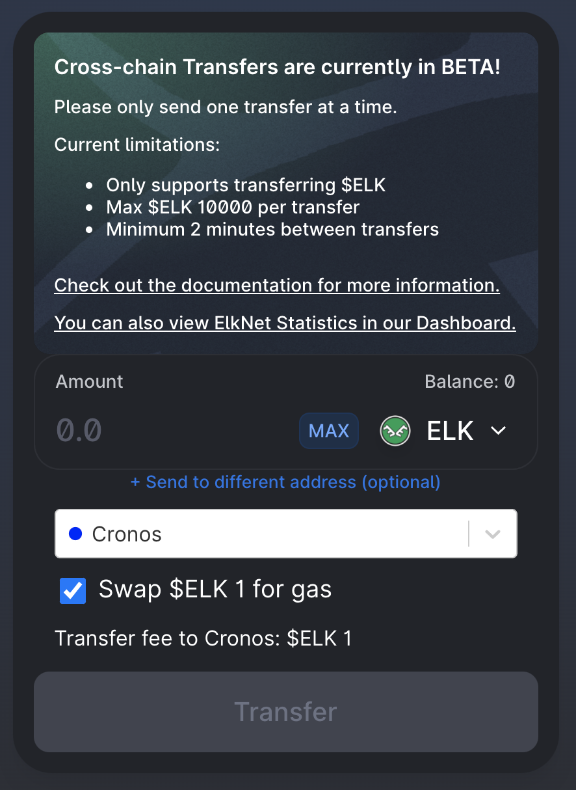
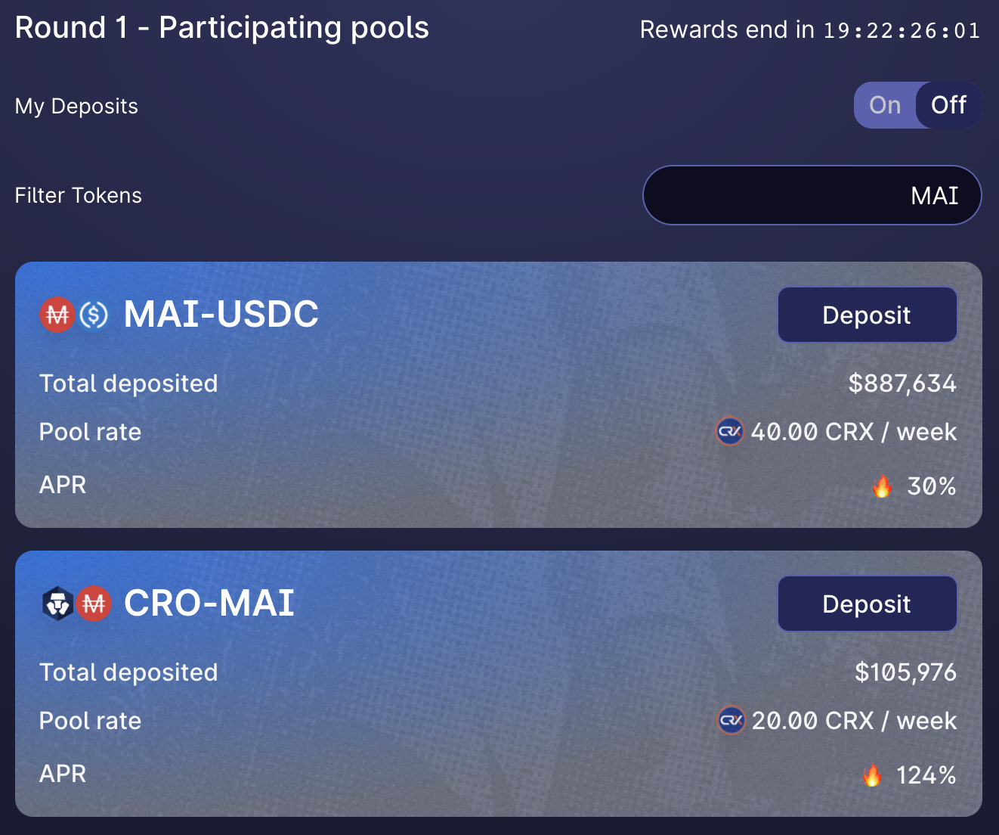

# Khởi động trên Cronos

## Cronos là gì?

Sẽ thật khó để giải thích Cronos là gì nếu không đề cập đến Crypto.com. Crypto.com là một trong những sàn giao dịch tập trung lớn nhất (còn được gọi là CEX) và đang xây dựng chuỗi chuỗi của riêng mình, bao gồm Crypto.org Chain và Cronos. Crypto.org Chain là một chuỗi có công nghệ độc quyền trong khi Cronos là người chị em tương thích với EVM (Máy ảo Ethereum) của nó. Nó khá giống với Binance Chain dành riêng cho CEX và Binance Smart Chain tương thích với EVM.

Trong số các ưu điểm khác, Cronos thể hiện khả năng tương thích với EVM, có nghĩa là hầu hết các ứng dụng khởi chạy trên các chuỗi EVM khác cũng có thể được triển khai cho Cronos, bao gồm cả Mai Finance và Khả năng mở rộng: Cronos nhanh hơn và rẻ hơn Ethereum Mainnet. &#x20;

## Khởi động với Cronos

Để sử dụng mạng Cronos, bạn sẽ cần một địa chỉ ví. Vì Cronos là một mạng tương thích với EVM, nó sẽ chấp nhận các ví tương tự như trên các chuỗi tương thích với EVM khác, bao gồm ví web như Metamask hoặc Nifty và bạn sẽ có thể sử dụng ví phần cứng như Trezor hoặc Ledger.

Đối với hướng dẫn này, chúng tôi sẽ gắn bó với Metamask giống như tất cả các hướng dẫn khác trên trang web này. Nếu bạn chưa cài đặt Metamask, bạn có thể tìm hướng dẫn về [Cách bắt đầu với Polygon](../huong-dan/how-to-get-started-on-polygon.md).

### Thêm Cronos vào Metamask

Nếu bạn đã cài đặt phiên bản mới nhất của Metamask, thì bạn đã có quyền truy cập vào chuỗi Cronos và không có gì khác để bạn thực hiện ngoài việc chọn Cronos trong danh sách mạng thả xuống ở đầu Metamask. Bạn cũng có thể tự đặt một RPC mới để truy cập Cronos bằng các bước sau. Mở cửa sổ bật lên Metamask, nhấp vào biểu tượng ví của bạn, điều hướng đến Cài đặt, sau đó chọn Mạng và tìm Cronos. Dữ liệu bạn sẽ nhận được như sau:

* **Tên mạng:** Cronos
* **New RPC URL:** https://evm-cronos.crypto.org
* **Chain ID:** 25
* **Biểu tượng tiền tệ:** CRO
* **Trình khám phá chuỗi URL:** https://cronos.crypto.org/explorer/

Lưu các thay đổi và Metamask sẽ tự động chuyển bạn sang mạng Cronos:

## Bắc cầu tới Cronos

### Faucets

Không có bất kỳ faucet chính thức nào để nhận  CRO đầu tiên của bạn cho một vài giao dịch đầu tiên của bạn. Tuy nhiên, một số ứng dụng sẽ cung cấp dịch vụ này nếu bạn chuyển một số tiền cho Cronos hoặc chỉ đơn giản là nếu bạn cần một ít phí gas:

* [Crystl Finance Faucet](https://cronos.crystl.finance/faucet): Sau khi kết nối ví của bạn và hoàn thành captcha, bạn có thể yêu cầu một số CRO sẽ được gửi đến ví của bạn.
* [Elk Finance](https://app.elk.finance/#/elknet): Khi bạn bắc cầu mã thông báo ELK của mình từ chuỗi này sang chuỗi khác, bạn sẽ có tùy chọn hoán đổi một phần nhỏ của ELK đã chuyển thành mã thông báo gas gốc của chuỗi đích. Điều này đặc biệt hữu ích nếu bạn là cầu nối tài sản lần đầu tiên với một chuỗi mới.

* [Crypto.com](https://crypto.com): Đừng quên rằng Cronos là một chuỗi liên kết với Crypto.com. Bạn có thể tạo tài khoản ở đó, mua mã thông báo CRO của mình trực tiếp bằng cách liên kết tài khoản ngân hàng và gửi chúng đến Cronos.


Hãy nhớ rằng bạn sẽ cần một số mã thông báo gas để có thể thực hiện các giao dịch. Điều này có nghĩa là nếu bạn kết nối tài sản từ một chuỗi khác với Cronos trong một tài khoản không có mã thông báo CRO, bạn sẽ bị mắc kẹt và không thể làm bất cứ điều gì. Đảm bảo ví của bạn có đủ tiền để thực hiện ít nhất một giao dịch hoán đổi lấy mã thông báo gas.


### Các cầu nối

* [Relay Chain](https://app.relaychain.com/transfer#/)  là đối tác chính thức của Mai Finance nếu bạn muốn làm cầu nối MAI của mình với Cronos. RelayChain hiện hỗ trợ bắc cầu MAI từ một số chuỗi khác nhau, vì vậy bạn sẽ có thể gửi tài sản của mình từ Polygon, Moonriver, Avalanche hoặc Shiden đến Cronos. Đơn giản chỉ cần chọn chuỗi đích là Cronos và mã thông báo để gửi (nó thường được đặt tên là MAI, nhưng đôi khi nó cũng có tên miMATIC). Chọn số tiền cần chuyển và bắt đầu chuyển khoản không quá 10 phút. Chú ý đến phí chuyển tiền. Tuy nhiên, một điều thú vị về RelayChain là nó sẽ cung cấp cho bạn một số CRO ở phía nhận để bạn có thể hoán đổi một số MAI lấy CRO.

* [AnySwap](https://anyswap.exchange/#/router) cũng là một khả năng cho hầu hết các chuỗi nếu bạn muốn chuyển một số tài sản cho Cronos. Lưu ý thêm, AnySwap cũng hỗ trợ chuyển MAI từ Polygon sang Cronos.
* [ElkNet](https://app.elk.finance/#/elknet) là một trường hợp cụ thể vì cầu nối từ Elk Finance sẽ cho phép bạn kết nối mã thông báo ELK từ bất kỳ chuỗi tương thích EVM nào với bất kỳ chuỗi tương thích EVM nào khác, nơi chúng được triển khai với khả năng hoán đổi một phần nhỏ số tiền đã chuyển thành mã thông báo gas (xem phần dành riêng cho Faucet ở trên).

### MAI Hub

Trong trường hợp bạn bắc cầu một số MAI từ Polygon đến Cronos thông qua RelayChain, bạn sẽ nhận được phiên bản RelayChain của MAI thay vì MAI gốc do ứng dụng trên Cronos tạo ra. 2 mã thông báo (một từ RelayChain và một từ Mai Finance) có cùng giá trị và cùng tên, nhưng địa chỉ hợp đồng khác nhau, và mã duy nhất sẽ được chấp nhận để thu lợi nhuận trên Cronos là từ Mai Finance.

Bạn có thể hoán đổi MAI của mình từ RelayChain bằng cách sử dụng trung tâm trên Mai Finance với tỷ lệ 1: 1, sau đó bạn sẽ có thể sử dụng MAI của mình trên các nền tảng khác.

Đừng quên rằng bạn sẽ phải chuyển đổi MAI của mình thành phiên bản Relay Chain nếu bạn muốn kết nối chúng từ Cronos sang chuỗi khác.


Có vẻ như AnySwap hỗ trợ chuyển MAI từ Polygon sang Cronos, nhưng bạn sẽ nhận được phiên bản AnySwap của MAI mà bạn sẽ không thể hoán đổi qua trung tâm. Bạn có thể bị kẹt với một mã thông báo không sử dụng được, vì vậy hãy đảm bảo rằng bạn đang sử dụng đúng cầu nối.&#x20;


## DeFi trên Cronos

Cronos được liên kết với Crypto.com, rất nhiều khoản đầu tư đang chảy vào chuỗi và các ứng dụng DeFi ở đó để hỗ trợ thanh khoản. Như vậy, bạn có thể thu được anh tácsản lượng trên các nền tảng sau:

* [CroDex](https://swap.crodex.app/#/swap): Đây là một trong những DEX (Sàn giao dịch phi tập trung) và AMM (Tạo thị trường tự động) hàng đầu trên Cronos và là một fork của Uniswap v2 giống như QuickSwap. Bạn sẽ có thể hoán đổi tài sản của mình, tham gia khai thác thanh khoản bằng cách cung cấp cặp LP (Cung cấp thanh khoản) trong các bể thanh khoản hoặc đặt cọc mã thông báo gốc của nền tảng để kiếm thêm phần thưởng. CroDex cũng là đối tác chính thức đầu tiên của Mai Finance trên Cronos và là nơi duy nhất bạn có thể hoán đổi MAI lấy các tài sản khác, cũng như tham gia vào các chương trình khai thác thanh khoản bằng các cặp MAI-USDC và MAI-CRO.

Khi bạn cung cấp thanh khoản trên CroDex, bạn sẽ nhận được phần thưởng là mã thông báo CRX mà bạn có thể đặt cược trong Vault để nhận được nhiều mã thông báo CRX hơn, nhưng có các tùy chọn khác (tốt hơn) sẽ được trình bày trong một hướng dẫn trong tương lai

* [VVS](https://vvs.finance) và [CronaSwap](https://app.cronaswap.org): Đây là các DEX / AMM khác là fork của PancakeSwap (một fork khác của Uniswap), nơi bạn sẽ nhận được các tính năng tương tự như trên CroDex.
* [Beefy Finance](https://app.beefy.finance/#/cronos), [Adamant](https://adamant.finance) và [Autofarm](https://autofarm.network/cronos/) là những trình tổng hợp / tối ưu hóa năng suất nổi tiếng có mặt trên nhiều mạng và nơi bạn sẽ có thể gửi mã thông báo LP của mình từ hầu hết các DEX và để các thuật toán phụ trách nhóm thu thập mã thông báo trang trại và cộng dồn phần thưởng thành nhiều mã thông báo LP hơn
* [Crystl Finance](https://cronos.crystl.finance) là một bản fork ra mắt trên Polygon đầu tiên và hiện cũng có sẵn trên Cronos. Người dùng sẽ có thể gửi mã thông báo LP trong hầm để kiếm mã thông báo CRYSTL có thể được đặt cọc hoặc cung cấp thanh khoản (hoặc hoán đổi).
* [Fortune DAO](https://www.fortunedao.com/#/) là bản fork Ohm (Olympus) chính trên Cronos chấp nhận DAI và USDC

## Mai Finance trên Cronos

Hiện tại, ứng dụng vẫn chưa được khởi chạy hoàn toàn và chủ yếu đang chờ ChainLink Oracles chấp nhận mã thông báo làm tài sản thế chấp. Hub đã có mặt, vì vậy bạn có thể mong chờ sự ra mắt vào quý đầu tiên của năm 2022.

## Tuyên bố từ chối trách nhiệm

Hướng dẫn này KHÔNG phải là lời khuyên tài chính, và chỉ nên được coi là một công cụ giáo dục. Luôn luôn làm nghiên cứu riêng của bạn. Thảo luận về một dự án trong hướng dẫn này không nên được coi là sự chứng thực của dự án.


Hãy nhớ rằng một chiến lược hoạt động tốt tại một thời điểm nhất định có thể hoạt động kém (hoặc khiến bạn mất tiền) vào một thời điểm khác. Hãy cập nhật thông tin, theo dõi thị trường, theo dõi các khoản đầu tư của bạn và như mọi khi, hãy tự nghiên cứu.

