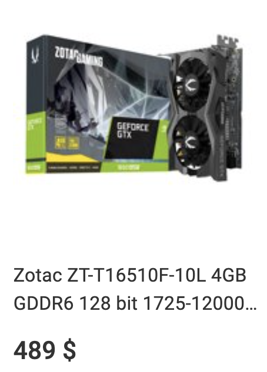

# Cách sử dụng MAI ngoài thực tế

## Tình huống thực tế cho MAI

DogeOfWallStreet rất lạc quan về Ethereum. Với tất cả cơn sốt xoay quanh tiền điện tử, một phần được thúc đẩy bởi cơn sốt của NFT và trường hợp tăng giá cho Eth 2.0, anh ấy muốn đảm bảo rằng anh ấy có thể nhận được nhiều ETH nhất có thể trước khi giá thực sự go to moon.

Để làm như vậy,  anh ý đã đầu tư vào một giàn khai thác nhỏ với 6 GPU. Anh ấy đang khai thác ETH 24/7/365 và kiếm được trung bình $ 40,00 mỗi ngày với 6 RTX 3080 của mình.

Hôm nay là ngày mà khoản đầu tư ban đầu của anh ấy vào GPU cuối cùng đã được hoàn vốn đầy đủ và bây giờ bộ máy đào chỉ tạo ra lợi nhuận. Tuy nhiên, DogeOfWallStreet nhận thấy một số điều

* Sau sự kiện EIP1559, lợi nhuận của anh ấy giảm, nhưng chỉ giảm 15%, điều này cũng không quá tệ
* rất nhiều thợ đào ETH đang bán card đồ họa của họ vì họ nghĩ rằng việc khai thác không còn mang lại lợi nhuận
* giá GPU giảm nhẹ và hiện có thể mua thêm một số thiết bị đào ETH trên các trang web chuyên dụng và thậm chí tại cửa hàng
* "Sự hợp nhất" sẽ chuyển Ethereum từ P-o-W (Bằng chứng công việc) sang P-o-S (Bằng chứng cổ phần) sẽ không xảy ra trước Quý 1 năm 2022 và các nhà phát triển Ethereum nổi tiếng vì sự chậm trễ
* các nhà sản xuất GPU và ASIC đang bổ sung thêm nhiều công cụ khai thác ETH vào thị trường, đặt cược vào thực tế rằng ETH2.0 sẽ bị trì hoãn trong nhiều tháng, có thể là nhiều năm

Vì vậy, thay vì ngồi trên lợi nhuận của mình chờ đợi giá tăng vọt, DogeOfWallStreet quyết định rằng đã đến lúc mua thêm card đồ họa và có thể tăng lợi nhuận khai thác của mình. Về mặt chi phí, RTX 1660 super có vẻ là card có lợi nhất hiện tại và nó chỉ có giá $ 500.

Sau 1 tháng khai thác, anh ấy kiểm tra danh mục đầu tư của mình trên mạng chính ETH sau khi bể này trả tiền cho anh ta. Anh ta có số ETH trị giá tương đương 1.340,00 đô la (lợi nhuận khai thác và ETH đã tăng gần 12% trong 4 tuần), đủ để mua card ... nhưng sau đó lại gặp tiến thoái lưỡng nan:

* anh ấy có nên giữ ETH của mình vì giá đang tăng không?
* anh ta có nên bán ETH của mình không vì anh ta mua GPU càng sớm thì anh ta càng sớm khai thác được nhiều ETH hơn?

Đó là khi anh phát hiện ra Mai Finance và sức mạnh của khoản vay 0% lãi suất.

## &#x20;Khoản vay 0% lãi suất / 0,5% phí hoàn trả

Sau khi đọc các tài liệu khác nhau của Mai Finance và nhận được một số trợ giúp từ cộng đồng Discord, DogeOfWallStreet nhận thấy khả năng giữ Ethereum của mình trong khi vẫn được mua thêm card đồ họa.

Bước đầu tiên là kết nối ETH với mạng Polygon. Điều này thật dễ dàng bằng cách sử dụng cầu [PoS](https://wallet.polygon.technology/) và việc bắc cầu các tài sản được thực hiện ở "mức giá hợp lý" là 20,00 đô la được thanh toán bằng ETH.

DogeOfWallStreet gửi ETH của mình trên AAVE và nhận được amWETH. Bây giờ anh ta đến Mai Finance và gửi số tiền này để nhận được các token camWETH sẽ được sử dụng làm tài sản thế chấp trong vault. Ở giai đoạn đó, anh ấy vẫn sở hữu tất cả ETH của mình và Mai Finance cho phép anh ấy kiếm được 1,39% APY trên tài sản của mình. Không nhiều, nhưng vẫn được đánh giá là cao.

Sau khi gửi camWETH trị giá 1.320,00 đô la vào kho tiền, anh ấy bây giờ có thể vay MAI dựa vào tài sản thế chấp của mình. DogeOfWallStreet quyết định duy trì tỷ lệ tài sản thế chấp trên nợ trên 200% và chỉ vay 600 MAI. Sau đó, anh ta sử dụng swap để nhận 594 USDC (phí hoán đổi 1%) mà anh ta kết nối trở lại mạng chính, trả một lần nữa khoản phí $ 20,00. Anh ấy không thực sự quan tâm đến việc trả phí vì một phần trong số đó được phân phối lại cho các thợ đào và anh ấy là một trong số họ và có kế hoạch kiếm tiền từ các khoản phí này.

Để nhận được một số USD từ 574 USDC của mình, DogeOfWallStreet chuyển USDC sang ví Coinbase của anh ấy, nơi anh ấy hiện có thể bán chúng và chuyển $ 562.00 USD (phí coinbase là 2%) vào tài khoản paypal và cuối cùng là vào tài khoản ngân hàng của anh ấy!

Tại thời điểm này, DogeOfWallStreet đã giữ gần như 100% số ETH của anh ấy, hiện đang tạo ra 1,39% hàng năm VÀ anh ấy có 562,00 USD trong tài khoản ngân hàng của mình. Đã đến lúc chuyển sang bước tiếp theo!

## Đầu tư trong thế giới thực

DogeOfWallStreet mua card GTX 1660 mà anh ấy muốn, trả một số loại thuế và phí vận chuyển với tổng số tiền là 554,35 đô la. Sau một vài ngày, anh ấy nhận được GPU của mình và cài đặt nó vào thiết bị.

GPU bổ sung đang tăng doanh thu khai thác của anh ấy lên 2,14 đô la mỗi ngày. Anh ta sẽ mất 270 ngày để hoàn trả đầy đủ số tiền mua thẻ, đây là ROI có thể chấp nhận được theo anh ta. Thật vậy, khoản đầu tư mới trị giá 554,35 đô la của anh ấy có thể sẽ tạo ra doanh thu 781,10 đô la (2,14 đô la \* 365) hàng năm, là APR là 140,90%. Số tiền này cần được thêm vào camToken trị giá 18,34 đô la mà vault trên Mai Finance đang sinh lợi hàng năm.

Nhìn thấy những con số đó, DogeOfWallStreet chắc chắn sẽ chuyển tất cả ETH mà anh ấy đang khai thác sang Polygon và lặp lại vòng lặp hàng tháng để có được nhiều card hơn và khai thác nhiều ETH hơn.

Tại một số thời điểm, nếu việc khai thác ETH trở nên không có lãi, anh ta có thể chuyển sang đồng tiền khác (ETC, RVN, ERG ...), nhưng giàn khai thác của anh ta hiện là một khoản đầu tư đáng kinh ngạc

## Số đầu tư ban đầu và chiến lược trả nợ trong cuộc sống thực

Nghĩ về điều đó, Doge Wall Street bây giờ buồn vì anh ta không biết Mai Finance tồn tại trước khi anh ta mua giàn trâu của mình. Thật vậy, đây là những gì anh ấy có thể đã làm

* Nhận khoản vay ngân hàng 20.000,00 đô la với lãi suất 5% và trả dần trong 2 năm (hoàn trả 877,43 đô la /tháng)
* Chuyển đổi USD sang ETH, chuyển nó sang Polygon, sử dụng AAVE và Mai Finance để vay 10.000 MAI
* Chuyển đổi MAI sang USD và mua thiết bị của anh ấy + GPU ban đầu
* Tạo trung bình $ 1,300,00 mỗi tháng để trả khoản vay ngân hàng của anh ấy và giữ phần còn lại dưới dạng ETH có thể được sử dụng để trả nợ cho Mai Finance hoặc vay thêm Mai để đầu tư vào một thứ gì đó khác

Ngoài ra, anh ta cũng có thể chia ETH trị giá 1.300 USD thành

* Bán trực tiếp một phần ETH nhưng ít hơn số tiền nợ ngân hàng hàng tháng
* Một phần ETH được chuyển đến Polygon và Mai Finance, nơi anh ta có thể vay MAI và trả phần còn lại của khoản vay ngân hàng

Giả sử bạn nhận được _Thu nhập_ và cần trả nợ bằng _Thu nhập> Nợ._ Giả sử rằng Khoản nợ đó cũng lớn hơn một nửa Thu nhập của bạn. Hãy giả sử Fiat là phần Thu nhập của bạn mà bạn cần sử dụng để trả nợ và Crypto là phần sẽ được gửi đến Mai Finance để vay MAI. Chúng ta nhận được các phương trình sau

$$
Thu .nhập = Fiat + Crypto
$$

$$
Nợ = Fiat+\frac{Crypto}{CDR}
$$

Dẫn đến kết quả sau:

$$
Crypto=Thu.nhập - \frac{Nợ*CDR-Thu.nhập}{CDR-1}
$$

$$
Fiat = \frac{Nợ*CDR-Thu.nhập}{CDR-1}
$$

Trong ví dụ của chúng ta với $ 1,300,00 kiếm được cần phải trả khoản nợ $ 878,00, phép toán là

$$
Fiat=\frac{878*2-1300}{2-1}=\$456.00
$$

$$
Crypto=1300-\frac{878*2-1300}{2-1}=\$844.00
$$

Do đó, chúng tôi cần bán ETH trị giá $ 456,00 và sử dụng Mai Finance để vay $ 422,00 của MAI từ $ 844,00 giá trị ETH được gửi trong kho tiền (giả sử tỷ lệ tài sản thế chấp trên nợ là 200%). Rõ ràng rằng, bằng cách làm như vậy, chúng tôi đang giữ được nhiều thu nhập hơn và phải bán ít tiền điện tử hơn. Đó là một cách để tăng khoản tiết kiệm của bạn trong khi vẫn trả được nợ bên ngoài thế giới tiền điện tử.

Tất nhiên, đây là chuyển khoản nợ bạn cần trả cho ngân hàng thành khoản nợ bạn cần trả cho Mai Finance. Tuy nhiên, việc ngân hàng áp dụng hình thức tính phí lãi suất cao và bạn phải trả nợ hàng tháng giải thích lý do tại sao nên chuyển sang Mai Finance (lãi suất 0%, không giới hạn thời gian trả nợ).


Nếu bạn muốn sử dụng tỷ lệ Tài sản đảm bảo trên Nợ cao hơn, bạn sẽ có thể bán ít tiền điện tử hơn sang fiat và gửi / vay nhiều hơn từ các kho tiền của Mai. Ví dụ: với CDR là 175%, bạn sẽ bán ETH tương đương với $ 316,00 và giữ $ 984,00 tại Mai Finance để vay $ 562,00 của MAI, vẫn trả khoản nợ $ 878,00 của bạn cho ngân hàng hàng tháng.


**Lưu ý rằng**: Mọi tính toán ở trên đều chưa bao gồm phí giao dịch

## Tuyên bố từ chối trách nhiệm

Hướng dẫn này hoàn toàn không phải là lời khuyên tài chính và tuyệt đối không nên coi đó là điều hiển nhiên. Khai thác Ethereum là một công việc kinh doanh rủi ro. Phần cứng vẫn còn khá đắt trong khi không có gì đảm bảo rằng hoạt động khai thác sẽ vẫn có lãi trong tương lai gần. Đầu tư vào khai thác nên được thực hiện với rủi ro của riêng bạn, hãy hiểu cách khai thác hoạt động và đảm bảo ROI có thể chấp nhận được đối với tình trạng tài chính cá nhân của bạn . Doanh thu khai thác phụ thuộc nhiều vào nhu cầu giao dịch và có thể trở nên không sinh lời trước khi bạn có thể hoàn trả đầy đủ khoản đầu tư ban đầu của mình.


Hãy nhớ rằng một chiến lược hoạt động tốt tại một thời điểm nhất định có thể hoạt động kém (hoặc khiến bạn mất tiền) vào một thời điểm khác. Hãy cập nhật thông tin, theo dõi thị trường, theo dõi các khoản đầu tư của bạn và như mọi khi, hãy tự mình nghiên cứu.

