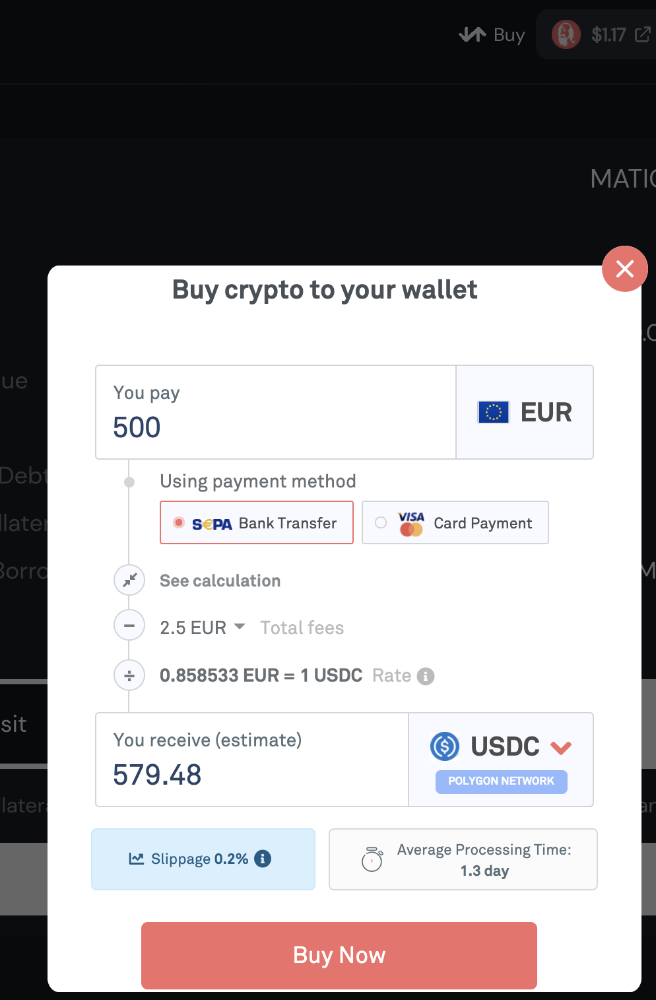
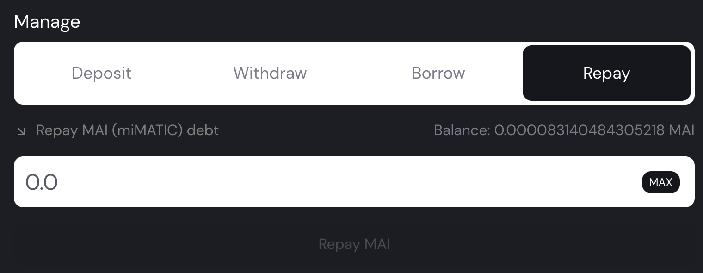

# Pago de la Deuda - ¿Cómo?

## Introducción

El mercado se encuentra en una tendencia alcista y tus cryptos se encuentran depositadas en una bóveda (**vault**). Tus cryptos se han revalorizado lo suficiente así que decides venderlas, sin embargo, al estar depositadas en una bóveda de Mai Finance, no las puedes retirar a no ser de que pagues tu deuda.

El mercado se encuentra en una tendencia bajista y tus cryptos se están devaluando rápidamente, no estás generando el suficiente rendimiento con tus activos para cubrir las pérdidas y mantener un Ratio de Colateral Deuda (**CDR**) sano, por lo que la liquidación está cerca. Es la hora de pagar tu deuda y asegurarte de no seguir perdiendo capital, y previniendo la liquidación.

Si no te encuentras en ninguna de estas situaciones, es probable que no te venga a cuenta pagar tu deuda. Véase el siguiente artículo sobre [Pago de la Deuda](debt-repayment-why-and-when.md) para más detalles.

## Pago Parcial o Completo usando FIAT

La forma más directa para saldar tu deuda es usando FIAT, sobre todo si quieres mantener tu colateral y tus otras inversiones.

Mai Finance está colaborando con [Transak](https://transak.com) para poder transferir fácilmente de tu tarjeta de débito/crédito a la red de Polygon. Simplemente vaya a Mai Finance y haga click en el icono de Transak en la barra del menú para abrir una ventana que te permitirá comprar crypto directamente, el cual será depositado directamente en tu cartera.

El principal problema con este método es el tiempo que tarda en procesar la transacción. Sin embargo, esto te permitirá intercambiar tus USDC a MAI para saldar parcial o totalmente tu deuda.

## Pago de la Deuda usando los Beneficios del Préstamo

### Pago Parcial

La mayoría de la gente querrá pedir prestado MAI para poder invertir en otros proyectos. Los inversores que usan las granjas de rendimiento (yield farming) que usan MAI podrán generar con mucha probabilidad recursos adicionales para pagar su deuda, y con suerte no perderán mucho dinero en el intento. Si no te identificas con el grupo de arriba, tienes 2 opciones:

* Pagar tu préstamo con el dinero generado.
* Reinvertir tus ganancias en el mismo u otro proyecto.

En la mayoría de casos, es mejor reinvertir tus ganancias ya que al acumular( o compound), tu APR (**Tasa** de **Porcentaje Anual** ) es aplicado en una cantidad superior, lo que significa ingresos superiores. En esta guía hay distintos artículos sobre cómo poder maximizar tus inversiones.

Sin embargo, hay personas que no son partidarias a tener una deuda, queriéndola pagar lo antes posible. Si ese es tu caso, puedes cambiar tus beneficios a MAI y saldar tu deuda.

* Abre la información sobre tu bóveda (vault).
* Selecciona la opción de `Manage`
* Selecciona la ventana de "_**Repay**_" al final de tu bóveda.
* Introduce la cantidad que quieras devolver.
* Haz click en`Repay MAI` y habrás terminado.

Pongamos el siguiente ejemplo:

* Tienes $1,000.00 de tokens camWMATIC en tu bóveda, con una deuda de $400.00
* Intercambias $10.00 de token ADDY por MAI
* Pagas $10.00 hoy :
  * Tu deuda es ahora $390.00
  * El valor de tus camWMATIC es de $999.95 (tienes que pagar el 0.5% de los $10.00 en concepto de cuota de pago)

En un futuro, podrás saldar tu deuda usando esta técnica, siempre y cuando puedas generar el suficiente beneficio usando tu préstamo.

¿Es esta estrategia eficiente? No del todo. Saldar tu deuda usando este método no cambia nada excepto tu CDR. Ya que tu colateral permanecerá bloqueado hasta que hayas pagado la totalidad de tu deuda, y si usas los _**amTokens,**_ no habrá ninguna diferencia entre tener una deuda o no, esto es debido a que tu colateral te está generando rendimiento. La única ventaja es que podrás retirar una parte de tu colateral y usarla en otra parte, incluso podrías venderla.

### Pago Total

Otra estrategia, bastante similar a la anterior, es saldar tu deuda con un solo pago. En el ejemplo de arriba, en vez de pagar $10.00 cada cierto tiempo, podría hacer compound de esos $10.00 generados por mi inversión y generar rendimiento de forma mas rápida. Además, podría invertir esas ganancias en otro proyecto que me generase mayores beneficios. Una vez consiga el equivalente de $400.00 que corresponde a mi deuda del préstamo, puedo pagar la deuda de una sola vez.

## Pago de la Deuda usando tu Colateral

### Idea Principal

En Mai Finance, puedes pedir prestado MAI al depositar una cantidad de colateral en una bóveda. El **CDR** tiene que mantenerse siempre por encima de un cierto nivel, el 150% para la mayoría de casos. Esto significa que manteniendo un CDR del 150% , por cada $100 de colateral depositado, solo puedes pedir prestado $66.6667 de MAI.

Sin embargo, esto te pondría en una situación de posible liquidación. Esto significa que si la "salud" de tu bóveda es considerada peligrosa, cualquiera puedes pagar una parte de tu deuda usando sus fondos para así quedarse con una parte del colateral. Para obtener más detalles acerca de la liquidación, lea la [documentación oficial](https://docs.mai.finance/liquidation).

La mejor práctica posible es mantener un nivel elevado de **CDR** para evitar ser liquidado, pero incluso con un CDR cercano al 150%, es fácil de comprobar que el valor de tu colateral SIEMPRE es superior al valor de tu deuda. Esto significa, que llegado al caso, podrás saldar tu deuda vendiendo una parte de tu colateral.

### Como Usar el Colateral

Consideremos una bóveda con $1,000.00 de MATIC y una deuda de $500.00 . El CDR is 200%. Recuerda que el CDR **mínimo** es 150%. En este ejemplo, queremos saldar la deuda totalmente, evitar la liquidación y mantener como mínimo el CDR al 160% CDR cuando retiremos el colateral. Usaremos las siguientes fórmulas:

$$
CDR=\frac{Colateral}{Deuda}
$$

$$
Colateral Disponible = ColateralInicial - ObjetivodeCDR * Deuda
$$

En este ejemplo, queremos mantener el CDR al 160%, por lo que la cantidad "segura" de colateral que podemos retirar es la siguiente:

$$
ColateralDisponible = 1000 - 1.60*500 = $200
$$

Por lo que tendríamos que realizar esta estrategia:

* Retirar $200 del colateral depositado
  * La bóveda tendrá ahora $800 de MATIC y $500 de deuda y el CDR es del 160%
* Vende los $200 del colateral y compra MAI
* Paga los $200 de la deuda con una cuota de pago del 0.5%
  * La bóveda tiene ahora $799 de MATIC y $300 de deuda y el CDR es del 266.33%
* Calcula la nueva cantidad de colateral que puedas retirar: $319
* Retira $319 del colateral
  * La bóveda tiene ahora $480 MATIC y $300 de deuda y el CDR es del 160%
* Vende los $319 de colateral para comprar MAI
* Paga los $300 de deuda con una cuota de pago del 0.5%
  * La bóveda tiene $478.50 de MATIC, $0 de deuda y $19 en MAI extras.

Viendo la estrategia de arriba se puede observar que mantener un CDR sano puede ayudarte a pagar la deuda con muy pocas transacciones. Cabe destacar, que si tu CDR esta cercano al límte del 150%, tendrás que realizar mas transacciones puesto que no podrás retirar tantos fondos de una sola vez.


Un CDR del 260% es suficiente para poder retirar la cantidad total equivalente de tu deuda y mantener un CDR al 160% . De esta forma, solo tendrás que realizar un solo "bucle" para pagar totalmente tu deuda.


Pagar totalmente tu deuda vendiendo tu colateral nunca es necesario si no tienes la necesidad de vender tus activos, o de modificar tu CDR y mantener tu bóveda fuera de los límites de ser liquidada .

## Pago de la Deuda usando un bot

Esta parte del artículo es pura teoría y esta enfocado a los que tengan una gran experiencia programando. La idea es una los préstamos flash que te ayudarán a pagar tu deuda y desbloquear tu colateral para poder pagarla. Los préstamos flash son una propuesta que ofrecen algunas aplicaciones blockchain, que te permite pedir prestado fondos y pagar el préstamo en el mismo número de bloque. si el prestamo no puede ser pagado totalmente en el mismo número de bloque, la transacción es cancelada. En Polygon, AAVE ofrece estos préstamos.

Si volvemos a usar el mismo ejemplo anterior con los $1,000.00 de MATIC y una deuda del $500.00. El orden sería el siguiente:

* Pedir prestado $600.00 de USDC en AAVE en un préstamo flash
* Intercambia el USDC por MAI
* Paga el total de tu deuda.
* Retira tu colateral MATIC
* Vende tu MATIC por USDC
* Paga el préstamo flash en AAVE

Cuando hayas termimado, todas las transacciones anteriores habrán sucedido en el mismo número de bloque y tendrás la cantidad restante de lo que haya sobrado en tokens MATIC y USDC en tu cartera (serán unos $500 aproximadamente, sin embargo, este valor puede variar debido a las tasas de interes del préstamo flash, el gas de la red o las cuota de pago)

El paso siguiente, sería interactuar directamente con los smart contracts, lo que requiere un gran conocimiento sobre como funcionan éstos. Si necesitas ayuda, puedes preguntar en nuestro servidor de Discord donde hay un canal dedicado a la programación. Quizás en un futuro no muy lejano, [FuruCombo](https://furucombo.app/combo) propondrá a Mai Finance herramientas que te permitirán realizar lo anterior usando su herramienta gráfica, pero ahora no es posible. Por último, "pagar la deuda usando tu colateral" ha sido propuesto al equipo de desarrolladores de Mai, y esta opción puede ser implementada en el futuro.

## Pago de Deuda en el Corto Plazo vs Largo Plazo

Dependiendo de tu estrategia y de la forma que te sientes respecto a la deuda, podría ser una buena idea comparar diferentes plataformas de préstamos. Sin embargo, ten en cuenta de que Mai Finance tiene un 0% de tasa de interes y una cuota de pago del 0.5%, lo que le convierte en una de las mejores aplicaciones de préstamos de Polygon. El único contrincante es AAVE, pero solo si quieres pedir prestado MAI o USDC por un periodo corto de tiempo.

* Mai tiene un 0% de interés + de cuota de pago 0.5%
* AAVE no tiene cuota de pago pero un APR variable de los intereses que tienes que pagar.

Por ejemplo podemos ver en la imagen superior, que el USDC tiene un interes al pedir prestado del 3.79% con una recompensa del 2.08% devuelto en MATIC. Esto da como resultado, a fecha de cuando fue la captura, un interés del 1.71% que tienes que devolver si quieres mantener tu préstamo por un año entero. Con AAVE, puedes pagar tu deuda de forma muy rápida, por lo que el APY variable es equivalente al 0.005% diario. Por lo que se tardaría 100 días (un poco más de 3 meses) para alcanzar el 0.5% de tu deuda.

Si tienes pensado mantener tu préstamo más de ese tiempo, Mai Finance es la mejor opción. También, es importante resaltar que los APRs de AAVE son variables, estos fluctuaran dependiendo de la cantidad depositada y pedida por los usuarios (cuanto mas gente quiera pedir prestado en AAVE, mayor será el APR). Además, el programa de recompensa de MATIC terminará en un futuro no muy lejano por lo que esa tasa de interés del 1.71% pasará a convertirse en una del 3.79% . Por lo que la ventaja de Mai Finance es que no tienes que estar pendiente de la cuota de interés del préstamo, ya que sabes que siempre será la misma.

Por último, el equipo de Mai Finance esta trabajando en incentivar las bóvedas, de forma similar a como funciona el programa de recompensas de MATIC en AAVE, lo que significaría que tendrás una tasa de interés del 0% y recibirás una recompensa en forma de Qi, lo que podría incluso reducir tu cuota de pago al 0%. Recuerda que cuanto más mantengas el préstamo, mayores serán las recompensas que recibirás, lo que convertiría a Mai Finance en un proveedor de préstamos con tasa de intereses negativos

## Descargo de Responsabilidad

Las opiniones expresadas en este texto son exclusivas del autor de este artículo, y no son necesariamente las mismas que las del resto de la comunidad de Mai Finance, ni del equipo de desarrollo de éste. Este artículo no debería ser tratado cómo consejo financiero, sino cómo un recurso educativo.


Ten en cuenta que una estrategia que funciona bien en un momento dado puede funcionar mal (o hacerle perder dinero) en otro momento. Mantente informado, controla los mercados, controla tus inversiones y, como siempre, haz tu propia investigación.

