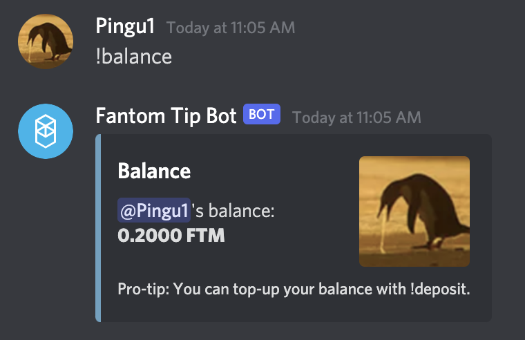

# Fantom'u Nasıl Kullanırım?

## Fantom Nedir?

Fantom, blockchain tasarımcıları için bir Ethereum alternatifidir. Açık kaynaklı akıllı sözleşme destekli bir blok zinciri olarak, tasarımcıların güvenli, kapsamlı ve modüler DApp'ler (**D**ecentralized **A**pplication) geliştirmesine olanak tanır.

Zincir, bazen blok zincir trilemması olarak adlandırılan önceki nesil blok zinciri platformlarının tüm sınırlamalarının üstesinden gelmek için tasarlanmıştır: ademi merkeziyetçilik, güvenlik ve ölçeklenebilirlik. Bu yönlerden birini geliştirmek için, diğer ikisinden birinin üste gelmesi gerekecek. Fantom, DAG (Yönlendirilmiş Asiklik Grafikler) tabanlı Lachesis aBFT konsensüs mekanizması sayesinde bunu çözmeye çalıştı ve yüksek performanslı, ölçeklenebilir ve güvenli olmasını sağladı. İlk karşılaştırmalar, Fantom'un saniyede 20.000'den fazla işlemi kolayca gerçekleştirebileceğini gösterdi.

Son olarak, Fantom %100 EVM (**E**thereum **V**irtual **M**achine) uyumludur, yani EVM uyumlu ağlarda geliştirilen DApp'ler Fantom'da da konuşlandırılabilir. MetaMask ve diğer web3 uygulamalarının da Fantom ile uyumlu olması nedeniyle kullanıcılar için başka avantajlar da getiriyor. Aynı cüzdan içinde Polygon veya Avalanche'dan Fantom'a sorunsuz bir şekilde geçebileceksiniz.

## Fantom'a Başlarken

Fantom, EVM uyumlu olduğundan, diğer EVM zincirleri (Ethereum Mainnet, Polygon veya Avalanche) için zaten bir cüzdanınız varsa rahatça kullanabileceksiniz. Aksi takdirde, cüzdan adresi oluşturma gerekecekti. Kullanılabilecek farklı cüzdan türleri vardır: Metamask veya [fWallet](https://pwawallet.fantom.network/#/) gibi **yazılım cüzdanları** veya \[Trezor]\(https gibi) **donanım cüzdanları** ://trezor.io/coins/) veya [Ledger](https://fantom.foundation/blog/how-to-set-up-your-ledger-nano-sx-with-fantom/).

Bu kılavuz için ve diğer tüm kılavuzlarımızda Metamask kullandığımız gibi yine Metamask kullanacağız. Dilerseniz istediğiniz diğer yazılım/donanım cüzdanlarını kullanmaktan çekinmeyin. Metamask'ı nasıl kuracağınızla ilgili talimata ihtiyacınız varsa, [polygon kılavuzunda](../polygon-tutorials/how-to-get-started-on-polygon.md#downloading-metamask) talimatları bulabilirsiniz.

### Adding Fantom to Metamask

Fantom ağını kullanmak için Metamask'ta manuel olarak yapılandırmanız gerekecektir. Bunu yapmak için Metamask penceresinin üst kısmındaki Ağ açılır menüsüne tıklayın (burada şu anda kullanmakta olduğunuz ağı, varsayılan olarak Ethereum Mainnet'i gösterir), ardından "Custom RPC"yi seçin. Aşağıdaki bilgiler Fantom'a bağlanmanızı sağlayacak bilgilerdir:

* **Network Name**: Fantom Opera
* **RPC URL**: https://rpc.ftm.tools/
* **ChainID**: 250
* **Symbol**: FTM
* **Explorer**: https://ftmscan.com

Değişikliklerinizi kaydettikten sonra Metamask otomatik olarak Fantom ağına geçecektir.

.png>)

Metamask'ı kurmak için daha fazla ayrıntıya ihtiyacınız varsa [resmi Fantom kılavuzunda](https://docs.fantom.foundation/tutorials/set-up-metamask) ek bilgiler bulacaksınız.

### FTM faucet

Artık FTM'de olduğunuza göre, bir miktar FTM'ye (gas maliyetlerini karşılamak için kullanılan token) ihtiyacınız olacak. Diğer zincirlerden bazı FTM'leri köprüleyebilir veya birkaç işlem gerçekleştirmek için cüzdanınıza yeterli FTM tokenı bırakacak bir faucet kullanabilirsiniz. [Fantom'daki ana faucet](https://docs.spookyswap.finance/getting-started/how-to-get-fantom-gas), Fantom'daki DEX'lerden biri olan SpookySwap'ta bulunabilir (**D**ecentralized **E**xchange). Bu işlemi gerçekleştirmek için SpookySwap tarafından sunulan ve Discord'a dayanan bir hizmet olduğunu ve 30 günden fazla etkin bir Discord Hesabı gerektireceğini unutmayın (30 gün boyunca SpookySwap Discord sunucusunda olması gerekmez).

* [SpookySwap Discord](http://discord.gg/AqbsWsWDgn) sunucusuna katıldıktan ve hesabınızı doğruladıktan sonra #faucet bölümüne gidin.

.png>)

* \#faucet kanalında `!faucet` komutunu yazmanız yeterlidir, bot size bir miktar $FTM gönderecektir. Her 30 günde bir 1 etkileşimle sınırlı olacağınızı unutmayın.
* FTM'i düzgün bir şekilde aldığınızı doğrulamak istiyorsanız, onunla doğrudan etkileşim kurmak için Fantom Tip Bot adına tıklayabilir ve `!balance` yazabilirsiniz.

* Şimdi yapmanız gereken tek şey, `!withdraw <your_wallet_address>` komutunu kullanarak FTM'lerinizi cüzdan adresinize göndermek. Cüzdan adresinizi Metamask penceresinin en üstünde bulacaksınız.

.png>)

.png>)

## Fantom'a Köprü Oluşturma

### Stablecoinler / ETH / BTC arasında köprü oluşturma

Stablecoinleri Fantom'a köprülemek istiyorsanız, aşağıdaki köprü listesini kullanabilirsiniz:

* [AnySwap](https://anyswap.exchange/#/bridge): Bu, Polygon'da bastığınız MAI'yi Fantom'a göndermek için resmi olarak desteklenen köprüdür (bkz. \[MAI metaverse]\(../mai-university/mai -metaverse.md#fantom) ayrıntılar için kılavuz). Bu çözüm, birçok varlığı ve birçok zinciri destekler, böylece kripto varlıklarınızı Fantom'a göndermeniz sizin için kolay olacaktır. İşlem ücretleri ve beklenen yürütme süresi için lütfen köprüleme kullanıcı arayüzünün altındaki Hatırlatma notlarına bakın.

* [Celer Bridge](https://cbridge.celer.network/#/): Köprüden Fantom'a (DYOR) kadar %0,04 ile %0,19 arasında değişen ücretlerle çoğu stabilcoin için birçok zincir için köprüleme hizmetleri sunar.
* [xpollinate](https://www.xpollinate.io): düşük ücretler ve köprülemek istediğiniz token için hedef zincirde yeterli likidite olmasını sağlar. Likidite ne kadar düşükse (veya köprülenecek miktar ne kadar büyükse), transfer o kadar uzun olur..

### Diğer varlıklar arasında köprü oluşturma

* Binance CEX: Binance'de FTM tokenini satın alabilecek ve onu doğrudan Fantom'a bağlayabileceksiniz.
* [SpookySwap](https://spookyswap.finance/bridge): Fantom'a gönderebileceğiniz birçok ağı ve birçok tokenı destekler.
* AnySwap: Stablecoin bölümünde yapılan açıklamaya bakın.

## Fantom'da DeFi Uygulamaları

Fantom, 2021 yazının sonunda, özellikle zincirdeki yatırımcıları ve geliştiricileri çekmeye yardımcı olan ödül programlarıyla oldukça etkileyici bir genişleme gördü. Büyüme, Curve ve SushiSwap dahil olmak üzere Eylül 2021'de DApp'lerini Fantom'da kullanan bluechip projeleri tarafından da desteklendi.

* [BeethovenX](https://app.beethovenx.io/#/): Bu uygulama Balancer'a çok benzer. Bazı tokenları diğerleri için takas edebilecek ve ayrıca birden fazla tokendan oluşan dengeli havuzlara girebileceksiniz. Burası aynı zamanda Mai Finance'in Fantom'daki ilk resmi ortağı ve MAI'nizi değiştirebileceğiniz veya MAI-USDC havuzunda kullanabileceğiniz tek yer.

* [SpookySwap](https://spookyswap.finance): Bu, Fantom'daki en büyük DEX'tir (**D**ecentralized **E**xchange), burada tokenlarınızı başkalarıyla takas edebileceğiniz, likidite yatırabileceğiniz ve çiftlik verimi gibi hemen hemen aynı şekilde QuickSwap on Polygon'da yaptığınız faaliyetleri uygulayabilirsiniz. SpookySwap platformun tokenı olan BOO kullanarak sizi ödüllendirecek. Bir yan not olarak ekleyelim, BOO stake ettiğinizde, karşılığında xBOO alacaksınız ve bunları ekstra ödüller kazanmak için kullanabilirsiniz (QuickSwap'taki Dragon's Syrup ile aynı prensip).
* [SpiritSwap](https://app.spiritswap.finance): Token değiş tokuş edebileceğiniz, LP tokenları oluşturabileceğiniz ve likidite havuzlarında çiftlik getirisi yapabileceğiniz geleneksel AMM ve getiri çiftçiliği platformu. SpiritSwap, platformda stake edebileceğiniz ve inSPIRIT tokenlarını (SPIRIT belirli bir süre için kilitlenecektir), veCRV bağlı olarak alabileceğiniz SPIRIT ile size ödeme yapacaktır. Fantom'da Mai Finance'i beklerken ödünç vermek ve ödünç almak için SpiritSwap'ı da kullanabilirsiniz.
* [Tarot](https://www.tarot.to): Tarot, Impermax'ın Fantom versiyonudur. Burada SpookySwap'tan (veya diğer DEX'ler/AMM'den) LP tokenlarınızı kullanabilecek ve bunları çiftlikte kullanmak için değerlendirebileceksiniz. Ayrıca, single token yatırabilir ve insanların yeni LP tokenları oluşturmak ve çiftçilik miktarlarından yararlanmak için ödünç alabilecekleri belirli havuzlara ödünç verebilirsiniz. LP'lerinizi kullanımın yüksek olduğu bir havuzda kullanırsanız, likidasyonun farkında olun.
* [Scream](https://scream.sh): Scream tokenlarınızı ödünç alabileceğiniz ve onlara karşı ödünç alabileceğiniz bir Compound klonudur. Tokenlarınızı ödünç vermek, ödünç verdiğiniz tokena ve diğer platformlarda kullanabileceğiniz SCREAM şeklinde ödüller kazanmanızı sağlayacaktır.
* [Curve](nas%C4%B1l-ba%C5%9Flang%C4%B1%C3%A7-on-fantom.md#bridging-stable-coins-eth-btc): Curve, herkesin iyi bildiği, tokenlarınızı yatırabileceğiniz bluechip projesidir belirli havuzlar (eşit miktar yatırmanıza gerek yoktur) ve ödünç verdiğiniz tokenların yanı sıra CRV ve wFTM ile ödüllendirileceksiniz.

.png>)

Fantom'da diğer kılavuzlarda anlatılacak olan pek çok başka fırsat var.

## Diğer faydalı bağlantılar

* [Fantom Explorer](https://explorer.fantom.network)
* [Fantom Gas Tracker](https://ftmscan.com/gastracker)
* Resmi [Fantom Discord](fantom.md#ftm-faucet-nas%C4%B1l-ba%C5%9Flat%C4%B1l%C4%B1r) sunucusu
* [DeBank](https://debank.com) portföy yönetimi

## Sorumluluk Reddi

Bu kılavuz finansal tavsiye DEĞİLDİR ve sadece bir eğitim aracı olarak görülmelidir. Her zaman kendi araştırmanızı yapın. Bu kılavuzda sunulan veya sadece ağdaki olasılıkları gösteren projeler ve projeyi onaylayan biri olarak görülmemelisiniz.


Belirli bir zamanda iyi çalışan bir stratejinin başka bir zamanda kötü performans gösterebileceğini (veya para kaybetmenize neden olabileceğini) unutmayın. Lütfen haberdar olun, piyasaları takip edin, yatırımlarınızı takip edin ve her zaman olduğu gibi kendi araştırmanızı yapın.

