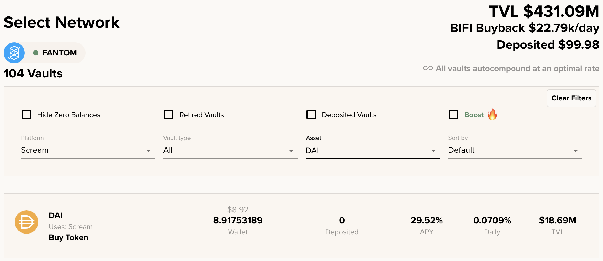

# Appliquer un effet de levier à vos cryptos sur Fantom

## Introduction

Mai Finance a lancé sa plateforme de prêt sur Fantom avec de nombreux types de coffres différents, permettant la possibilité de créer du MAI en fonction des actifs que vous déposerez dans un coffre. L'idée est que vous pourrez conserver vos crypto-monnaies et bénéficier de l'appréciation de leur prix, tout en ayant la possibilité d'acheter d'autres jetons et de cultiver des rendements avec des TAEG élevés. Si vous utilisez votre prêt pour acheter davantage du même actif que vous avez déjà déposé, c'est ce qu'on appelle un effet de levier sur vos jetons. Nous allons vous montrer les avantages de cette stratégie en utilisant 2 plateformes de prêt différentes sur Fantom pour tirer parti de nos jetons DAI.

## Appliquer un effet de levier à vos jetons de coffres de Yearn

### Déposez vos actifs sur Yearn Finance

[Yearn Finance](https://beta.yearn.finance/#/home) est un groupe de protocoles fonctionnant sur le Mainnet Ethereum et d'autres blockchains qui permettent aux utilisateurs d'optimiser leurs gains sur les crypto-actifs grâce à des services de prêt et de trading. Sur Fantom, le produit que nous allons utiliser est le coffre-fort sur yearn finance. C'est un outil qui acceptera les dépôts de jetons seuls et vous fera gagner des rendements sur ce dépôt. Comme preuve de dépôt, vous recevrez un yvToken. Dans notre cas, nous déposerons des DAI et obtiendrons des yvDAI en échange.


Le site de yearn finance est toujours en mode bêta sur Fantom. L'équipe travaille toujours sur la plateforme et les APRs/APYs ne sont pas affichés. Si vous vous rendez sur l'onglet Iron Bank, qui est le protocole de prêt/emprunt sur la plateforme yearn, vous verrez que le prêt de DAI obtient un taux d'intérêt annuel de \~8%. Veuillez investir à vos propres risques.


### Déposez vos yvTokens sur Mai Finance

Une fois que vous avez déposé votre DAI sur yearn finance, vous devriez avoir yvDAI dans votre portefeuille. C'est ce que nous appelons un jeton à rendement : c'est un jeton qui n'a pas de valeur en soi, mais qui représente votre part d'une pool où vos actifs rapportent des rendements et dans lequel les récompenses sont automatiquement composées. En d'autres termes, si la valeur de votre DAI ne change pas parce qu'il est indexé sur le dollar américain, la valeur sous-jacente de votre jeton yvDAI augmente quand même.

Mai Finance accepte un grand nombre de jetons de rendement différents comme collatéral, y compris yvDAI. Vous pouvez maintenant déposer ce jeton et emprunter des MAI contre lui.

Le coffre yvDAI a un seuil de liquidation de 110%, ce qui signifie que vous pouvez emprunter des MAI de sorte que le rapport entre la valeur de votre collatéral et la valeur de la dette soit de 110%. Attention, 110% est en fait le ratio auquel votre coffre sera liquidé. Vous devez maintenir le ratio au-dessus de ce seuil minimum. Étant donné que le prix du DAI ne varie pas beaucoup (moins de quelques centimes à la hausse ou à la baisse), il est possible de conserver un ratio CDR (Collateral to Debt Ratio) "sûr" de 115 %, mais n'hésitez pas à conserver un ratio plus élevé.

Comme toujours, pour calculer la valeur du prêt que nous pouvons obtenir en fonction de la valeur de notre collatéral et du CDR ciblé que nous voulons obtenir, nous utiliserons la formule suivante:

$$
MAI_{disponible} = \frac{Collatéral_{valeur} - Dette_{valeur} * CDR_{ciblé}}{CDR{ciblé}}
$$

​Avec un collatéral d'une valeur de 100 $ et aucune dette, si nous voulons conserver un CDR sain de 115%, nous pouvons emprunter jusqu'à

$$
MAI_{disponible}=\frac{100-0*1.15}{1.15}=86.95
$$

​Vous êtes maintenant dans une position où vous avez vos rendements de DAI dans un coffre Yearn, et vous avez également des pièces stables MAI prêtes à être utilisées. Puisque nous voulons tirer parti de notre position en DAI, nous allons maintenant échanger notre MAI contre plus de DAI.

### Échangez MAI sur BeethovenX

Sur Fantom, la principale source de liquidité pour MAI est [BeethovenX](https://app.beets.fi/#/trade). C'est l'endroit principal où vous pourrez échanger vos jetons MAI contre plus de DAI pour notre stratégie.

C'est la dernière étape de notre boucle. Maintenant que vous avez plus de DAI, vous pouvez les déposer dans un coffre Yearn et répéter la boucle. Ce faisant, vous augmentez le montant des actifs que vous avez dans le coffre Yearn, ce qui signifie que vous obtiendrez plus de récompenses en prêtant vos DAI sur cette plateforme. L'APY reste la même, mais comme vous avez plus d'actifs, vous obtenez plus de rendement, et si vous comparez avec votre investissement initial, c'est votre APY qui augmente. Si vous souhaitez obtenir plus d'exemples sur l'APY que vous pouvez obtenir en utilisant les boucles yvDAI, veuillez lire notre [article sur les jetons camDAI](../tutoriels-polygon/camdai-beginner-strategy.md) pour Polygon qui utilise exactement la même stratégie mais des outils différents.


BeethovenX est en fait une opportunité fantastique de cultiver des rendements avec votre MAI emprunté. Il suffit de déposer votre MAI dans le pool MAI-DAI-USDC (APR de \~30% à partir de novembre 2021) si vous ne pouvez pas obtenir une meilleure APR en utilisant des boucles à effet de levier.


## Exploitez vos mooScreamTokens sur Mai Finance

### Déposez vos actifs sur Beefy Finance

[Beefy Finance](https://app.beefy.finance/#/fantom) est une plateforme d'optimisation de rendement multi-chaîne décentralisée qui permet à ses utilisateurs de gagner des intérêts composés sur leurs crypto-monnaies. En d'autres termes, vous pouvez déposer des actifs ou des LP tokens d'autres plateformes sur Beefy Finance et laisser l'auto-composeur récolter les jetons de ferme et les convertir en plus d'actifs ou LP tokens déposés. Pour notre exemple, nous allons utiliser des dépôts simples de DAI sur Beefy et utiliser Scream comme plateforme sous-jacente. Scream est un Compound fork sur le réseau Fantom sur lequel vous pourrez prêter vos actifs et collecter des tokens SCREAM. Beefy vendra ensuite les jetons SCREAM pour plus de DAI.

Pour déposer notre DAI, nous nous rendrons sur l'application Beefy Finance et sélectionnerons Scream comme plateforme sur laquelle nous ferons du farm yields. Vous pouvez également ajouter le filtre DAI afin d'obtenir le dépôt direct de DAI.

Comme vous pouvez le constater, Beefy offre déjà un taux d'intérêt annuel incroyable sur les dépôts simples de DAI. Une fois que vous avez déposé vos DAI sur Beefy, vous devriez avoir une preuve de dépôt dans votre portefeuille sous la forme de jetons mooScreamDAI. Comme pour le jeton yvDAI, le jeton mooScreamDAI est un dépôt à rendement, ce qui signifie que votre actif est toujours utilisé sur Scream et composé sur Beefy, ce qui permet d'obtenir des rendements. Mais vous pourrez utiliser ce jeton sur Mai Finance pour emprunter des MAI contre eux.

### Déposez vos mooScreamToken sur Mai Finance

Une fois que vous avez déposé votre DAI sur Beefy Finance, vous devriez avoir mooScreamDAI dans votre portefeuille. Vous pouvez utiliser exactement les mêmes étapes que pour la stratégie Yearn Vault ci-dessus, la seule différence est que le ratio de liquidation de mooScreamDAI est de 135%. Puisque DAI est une pièce stable, il est toujours possible d'emprunter MAI et de garder un CDR très proche du ratio de liquidation. Pour notre exemple, nous viserons un CDR de 140%, et avec la même formule que ci-dessus, nous pouvons calculer la quantité de MAI que nous pouvons frapper avec 100$ de DAI.

$$
MAI_{disponible}=\frac{100-0*1.4}{1.4}=71.43
$$

​Puisque nous empruntons moins, nous serons en mesure d'effectuer moins de boucles et le rendement annuel équivalent final sera également inférieur, mais cela reste une assez bonne stratégie pour les débutants.

Le reste de la boucle est le même que pour yvDAI, ce qui signifie que vous devrez échanger votre MAI pour le DAI sur BeethovenX et répéter jusqu'à ce que vous soyez satisfait.

## Quelques notes sur les stratégies de levier

L'effet de levier DAI est considéré comme une stratégie pour débutants dans le sens où il présente très peu de risques (vous travaillez avec des pièces stables) et vous pouvez obtenir de bons rendements en utilisant au maximum 3 protocoles. Cependant, il y a toujours certains risques.

### Risque de liquidation

Plus vous effectuerez de boucles, plus le risque de liquidation sera élevé. En effet, même une petite variation du prix du DAI sera amplifiée par l'effet de levier que vous avez appliqué, et même si vous gardez un CDR de 5 points au-dessus du ratio de liquidation, votre coffre peut être en danger. C'est toujours une bonne idée d'arrêter les boucles de levier à l'étape où vous déposez vos actifs sur MAI finance et de ne pas emprunter des MAI supplémentaires afin de garder un meilleur CDR.

En outre, en cas de liquidation, étant donné que votre coffre sur MAI finance contient beaucoup plus d'actifs, une liquidation aura également un impact plus important que si vous n'aviez pas levé votre position, simplement parce que la dette que vous devez rembourser est également beaucoup plus importante.

### Risque Technologique

Si vous utilisez de nombreux protocoles pour vos legos d'investissement, vous devez vous assurer que ces protocoles sont sûrs. En effet, dans notre stratégie de levier, si un seul protocole est piraté, toute la stratégie peut s'effondrer. Assurez-vous de faire preuve de diligence raisonnable avant d'investir dans des projets deFi.

### Atteindre les plafonds d'endettement

Comme ces stratégies sont faciles à mettre en place et présentent peu de risques, la demande est très forte. Cependant, vous avez certainement remarqué que dans le processus d'effet de levier, les MAI empruntés sont échangés contre des DAI (ou d'autres jetons). Si trop de MAI est vendu sur Beethoven, son prix va diminuer lentement et il y a un risque que le MAI perde son ancrage, ce qui est assez mauvais pour une pièce stable. Afin de laisser le temps au prix de se stabiliser, Mai Finance a mis en place des mécanismes de sécurité, dont le plus important est un plafond d'endettement pour chaque coffre

Un plafond d'endettement représente le nombre maximum de MAI qui peuvent être crées pour un coffre donné. Une fois le plafond atteint, plus aucun MAI ne peut être emprunté. L'équipe centrale en charge du financement du MAI peut alors décider d'augmenter le plafond ou d'attendre un peu plus pour un meilleur prix du MAI.

Vous pouvez à tout moment vérifier la quantité de MAI qui peut être créee sur la [page de création du coffre](https://app.mai.finance/vaults/create), mais vous remarquerez généralement qu'il n'y a plus de MAI si vous obtenez le message d'erreur suivant:

Ce message d'erreur apparaîtra même si votre facteur de santé est correct. Dans la plupart des cas, attendre que le plafond soit augmenté est la seule solution. Gardez un œil sur twitter ou sur Discord pour savoir quand cela se produit.

## Avertissements

Cet article a présenté quelques-unes des façons d'utiliser vos actifs sur Fantom et d'inclure Mai Finance à votre stratégie afin d'augmenter vos gains. Cependant, comme d'habitude, cet article n'est pas un conseil financier et vous devriez toujours faire vos recherches avant d'appliquer une stratégie d'investissement, et investir de manière responsable.

Gardez également à l'esprit que cette solution peut ne pas être la meilleure stratégie selon le moment où vous prévoyez de l'utiliser. Nous venons de souligner que BeethovenX a également des taux d'intérêt intéressants pour votre MAI, et vous pouvez également utiliser Beefy Finance pour convertir les récompenses BEETS en pièces plus stables.


N'oubliez pas qu'une stratégie qui fonctionne bien à un moment donné peut donner de mauvais résultats (ou vous faire perdre de l'argent) à un autre moment. Restez informé, surveillez les marchés, gardez un œil sur vos investissements et, comme toujours, faites vos propres recherches.

