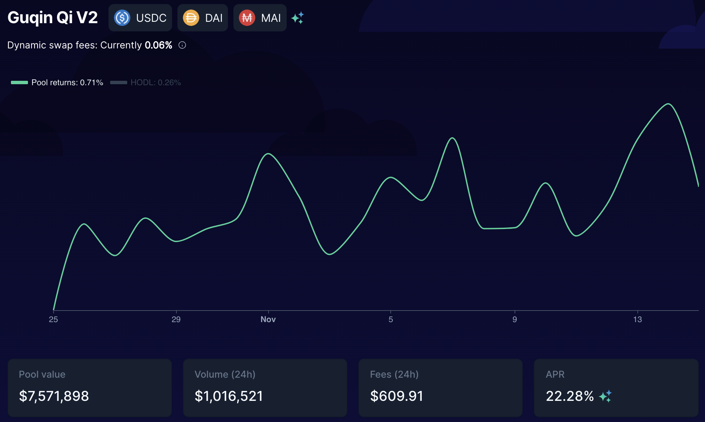
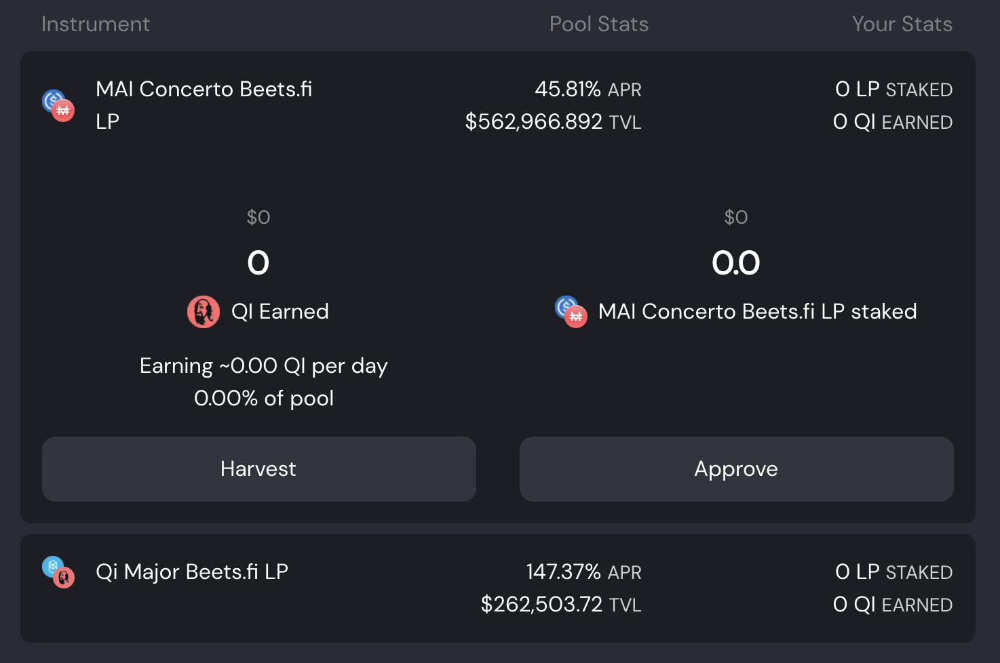

# Cosa fare con MAI su Fantom

## Obbiettivo di questo tutorial

L'obbiettivo di questo tutorial non è presentare in dettaglio cosa puoi fare con la tua stable coin MAI ma avere un elenco di tutti i siti Web e applicazioni DeFi che puoi utilizzare su Fantom che ti permettano di utilizzare i tuoi MAI direttamente o in combinazione con altre stable coin. Per maggiori dettagli su modi specifici di utilizzare MAI, puoi fare riferimento ad altri tutorial su questo sito o ottenere aiuto su [Discord](https://discord.gg/aRghpvhV) o [Telegram](https://t.me/QiDaoProtocol).

Si prega di notare che l'elenco non è completo e non lo sarà mai poiché ci sono nuove dApp lanciate ogni settimana sulla rete. Non possiamo recensirle tutte quindi presenterò solo le opzioni principali, ovvero le opzioni più famose/più "sicure".

Se vuoi che un particolare progetto sia elencato, per favore unisciti alla comunità Qi su [Discord](https://discord.gg/mQq55j65xJ).

## Farmare in sicurezza sui progetti maggiori (bluechip)

I progetti Bluechip sono le applicazioni DeFi che si sono dimostrate solide e presentano un rischio minore. Di solito sono controllati e il team di sviluppo ci ha lavorato per molto tempo. Di solito non hanno APR (tasso percentuale annuo) altissimi ma sono affidabili e sicure.

### BeethovenX

[BeethovenX](https://app.beets.fi/#/) è un fork di Balancer, un progetto che non è stato lanciato su Fantom ma la cui presenza è ben consolidata su altre reti. Come Balancer, BeethovenX è un gestore di portafoglio automatizzato, fornitore di liquidità e rilevatore di prezzi. Sulla piattaforma, sarai in grado di prestare le tue crypto valute e riscuotere commissioni dalle negoziazioni. Se hai bisogno di maggiori informazioni sui progetti, esplora [il loro documento ufficiale](https://docs.beethovenx.io).

Il team di BeethovenX non ha solo "forkato" il progetto Balancer, ma ha anche integrato incredibili funzionalità aggiuntive (gestione del portafoglio, tracciamento del token nativo $BEETS e rewards riscattabili in qualsiasi momento). E tutto questo con un universo e una storia fantastici, che li hanno aiutati a creare una comunità fantastica.

Su Fantom, potrai aggiungere i tuoi $MAI nel pool `Guqin Qi V2` pool che è composto da $MAI (65% del pool), $DAI (17.5% del pool) e $USDC (17.5% del pool) con un APR (**A**nnual **P**ercentage **R**evenue) che oscilla tra il 20% e il 30%, pagato in $BEETS e commissioni di swap.

Come per Balancer, la cosa migliore di BeethovenX è il fatto che non è necessario fornire il rapporto esatto di token nel pool. L'algoritmo che mantiene il corretto equilibrio tra i 3 assets prenderà qualsiasi deposito tu abbia e venderà/acquisterà token per assicurarsi che il rapporto venga mantenuto. In questo modo, puoi semplicemente depositare $MAI e lasciare che il pool faccia il resto.

BeethovenX è anche la migliore applicazione se vuoi scambiare i tuoi $MAI con un'altra valuta utilizzando la funzione di scambio.

### SpookySwap

[SpookySwap](https://spookyswap.finance) è probabilmente uno dei migliori DEX su Fantom dove potrai scambiare i tuoi token ERC20, fornire liquidità e fare farming, creare LP (**L**iquidity **P**rovider) tokens, mettere in stake il token nativo $BOO e puoi anche fare il bridge di alcuni assets da Fantom ad altre chain (e viceversa). E' un fork di Uniswap v2 a cui il team ha aggiunto ulteriori funzionalità sorprendenti.

SpookySwap ha introdotto di recente la coppia $MAI-$USDC che gli utenti possono ora farmare per ottenere token $BOO con un APR medio tra 25% e il 30%.

Potrai mettere in stake i tuoi token $BOO e ottenere un ulteriore \~20% APR che è un ottimo modo di sfruttare le ricompense ottenute. Come nota a margine, mettendo in stake il token $BOO, riceverai una prova di deposito $sBOO che viene accettata come collaterale su Mai Finance. Questo va a creare un piccolo loop in cui l'utente può depositare $MAI-$USDC, guadagnare e mettere in stake $BOO, depositare $sBOO su Mai Finance e prendere in prestito $MAI da aggiungere nuovamente al pool $MAI-$USDC.

### Mai Finance

[Mai Finance](https://app.mai.finance/farm) è una piattaforma di deposito e prestito e il progetto principale che tutti noi amiamo. Per supportare il peg di $MAI e avere più casi d'uso per $MAI sulla rete Fantom, sono stati aggiunti ulteriori pool alla piattaforma Mai Finance. Quindi, sarai in grado di depositare il token $MAI-$USDC LP precedentemente creato su BeethovenX (cerca il pool $MAI Concerto) e ottenere ricompense in token $Qi.

Il token $QI che otterrai farmando direttamente su Mai Finance può essere utilizzato nel pool $Qi-$FTM che è presente anche su Mai Finance (puoi creare anche il LP su BeethovenX) e sul quale potrai guadagnare ancora più $QI .Puoi anche usare il router di [AnySwap](https://anyswap.exchange/#/router) per trasferire i tuoi $Qi ottenuti su Fantom sulla rete Polygon. Potrai poi mettere in stake $QI su Mai Finance, participare alla governance e riscuotere dividendi dal protocollo.

## Farms "Degen" e aggregatori

### Beefy Finance

[Beefy Finance](https://app.beefy.finance/#/fantom) è un aggregatore presente su tutte le principali piattaforme, Fantom incluso. Sarai in grado di depositare alcuni token LP su Beefy e gli algoritmi si occuperanno di raccogliere le tue ricompense, venderle e reinvestirle automaticamente in ulteriori token LP.

Puoi utilizzare alcuni token Beefy specifici come collaterale su Mai Finance, controlla l'[articolo su questo sito](leverage-your-crypto-on-fantom.md#Leverage-your-mooScreamTokens-on-Mai-Finance). In termini pratici per utilizzare $MAI su beefy, dovrai depositare i token LP che hai creato su BeethovenX o SpookySwap:

Beefy venderà le tue ricompense $BEETS e $BOO per accrescere le tue posizioni $MAI-$DAI-$USDC o $MAI-$USDC. Presta attenzione al fatto che Beefy mostra l'APY (**A**nnual **P**ercentage **Y**ield) mentre BeethovenX e SpookySwap mostrano l'APR. Questo è un punto fondamentale quando vuoi scegliere una determinata piattaforma per ottenere le ricompense VS la semplicità d'uso.

### Beluga

Beluga è un altro aggregatore su Fantom che ha come target piattaforme specifiche e nel nostro caso, possiamo usare Beluga per il pool BeethovenX. Invece di vendere il token $BEETS ottenuti da BeethovenX per aumentare la posizione $MAI-$DAI-$USDC, i $BEETS saranno depositati nel pool $BEETS-$FTM che sta ottenendo il 350% APR a Novembre 2021. I $BEETS saranno raccolti regolarmente e reinvestiti (compound) nel pool $BEETS-$FTM e sarai in grado di ritirare questo token LP e rimuovere la liquidità direttamente su BeethovenX. Come nota a margine, dato che Beluga utilizza il pool $BEETS-$FTM e che ha un APR molto alto, anche l'APY finale per $MAI-$DAI-$USDC sarà molto alto.


Tieni presente che Beluga non ti aiuterà a far crescere la tua posizione di stable coin. L'APY finale è fortemente dipendente dal prezzo di $BEETS e dal rendimento del pool $BEETS-$FTM. Il valore della ricompensa non verrà acquisito e salvato nel tuo LP di stable coin quindi dovrai poi separare manualmente l'LP $BEETS-$FTM e venderli per quello che vuoi.


### Farms Degen

Molte farm degen utilizzano token LP creati su SpookySwap e SpiritSwap. SpookySwap ha aggiunto $MAI-$USDC solo a metà Novembre 2021 e SpiritSwap ha inserito $MAI nella whitelist ma non ha alcun pool $MAI. Ciò significa che la maggior parte delle farm degen non ha LP $MAI, ma potresti vedere le coppie $MAI-$USDC apparire molto presto su questi siti.

Per restare aggiornato sulle nuove farm lanciate ogni giorno/ogni settimana, segui la [lista regolarmente aggiornata di RugDoc.io](https://rugdoc.io/chain/fantom/). In più, assicurati di fare le tue ricerche quando usi le farm degen, questa guida non può essere presa come un consiglio finanziario e non sta promuovendo alcuna farm o applicazione specifica a parte Mai Finance.

### Tarot

Tarocchi è un'applicazione molto specifica ed è un fork di Impermax Finance. Consente all'utente di:

* Prestare singoli assets e ottenere una ricompensa pagata nell'asset che stai prestando
* Prendere in prestito 2 assets per formare token LP e farmare su piattaforme specifiche, con l'opzione di sfruttarne la posizione usando la leva finanziaria per aumentare le ricompense

Tarot accetta alcune coppie da SpookySwap, SpiritSwap e SushiSwap. Tuttavia, dato che queste piattaforme stanno solo iniziando ad accettare $MAI e a proporre coppie di LP con $MAI, Tarot attualmente le propone ancora. Possiamo facilmente immaginare che in un futuro molto prossimo, sarai in grado di prestare i tuoi $MAI sui Tarot o utilizzare le coppie LP $MAI per farmare i rendimenti con una posizione in leva. Per maggiori dettagli su come funziona la piattaforma, leggi la [sezione dedicata ad Impermax](../polygon-tutorials/what-to-do-with-mai-on-polygon.md#Impermax) nella guida a Polygon.

## Disclaimer

Tutte le informazioni di questo tutorial sono a scopo puramente educativo. L'obiettivo è portare alla luce progetti meritevoli di attenzione per le persone che sono entrate nel mondo delle crypto su Fantom. Mai Finance propone anche un pool MAI-USDC (crea il tuo token LP su BeethovenX) che ti ricompenserà con il token Qi. Infine, questa guida NON è ASSOLUTAMENTE pensata per essere applicata così com'è, non è un consiglio finanziario e non dovresti seguire ciecamente quello che vi è scritto. Si prega di leggere i documenti dei diversi progetti che sono stati menzionati prima di considerare un investimento sulle loro piattaforme.


Tieni presente che una strategia che funziona bene in un dato momento potrebbe avere un rendimento peggiore (o farti perdere denaro) in un altro. Tieniti aggiornato, monitora i mercati, tieni d'occhio i tuoi investimenti e come sempre, fai le tue ricerche.

