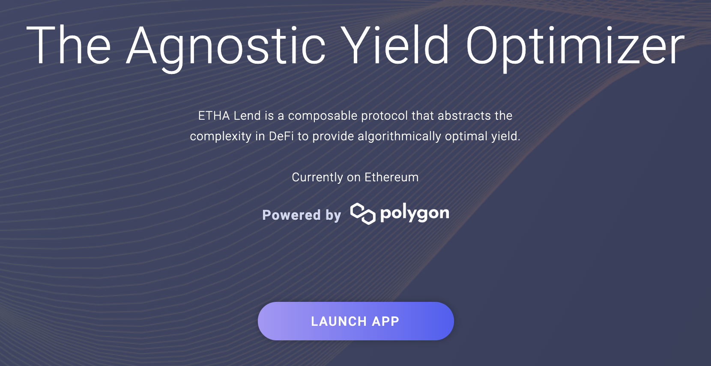
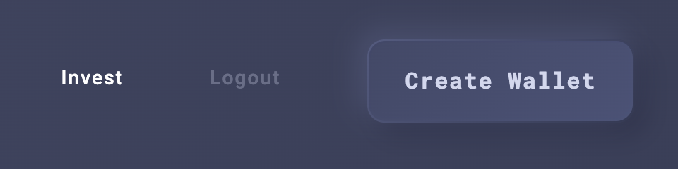
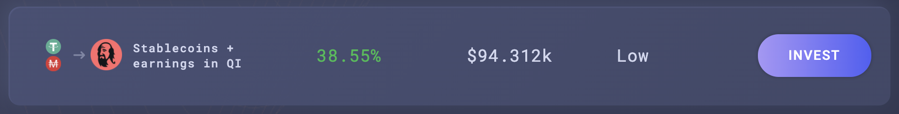
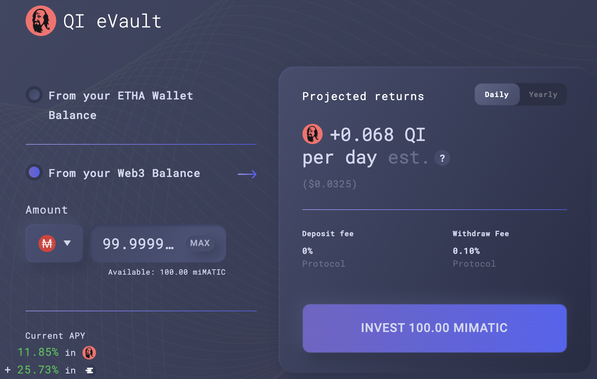
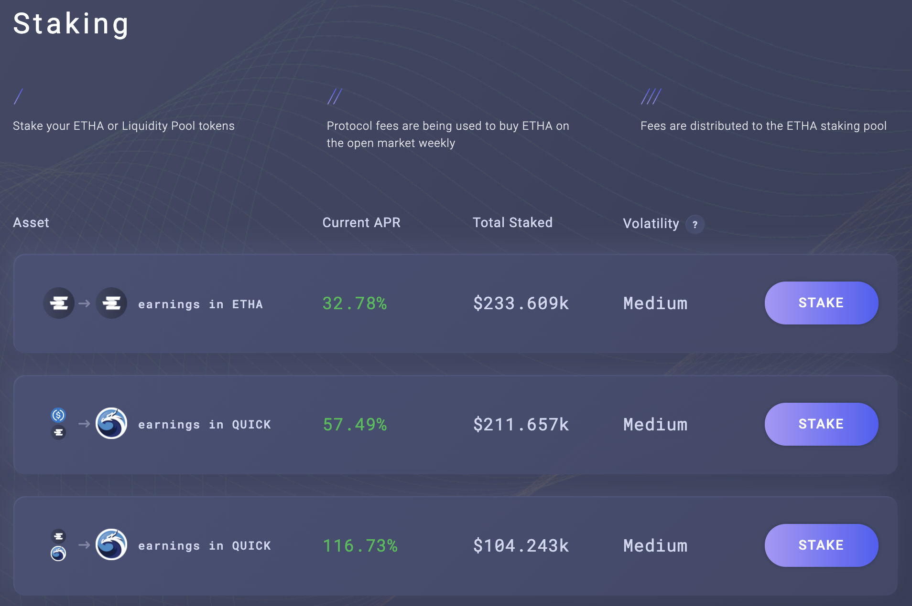
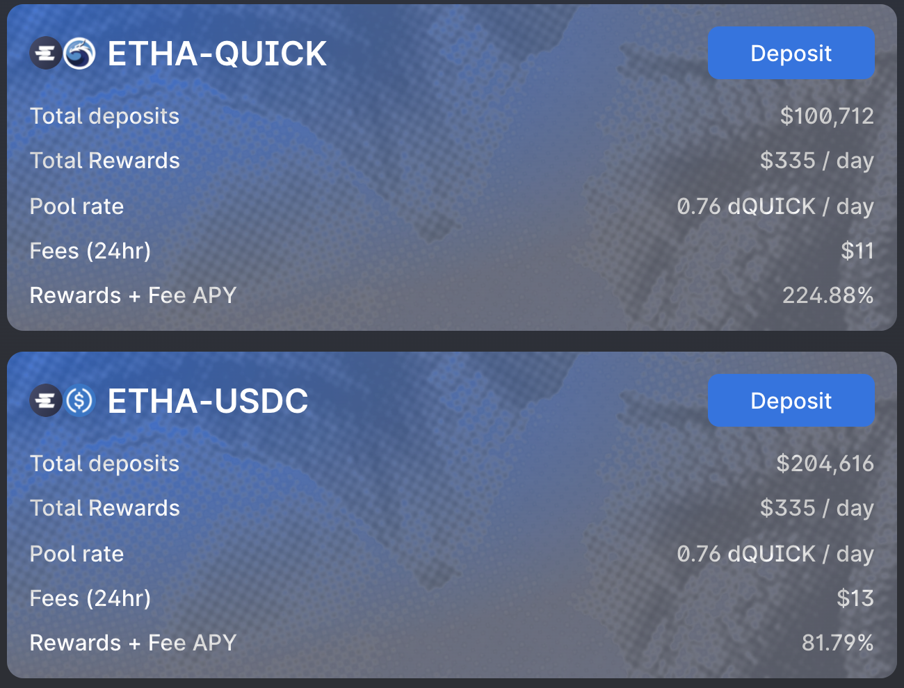
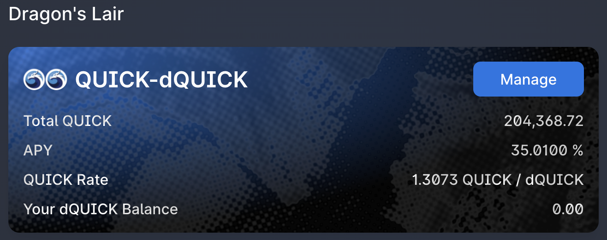
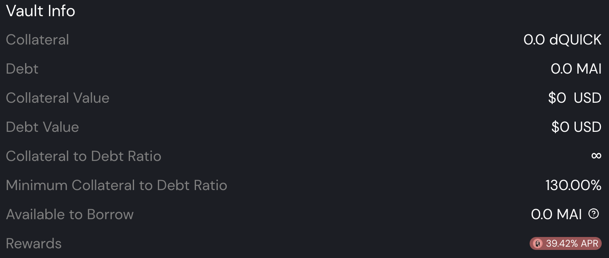
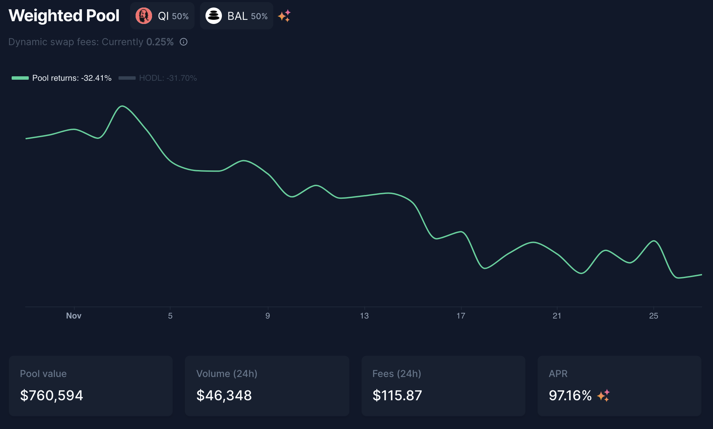
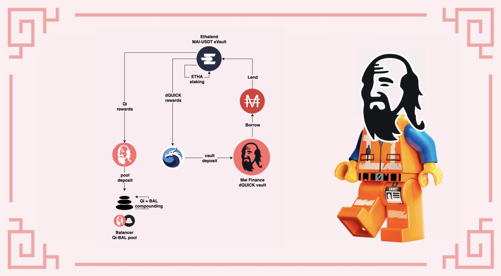

# Sử dụng MAI tại Ethalend

## Giới thiệu

Một trong những sứ mệnh của bộ hướng dẫn này cung cấp là làm cho Defi thân thiện với người dùng bằng cách làm đơn giản hóa các giao thức phức tạp nhất. Tầm nhìn này cũng được chia sẻ bởi đội ngũ đằng sau [Ethalen](https://www.ethalend.org)[d](https://www.ethalend.org) và hướng dẫn này sẽ trình  bày một cách hoàn hảo cách để sử dụng nền tảng này với Mai Finance để nâng cao năng suất đồng ổn định của bạn.

## Trình bày Ethalend&#x20;

### Ethalend là gì?

Ethalend là một giao thức có thể kết hợp để tóm lược độ phức tạp trong DeFi nhằm cung cấp năng suất tối ưu về mặt thuật toán. Nó không phải là một công cụ tổng hợp năng suất, mà là một công cụ tối ưu hóa lợi nhuận. Bạn sẽ có thể gửi tài sản của mình trên nền tảng và thuật toán phụ trách bể sẽ thực sự đầu tư chúng theo cách tốt nhất có thể. Sau đó, lợi nhuận được phân bằng mã thông báo gốc của Ethalend, mã thông báo ETHA, cũng như một số mã thông báo đối tác, bao gồm Qi từ Mai Finance mà bạn có thể nhận được bằng cách gửi MAI của mình vào MAI-USDT eVault. Bạn có thể đọc thêm về Ethalend qua [tài liệu chính thức](https://docs.ethalend.org) của họ hoặc bằng cách[ đọc bài phỏng vấn ](ethalend-single-staking.md#intro)tuyệt vời này của người đồng sáng lập

### Tạo ví Ethalend bằng ví web 3

Một trong những điều rất thú vị về Ethalend là ứng dụng đang sử dụng ví trực tuyến trên chuỗi khối chuyên dụng không được liên kết với ví web3 của bạn. Đây có thể coi là

* một lợi thế vì tất cả rủi ro hợp đồng được giới hạn ở những gì được hiển thị trong ví riêng tư này. Ngoài ra, một số tương tác giữa ứng dụng Ethalend và ví cá nhân được đưa trực tiếp vào việc sử dụng nền tảng, điều này có thể giúp bạn tiết kiệm một số phí giao dịch. Xin lưu ý thêm, ví thông minh ETHA không bị giám sát, có nghĩa là chỉ bạn mới có quyền truy cập vào ví, nó không giống như một ví tập trung chính kiểm soát  ví của bạn.
* một bất lợi, vì nó làm tăng thêm sự phức tạp trong quy trình của bạn và ví thông minh ETHA không tương thích với các thiết bị lưu trữ vật lý.&#x20;

Bạn sẽ quyết định xem ưu điểm có mang lại đủ giá trị để vượt qua nhược điểm hay không. Khi bạn đã sẵn sàng tạo ví, chỉ cần nhấp vào nút `Create Wallet` ở góc trên cùng bên phải của màn hình.

Bây giờ là lúc khám phá giao thức

## Chiến lược tổng quan

Chiến lược này có thể được thêm vào nhóm các chiến lược tương đối an toàn của bạn vì nó sẽ sử dụng cách canh tác đồng ổn định tận gốc và lợi nhuận bổ sung sẽ được cung cấp nhờ có nhiều tài sản biến động hơn từ phần thưởng của vị thế ổn định.

### Đặt cổ phần MAI đơn và kết quả

Một trong những lợi thế lớn của Ethalend và cũng la tính năng chính cho phép đơn giản hóa DeFi là bạn không cần cung cấp cặp LP (Cung cấp thanh khoản) bao gồm 2 tài sản với tỷ lệ 1: 1. Thuật toán quản lý bể (hoặc eVault trong trường hợp của chúng ta) sẽ tự động làm điều đó cho bạn. Ngoài ra, sau khi bạn gửi tài sản của mình vào eVault, chúng sẽ được tự động định tuyến lại sang giao thức tốt nhất sẽ tối đa hóa lợi nhuận. Các mã thông báo phần thưởng sẽ được tiếp tục canh tác và chuyển đổi cho bạn thường xuyên.

Như bạn có thể thấy, thông tin chi tiết về phần thưởng được hiển thị ở phần bên phải của màn hình. Phần thưởng ETHA không được hiển thị, nhưng bạn sẽ nhận được ước tính về phần thưởng Qi liên quan đến khoản tiền gửi của bạn. Nếu bạn kéo xuống trang, bạn cũng sẽ hiểu rõ về chiến lược cơ bản đang sử dụng QuickSwap trong trường hợp này. Phần thưởng QUICK sẽ được chuyển thành phần thưởng Qi. Phần thưởng ETHA được tạo ra bởi giao thức để khuyến khích bạn sử dụng nền tảng của họ thay vì QuickSwap.


Chú ý đến phí rút tiền 0,10%. Như đã viết, với số tiền đặt cọc là 100 MAI, chúng ta sẽ phải trả phí rút là 0,1 MAI, tương ứng với 10 ngày farm trong eVault. Hãy chắc chắn rằng bạn hiểu rõ điểm này trước khi đầu tư bất cứ thứ gì.


### Gửi ETHA: Ethalend hay QuickSwap

Phần thưởng chính bạn sẽ nhận được bằng cách cho mượn MAI của bạn trên Ethalend sẽ được thanh toán bằng ETHA, mã thông báo gốc từ Ethalend. Một trong những lợi thế chính của Ethalend là bạn sẽ có thể đặt cược một lần vào mã thông báo ETHA của mình trực tiếp trên nền tảng và tăng lợi nhuận của bạn.

Như bạn có thể thấy, lựa chọn tốt nhất là gửi ETHA bạn kiếm được vào bể ETHA-QUICK. Vì bản chất của 2 tài sản (rất dễ bay hơi) nên phần thưởng thực sự rất cao. Bạn có thể giảm các khoản lỗ vô thường bằng cách gửi ETHA của mình vào bể ETHA-USDT nếu bạn muốn. Trong cả hai trường hợp, bạn sẽ được thưởng bằng mã thông báo QUICK. Và tất nhiên, nếu bạn thực sự lạc quan về ETHA, bạn có thể đặt phần thưởng của mình vào nhóm ETHA để có thêm ETHA.

Các hầm gửi tiền trên Ethaland thực sự là một tiện ích được cung cấp bởi Ethalend. Khi bạn gửi mã thông báo của mình vào bể, thuật toán cân bằng sẽ bán một số mã thông báo đã gửi để mua mặt còn lại của cặp LP và sử dụng cặp này trong QuickSwap. Một lưu ý nhỏ là bạn hoàn toàn có thể thực hiện việc này theo cách thủ công: yêu cầu mã thông báo ETHA của bạn, rút ​​tiền trong ví web3 của bạn, bán 50% cho mã thông báo QUICK, tạo một số mã thông báo LP và gửi chúng vào bể QuickSwap:


QuickSwap cấp cho bạn APY 223,1% trên cặp ETHA-QUICK, trong khi Ethalend hiển thị APR 116,73% trên cùng một cặp. Điều này là do sự khác biệt giữa APY (Lợi nhuận phần trăm hàng năm hoặc phần thưởng được cộng gộp tự động) và APR (Doanh thu phần trăm hàng năm hoặc phần thưởng không có hệ số cộng gộp tự động). 2 phần trăm thực sự hoàn toàn giống nhau, vì vậy không quan trọng bạn đã chọn nền tảng nào để sử dụng mã thông báo ETHA của mình.


### Hầm dQUICK Mai

Cách tốt nhất để sử dụng phần thưởng QUICK mà bạn sẽ nhận được từ việc đặt cược ETHA của mình là chuyển chúng thành dQUICK. dQUICK có thể được tạo trong Dragon's Lair trên QuickSwap. Đó là cách QuickSwap khuyến khích người dùng gửi  QUICK của họ bằng cách thưởng cho họ thêm QUICK: bằng cách khóa mã thông báo QUICK của bạn trên QuickSwap, bạn sẽ kiếm được thêm mã thông báo


APY DQUICK dao động từ 20% đến 40%, tùy thuộc vào số lượng QUICK thực sự được gửi trên Nền tảng


Nhưng một trong những điều tốt nhất về dQUICK là đó là mã thông báo "bằng chứng ký gửi" có thể được sử dụng trên Mai Finance làm tài sản thế chấp. Điều này có nghĩa là, sau khi bạn gửi phần thưởng QUICK của mình từ Ethalend trên QuickSwap và nhận được dQUICK, bạn có thể đến Mai Finance và gửi mã thông báo DQUICK vào một Kho tiền DQUICK để mượn MAI.

Một số điều về kho dQUICK:

* Chúng có tỷ lệ thanh lý là 130%, có nghĩa là bạn sẽ có thể vay rất nhiều MAI so với mã thông báo dQUICK của mình. Tuy nhiên, nếu bạn cũng muốn nhận phần thưởng đi vay, bạn sẽ cần phải giữ CDR (Tỷ lệ tài sản đảm bảo trên Nợ) từ 155% đến 400%. Đây là một ý tưởng hay vì mã thông báo QUICK khá dễ bay hơi và theo nguyên tắc chung, trang web này cho phép  CRD cao hơn 100% so với tỷ lệ thanh lý (hoặc 230% đối với dQUICK).
* Hầm dQUICK là một trong số những hầm có APR cao nhất khi bạn vay MAI so với dQUICK. Như đã viết, bạn có thể nhận được tới 39,40% APR được thanh toán bằng mã thông báo Qi dựa trên số tiền MAI.&#x20;

Bạn đã có thể thấy rằng, việc cung cấp dQUICK là rất thú vị vì bạn sẽ có một tài sản nhận được phần thưởng QUICK kép từ QuickSwap, bạn sẽ nhận được phần thưởng Qi cho khoản vay của mình và bạn sẽ có được MAI, sau đó có thể được thêm lại vào eVault trên Ethalend, tăng vị trí farm ổn định của bạn.

### Làm gì với phần thưởng QI

Chủ đề này được giải thích trong một [bài dành riêng](what-to-do-with-qi-on-polygon.md). Vì lợi ích của hướng dẫn này, chúng tôi sẽ chỉ cần gửi Qi của bạn vào bể Qi-BAL trên Balancer để hưởng lợi từ APR vững chắc, được thanh toán bằng mã thông báo Qi và BAL bổ sung mà bạn có thể kết hợp trong cùng một nhóm.

## Khởi động hệ thống

Sau đây là một mô phỏng được thực hiện với khoản đầu tư ban đầu là 100 đô la MAI mà bạn có thể vay từ một kho tiền hiện có hoặc mua từ nền tảng DEX. Nó giả định rằng tất cả các APR và APY hiện tại đều giữ nguyên trong khoảng thời gian 1 năm và tất cả các mã thông báo đều giữ cùng một mức giá, điều này (tất nhiên) sẽ không bao giờ đúng như vậy.

### Ngày 1

Vào ngày 1, bạn sẽ gửi MAI của mình trên Ethalend trong bể MAI-USDT, sau đó bạn sẽ nhận được phần thưởng bằng cả Qi và ETHA vào cuối ngày.

| Dạng phần thưởng     | Giá trị bằng Đô la |
| -------------------- | ------------------ |
| Mai trên Ethalend    | 100.000            |
| Qi+BAL trên Balancer | 0.032              |
| ETHA trên Ethalend   | 0.070              |
| dQUICK trên Mai      | 0.000              |
| nợ trên Mai Finance  | 0.000              |

### Ngày 2

Vào ngày thứ 2, bạn có thể đặt  ETHA của mình từ ngày đầu tiên trên Ethalend, điều này sẽ tạo ra phần thưởng QUICK mà bạn có thể chuyển đổi sang dQUICK trên QuickSwap, gửi tiền trên Mai Finance và bạn sẽ có thể vay MAI để lấy các mã thông báo này. Bạn cũng có thể gửi Qi của mình vào nhóm Balancer. Vào cuối ngày thứ 2, bạn sẽ nhận được:

| Dạng phần thưởng     | Giá trị bằng Đô la |
| -------------------- | ------------------ |
| Mai trên Ethalend    | 100.000            |
| Qi+BAL trên Balancer | 0.065              |
| ETHA trên Ethalend   | 0.141              |
| dQUICK trên Mai      | 0.000              |
| Nợ MAI               | 0.000              |

Từ đó, hệ thống được khởi động và bạn sẽ có thể phát triển vị thế MAI ổn định của mình, cũng như nhận được phần thưởng bằng Qi, BAL, ETHA và dQUICK. Lưu ý rằng một số giá trị quá thấp để vay dưới 0,01 MAI, bạn sẽ phải tích lũy dQUICK trong 14 ngày trước khi có thể vay MAI.

## Kết quả canh tác

### Công việc hàng ngày

Công việc hàng ngày bao gồm:

* Thu phần thưởng Qi và ETHA từ bể MAI-USDT trên Ethalend&#x20;
* Gửi mã thông báo Qi vào bể Balancer trên Balancer&#x20;
* Gửi mã thông báo ETHA vào bể ETHA-QUICK trên Ethalend&#x20;
* Thu thập phần thưởng QUICK từ nhóm ETHA-QUICK trên Ethalend&#x20;
* Chuyển đổi QUICK thành dQUICK trên QuickSwap&#x20;
* Gửi  dQUICK vào kho tiền dQUICK trên Mai Finance&#x20;
* Vay MAI từ kho tiền DQUICK trên Mai Finance&#x20;
* Gửi thêm MAI đã vay vào bể MAI-USDT trên Ethalend

Ngoài ra, bạn sẽ có thể thu hoạch và gộp phần thưởng Qi và BAL hàng tuần.

### Kết quả sau một tháng

Dưới đây là kết quả sau cuối mỗi tháng:

| ngày | Mai trên Ethalend | Qi trên Balancer | ETHA trên Ethalend | dQUICK trên Mai | Nợ MAI  |
| ---- | ----------------- | ---------------- | ------------------ | --------------- | ------- |
| 30   | 100.046           | 1.015            | 2.186              | 0.099           | 0.049   |
| 60   | 100.196           | 2.116            | 4.303              | 0.406           | 0.203   |
| 90   | 100.453           | 3.315            | 6.424              | 0.926           | 0.463   |
| 120  | 100.819           | 4.624            | 8.553              | 1.666           | 0.833   |
| 150  | 101.297           | 6.058            | 10.690             | 2.631           | 1.315   |
| 180  | 101.892           | 7.632            | 12.838             | 3.828           | 1.914   |
| 210  | 102.606           | 9.361            | 15.001             | 5.263           | 2.632   |
| 240  | 103.443           | 11.264           | 17.179             | 6.945           | 3.473   |
| 270  | 104.406           | 13.360           | 19.377             | 8.881           | 4.441   |
| 300  | 105.501           | 15.671           | 21.597             | 11.079          | 5.540   |
| 330  | 106.731           | 18.220           | 23.841             | 13.548          | 6.774   |
| 360  | 108.100           | 21.032           | 26.113             | 16.297          | 8.149   |
| 365  | 108.343           | 21.528           | 26.495             | 16.783          | 8.392   |

### Ngày thứ 365

Tai thời điểm cuối năm bạn sẽ nhận được:

* MAI trị giá 108,343 đô la trong bể MAI-USDT trên Ethalend
* ETHA trị giá $ 26,495 trong bể ETHA-NHANH trên Ethalend
* Qi trị giá $ 21,528 trên bể Qi-BAL trên Balancer
* bQUICK trị giá 16,783 đô la trong kho tiền dQUICK trên Mai Finance
* Khoản nợ MAI trị giá 8,392 đô la trên Mai Finance

Tổng cộng là tài sản trị giá 173,149 đô la và khoản nợ chưa thanh toán là 8,392 đô la, tương ứng với APY là 64,757%. Điều này đạt được với khoản đầu tư ban đầu là 100 đô la MAI và sử dụng nguồn vốn ổn định làm cơ sở để canh tác. Lưu ý rằng phí giao dịch chưa được tính đến nhưng có thể ảnh hưởng đến kết quả cuối cùng. Điều này cũng giả sử bạn đang lãi kép hàng ngày trong 1 năm hoàn chỉnh.

## Tuyên bố từ bỏ trách nhiệm

Mọi thứ được trình bày trong hướng dẫn này là nội dung giáo dục được thực hiện để minh họa cách bạn có thể sử dụng MAI của mình mà không cần bán chúng và vẫn tạo ra APY hơn 60% bằng cách sử dụng các giao thức khác nhau dưới dạng khối xếp hình lego. Tuy nhiên, hướng dẫn này không nên được coi là lời khuyên tài chính.

Ngoài ra, chiến lược ở đây là trình bày một vòng lặp khép kín không bán bất kỳ mã thông báo nào và mỗi hệ thống đang cung cấp cho hệ thống tiếp theo. Tuy nhiên, như bạn có thể thấy, vị thế cuối cùng của dQUICK không cao lắm, và khoản vay MAI có thể sẽ không tạo ra nhiều Qi. Bạn có thể đạt được cùng một APY tương đương (nếu không tốt hơn) bằng cách bán phần thưởng IQUICK được cấp bởi bể ETHA-QUICK, mua MAI và thêm nó vào vị trí MAI-USDT của bạn.


Hãy nhớ rằng một chiến lược hoạt động tốt tại một thời điểm nhất định có thể hoạt động kém (hoặc khiến bạn mất tiền) vào một thời điểm khác. Hãy cập nhật thông tin, theo dõi thị trường, theo dõi các khoản đầu tư của bạn và như mọi khi, hãy tự nghiên cứu.

