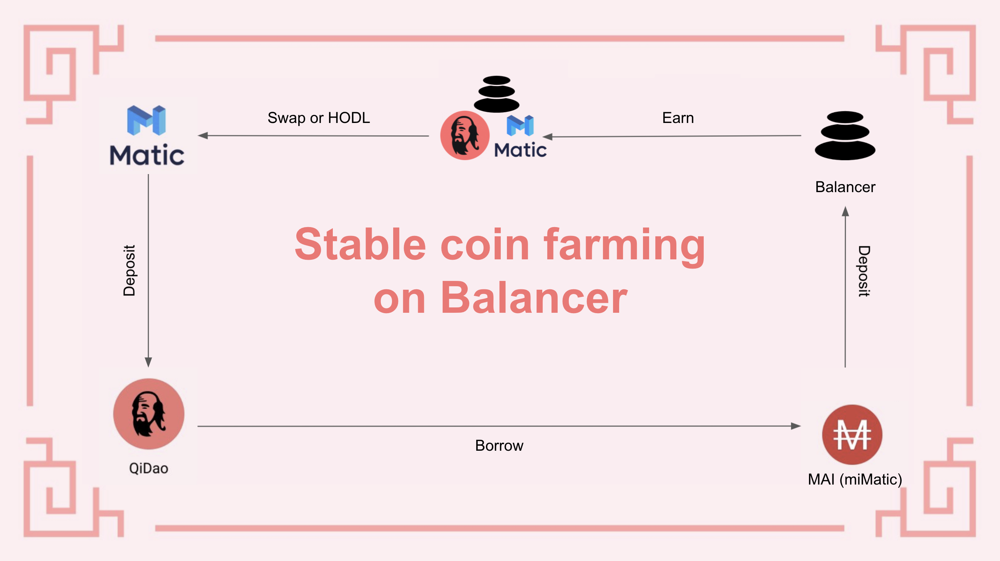
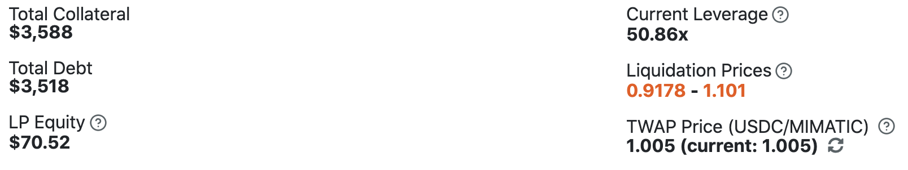
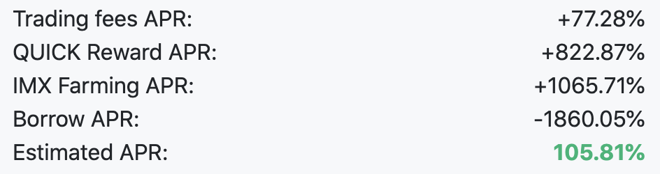

# Cách sử dụng MAI trên hệ sinh thái Polygon?

## Mục tiêu của hướng dẫn này

Mục tiêu của hướng dẫn này không phải là trình bày chi tiết những gì bạn có thể làm với đồng MAI của mình, tuy nhiên sẽ có một danh sách tất cả các trang web và ứng dụng DeFi mà bạn có thể sử dụng trên Polygon sẽ cho phép bạn sử dụng MAI của mình trực tiếp hoặc kết hợp với các đồng tiền ổn định khác. Để biết thêm chi tiết về các cách cụ thể để sử dụng MAI, bạn có thể tham khảo các hướng dẫn khác trên trang web này, hoặc nhận trợ giúp trên Discord hoặc Telegram.

Xin lưu ý rằng danh sách này chưa hoàn chỉnh và sẽ không bao giờ là hoàn chỉnh bởi vì có các dapp mới ra mắt liên tục hàng tuần. Chúng ta không thể xem xét tất cả chúng, vì vậy tôi sẽ chỉ trình bày các tùy chọn chính, hoặc các tùy chọn nổi bật nhất / "bảo mật" nhất.

Nếu bạn muốn dự án cụ thể được trình bày xin vui lòng liên hệ cộng đồng  [Discord](https://discord.gg/mQq55j65xJ).


Chúng ta sẽ không trình bày farm của Mai Finance. Chủ đề này xứng đáng có một mục hướng dẫn riêng, bởi vì Qi không giống như bất kỳ đồng coin bản vị của một farm ngẫu nhiên nào.


## Farming an toàn trên các dự án bluechip

Các dự án bluechip là các ứng dụng DeFi được chứng minh là bền vững và có rủi ro thấp hơn. Các dự án thường đã được kiểm định và team đã gắn bó với dự án rất lâu. Những dự án thường không có APR lớn \(Tỷ lệ phần trăm lợi nhuận hàng năm\) nhưng có thể đáng tin cậy.

### Balancer

[Balancer](https://polygon.balancer.fi/#/) là trình quản lý danh mục đầu tư tự động, nhà cung cấp thanh khoản và cảm biến giá. Trên nền tảng này, bạn sẽ có thể cho vay tiền điện tử của mình và thu phí từ các nhà giao dịch, những người tái danh mục đầu tư của bạn bằng cách tận dụng các cơ hội kinh doanh chênh lệch giá. Nếu bạn cần thêm thông tin chi tiết về Balancer, vui lòng đọc [tài liệu chính thức của Balancer](https://docs.balancer.fi/).

Trên chuỗi Polygon, Balancer đề xuất một bể bao gồm 4 đồng stablecoin chính: DAI, USDC, USDT và MAI \(miMATIC\). Bể stablecoin này hiện có APR khá ổn định là ~ 20%.

Tính năng nổi trội nhất về Balancer là bạn hoàn toàn không cần phải sở hữu 4 đồng tiền để gửi vào bể. Tính năng cân bằng sẽ tự động tạo ra một kết hợp cân bằng với bất kỳ khoản tiền gửi nào bạn thực hiện. Điều này có nghĩa là nếu bạn có MAI trị giá 100 đô la, bạn có thể chỉ cần gửi chúng vào nhóm Balancer và để thuật toán chia đúng tỷ lệ 25% cho mỗi đồng xu tùy thuộc vào giá tương ứng của chúng tại thời điểm bạn gửi tiền.

Phần thưởng được phân phối hàng tuần bằng đồng BAL. Ngoài đồng BAL ra, phần thưởng bổ sung có thể được cấp phụ thuộc vào bể mà bạn đã tham gia. Bạn có thể kiểm tra các chương trình ưu đãi khác nhau [tại đây](https://balancer-incentives.web.app/). Trong trường hợp của chúng ta, việc tham gia vào bể stablecoin cũng sẽ giúp bạn kiếm được phần thưởng MATIC và Qi.

Một vòng hoàn hảo sẽ được minh họa như sau:

Nếu bạn cần thêm thông tin chi tiết về cách bạn có thể sử dụng Mai Finance để cho vay đồng tiền mã hóa của bạn và mượn lại đồng Mai \(thay vì bán chúng để mua Mai\), hãy đọc các hướng dẫn khác trên tài liệu này. Bạn có thể kiếm được nhiều hơn thế nếu đưa [giao thức Aave](leverage-aave-tokens.md) vào vòng lặp.

### Curve finance

[Curve](https://curve.fi/) là một nền tảng nơi bạn có thể cho vay tài sản tiền điện tử của mình trong các bể sẽ tạo ra doanh thu, nhưng không trực tiếp MAI \(vẫn chưa?\). Các bể mà chúng tôi quan tâm là

* Bể AAVE sẽ tạo ra từ 5% đến 15% APR \(APR biến động rất nhiều\) trên bộ ba đồng tiền ổn định \(DAI / USDC / USDT\). Bể hoạt động giống hệt như Balancer theo cách mà bạn có thể vào nhóm bằng cách sử dụng một tài sản duy nhất sẽ được sử dụng trên AAVE bởi giao thức.
* Bể Atricrypto bao gồm bộ ba đồng tiền ổn định và bao gồm cả wETH và wBTC để giảm thiểu tổn thất tạm thời. Bể này có APR dao động trong khoảng từ 25% đến 30%. Mai Finance team hiện cũng đang cố gắng thêm MAI vào nhóm này, có nghĩa là bạn có thể tham gia trực tiếp bằng MAI của mình.

Trong khi chờ giao thức Curve chấp nhận MAI là đồng tiền ổn định hợp lệ trong bể của họ, bạn vẫn có thể sử dụng tiền điện tử yêu thích của mình với Curve bằng cách làm theo các bước sau \(trong ví dụ với MATIC\)

* Gửi MATIC vào giao thức Aave để nhận lại amWMATIC
* Gửi  amWMATIC trên Mai Finance và nhận lại camWMATIC \(phần thưởng AAVE sẽ được gộp vào các camWMATIC\).
* Dùng camWMATIC như tài sản thế chấp để vay MAI
* Sử dụng mục [Swap](https://app.mai.finance/swap) để swap tất cả MAI sang USDC
* Sau đó bạn có thể
  * Tham gia vào bể atricrypto trên Curve để nhận phần thưởng từ 25% đến 30%.
  * Vào bể AAVE bằng USDC trên Curve để nhận phần thưởng từ 5 đến 15%

Phần thưởng trên Curve được thưởng bằng cách

* Tự động cộng dồn USDC để tăng vị thế của bạn trong bể \(nó là sự kết hợp của USDC/USDT/DAI và có thể là wBTC/wETH trong bể artricypto\).
* Số WMATIC được thưởng có thể dùng để lặp lại vòng lặp như trên nhằm tăng khoản vay và vốn đầu tư của bạn.
* Token CRV cũng thể dùng làm tài sản thế chấp để vay thêm MAI trên Mai Finance và tăng vốn đầu tư của bạn.

### AAVE

Có một hướng dẫn đầy đủ về cách dùng nền tảng Mai Finance [tạo đòn bẩy cho các token từ thị trường Aave.](leverage-aave-tokens.md) Tuy không có cách sử dụng trực tiếp đồng MAI trên  nền tảng này nhưng trong tương lai AAVE sẽ có một bể ở đó bạn có thể cho vay trực tiếp đồng MAI của mình.

### QuickSwap

[QuickSwap](https://quickswap.exchange/#/) có lẽ là DEX \(trao đổi phi tập trung\) nổi tiếng nhất trên chuỗi Polygon cùng với Sushiswap và 1Inch. Nó cũng là một AMM\( Nhà tạo lập thị trường tự động\) cho phép người dùng có thể giao dịch một cách hiệu quả trên mạng lưới Polygon bằng cách sử dụng các bể thanh khoản.Bất kỳ giao dịch nào trên sàn giao dịch đều phải chịu một khoản phí được phân phối lại một phần cho người dùng gửi thanh khoản của họ trên nền tảng.

Cách bạn có thể sử dụng MAI trên QuickSwap rất giống với [các yield farm thông thường](secure-your-yield-farming-profits.md), vì vậy nếu bạn cần biết các bước chính xác để vào bể MAI / USDC trên QuickSwap, có lẽ tốt hơn bạn nên đọc bài viết này.

Hiện tại, nếu bạn tham gia vào bể MAI/USDC trên Quickswap, bạn sẽ nhận được

* phí giao dịch
* token QUICK

## Các Degen farm

### Adamant

[Adamant](https://adamant.finance/home) là một nền tảng tăng tốc liệt kê tất cả các bể tốt nhất từ Quickswap và cho phép bạn tham gia trực tiếp tại website của họ. Bằng cách gửi tài sản của bạn \(mã token LP\) vào một bể cụ thể trên Adamant, các thuật toán sẽ thu thập phần thưởng do bể đó cấp và tự động bán ra thị trường và gộp một phần của phần thưởng vào cặp LP của bạn. Phần còn lại của phần thưởng thường được chuyển đổi trong WMATIC, sau đó được phân phối lại cho những người nắm giữ đồng ADDY \(đồng coin bản vị của Adamant\). Cuối cùng, bạn nhận được phần thưởng bằng đồng ADDY cũng như bạn có thể thu hoạch su 90 ngày, kiếm cho bạn một phần thưởng cổ phần của WMATIC.

Về tổng quan, Adamant là một nền tảng tốt nếu bạn không thực sự quan tâm đến đồng bản vị và nếu bạn không muốn gộp phần thưởng của mình theo cách thủ công nhiều lần trong ngày. Nó cũng tạo ra nhiều doanh thu hơn vì bạn nhận được một số phần thưởng ADDY ngoài phần thưởng được trả bởi bể thanh khoản đó.

Adamant hiện hỗ trợ một số bể chấp nhận cặp LP MAI / USDC. Các bể hiện có:

* QuickSwap: Phần thưởng QUICK được đổi thành nhiều cặp MAI/USDC và WMATIC
* DinoSwap: Phần thưởng Dino được đổi thành nhiều phần thưởng MAI / USDC LP và WMATIC hơn
* Mai Finance: Phần thưởng Qi được đổi thành nhiều phần thưởng MAI / USDC LP và WMATIC hơn


Ảnh chụp màn hình của bể QuickSwap trên trang web QuickSwap \(xem đoạn trên\) và Adamant đã được chụp trong cùng một ngày, nhưng đang hiển thị các APY khác nhau \(lợi nhuận phần trăm cộng dồn hàng năm\).


Bạn có thể thấy rằng APY trên Adamant cao hơn một chút so với QuickSwap. Phân tích phần thưởng như sau

* 12,88% QUICK được cộng dồn tự động \(nghĩa là phần thưởng QUICK được chuyển thành nhiều LP hơn\)
* 9.16% phần thưởng ADDY  \(không cộng dồn\)
* 3.40% cổ tức trả bằng WMATIC

Điều này có nghĩa là, trong số 20,92% được QuickSwap phân phối, chỉ có 12,88% được sử dụng để tăng số lượng LP của bạn, phần còn lại được đổi thành cổ tức c WMATIC. Bạn sẽ có thể nhận phần thưởng ADDY của mình hàng ngày \(hoặc bất cứ lúc nào\) và stake chúng để tạo ra cổ tức WMATIC có thể nhận. Nói cách khác, Adamant có vẻ là một lựa chọn tốt hơn vì nó có APY tốt hơn và phần thưởng cộng dồn tự động, nhưng trên thực tế, nó cũng liên quan đến rất nhiều thao tác thủ công.


Việc sử dụng Adamant cũng có tác động mạnh mẽ đến giá đồng bản vị . Adamant liên tục bán các mã thông báo trang trại để tạo ra nhiều cặp LP và WMATIC dưới dạng cổ tức cho những người nắm giữ ADDY của họ, áp lực bán rất cao đối với các mã thông báo trang trại và có thể giải thích tại sao giá của chúng liên tục giảm.


### Một số farm khác chấp nhận cặp MAI/USDC

MAI ngày càng trở nên phổ biến hơn trên Polygon và bởi vì QuickSwap hỗ trợ cặp MAI / USDC, rất nhiều farms hiện cũng đang hỗ trợ nó. Danh sách sau đây sẽ trình bày một số dự án mà bạn có thể kiếm được lợi nhuận bằng cách sử dụng MAI / USDC

* DinoSwap
* Augury
* Polypup
* ...

Các farm khác cũng có thể chấp nhận bể MAI / USDC. Nếu bạn muốn được cập nhật thông tin về các trang trại mới và ngày ra mắt của chúng, thì bạn xem lịch [RugDoc.io](https://rugdoc.io/calendar/) cho các farm trênPolygon  lịch này sẽ trình bày tổng quan về mỗi farm, như cũng như những rủi ro tiềm ẩn của chúng.

## Impermax

### Giải thích một chút 

[Impermax](https://polygon.impermax.finance/) là một nền tảng cho phép người tạo đòn bẩy mã token LP của họ để có lợi suất cao hơn. Mục tiêu rất đơn giản: bằng cách cung cấp cặp LP và sử dụng chúng làm tài sản thế chấp, sau đó người ta có thể vay thêm trong số 2 tài sản cơ bản để tạo ra nhiều cặp LP hơn và tiếp tục lặp lại vòng lặp.

Khi làm như vậy, nhà đầu tư sẽ bị tổn thất tạm thời và tổn thất này được phóng đại theo số lần lặp lại vòng lặp. Rủi ro thanh lý cũng tăng lên gấp bội khi áp dụng quá nhiều vòng lặp. Thật vậy, nếu APR được nhân lên, sự biến đổi giá của hai đồng tiền tạo thành cặp tiền sẽ được khuếch đại bởi hiệu ứng đòn bẩy, dẫn đến việc thanh lý nhanh hơn.

Tuy nhiên, với những đồng tiền ổn định, rủi ro thanh lý sẽ thấp hơn vì sự biến động về giá là không đáng kể. Điều này cũng có nghĩa là Tỷ lệ tài sản đảm bảo trên Nợ \(CDR\) có thể rất gần 100%, dẫn đến số vòng lặp cao, do đó APR cao.

Lưu ý rằng Impermax tính phí khi bạn vay và tạo đòn bẩy của mình. Phí tương ứng với 0,1% đòn bẩy cuối cùng của bạn. Ví dụ: nếu bạn có MAI / USDC trị giá 100 đô la và tôi sử dụng đòn bẩy 50 lần, vị thế cuối cùng của bạn sẽ trị giá 5.000 đô la và bạn sẽ trả khoản phí 4,90 đô la tương ứng với số tiền 4,900 đô la mà bạn đã vay.

Hiệu quả của vòng lặp kết hợp cho vay / đi vay cho phép gấp bội APY cuối cùng. APY ban đầu là 20% cho cặp MAI / USDC với CDR là 110%,  tiến hành vòng lặp 50 lần và sử dụng công thức

$$
APRtương.ứng =  APRban.đầu * \sum_{i=0}^{n}{\frac{100}{CDR}}^i
$$

Chúng ta có thể dễ dàng nhận được APR cuối cùng là 228%. Có một số yếu tố khác sẽ ảnh hưởng đến APR cuối cùng, đó là APR đi vay \(lãi suất cho vay để vay thêm token LP\) và cung / cầu của cả hai tài sản tạo nên cặp LP \(trực tiếp thúc đẩy APR đi vay\)

Ngoài ra, bởi vì tất cả các chỉ số được phóng đại theo số lần áp dụng vòng lặp, APR sẽ thay đổi rất lớn và đôi khi có thể trở nên âm trong một khoảng thời gian ngắn \(mã LP của bạn sẽ được sử dụng để hoàn trả APR âm\).

### Tạo đòn bẩy vị thế cho cặp MAI/USDC

Cuối cùng, bạn đang sử dụng APR căn bản trên một giá trị lớn hơn điều này thể hiện bạn đang kiếm được lợi ích lớn hơn nhiều, làm tăng APR cho vị thế ban đầu của bạn.

Bạn có thể dễ dàng thấy số tiền đang sử dụng làm tài sản thế chấp, số tiền bạn đầu tư ban đầu, tỷ lệ đòn bẩy là gì và giá trị thanh lý do tỷ lệ đòn bẩy là bao nhiêu. Thông tin này sẽ cung cấp cho bạn các tỷ lệ sau tại thời điểm viết bài

APR có được bằng mã token IMX có thể được hoán đổi để lấy thêm cặp MAI / USDC \(tận dụng lợi thế của nền tảng Mai Finance để vay với lãi suất 0%, RFTM\) hoặc được sử dụng để cung cấp thanh khoản cho các bể cụ thể chấp nhận IMX trên Impermax.

### Cho vay MAI

Trên trang web, bạn cũng có thể cung cấp tính thanh khoản cho những người muốn áp dụng vòng lặp đòn bẩy cho các vị thế của họ \(họ sẽ cần tài sản cơ bản để tạo thêm mã token LP\). Cho vay tài sản là một cách tuyệt vời để kiếm được lợi tức và đẩy mọi rủi ro cho người đi vay . Ngoài ra, càng nhiều người dùng vay, APR của nguồn cho vay càng cao.

Đây là một cách tuyệt vời khác để tối ưu hóa khoản vay 0% của bạn trên Mai Finance. Bạn không những không phải trả bất cứ khoản nào để vay MAI mà còn có thể kiếm được rất nhiều tiền lãi chỉ bằng cách gửi vào Impermax.

## Tuyên bố từ chối trách nhiệm

Mọi hướng dẫn này hoàn toàn phục vụ cho mục đích giáo dục. Mục tiêu là mang lại cái nhìn mới cho các dự án mà chúng tôi nghĩ là xứng đáng cho những nhà đầu tư trong thế giới tiền điện tử trên Polygon. Chúng tôi rõ ràng không nói về Mai Finance như một farm bởi vì một bài hướng dẫn chuyên dụng sẽ được viết sau đây. Cuối cùng, hướng dẫn này TUYỆT ĐỐI KHÔNG ĐƯỢC áp dụng một cách máy móc,  nó không phải là bất kỳ lời khuyên tài chính nào và bạn không nên làm theo những gì chúng tôi đã viết một cách mù quáng. Vui lòng đọc tài liệu về các dự án khác nhau mà chúng tôi đã đề cập trước khi xem xét đầu tư vào nền tảng của họ.


Hãy nhớ rằng một chiến lược hoạt động tốt tại một thời điểm nhất định có thể hoạt động kém \(hoặc khiến bạn mất tiền\) vào một thời điểm khác. Hãy cập nhật thông tin, theo dõi thị trường, theo dõi các khoản đầu tư của bạn và như mọi khi, hãy tự mình nghiên cứu.


