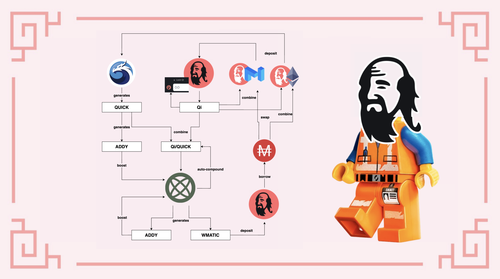

# Farming, staking, ou ambos?

## Introdução

Ao trabalhar com aplicaçōes DeFi (**De**centralize **Fi**nance, Finanças Decentralizadas), especialmente farms de rendimento, é normal que você acabe ficando com um monte de tokens nativos da farm. Se a maioria das pessoas simplesmente vende esses tokens para comprar mais de suas moedas favoritas, aqui nós tentaremos mostrar algumas maneiras de, na verdade, mantê-los e colocá-los para trabalhar para aumentar os seus rendimentos.

Para fazer isso, nós vamos usar novas LP Pools (**L**iquidity **P**roviding Pools, Piscinas de Fornecimento de Liquidez) lançadas na QuickSwap no início de Setembro de 2021, que estão utilizando o token Qi da Mai Finance. Para uma idéia melhor do que funcionam as aplicaçōes da QuickSwap e da Adamant, por favor, leia [este guia.](stack-dapps-like-lego-bricks.md)

## Apresentando as aplicaçōes e pools

### No lado do Farming

Para maximizar nossos ganhos, nós iremos usar 3 aplicaçōes diferentes:

* Mai Finance
* QuickSwap
* Adamant

Nós também utilizaremos as seguintes LP pools

* Qi/MATIC na Mai Finance para gerar Qi
* Qi/WETH na QuickSwap para gerar QUICK e ADDY
* Qi/QUICK na Adamant para gerar ADDY e MATIC

Você já pode ver que cada aplicação está gerando tokens que podem alimentar as outras pools usadas em outras aplicaçōes. A ideia é usar os tokens Qi colhidos na Mai Finance em combinação com os tokens QUICK colhidos na QuickSwap e usar os dois na Adamant. A Adamant irá gerar tokens ADDY que irão permitir a você reivindicar dividendos em MATIC. Os tokens MATIC podem ser trancados na Mai Finance no Vault de WMATIC para tomar emprestado MAI, e então comprar MATIC e WETH que podem então ser usados with token Qi para aumentar suas posiçōes em ambas Mai Finance e QuickSwap.

### No lado do Staking

Você também precisa saber que os tokens gerados em excesso na Mai Finance e Quickswap podem ser utilizados em staking:

* Qi na Mai Finance **E** QuickSwap podem ser usados para votar no QIP (**Q**iDAO **I**mprovement **P**roposals, Propostas de Melhorias da QiDAO).
* Qi na Mai Finance podem ser bloqueados. Se você bloquear seu Qi, você se torna elegível a receber dividendos de protocolos que são pagos em Qi e distribuidos todas as quartas-feiras. Mais detalhes sobre staking de Qi em breve.
* QUICK na QuickSwap também podem ser usados em staking para gerar mais tokens QUICK na Dragon's Lair.
* QUICK bloqueados (dQUICK) também podem ser usados na QuickSwap para gerar outros tokens na Dragon's Syrup, e o que nós utilizaremos é o token ADDY, gerado na farm
* ADDY na Adamant passam automaticamente por vesting (bloqueados por 90 dias), mas irão gerar dividendos em WMATIC.
* ADDY na Adamant também podem ser travados para fazer um boost no seu APR/APY (**A**nnual **P**ercentage **R**ewards / **A**nnual **P**ercentage **Y**ield) das pools que você participa, assim como gerar mais ADDY, e fazer um boost nos seus dividendos em MATIC.

## Bootstrapping

A seguir veremos uma simulação feita com um investimento inicial de $1,000 de LP tokens Qi/MATIC e Qi/WETH, e os atuais APRs/APYs fornecidos pelas diferentes plataformas em 9 de Setembro de 2021. Isso não é uma aplicação real do que foi descrito acima. As taxas e os preços dos tokens irão variar, alguns programs serão encerrados, etc. Portanto, os resultados finais são apenas uma estimativa do que você conseguiria se tudo permanecesse estável, o que nunca será o caso.

### 1.º Dia


**ATENÇÃO:** As pools usadas neste guia foram ao ar algumas horas antes da publicação. Os APRs e APYs obviamente não serão os mesmos, e este artigo precisará passar por revisão após alguns dais. Por favor, faça a sua própria pesquisa e interprete esse guia com cautela.


Como nós temos $500 de LP tokens Qi/MATIC e $500 de LP tokens Qi/WETH, nós iremos depositá-los na Mai Finance e QuickSwap. Além disso, se você tem preferência pela Mai ou QuickSwap, você pode simplesmente depositar mais LP tokens na plataforma que preferir, para gerar mais do seu tokens favorito e fazer staking com eles. Para o nosso exemplo nós preferimos uma divisão de 50% para cada token.

* $500 de Qi/MATIC estará na Mai Finance, com um APR de 1160.65%
* $500 de Qi/WETH estará na QuickSwap, com um APR de 1817.44%

Nós também iremos usar os seguintes APRs para o resto da simulação:

* APR em dQUICK da Dragon's Lair é de 17.28%
* APR em ADDY da Dragon's Syrup é de 17.08%
* APR em Qi/QUICK na Adamant para LP tokens reacumulados automaticamente é de 133%
* APR em Qi/QUICK na Adamant para tokens ADDY é de 131%
* APR em WMATIC na Adamant é de 35% dos tokens ADDY bloqueados

Como o APR na Mai Finance é menor do que na QuickSwap, nós iremos usar 100% do Qi gerado na Mai Finance para gerar mais tokens Qi/QUICK. Não iremos vendê-los, mas combiná-los com tokens QUICK recebidos na QuickSwap, o que significa que no final do dia, nos restará 0 Qi. Obviamente, se você pesar seu investimento inicial diferentemente, você pode terminar o dia com Qi, mas nenhum QUICK.

Portanto, no final do primeiro dia, nós teremos em nosso portfólio:

| Tipo de recompensa  | Valor em dolares |
| ------------------- | ---------------- |
| dQUICK na QuickSwap | 8.997            |
| ADDY na QuickSwap   | 0                |
| Qi/QUICK na Adamant | 31.799           |
| ADDY na Adamant     | 0                |
| WMATIC na Adamant   | 0                |

### 2.º Dia

No segundo dia, o dQUICK depositado na Dragon's Syrup da QuickSwap começar a gerar tokens ADDY, assim como o Par LP Qi/QUICK na Adamant. No final do segundo dia, nós teremos:

| Tipo de recompensa  | Valor em dólares |
| ------------------- | ---------------- |
| dQUICK na QuickSwap | 17.998           |
| ADDY na QuickSwap   | 0.0042           |
| Qi/QUICK na Adamant | 63.713           |
| ADDY na Adamant     | 0.114            |
| WMATIC na Adamant   | 0                |

Don't forget to claim your rewards daily on Adamant in order to start generating WMATIC dividends!

### Day 3

On Day 3, the ADDY tokens collected on Adamant will start generating WMATIC dividends. This means that at the end of Day 3, we would get in our portfolio

| Reward type         | Value in dollars |
| ------------------- | ---------------- |
| dQUICK on QuickSwap | 27.004           |
| ADDY on QuickSwap   | 0.025            |
| Qi/QUICK on Adamant | 95.743           |
| ADDY on Adamant     | 0.343            |
| WMATIC on Adamant   | 0.0001           |

Starting on Day 4, we will be able to

* collect the WMATIC dividends
* deposit a portion of the WMATIC on Mai Finance and borrow MAI against it
* sell MAI to buy more WETH
* pair the remaining MATIC with Qi, and the WETH with some more Qi generated on Mai Finance
* deposit the additional Qi/WMATIC pair on Mai Finance and the Qi/WETH pair on QuickSwap

At that point, the farming system is fully primed, and we can start estimating revenues.

## Farming results

### Daily routine

The daily routine is composed by the following transactions

* Harvest Qi on Mai Finance
* Harvest WMATIC on Adamant
* Deposit 66% of WMATIC on Mai Finance
* Borrow MAI for 50% of the deposit
* Swap MAI for WETH
* Create Qi/WMATIC pair on QuickSwap
* Deposit the Qi/WMATIC on Mai Finance
* Create Qi/WETH pair on QuickSwap
* Deposit the Qi/WETH on QuickSwap
* Harvest Quick on QuickSwap
* Create Qi/QUICK pair on QuickSwap
* Deposit remaining QUICK on Dragon's Lair
* Deposit dQUICK on Dragon's Syrup
* Harvest ADDY token from Dragon's Syrup
* Harvest ADDY token from Adamant
* Deposit new Qi/QUICK on Adamant
* Deposit harvested ADDY on Adamant (lock)

### Raw results month after month

| Month | dQUICK    | Qi/QUICK   | ADDY       | Qi/MATIC Qi/WETH |
| ----- | --------- | ---------- | ---------- | ---------------- |
| 1     | $280.96   | $1,040.78  | $54.97     | $0.91            |
| 2     | $557.79   | $2,162.98  | $224.36    | $7.89            |
| 3     | $842.08   | $3,413.73  | $521.09    | $27.85           |
| 4     | $1,138.60 | $4,816.62  | $960.17    | $68.48           |
| 5     | $1,454.30 | $6,405.18  | $1,559.60  | $138.44          |
| 6     | $1,798.77 | $8,224.86  | $2,341.64  | $247.49          |
| 7     | $2,184.58 | $10,335.38 | $3,334.13  | $406.84          |
| 8     | $2,627.76 | $12,813.60 | $4,572.23  | $629.47          |
| 9     | $3,148.40 | $15,757.01 | $6,100.39  | $930.60          |
| 10    | $3,771.42 | $19,288.05 | $7,974.83  | $1,328.32        |
| 11    | $4,527.47 | $23,559.40 | $10,266.47 | $1,844.31        |
| 12    | $5,454,16 | $28,760.60 | $13,064.51 | $2,504.79        |

### Day 365

After a complete year, the final state of our investment would be

| Reward type                   | Value in dollars |
| ----------------------------- | ---------------- |
| dQUICK on QuickSwap           | 5,628.29         |
| ADDY on QuickSwap             | 365.25           |
| Qi/QUICK on Adamant           | 29,733.58        |
| ADDY on Adamant               | 13,587.56        |
| Additional Qi/MATIC + Qi/WETH | 2,631.07         |

Note that the ADDY that have been generated via the QuickSwap farm haven't been harvested daily and added to boost the ADDY rewards on Adamant in this simulation (it is already complex enough). Also, we are only taking in account vested ADDY. After the initial vesting period of 90 days, if you claim the ADDY tokens and lock them, you will boost your ADDY rewards even more, and generate more WMATIC.

Finally, after one year, the generated revenue is worth $51,580.50. If we consider the initial investment was $1,000 worth of Qi/MATIC and Qi/WETH, this leads to a final APY of 5,087.39%.

## Disclaimer

This guide is definitely not financial advice, it was made with an educational goal in mind. You need to pay attention to price variations, supply and demand, reward programs end dates, impermanent losses etc ... The goal wasn't to propose recipes that can be followed blindly, so please do your homework and your own simulation, and only invest what you're ready to possibly lose.


Keep in mind that a strategy that works well at a given time may perform poorly (or make you lose money) at another time. Please stay informed, monitor the markets, keep an eye on your investments, and as always, do your own research.

