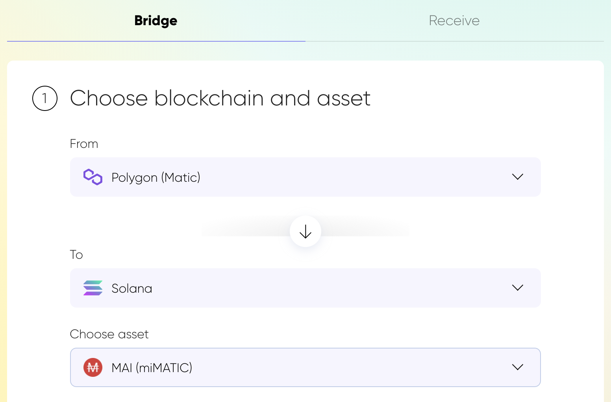
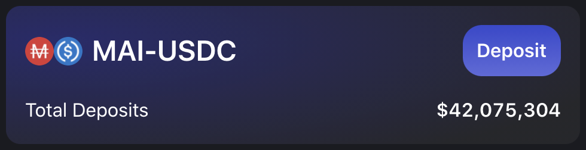
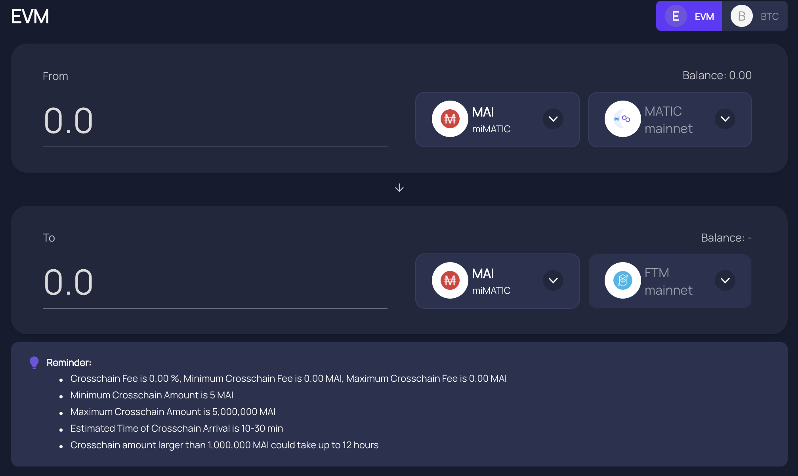

# MAI Metaverse

## Intro

MAI, sometimes referenced as miMATIC, is the first stable coin native from the Polygon network. It's soft pegged to $1.00, and its value can possibly fluctuate between $0.99 and $1.01. You can get more details on how the peg is maintained in [the official documentation](https://docs.mai.finance/stablecoin-economics). But it's not because MAI is native to Polygon that it's only found on that network. Indeed, the same way as you can find DAI on different networks \(DAI is actually another stable coin coming from the Ethereum Mainnet\), MAI is slowly but surely expanding to other networks too. This article will highlight the different networks where you can find it, and how you can transfer your MAI from one network to the other.

## Polygon

### Getting MAI on Polygon

As explained, MAI is native to Polygon, and that's the only place \(as for September 2021\) where you will be able to mint MAI.This is done either by

* borrowing MAI against some collateral you previously deposited in a vault on Mai Finance
* swapping USDC for MAI on [Mai Finance](https://app.mai.finance/anchor)
* selling another asset and buying MAI on any DEX \(**D**ecentralized **EX**change\) on Polygon, the most efficient being [Zapper](https://zapper.fi/exchange), [Balancer](https://polygon.balancer.fi/#/trade) or [1Inch](https://app.1inch.io/#/137/classic/swap).

### Using MAI on Polygon

The MAI stable coin is being used in more and more projects on Polygon, especially now that it's used as other stable coins on big projects like QuickSwap. As of September 2021, there are 3 stable farms on QuickSwap with a grand total of $18,327,604:

* MAI-DAI with $6,553,255
* MAI-USDT with $6,316,026
* MAI-USDC with $5,458,323

Additional pools can be found on other projects / yield farms / yield optimizers. You can read more on what to do with your MAI stable coin in [the dedicated article](../tutorial/what-to-do-with-mai-on-polygon.md).

## Solana

### Getting MAI on Solana

Solana is a blockchain platform for decentralized apps. The goal of the network is to propose low fees \(less than $0.01\) and fast \(less than 400ms\) transactions. The idea behind this is to create some alternative to the Ethereum Mainnet and its side chains. However, it's not because Solana is a direct competitor to the Ethereum network that it doesn't support the same assets. Indeed, Solana now supports the MAI stable coin that can be bridged from Polygon \(where it can be minted\).

In order to send your MAI tokens to Solana, you can use [AllBridge](https://allbridge.io/), a bridging platform that allows you to transfer tokens from one chain to another. AllBridge supports the following networks:

* Ethereum Mainnet
* Polygon
* Solana
* Huobi
* Binance Smart Chain

The interface is really intuitive in the sense you simply have to select the two networks and the asset you want to transfer between the 2.

The next step is to indicate the address of your Solana wallet and the amount you want to transfer. Be aware that MetaMask doesn't support Solana wallets \(yet?\), you will have to create a separate wallet on that network. It can be either a web wallet like MetaMask, or an app wallet. Please read the [official recommendations from Solana](https://docs.solana.com/wallet-guide) before choosing one.


Be aware that Solana does not offers any faucet where you will get your first SOL \(native token used to pay for transactions\). You need to buy some SOL first and have them in your wallet so that you can transfer MAI to your wallet.


### Using MAI on Solana

The same way you can use MAI on Polygon to provide liquidity and farm yields, you can do the same on Solana. The main place where you can use MAI is [Saber](https://app.saber.so/), in the MAI/USDC pool.

One of the good thing to know about the MAI/USDC pool on saber is that, unlike LP \(**L**iquidity **P**roviding\) pools on QuickSwap, you don't need to provide LP pairs with a ratio 1:1. You can simply deposit a single asset \(**MAI** or **USDC**\) or an \(un\)balanced ratio of both stable coins.

This means that you can actually use 100% MAI deposits from Mai Finance without having to swap any for USDC. It's particularly convenient and prevents getting impacted by small price differences between the 2 stable coins. Note that you will get rewards paid in the native farm token, the same way as you would get paid in QUICK if you're farming on QuickSwap on Polygon. You can then sell your saber tokens to increase your MAI/USDC position.


On Solana, you can also use [Sunny](https://app.sunny.ag/), an aggregator that will auto-compound the rewards from Saber. Note that the Sunny aggregator is not validated by the Mai Finance team. AllBridge and Saber have been official partners of Mai Finance, but results are not guaranteed. Please, as usual, do your own researches.


## Avalanche

### Getting MAI on Avax

Avalanche is a blockchain network, designed to provide an open-source platform and a layer 1 protocol for launching DeFi applications and enterprise blockchain solutions. It's another alternative solution to Ethereum Mainnet that also supports the same assets as Ethereum Mainnet, Polygon and Solana. As such, you can now send your MAI from Polygon \(the only place, as of September 2021, where you can mint MAI\) to Avax using [Relay Chain](https://app.relaychain.com/#/transfer).

As for AllBridge, the UI is quite simple. You simply select the network from which the asset will be bridge, its destination, and the asset to transfer.

Metamask **does** support [Avax wallets](https://support.avax.network/en/articles/4626956-how-do-i-set-up-metamask-on-avalanche), so you won't need any additional wallet like for Solana.

### Using MAI on Avax

The same way you can use MAI to farm yields on Polygon, you can use MAI on Avalanche. The main place to do so is [Trader Joe's farms](https://www.traderjoexyz.com/#/farm), where you will find a MAI/USDC pool.

The farms on Avalanche work very closely to what you can find on Polygon. Hence, you can use Trader Joe's app the same way you would use QuickSwap. You first need to create an LP pair on the site using the same ratio of MAI and USDC, then deposit the LP pair on the farm. The same way you would get paid in QUICK when farming on QuickSwap, you will get rewarded in JOE tokens when farming on Trader Joe. You can then use these tokens in other pools, or sell them to increase your MAI/USDC pair.

## Fantom

### Getting MAI on Fantom

Fantom is a blockchain / smart contract platform which purpose is to solve the scalability issues of other networks, namely the Ethereum blockchain. Developers can create their DApps \(**D**ecentralized **App**lications\) on that network and use the same assets as on other network. As such, you can already bridge MAI from Polygon to Fantom using the [AnySwap](https://anyswap.exchange/#/bridge)'s bridge.

If AnySwap is another bridging solution, its UI is very similar to the one of AllBridge and Relay Chain. When on Polygon, you will have to connect your MetaMask wallet first, then select the asset you want to bridge \(MAI\) and the destination network \(Fantom\).

Metamask **does** support [fantom wallets](https://docs.fantom.foundation/tutorials/set-up-metamask), so it's very easy to set it up to get your MAI on Fantom and start using it right away.

### Using MAI on Fantom

Currently, the Mai Finance team does not have any partnership with any yield farm on Fantom. Once the team is aware of projects that are using MAI, this documentation will be updated. Stay tuned.

## Disclaimer

The details presented in this guide are purely educational and have not been tested directly by the team maintaining this guide. A few users on the discord server have already tried bridging their assets to Solana and/or Avalanche, so you can join the Discord community to ask your questions. Please don't forget to do your own researches, different networks will have different transaction fees and execution times, different reward programs, bridging fees etc ... If you send your MAI to other networks, make sure you can bridge them back in case you need it on Polygon.


Keep in mind that a strategy that works well at a given time may perform poorly \(or make you lose money\) at another time. Please stay informed, monitor the markets, keep an eye on your investments, and as always, do your own research.


