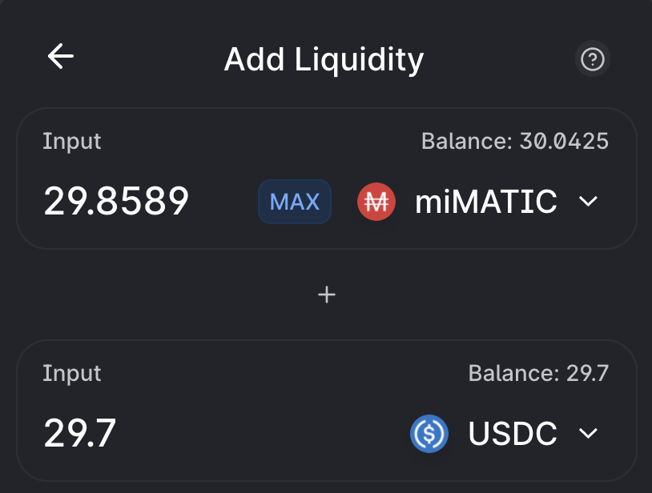
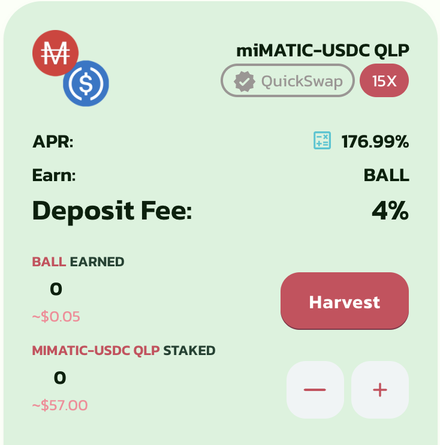

# Farming using only stable coins

## General idea

When you enter a yield farm on Polygon, you expose your investments to the success or failure of the farm. This guide isn't presenting in details what is a Yield Farm, or how you should farm on them. If you need help on that there are tutorials everywhere on internet. You can also get some help from the QiDAO community on [Discord](https://discord.gg/mQq55j65xJ).

The main issue when you are farming is that you have to make a choice between

* selling the native token and convert them into "secured" assets that will represent your gains
* re-invest them to generate even more profits (also known as hyper-compounding)

The guide will present step by step how to use Mai Finance to actually secure your gains while still re-investing a portion of it into the farm.


To illustrate in more details how you can do that, I will use the [latest PolyPup](https://ball.polypup.finance) farm. This is for educational purpose only, and should absolutely not be used as a financial advice. Also, the term "secure" here is solely based on my personal appreciation. As always, do your own research. Finally, I personally don't recommend this farm.


## Farming life cycle

### Getting prepared to farm

As a humble farmer once told me

> _**You should never buy what you can earn**_

In the guide, we will try to implement as much financial security as possible. To do so, we will farm using stable coins only, in order to protect our investment from any impermanent loss. Most farms are proposing stable coins pairs in their liquidity pools (LP), and MAI gaining more and more visibility, you can find farms proposing MAI/USDC pools. This is the stable coins pair we will be focusing on.

In order to start farming using MAI/USDC pair, you need to acquire some stable coins. Mai Finance allows you to borrow the MAI stable coin by depositing your favorite crypto currency. In our case, we have a bunch of MATIC in our wallet, ready to be used. By depositing my MATIC into the [MATIC vault](https://app.mai.finance/vaults/matic) on Mai Finance, I can borrow MAI. If you need assistance doing that, please join the Discord server and ask the community. You can also read other tutorials on this site where you may find how to do this.


You can deposit your MATIC tokens in your MATIC vault, but you can also deposit them into AAVE to get amWMATIC, deposit them on Mai Finance on the yield page to get camWMATIC, and use these camWMATIC as collateral. You will be able to borrow the same amount of MAI, but you will also earn additional yield on your MATIC. See [Leverage your AAVE tokens](https://qidao-qimps.gitbook.io/mai-finance-tutorials/investment-tutorials/leverage-aave-tokens) to get more details on how to do this.


Once you borrowed MAI stable coins, you can use the [anchor page](https://app.mai.finance/anchor) on Mai Finance to convert half of your loan into USDC. Indeed, when you farm using LP pairs, the two parts of the pair need to be provided in a 1:1 ratio.

Now depending on the farm you want to farm on, you need to combine your 2 stable coins (MAI and USDC) into a valid LP pair on a DEX platform. Since my plan is to enter Polypup, and that farm accepts QuickSwap LPs, I need to go to [QuickSwap](https://quickswap.exchange/#/) and generate my pair there.

I am now ready to enter the farm.

### Deposit and harvest farm tokens

Now that you have some LP tokens, you can go to the farm website and deposit them to start collecting the farm tokens. In our example, I deposited my MAI/USDC tokens into the correct pool, and started collecting BALL tokens.

As of right now, you can see that farming MAI/USDC is granting me 176.99% APR. Based on how much liquidity is provided in the pool, and on the price of the BALL token, this APR will change over time.


It's very important to note that when you deposit your LP tokens, most farm will charge anywhere between 2% and 4% fees directly taken from the tokens you deposit. Be very aware of this, and make sure you are mentally ready to potentially lose the fee, or not fully get it back.


Now that your stable coins are deposited in the pool, you will earn some farm tokens that you can harvest whenever you want. Note that the price of the farm token will likely be very volatile, so make sure you harvest regularly when the token has some value. The more you wait, the more risk you have to get a big bag of tokens that worth totally nothing. In the screenshot above, simply click the Harvest token and collect your BALLs.

### Leverage your farm tokens

Now that you have some farm tokens, usually you have the choice between

* selling them to buy something of greater value (your favorite crypto is a good example)
* re-inject them into the pool

Mai Finance presents a third option that lets you do both. Once you harvested your reward, simply go to your favorite DEX that support the farm token. Usually, you can find a link to a DEX in the menu of the farm. The link will include the token address which will help you trade it easily.

At that point, I am back at the step where we have MATIC tokens in my wallet, ready to be deposited on Mai Finance as a collateral. If I do that, I can borrow MAI, swap a portion of it into USDC, create a LP pair and re-deposit it into the farm. By doing this conversion, I "secure" 100% of my rewards by swapping them into a more stable crypto (here MATIC) and I re-inject 50% of my reward into the farming pool (or actually, in this example, 46% because of the 4% deposit fee).

If you think about it from a different perspective, the APR is 100% applied to your main crypto. If you are depositing new LP tokens into the pool (compounding), you get 50% of the APY advertised by the pool.

## Gains estimation

All the results presented below are assuming a few things

* We started with the equivalent of 60 MAI borrowed against the equivalent of $120.00 worth of MATIC
* The APR of the farm is staying at 176.99% for the period of time, translating to a 0.484% daily gain
* The value of MATIC and BALL stay the same for the period of time

These assumption are obviously not applying to the real life, the APR will slowly decay over time as more liquidity is provided to the pool, and as the farm token varies in price.

### Estimated raw results

| Day | LP value | Reward value | Compounded MATIC | New LP created |
| :-: | -------: | -----------: | ---------------: | -------------: |
|  1  |   $57.60 |       $0.279 |           $0.279 |         $0.139 |
|  2  |  $57.734 |       $0.280 |           $0.559 |         $0.140 |
|  3  |  $57.874 |       $0.280 |           $0.840 |         $0.140 |
|  4  |  $58.014 |       $0.281 |           $1.121 |         $0.141 |
|  5  |  $58.155 |       $0.282 |           $1.403 |         $0.141 |
|  6  |  $58.296 |       $0.282 |           $1.686 |         $0.141 |
|  7  |  $58.437 |       $0.283 |           $1.969 |         $0.142 |
|  8  |  $58.579 |       $0.284 |           $2.253 |         $0.142 |
|  9  |  $58.721 |       $0.285 |           $2.538 |         $0.142 |
|  10 |  $58.863 |       $0.285 |           $2.823 |         $0.143 |
|  11 |  $59.006 |       $0.286 |           $3.109 |         $0.143 |
|  12 |  $59.149 |       $0.287 |           $3.396 |         $0.143 |
|  13 |  $59.292 |       $0.287 |           $3.684 |         $0.144 |
|  14 |  $59.436 |       $0.288 |           $3.972 |         $0.144 |
|  15 |  $59.580 |       $0.289 |           $4.261 |         $0.144 |
|  16 |  $59.725 |       $0.289 |           $4.551 |         $0.145 |
|  17 |  $59.870 |       $0.290 |           $4.841 |         $0.145 |
|  18 |  $60.015 |       $0.291 |           $5.132 |         $0.145 |

* On day 1, the 4% fee is applied to our initial 60$ worth of MAI/USDC pair
* At the end of day 1, the generated revenue ($0.279) is fully transferred into the MATIC vault
* At the end of day 1, since we added some funds to the vault we can borrow more MAI
* In order to keep a 200% Collateral to Debt ratio, we only borrow 50% of the deposited MATIC ($0.139)
* At the beginning of day 2, we re-inject $0.139 into the farm (and the farm takes out 4% deposit fee)
* At the beginning of fay 2, we start again with an additional $0.134 worth of LP token

### Estimating APRs, APYs and revenue growth

The estimation was stopped after 18 days because passed that date, you can see that we are back at a value of $60 worth of LP tokens. This means that I farmed enough to repay the initial deposit fees, which is the minimum goal that any farmer should aim for.

Passed that date, staying in the farm will only generate benefits. And because we're farming using stable coins, there's literally 0% impermanent loss on the liquidity I provide, meaning that there's no risk of losing money by staying in the pool.

However, I can also consider that I repaid the initial $2.40 deposit fee on day 9 because it's the time when the value of the profit in my MATIC wallet reached that amount. If I was just selling the farm token to make profit and not re-invest into the farming pool, that would actually be the moment I would only generate benefits.

In terms of gains, the reward that gets compounded into the farm is only 50% of the farm APR. This means that with a farm APR rated at 176.99%, the actual growth rate is only 88.495% annually, or 0.242% daily.

It's also possible to calculate the exact gain that was accrued on a specific day on the farm, assuming you are compounding daily, using the following formula for the **R**eturn **O**n **I**nvestment

$$
ROI_{DayN}=InitialInvestment*(1+DailyAPR)^{DayN}-InitialInvestment
$$

In the case of a farm that takes 4% deposit fee, you need to multiply the above result by 96%. In our case, we can quickly verify that the formula works by comparing its result to the table above

$$
ROI_{Day1} = [60 * (1+0.00242)^{1}-60]*0.96=$0.1396523836
$$

$$
ROI_{Day365}=[60*(1+0.00242)^{365}-60]*0.96=$81.80752927
$$

Starting from $60.00 and generating $81.81 after 1 year gives an APY of 136.34%.

If we compare this to the theoretical APY given by a 88.495% APR using the formula

$$
APY = ( 1 + \frac{APR}{N})^N-1
$$

This gives with an APR of 88.495% and N = 365 (compounding daily)

$$
APY = ( 1 + \frac{0.88495}{365})^{365}-1=142.02\%
$$

Note that the estimation above doesn't take into consideration the 4% deposit fee, hence the small discrepancy.

The gains in the MATIC wallet are simply twice the gains from the farm and we can calculate the ROI on a given day using the same formula as above and multiply the result by 2.

$$
ROI_{Day365} = [60 * (1 + 0.00242)^{365} - 60]*0.96*2=$163.6150585
$$

This is the number of MATIC that we would generate by staying into the farm for one year, with an initial investment of 60$ worth of MAI/USDC, assuming the APR of the farm remains the same. This also gives an APY of 272.69%, which is roughly the APR that the farm advertised (the farm usually don't take into consideration the 4% deposit fee in the displayed APR).

### Recap after 1 year farming with stable coins

At the end of the year we would get

* $283.62 MATIC in the Vault (initial $120.00 + $163.62 generated by the farm)
* $141.82 of debt (initial $60.00 + $81.82 borrowed and re-invested)
* $141.82 of MAI/USDC tokens on the farm

## Disclaimer

Everything presented in this strategy is assuming that

* The farm is keeping a constant APR on your pool (which is totally wrong)
* It is possible to farm for a whole year (which is not possible, all farms are ending their farming session sooner or later)

As a side note, the APR of the MAI/USDC pool on Polypup after 24h of farming is 128.13%, mostly because of the price of BALL slowly decaying.

Also, farming with stable coins _**may**_ be the most "secured" way to earn yields because you're not exposed to impermanent loss. However, there is absolutely no guarantee that you will be able to get your 4% deposit back. You can find some websites that have stable coin pools with 0% to 1% deposit fees, even on the non-native pools (pools that accept LP pairs without the native farm token).

Harvesting the rewards and swapping them for something valuable is considered the best strategy when farming yields. Borrowing MAI to re-inject a portion of stable coin in the pool and increase your farming revenues exposes your benefits to the 4% deposit fee that the farm is taking off your LP pair, which may not be the best thing to do if you are unsure to get it back, and it's probably better to use another strategy to re-invest your earnings (invest in native pools / pools with 0% interest / pools with high APRs).


Keep in mind that a strategy that works well at a given time may perform poorly (or make you lose money) at another time. Please stay informed, monitor the markets, keep an eye on your investments, and as always, do your own research.

