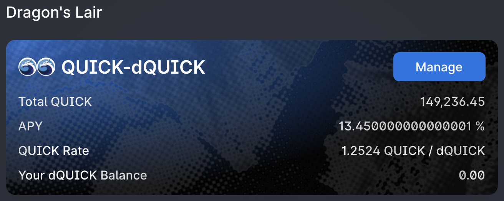

# Montando DApps como peças de Lego

## Introdução

Ao buscar rendimentos em alguma farm, você geralmente recebe as suas recompensas na forma do token nativo da farm. Você então pode escolher entre vendê-los, ou mantê-los com a esperança de que irão valorizar ao longo do tempo. Este guia apresenta alguns diferentes DApps (**D**ecentralized **App**lications, ou Aplicaçōes Decentralizadas) para maximizar seus rendimentos sem que você precise vender qualquer coisa, enquanto ainda recebe juros compostos. Este artigo também irá começar com stablecoins, pois essa é considerada uma estratégia relativamente segura. Porém, você precisa ter em mente que isto não é conselheiro financeiro, e que este guia deve ser seguido com caução já que os resultados não são garantidos. Como sempre, faça a sua própria pesquisa.

## QuickSwap

A QuickSwap é uma das maiores AMM (**A**utomated **M**arket **M**aker, Agente Automatizado de Mercado) na rede Polygon. Pessoas depositam pares de tokens em pools de liquidez e recebem taxas das transaçōes dos outros usários que usam a plataforma para trocar seus tokens. Durante uma troca, a QuickSwap automaticamente escolhe a melhor rota utilizando diferentes pools de liquidez, e cada pulo de uma pool a outra é sujeito às taxas das transaçōes, que são redistribuídas aos fornecedores de liquidez.

### Farming com Stablecoins

Para este exemplo, iremos utilizar o par MAI/USDC na QuickSwap. Esta pool de liquidez, uma stable pool, entrega um APY (**A**nnual **P**ercentage **Y**ield, Rendimento Percentual Anual) que varia entre 20% e 25%. O rendimento é composto de taxas de transaçōes (que são acumuladas na pool de liquidez) e recompensas em QUICK.

A pool recebe uma quantidade fixa de tokens QUICK todos os dias, então, eles são distribuídos aos fornecedores de liquidez de acordo com sua fatia da pool. Por exemplo, se a pool tem o equivalente a $1,000,000 de liquidez, e você já depositou $1,000 de LP tokens (**L**iquidity **P**rovider, fornecedor de liquidez), você possui 0.1% da pool, o que te entitula a 0.1% das recompensas diárias de QUICK. Sua recompensa será então exigível quando você gerenciar a pool que você entrou.

Você pode reinvidicá-las frequentemente para fazê-las trabalhar. Vamos ver como fazer isso.

### Dragon's Lair

A Dragon's Lair é uma maneira de otimizar seus ganhos na QuickSwap. Você pode depositar os tokens QUICK que você recebe das pools de liquidez na Lair, e eles então irão te render recompensas QUICK adicionais. Esta é uma ótima ideia se você prefere guardar os tokens QUCIK ao invés de vendê-los. Ao fazer staking de seus tokens QUICK na Dragon's Lair, as recompensas que eles geram são automaticamente reacumuladas, e o APY da Lair é de cerca de 12%.

Após depositar seus tokens QUICK, você irá receber em sua carteira tokens dQUICK que representam a sua fatia da pool de QUICK. Note que a razão QUICK:dQUICK não é de 1:1 já que o token dQUICK representa a sua fatia na pool, enquanto a quantidade de QUICK que você possui aumenta ao longo do tempo com mais recompensas sendo adicionadas a pool.&#x20;

Agora você tem suas stablecoins depositadas na pool de liquidez, e elas geram recompensas QUICK. As recompensas geram mais recompensas graças a Dragon's Lair. Mas espera, tem mais...

### Dragon's Syrup

A Dragon's Syrup é uma maneira adicional que a QuickSwap oferece para recompensar ainda mais usuários que estão segurando tokens QUICK. O time da QuickSwap criou um programa onde parceiros podem promover seus produtos ao garantir seus tokens aos usuários da plataforma QuickSwap. Você pode então depositar seus tokens dQUICK em uma das farms para receber esses tokens exóticos somados a suas recompensas da Dragon's Lair. A que nos temos interesse está na farm de ADDY.

Quando você deposita seus tokens dQUICK na farm, eles desaparecem da Dragon's Lair (da mesma maneira como seus camTokens desaparecem da página de rendimentos na Mai Finance quando você os deposita na Vault). Mas você pode ver claramente que o APY dQUICK da Lair ainda é aplicado, e que você também recebe recompensas ADDY adicionais. Aqui, o APR (**A**nnual **P**ercentage **R**eward, Taxa de Percentual Anual) é de 21.36% atualmente.


Você irá notar que as farms da Syrup possuem data de validade. Aqui, a farm ADDY irá expirar em 50 dias e 11 horas. Algumas novas farms irão ser exibidas conforme outras vão desaparecendo.


No nosso caso, as recompensas em ADDY que nós recebemos podem ser reinvidicadas manualmente. Você pode notar que a taxa pela qual colhemos as recompensas ADDY pode apenas acelerar se nós reacumulamos manualmente as nossas recompensas QUICK em dQUICK que então depositamos na farm de ADDY na QuickSwap.

### Recapitulando

Nós temos tokens LP MAI/USDC depositados na pool de liquidez, e nós ganhamos:

* Taxas das trocas
* Recompensas em QUICK da pool, que precisamos reinvidicar manualmente e adicionar à Dragon's Lair
* Recompensas em QUICK da Dragon's Lair que são automaticamente reacumuladas com as nossas recompensas existentes
* Recompensas ADDY da Dragon's Syrup que nós podemos reivindicar

## Impermax

Impermax é uma aplicação que permite seu usuário alavancar automaticamente seus ativos para amplificar suas posiçoes nas pools de liquidez. Isso é feito adicionando ativos adicionais fornecidos na plataforma da Impermax.&#x20;

### Farming com stablecoins

Para este exemplo, nós também utilizaremos a pool de MAI/USDC na Impermax. Depositando alguns LP tokens na pool MAI/USDC, nós agora temos a opção de alavancar este deposito um certo numero de vezes para aumentar o nosso cpaital exposto, e com isso ganhar mais recompensas. Porém, você precisa prestar atenção a algumas coisas quando você utilizar a Impermax:

* Você pode apenas tomar emprestado o que outros usuários fornecem
* Quanto mais ativos tomar emprestado, maior a taxa de empréstimo
* Se a taxa do empréstimo ficar muito alta, seu APR final pode se tornar negativo, então você perderá parte da sua LP&#x20;
* Quanto mais você se alavncar, maior será o APR, mas também maior a taxa deo empréstimo&#x20;

### Posição alavancada

Na QuickSwap, eu depositei $20 do par MAI/USDC. Na Impermax, eu irei depositar apenas $10 de MAI/USDC e irei aplicar alavancagem de 2 vezes para obter exposiçāo de $20.

Você pode ver na foto acima que se aumento minha alavancagem para 2.1 vezes, eu tomaria emprestado:&#x20;

* 0.481269 USDC
* 0.487593 MAI

Nós podemos ver também o quanto as taxas das operaçōes que eu coleto iriam aumentar (+3.45%), assim como o aumento de recompensas QUICK (+36.83%), recompensas IMX (+23.05%) e a taxa de empréstimo (-37.20%) para um APR final estimado em 26.13%.

Perceba neste exemplo que as taxas de empréstimo são pagas com as recompensas QUICK e as taxas das operaçōes, caso as recompensas QUICK sozinhas não sejam o suficiente. Se a taxa de empréstimo ainda não for paga, as recompensas IMX são usadas para isso, e por último, se ainda houver algo a ser pago, o depósito.

Nosso objetivo aqui é igualar o depósito que temos com o da QuickSwap, então nós permaneceremos com uma alavancagem de duas vezes. Isso também garante que nós não teremos o risco de atingir APRs negativo. Nosso objetivo não é coletar a maior quantidade de recompensas possível, mas aumentar nossa posiçāo ao longo do tempo, e coletar tokens IMX.

### Recapitulando

Nōs temos tokens MAI/USDC depositados na pool apropriada:

* Nossa posição é alavancada duas vezes para corresponder com a quantidade depositada na QuickSwap
* Nós coletamos tokens IMX

## Adamant

A Adamant é uma plataforma otimizadora de rendimentos que automatiza a colheita nas pools de liquidez e reacumula automaticamente as recompensas em LP tokens adicionais. A maioria das pools presentes nas Adamant são pools populares de grandes provedores de liquidez como a QuickSwap, SushiSwap e outros. Vejamos como podemos utilizar a Adamant para otimizar nossos rendimentos.

### Farming de QUICK/IMX

Nós recebemos tokens QUICK na QuickSwap, e tokens IMX na Impermax. Vamos usar a Adamant para o farm de QUICK/IMX na pool da QuickSwap. Por que fazer isto? Porque esta farm é, de fato, muito rentável, como você pode ver abaixo:

Enquanto este artigo é escrito, o atual APY da pool de IMX/QUICK na Adamant é de 417.25%. A recompensa é composta de:

* 168.49% em tokens QUICK reacumulados automaticamente (recompensas QUICK da QuickSwap são vendidas para comprar LP tokens IMX/QUICK LP adicionais que são adicionados a sua posição)
* 212.85% em tokens ADDY que você pode reinvidicar na Adamant (eles passam por vesting durante 90 dias, então você não pode acessá-los imediatamente)
* 35.91% em dividendos de taxas pagos em WMATIC se você reivindicar seu ADDY diariamente

Isso significa que a sua posição IMX/QUICK irá crescer com o tempo, e que você irá coletar suas recompensas ADDY. Quanto mais ADDY você segurar, mais dividendos (WMATIC) você irá coletar.&#x20;

Você também pode ver que o APY na Adamant é _Boostable (_impulsionável_)_. Isso significa que ao fazer staking de mais tokens ADDY (não os que passam pelo vesting), você irá aplicar um multiplicador adicional à recompensa que você recebe. Isso é de fato muito bom, porque nós CONSEGUIMOS mais ADDY da Dragon's Syrup na QuickSwap!

### Harvesting de ADDY e WMATIC

Para você colher os tokens ADDY respectivos à sua posição na pool de IMX/QUICK pool, você deve esperar por 90 dias, pois eles estarão bloqueados devido ao vesting. Entretanto, é permitido a você receber dividendos na forma de WMATIC. Atualmente, o APR para dividendos é de 34% baseado nos seus tokens ADDY em vesting.

Após o periodo de 90 dias, você terá a possibilidade de bloqueá-los por mais 90 dias e com isso fazer um boost nos tokens ADDY recebidos da vault, para receber ainda mais tokens.

Dividendos WMATIC são o verdadeiro produto final do trio QuickSwap + Impermax + Adamant que nós buscamos, porque nós podemos utilizá-los para reinvestir LP tokens adicionais na QuickSwap e Impermax.

### Recapitulando

Nós depositamos tokens IMX e QUICK recebidos da Impermax e QuickSwap na farm de LP tokens IMX/QUICK. A Adamant está rendendo:

* mais LP tokens por reacumular uma parte dos tokens QUICK garantidos pela QuickSwap para a pool IMX/QUICK
* tokens ADDY que são usados para fazer um boost nas recompensas de IMX/QUICK, e que nos torna elegíveis a receber dividendos
* dividendos em WMATIC

## AAVE

Com os tokens WMATIC ganhados na Adamant, nós podemos agora depositá-los na AAVE para fazê-los render. Essa é a alavancagem padrão com tokens AAVE mencionada [neste artigo](leverage-aave-tokens.md).

## Mai Finance

Seguindo o depósito na AAVE, nós recebemos amWMATIC em nossa carteira. Nós podemos utilizar a página de rendimentos na Mai Finance para reacumular automaticamente a recompensa gerada pela AAVE com as recompensas de incentivo MATIC e receber mais 4% no nosso MATIC ganhado na Adamant.

O camWMATIC pode então ser usado como garantia na Mai Finance, sendo depositado no cofre camWMATIC, que nos permite tomar emprestado MAI, e trocar uma parte do MAI cunhado em USDC. Quando tivermos mais MAI e USDC em nossa carteira, nós podemos combinar as 2 stablecoins em LP tokens adicionais que serão depositados na QuickSwap e Impermax. Mais uma vez, se você precisa de ajuda sobre como fazer isso, por favor, leia o [artigo dedicado](leverage-aave-tokens.md).

## Bootstrapping

A seguir, veremos uma simulação feita com um investimento inicial de $1,000 de LP tokens MAI/USDC e os APRs / APYs atuais dados pelas plataformas diferentes em 30 de Agosto de 2021. Isso não é uma aplicação real do que nós descrevemos acima. As taxas irão variar, os preços dos tokens irão variar, alguns programas serão encerrados, etc. Portanto, os resultados finais aqui são apenas uma estimativa do que você pode alcançar se tudo permanecer estável, o que nunca é o caso.

### Primeiro Dia

Como nós temos $1,000 de MAI/USDC, nós queremos dividir os LP tokens entre a QuickSwap e Impermax. Já que a Impermax nos permite alavancar nosso depósito, nós podemos então colocar mais tokens na QuickSwap e utilizar a opção de alavancagem na Impermax para coincidir com o que temos na QuickSwap.

Para diminir o risco de juros negativos na Impermax, a divisão será feita da seguinte maneira:

* $900 de MAI/USDC na QuickSwap
* $100 de MAI/USDC na Impermax, alavancando 9 vezes, para nos expormos a $900 na pool de MAI/USDC

Para o resto da simulação, nós consideraremos que a QuickSwap nos garante um APR de 25.56% em MAI/USDC pago em tokens QUICK, e a Impermax nos garante, em média, um APR de 20% em MAIS/USDC, alavancando 9 vezes, pago em tokens IMX. Isso corresponde a uma taxa diária de:&#x20;

* \+0.07% na QuickSwap
* \+0.05% na Impermax

Isso significa que no final do primeiro dia, nós ja coletamos:

* $0.63 de QUICK
* $0.49 de IMX

Dai, nós podemos combinar todo o IMX que recebemos com uma porção de recompensas QUICK no par LP IMX/QUICK que será depositado na Adamant. O par LP possui um valor de $0.98 e nós ainda temos $0.14 de QUICK que nós depositamos na Dragons's Lair para dQUICK. Então, dQUICK é usado na Dragon's Syrup para começar a coletar ADDY no segundo dia.\

| Reward type              | Value in dollars |
| ------------------------ | ---------------- |
| dQUICK on QuickSwap      | 0.14             |
| ADDY on QuickSwap        | 0                |
| IMX/QUICK on Adamant     | 0.98             |
| ADDY on Adamant          | 0                |
| WMATIC on Adamant        | 0                |
| camWMATIC on Mai Finance | 0                |
| debt on Mai Finance      | 0                |

### Day 2

We still have the same position on QuickSwap and Impermax, nothing changes and we once again get $0.63 worth of QUICK and $0.49 worth of IMX that are used to get $0.98 worth of IMX/QUICK and $0.14 of dQUICK deposited in the ADDY farm on QuickSwap.

However, the IMX/QUICK position on Adamant is earning 151.96% APR in IMX/QUICK (or +0.42% daily). This means that our original $0.98 deposit is now at $0.984, and we're adding $0.98 from farming on QuickSwap and Impermax. It also generated 177.43% APR (or +0.49% daily) ADDY, corresponding to $0.005.

On QuickSwap, the dQUICK we deposited in Dragon's Syrup is generating additional QUICK tokens at 12.26% APR (+0.03% daily) and ADDY tokens at 17.08% APR (+0.05% daily). This is applied to the $0.18 worth of QUICK, meaning that at the end of Day 2 we already generated $0.00006 worth of ADDY and $0.000054 worth of QUICK. The ADDY reward can be claimed and added into Adamant to start boosting the ADDY APR of the IMX/QUICK position.

| Reward type              | Value in dollars |
| ------------------------ | ---------------- |
| dQUICK on QuickSwap      | 0.274            |
| ADDY on QuickSwap        | 0.00006          |
| IMX/QUICK on Adamant     | 1.98             |
| ADDY on Adamant          | 0.005            |
| WMATIC on Adamant        | 0                |
| camWMATIC on Mai Finance | 0                |
| debt on Mai Finance      | 0                |

### Day 3

Moving on, the ADDY reward claimed on Adamant are now generating some WMATIC reward. The first $0.005 worth of ADDY collected earn 56% APR (0.15% daily) or WMATIC dividends, which corresponds to $0.000007 worth of WMATIC. Keep in mind we're only starting the engine here.

| Reward type              | Value in dollars |
| ------------------------ | ---------------- |
| dQUICK on QuickSwap      | 0.411            |
| ADDY on QuickSwap        | 0.00019          |
| IMX/QUICK on Adamant     | 2.971            |
| ADDY on Adamant          | 0.014            |
| WMATIC on Adamant        | 0.000007         |
| camWMATIC on Mai Finance | 0                |
| debt on Mai Finance      | 0                |

### Day 4

We can now add the WMATIC in the loop. This dividend will be deposited on AAVE, then used on Mai Finance to borrow new MAI.

| Reward type              | Value in dollars |
| ------------------------ | ---------------- |
| dQUICK on QuickSwap      | 0.548            |
| ADDY on QuickSwap        | 0.00038          |
| IMX/QUICK on Adamant     | 3.969            |
| ADDY on Adamant          | 0.029            |
| WMATIC on Adamant        | 0.000029         |
| camWMATIC on Mai Finance | 0.000007         |
| debt on Mai Finance      | 0.0000035        |

At this point, the "debt" on Mai Finance will be used to increase the MAI/USDC LP positions on both QuickSwap and Impermax, and the system is completely primed.

## Farming results

### Daily routine

The daily routine is composed by the following transactions

* Harvest IMX on Impermax
* Harvest QUICK on QuickSwap
* Create new IMX/QUICK LP pair on QuickSwap
* Deposit the remaining QUICK on Dragon's Lair to get dQUICK
* Deposit dQUICK on Dragon's Syrup to get additional ADDY
* Harvest ADDY on Dragon's Syrup
* Deposit harvested ADDY on Adamant vault
* Deposit IMX/QUICK LP tokens on Adamant
* Harvest ADDY on Adamant from LP pair
* Harvest WMATIC dividends on Adamant
* Deposit WMATIC on AAVE and get amWMATIC
* Deposit amWMATIC on Mai Finance and get camWMATIC
* Deposit camWMATIC on Mai Finance's vault
* Borrow 50% of the deposit as MAI stable coin on Mai Finance
* Swap 50% of the minted MAI for USDC on Mai Finance
* Create new MAI/USDC LP pair on QuickSwap
* Deposit 90% of the new LP tokens on QuickSwap liquidity pool
* Deposit 10% of the new LP tokens on Impermax liquidity pool
* Leverage the new position on Impermax to match the position on QuickSwap

### Raw results month after month

| Month | dQUICK | IMX/QUICK | ADDY    | WMATIC | Debt   |
| ----- | ------ | --------- | ------- | ------ | ------ |
| 1     | $4.25  | $32.56    | $2.32   | $0.03  | $0.02  |
| 2     | $8.36  | $68.34    | $9.65   | $0.28  | $0.15  |
| 3     | $12.48 | $108.86   | $22.30  | $0.98  | $0.49  |
| 4     | $16.59 | $154.78   | $41.34  | $2.41  | $1.20  |
| 5     | $20.71 | $206.83   | $67.50  | $4.86  | $2.42  |
| 6     | $24.84 | $265.83   | $101.73 | $8.70  | $4.34  |
| 7     | $28.97 | $332.74   | $145.11 | $14.31 | $7.15  |
| 8     | $33.12 | $408.63   | $198.87 | $22.14 | $11.06 |
| 9     | $37.29 | $494.73   | $264.40 | $32.70 | $16.34 |
| 10    | $41.48 | $592.45   | $343.28 | $46.57 | $23.26 |
| 11    | $45.71 | $703.39   | $437.33 | $64.40 | $32.19 |
| 12    | $49.97 | $829.37   | $548.59 | $86.94 | $43.46 |

### Day 365

After a complete year, the final state of our investment would be

| Reward type              | Value in dollars |
| ------------------------ | ---------------- |
| dQUICK on QuickSwap      | 50.689           |
| ADDY on QuickSwap        | 4.325            |
| IMX/QUICK on Adamant     | 851.968          |
| ADDY on Adamant          | 568.972          |
| WMATIC on Adamant        | 91.209           |
| camWMATIC on Mai Finance | 91.220           |
| debt on Mai Finance      | 44.30            |

Note that the WMATIC in Adamant and collected daily so they're not part of the final revenue generated via this process. Also, the ADDY that have been generated via the QuickSwap farm haven't been harvested daily and added to boost the ADDY rewards on Adamant in this simulation (it is already complex enough).

Finally, after one year, the generated revenue is worth $1,567.174. If we consider the initial investment was $1,000 worth of MAI/USDC, this leads to a final APY of 156.71% on our stable pair.

## Conclusion

This Lego game allowed us to generate an impressive APY from stable coin farming, with very little risk exposure. Of course, this simulation makes a few assumptions that are 100% incorrect, but it illustrates how we can combine different DApps to maximize yield farming. It also showcases that it's not a necessity to sell tokens that we farm, and that there's certainly a was to use them efficiently if you take the time to research possibilities.

## Disclaimer

This guide is definitely not financial advice, it was made with an educational goal in mind. You need to pay attention to price variations, supply and demand, reward programs end dates, impermanent losses etc ... The goal wasn't to propose recipes that can be followed blindly, so please do your homework and your own simulation, and only invest what you're ready to possibly lose.


Keep in mind that a strategy that works well at a given time may perform poorly (or make you lose money) at another time. Please stay informed, monitor the markets, keep an eye on your investments, and as always, do your own research.

