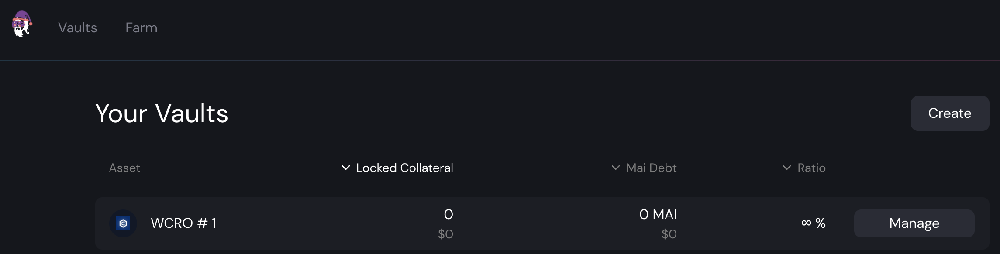

# 用 CroDex 耕种Legos

收益耕种很容易。你有 2 个代币，你将它们组合成一个 LP（流动性提供）对，你将 LP 代币存入一个池中，你开始获得掉期费，并且大多数时候，奖励是以你正在使用的农场的原生代币支付的。大多数人会简单地出售他们正在寻找的任何资产的奖励，这在大多数情况下是完全有效的，但与优化的解决方案相去甚远。今天，我们将看看如何从 Cronos 提出的几个 DApp 上的非常高的 APR（年利率）中获利，这会将稳定币的 30% 的 APR 转化为更高的利率。

## CroDex

### 与 MAI 一起耕作

即使 Mai Finance 的借贷应用程序还没有部署在 Cronos 上，也已经可以将 MAI 与其他链桥接起来。这样做的原因之一是因为 Cronos 上的 MAI 并不多，这意味着任何提议使用 MAI 进行农业的应用程序也将提供高 APR。 CroDex 就是这种情况，它是目前 Cronos 上唯一拥有 MAI 流动性的地方。对于本指南，我们将使用 CroDex 上的 MAI-USDC 池来降低你初始投资的无常损失风险，但你可以通过耕种 MAI-CRO 来增加收益。


每当你选择用于农耕产量的应用程序时，请务必注意奖励是显示为 APR（年百分比率）还是 APY（年收益率）。后者假设你获得的所有奖励每天都会复合一整年。在我们的示例中，MAI-USDC 对的 30% APR 对应于 34.97% APY。

如果将其与 Mai Finance 上的 MAI-USDC 池进行比较，Polygon 给出的 APR 为 20.18%，Fantom 为 22.10%，Avalanche 上的 MAI-av3CRV 池提出了 23.24% 的 APR。 CroDex 提出了所有链上 MAI 稳定的最佳利率！


CroDex 将使用其原生代币 CRX 向你付款。截至 2021 年 12 月，1 CRX = 127.56 USDC

### 单一质押 CRX

这就是有趣的地方。 CroDex 有 2 个不同的池，你可以在其中质押你的 CRX 代币以获得额外奖励。你可以质押以获得更多的 CRX，但我们将使用质押 CRX 的池子来奖励你 wCRO 代币。 wCRO 是 Cronos 网络的 gas 代币 CRO 的包装版本。

你已经可以看到，你可以很好地出售你的 CRX 以获得更多 MAI-USDC LP 代币，并在稳定货币对上获得近 35% 的 APY，但显然最好将你的 CRX 质押以获得 CRO。它不仅可以用来支付交易费用，还可以在 CroDex 上种植 MAI-CRO。随着时间的推移，你获得的 CRX 越多，如果你质押你的 CRX，你将获得的 CRO 就越多。但在本指南中，我们将进一步探索 Cronos！

## CRYSTL Finance

CRYSTL Finance 曾被称为 Polycrystal on Polygon。这是一个提出 LP 对vaults和单一权益池的goose fork，它的工作方式与 Beefy Finance 完全一样。我们将两者都用于我们的策略。

### 使用 CRX-WCRO 耕种 CRYSTL

我们将使用 CRX 质押产生的 CRO 代币将 50% 的奖励换成更多的 CRX，并将这两个代币组合成 CroDex 上的 CRX-WCRO 对，然后将 LP 代币存入 Crystl Finance 的保险库中。这会给你一个高APY，这将是复合的。

显示的费率是 APY。 1.21k% 的 APY 对应于 258.17% 的 APR，但你也可以直接在保险库信息中获得估计的每日收益，而你的 CRX-WCRO 耕作目前将为您带来 0.71% 的每日收益。跟踪每日奖励非常重要，因为我们将提取这部分 LP 头寸并将其分解为单独的代币。 CRX 将在 CroDex 上重新质押以获得更多的 CRO 代币，并且 CRO 将被交换为 CRYSTL。另请注意，我们每天将提取的收益需要支付提款费用。

### 单一质押 CRYSTL

使用上一步获得的 CRYSTL 代币，你将能够从 CRYSTL Finance 的单一权益池中获得 USDC。只需质押你的 CRYSTL 代币，你就会以 USDC 获得相当高的年利率。

然后，你可以简单地将 50% 的耕种 USDC 换成 MAI，并添加回你在 CroDex 上的原始头寸。

或者，我们可以使用与上述相同的方法并质押 CRYSTL 代币来赚取 SALEM 代币，这是 Salem Finance 的原生代币。

## Salem Finance

Salem Finance 是另一个goose fork，你可以在其中种植 SALEM 代币。大多数 LP 池都有存款费，但我们实际上不会使用 LP 农场，因为 CRYSTL Finance 已经为我们提供了我们需要的 SALEM 代币。相反，我们将在池中质押 SALEM，以再次获得非常高的 APR 来赚取额外的 WCRO。

(w)CRO 代币是 Cronos 的 gas 代币，它确实有很多实用性。如果需要，你还可以将其桥接到 Crypto.org 主链。在我们的例子中，因为我们想要关闭我们的投资循环，我们可以简单地出售 Salem Finance 的收益并购买更多的 USDC 和 MAI。

## 耕作策略

你已经可以看到，只有 3 个协议，你有多种选择：

* 耕种 MAI-USDC 获得 CRX，质押 CRX 获得 WCRO，出售 WCRO 获得更多 MAI-USDC
* 耕种MAI-USDC获得CRX，抵押CRX获得WCRO，耕种CRX-WCRO获得CRYSTL，抵押CRYSTL获得USDC，将USDC换成更多MAI-USDC
* 耕种MAI-USDC获得CRX，抵押CRX获得WCRO，耕种CRX-WCRO获得CRYSTL，抵押CRYSTL获得SALEM，抵押SALEM获得WCRO，出售WCRO获得更多MAI-USDC

对于本指南的其余部分，我们将专注于最后一种策略，它是最复杂的并且需要许多操作，但它也是提供最佳整体结果的策略。根据你的风险接受程度，随意应用你喜欢的一种。

### Bootstrapping系统

以下是初始投资价值 1,000 美元的 MAI-USDC LP 代币的模拟，以及本文档中截至 2021 年 12 月的当前 APR/APY。当然，费率和价格会随着时间而变化，所以这个模拟是仅在撰写本文时有效，并且模拟将仅提供对设置此系统可能获得的结果的估计。

### 第1天

你将你的 MAI-USDC 存入 CroDex 的适当池中，并获得 30% 的年利率。在第一天结束时，一旦你收集了你的 CRX 奖励，你将拥有

| MAI-USDC | staked CRX | CRX-WCRO | CRYSTL | SALEM | WCRO  |
| -------- | ---------- | -------- | ------ | ----- | ----- |
| 1,000.00 | 0.822      | 0.000    | 0.000  | 0.000 | 0.000 |

### 第2天

你质押的 CRX 正在生成 WCRO。你可以收获奖励并将 50% 换成更多 CRX，以创建 CRX-WCRO L 对，然后你可以将其存入 CRYSTL Finance。在第二天结束时，你将拥有

| MAI-USDC | staked CRX | CRX-WCRO | CRYSTL | SALEM | WCRO  |
| -------- | ---------- | -------- | ------ | ----- | ----- |
| 1,000.00 | 1.644      | 0.002    | 0.000  | 0.000 | 0.000 |

### 第3天

锁定在 CRYSTL Finance vault中的 CRX-WCRO 对生成了额外的 LP 代币。你必须提取每日收益并支付 0.1% 的费用，并将提取的 LP 部分分解为 CRX 和 WCRO 代币。你可以简单地在 CroDex 上重新质押 CRX，然后将 WCRO 换成 CRYSTL。这可以使用交换功能在 CroDex 上完成。在一天结束的时候，你会有

| MAI-USDC | staked CRX | CRX-WCRO | CRYSTL  | SALEM | WCRO  |
| -------- | ---------- | -------- | ------- | ----- | ----- |
| 1,000.00 | 2.466      | 0.005    | 0.00003 | 0.000 | 0.000 |


请注意，CRYSTL 上的奖励非常少，从第 1 天开始收获奖励可能并不有趣。此模拟仍在显示你应该获得的奖励，并假设你仍然每天复合，但这样做是为了简化结果。确保你不会将所有奖励都花在交易费用上，并且在最初的几周中仅每周复利可能会更有趣。


### 第4天

你可以质押你从 Crystl Finance 获得的 CRYSTL 奖励，以获得 SALEM 代币。在第 4 天结束时，你将获得

| MAI-USDC | staked CRX | CRX-WCRO | CRYSTL  | SALEM     | WCRO  |
| -------- | ---------- | -------- | ------- | --------- | ----- |
| 1,000.00 | 3.288      | 0.010    | 0.00011 | 0.0000002 | 0.000 |

### 第5天

你将从 Salem Finance 获得奖励的最后一天。 WCRO 奖励可以换成更多的 MAI-USDC。但是，你可以注意到，奖励的价值是如此之小，以至于你将无法在第 50 天左右之前从 Salem Finance 收获 WCRO。

## 耕种结果

### 例行工作

系统准备就绪后，这是你的日常工作

* 从 MAI-USDC 池中收获 CRX
* 从 CroDex 的单一质押池中获得 WCRO 奖励
* 将 WCRO 奖励的 50% 换成 CroDex 上的更多 CRX，并创建一些 CRX-WCRO LP 代币
* 将你的额外 CRX-WCRO 代币存入 CRYSTAL Finance
* 提取与你的每日奖励对应的部分CRX-WCRO
* 在 CroDex 上将 LP 代币分解为 CRX 和 WCRO
* 将 CRX 质押到 CroDex 上获得 WCRO 奖励的单一质押池中
* 在 CroDex 上将 WCRO 换成 CRYSTL
* 在 Crytl Finance 上质押 CRYSTL 代币以获得 SALEM 代币
* 收获 SALEM 代币
* 在 Salem Finance 上单质押 SALEM 代币
* 从 Salem Finance 获得 WCRO 代币
* 将 WCRO 换成 MAI 和 USDC 并创建更多 LP 对
* 将新的 MAI-USDC 对存入 CroDex 上的适当池中将新的 MAI-USDC 对存入 CroDex 上的适当池中

### 月复一月的原始结果

| 天   | MAI-USDC | staked CRX | CRX-WCRO | CRYSTL | SALEM  |
| --- | -------- | ---------- | -------- | ------ | ------ |
| 30  | 1,000.00 | 25.583     | 0.600    | 0.104  | 0.004  |
| 60  | 1,000.00 | 50.819     | 1.830    | 0.682  | 0.059  |
| 90  | 1,000.04 | 76.736     | 3.315    | 1.941  | 0.260  |
| 120 | 1,000.14 | 103.424    | 4.922    | 3.970  | 0.729  |
| 150 | 1,000.41 | 130.935    | 6.606    | 6.816  | 1.594  |
| 180 | 1,001.93 | 159.307    | 8.352    | 10.515 | 2.994  |
| 210 | 1,001.87 | 188.578    | 10.156   | 15.094 | 5.070  |
| 240 | 1,003.39 | 218.789    | 12.019   | 20.584 | 7.969  |
| 270 | 1,005.71 | 249.988    | 13.942   | 27.014 | 11.843 |
| 300 | 1,009.10 | 282.227    | 15.929   | 34.414 | 16.848 |
| 330 | 1,013.82 | 315.569    | 17.982   | 42.817 | 23.147 |
| 360 | 1,020.23 | 350.084    | 20.105   | 52.256 | 30.906 |

### 第365天

在这个系统耕种一整年之后，你将拥有

* CroDex 上价值 1,021.49 美元的 MAI-USDC
* CroDex 上价值 355.96 美元的单一质押的CRX
* 价值 20.47 美元的 CRX-WCRO 存入 CRYSTL Finance
* CRYSTL Finance 上价值 53.93 美元的单一质押的CRYSTL
* Salem Finance 上价值 32.353 美元的单一质押的 SALEM

Salem Finance 的 WCRO 实际上是作为额外的 MAI-USDC 头寸包括在内的，因为它已完全出售以增加这一对。

这意味着，如果初始投资为 1,000 美元，到年底，你将在所有应用程序中获得 1,484.45 美元，总 APY 为 48.45%。请记住，这是通过仅耕种稳定对作为策略的根来完成的。还需要注意的是，随着时间的推移交换的唯一代币是 CRO 代币。

### 使用 Mai Finance 的替代方案

Mai Finance 应用程序不支持 Cronos 上的vaults，因为 Cronos 上的代币还没有 Chainlink Oracles。预计 2022 年第一季度，Chainlink 将在 Cronos 上添加oracles，你将能够将你的 WCRO 代币存入Vault以借用 MAI 稳定币。这意味着可以修改上述策略以存入 WCRO 并使用 MAI 而不是出售 WCRO 代币，这将略微提高你的最终奖励率。

## 免责声明

本指南旨在展示你可以提高奖励率，而无需倾倒你所种植的代币。在构建反馈循环时找到合适的组合并不容易，但这绝对是可行的，如果你能找到合适的组合，你大部分时间都会得到回报。但是，编写本指南只是为了演示如何做到这一点，而不是为了构建类似的系统。所有交易费用都被故意丢弃，有些奖励不会持续一整年，这意味着你可能需要考虑更简单的循环进行个人投资。但是，对于这种类型的系统，CroDex 是一个很好的起点。


本指南绝对不是财务建议，它是出于教育目标而制定的。你需要注意价格变化，供需，奖励计划结束日期，无常损失等......目标不是提出可以盲目遵循的食谱，所以请做好功课和自己的模拟，只有投资你准备好可能失去的东西。


