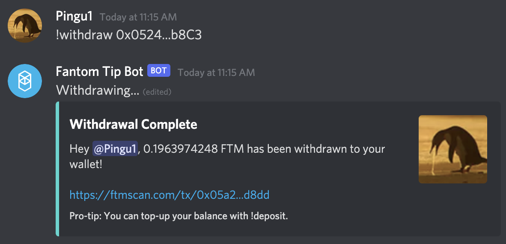
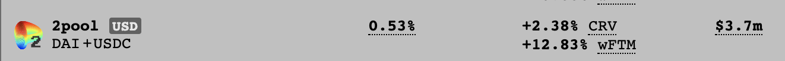

# 如何开始使用 Fantom

## 什么是Fantom

Fantom 是区块链设计师的以太坊替代品。作为启用了开源智能合约的区块链，它允许设计人员开发安全、全面和模块化的 DApps（Decentralized Applications)。

该链设计旨在克服上一代区块链平台的所有局限性，有时被称为区块链三难困境：去中心化、安全性和可扩展性。为了改进这些方面之一，它必须以其他两个方面之一为代价。\

Fantom 试图解决这个问题，这要归功于其基于 DAG(Directed Acyclic Graph)的 Lachesis aBFT(Asynchronous Byzantine Fault Tolerance) 共识机制，使其具有高性能、可扩展性和安全性。初始基准测试表明 Fantom 每秒可以轻松处理超过 20,000 个交易。\
\
最后，Fantom 100% EVM (Ethereum Virtual Machine) 兼容，这意味着在 EVM 兼容网络上开发的 DApp 也可以部署在 Fantom 上。这也为用户带来了另一个优势，因为 MetaMask 和其他 web3 应用程序也与 Fantom 兼容。你将能够在同一个钱包内从 Polygon 或 Avalanche 无缝切换到 Fantom。

## 上Fantom

Fantom 与 EVM 兼容，如果你已经拥有其他 EVM 链（Ethereum Mainnet、Polygon 或 Avalanche）的钱包，你将能够使用它。否则，是时候创建钱包地址了。可以使用不同的钱包类型：Metamask 或 [fWallet](https://pwawallet.fantom.network/#/) 等软件钱包，或 [Trezor](https://trezor.io/coins/) 或 [Ledger](https://fantom.foundation/blog/how-to-set-up-your-ledger-nano-s-x-with-fantom/)等硬件钱包。

对于本指南，由于我们在所有其他指南中都使用 Metamask，因此我们将使用 Metamask，但你可以随意使用你喜欢的任何其他软件/硬件钱包。如果你需要有关如何安装 Metamask 的说明，可以在[Polygon指南](../polygon/how-to-get-started-on-polygon.md)中找到说明。 [the polygon guide](../polygon/how-to-get-started-on-polygon.md#downloading-metamask).

### **将 Fantom 添加到 Metamask**

为了使用 Fantom 网络，你必须手动将其配置到 Metamask 中。为此，请单击 Metamask 窗口顶部的网络下拉菜单（它表示你当前使用的网络，默认为Ethereum Mainnet），然后选择Custom RPC。以下信息可让你连接到：

* **网络名称**: Fantom Opera
* **RPC URL**: https://rpc.ftm.tools/
* **ChainID**: 250
* **标志**: FTM
* **Explorer**: https://ftmscan.com

保存更改，Metamask 会自动将你切换到 Fantom网络。

如果你需要更多详细信息来设置 Metamask，你可以在[ Fantom 官方指南](https://docs.fantom.foundation/tutorials/set-up-metamask)中找到更多信息。

### FTM 水龙头

现在你在 FTM上了，你将需要一些 FTM（用于支付 gas 成本的原生代币）。你可以从其他链桥接一些 FTM 代币，或者使用一个可以在你的钱包中存入足够的 FTM 代币来执行一些交易的水龙头。[Fantom 上的主要水龙头](https://docs.spookyswap.finance/getting-started/how-to-get-fantom-gas)可以在 SpookySwap 上找到，SpookySwap 是那里的主要 DEX (Decentralized Exchange)之一。请注意，这是 SpookySwap 提供的一项依赖于 Discord 的服务，并且需要一个有效的 Discord 帐户激活 30 天以上（但不需要在 SpookySwap Discord 服务器上使用 30 天）。

* 一旦你加入 [SpookySwap Discord](http://discord.gg/AqbsWsWDgn) 服务器并验证你的帐户后，请前往#faucet 部分。

%20\(1\).png)

* 在#faucet 频道中，简单的点输入`!faucet`命令，网上机器人就会向你发送一些 $FTM。请注意，你每 30 天只能进行 1 次互动。
* 如果你想验证你是否正确收到了 FTM 代币，你可以单击 Fantom Tip Bot 名称直接与其互动并输入 `!balance`

%20\(1\).png)

* 你现在需要做的就是使用命令 `!withdraw <your_wallet_address>` 将你的 FTM 代币发送到你的钱包地址。你将在 Metamask 窗口的顶部找到你的钱包地址。

## 桥接到Fantom

### 桥接稳定币/ ETH / BTC

如果你想将稳定币桥接到 Fantom，你可以使用以下桥接列表：

* &#x20;[AnySwap](https://anyswap.exchange/#/bridge)：这是官方支持的桥接器，可将你在 Polygon 上铸造的 MAI 发送到 Fantom（有关详细信息，请参阅 [MAI metaverse](https://guide.qidao.community/mai-university/mai-metaverse#fantom)指南）。该解决方案支持许多资产和许多链，因此您可以轻松地将您的加密货币发送到 Fantom。请查看桥接 UI 底部的提醒说明，了解交易费用和预期执行时间。

%20\(1\).png)

* [Celer Bridge](https://cbridge.celer.network/#/): 为大多数稳定币的许多链提供桥接服务，费用从 0.04% 到 0.19% 不等，以桥接 Fantom (DYOR)。
* [xpollinate](https://www.xpollinate.io): 低费用，并确保目标链上有足够的流动性用于你要桥接的代币。流动性越低（或桥接金额越大），转移的时间越长。

### 桥接其他资产

* Binance CEX：你将能够在 Binance 上购买 FTM 代币并将其直接桥接到 Fantom，但这是你可以转移的唯一代币。
* [SpookySwap](https://spookyswap.finance/bridge): 支持许多网络和许多你可以发送到 Fantom。
* AnySwap 的代币：请参阅稳定币部分的**描述。**

## Fantom上的DeFi

Fantom 在 2021 年夏末看到了令人印象深刻的扩张，特别是奖励计划有助于吸引链上的投资者和开发商。这一增长也得到了蓝筹项目的支持，这些项目于 2021 年 9 月在 Fantom 上部署了他们的 DApp，包括 Curve 和 SushiSwap。

* [BeethovenX](https://app.beethovenx.io/#/): 这个应用程序与Balancer 非常相似。你将能够为其他代币交易一些代币，还可以进入由多个代币组成的平衡池。这也是Mai Finance在 Fantom 上的第一个官方合作伙伴，也是唯一一个你可以交换你的 MAI的地方，或者在 MAI-USDC 池中使用它们的地方。

%20\(1\).png)

* [SpookySwap](https://spookyswap.finance): 这是Fantom上最大的DEX(Decentralized Exchange)，在这里你可以将你的代币互换给他人，存入流动性和农场收入，这和你在Polygon上的QuickSwap所做的方式几乎相同。 SpookySwap 将用平台的原生代币 BOO 代币奖励你。作为旁注，当你质押BOO代币时，你将获得xBOO，一种纯利润代币。作为交换，你可以使用它们获得额外奖励（与 QuickSwap 上的Dragon Syrup原理相同）。
* [SpiritSwap](https://app.spiritswap.finance): 传统的 AMM 和收益耕作平台，你可以在其中互换代币、创建 LP 代币并在流动性池中耕作收益。 SpiritSwap 将向你支付 SPIRIT 代币，你可以在平台上质押该代币并获得 inSPIRIT 代币（SPIRIT 将被锁定一段时间），这是 veCRV 代币的挂件。你也可以在Fantom等待Mai Finance的同时使用SpiritSwap进行借贷。
* [Tarot](https://www.tarot.to): Tarot 是 Impermax 的 Fantom 版本，你可以在其中使用来自 SpookySwap（或其他 DEX/AMM）的 LP 代币，并使用它们在平台上耕种。你还可以存入单个代币并将其借给特定的池，在那里人们可以借用它们来生成新的 LP 代币并杠杆他们的农耕金额。如果你在利用率高的池中杠杆LP，请注意清算。
* [Scream](https://scream.sh): **** 这是 Compound 的克隆版，你可以在其中借出代币并借用代币。借出你的代币将使你获得你借出的代币的奖励，以及你可以在其他平台上使用的 SCREAM 代币。
* [Curve](how-to-get-started-on-fantom.md#bridging-stable-coins-eth-btc): Curve是众所周知的蓝筹项目，你可以将你的代币存入特定的池中（无需存入余额），你将在你出借的代币中获得奖励，以及CRV和wFTM代币。

Fantom 上还有很多其他机会将在其他指南中描述。

## **其他有用链接**

* [Fantom explorer](https://explorer.fantom.network)
* [Fantom gas checker](https://ftmscan.com/gastracker)
* 官方 [Fantom Discord](how-to-get-started-on-fantom.md#ftm-faucet) 服务器
* [DeBank](https://debank.com) 投资组合管理

## 免责声明

本指南不是财务建议，应仅被视为一种教育工具。总是做你自己的研究。本指南中介绍的项目或仅展示网络上的可能性，不应被视为对该项目的认可。


请牢记在给定时间运行良好的策略可能在另一个时间表现不佳（或让你赔钱）。请保持消息灵通，监测市场，留意你的投资，并一如既往地，做你的研究。

