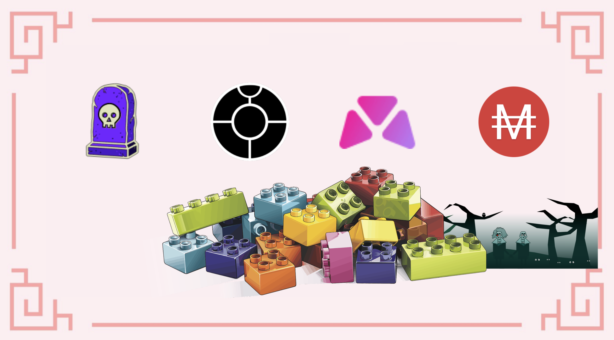
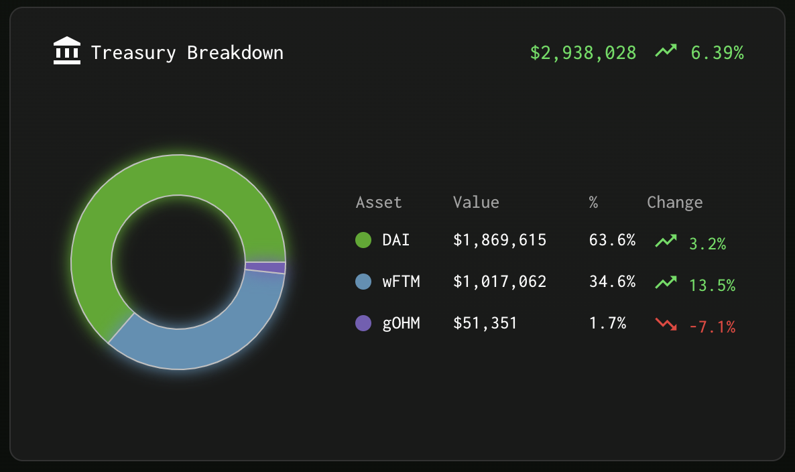

# Fantom上的Exodia Combo

## 介绍

投资加密货币时要记住的最重要的事情之一是确保你的初始值受到保护。如果你牢记这一基本原则，你可能只会将收益置于风险之中。但是，如果你想投资代表一些不确定性的代币，还有另一种选择：以折扣价购买它，并确保回报足够高以尽快支付你的初始投资。

几个月来，通过引入债券和一些项目提出的非常高的回报率，这成为可能。所以今天，我们在 Fantom 上探索两个项目，它们使用结合概念来实现 2 个截然不同的目标。

## Exodia

### 项目介绍

[Exodia](https://app.exodia.fi/dashboard) 是 Fantom 上的一个小项目，具有庞大的潜力。它是基于 EXOD 代币的Ohm fork，是由不同资产支持的储备货币。添加到 Exodia 宝库的初始支持资产是 DAI 和 FTM，但负责协议的团队和 DAO 决定与 Olympus 社区建立联系，并将其 33% 的超额准备金用于购买以 OHM 计价的资产。因此，宝库的一小部分以 gOHM 代币计价。

### 新的债券LP代币

为了加强联系，Exodia 最近投票决定增加其宝库中与 OHM 相关的代币数量，并将很快接受新代币作为其债券计划的一部分。新代币是可以在BeethovenX 上创建的LP（流动性提供）代币。 BeethovenX 代币的最大优点之一是即使你只拥有池中选择的单一资产，也可以创建它们，这使得它易于访问。 LP 代币组成由

* 20% wFTM
* 20% EXOD
* 20% wsEXOD
* 20% gOHM
* 20% MAI

这可能是第一个使用 Balancer fork LP 代币进行债券的 Ohm fork。这特别有趣，因为你现在可以仅使用你的 EXOD 代币购买新债券。所涉及的步骤是：

* 将你的 EXOD 代币存入 BeethovenX 上的 Monolith 池以获得 LP 代币
* 在 Exodia 应用程序上出售你的 LP 代币，以折扣价购买新的 EXOD
* 等待归属期并收集你的 EXOD 代币
* 重复

这大大降低了 EXOD 代币的抛售压力，这只会使协议受益。以前债券炒股者必须出售他们的 EXOD 以换取 DAI 以购买额外的债券，这对降低代币价格是部分不利的，并对宝库和跑道产生级联效应。


如果你不熟悉 Ohm 项目，我强烈建议你阅读有关该主题的更多内容。你可以参考我们的 Klima 指南（参见Polygon部分）或直接访问 [Exodia 的官方文档](https://docs.exodia.finance)。此外，你可以加入他们的不和谐并参加他们的教育计划。


你还会看到 LP 代币接受 MAI，这是你可以在 Mai Finance 上铸造的稳定币。这实际上将是我们 LP 的主要来源（见下文）。一旦你以相当好的折扣购买了债券，你将在归属期结束时获得你的 EXOD 代币。你还可以以 38,787% 的体面APY（年度百分比收益率）质押此代币，这相当于 601% 的 APR（年度百分比率）或 1.65% 的每日收益。

我们将使用债券系统以折扣价购买 EXOD 代币，并从非常高的 APY 中获利以从 rebase 奖励中获得收益。

## Tomb Finance

[Tomb Finance](https://tomb.finance) 是一个非常特殊的项目，在很多方面都是原创的。 TOMB 代币是一种与 FTM 代币挂钩的算法稳定币，旨在成为一种交换媒介，并为 Fantom 链的气体代币 FTM 增加额外的流动性。

Tomb Finance 生态系统提出了另外 2 个代币：

* TSHARE：这是 Tomb Finance 的治理代币。 TSHARE 的持有者拥有投票权。 TSHARE 质押者还将获得额外的 TOMB。向 TSHARE 持有者发行额外的 TOMB 代币遵循与 Ohm forks相同的机制，新代币在每个时期结束时以非常高的 APY 铸造。
* TBOND：这是一种特殊的代币，主要用于维持与 1 FTM 的挂钩。当 TOMB 价格低于 1 FTM 时，用户可以以 TOMB 代币的当前价格购买 TBOND。他们可以通过向协议出售 TOMB 代币来做到这一点，这些代币被烧毁，这将 TOMB 的价值增加到 1 FTM。以折扣价购买 TBOND 并能够兑换 TOMB 代币为 TBOND 代币命名。当 TOMB 代币高于你的挂钩时，人们可以将他们的 TBOND 兑换为 TOMB。新的 TOMB 被铸造出来，降低了代币的价值。也就是说，这是一个套利代币！

Tomb Finance 还提出了 2 个 LP 池，这些池将为你赚取 TSHARE 代币。这对于 Tomb Finance 具有非常重要的流动性深度尤为重要。然而，为了实现将 TOMB 作为 FTM 的替代解决方案的目标，协议让用户使用 TOMB 非常重要，因此拥有流动性。当你种植 TOMB-FTM 和 TSHARE-FTM 矿池时，你将获得 TSHARE 代币奖励，这将使你能够赚取更多的 TOMB 代币，这是单个应用程序中一个不错的小闭环。

## 关闭循环的附加部分

既然我们已经介绍了我们战略的两大块，让我们快速查看当天拼图的其他部分。

### Beefy Finance

[Beefy Finance](https://app.beefy.finance/#/fantom) 是一个收益优化器，它将接受来自特定 DEX（去中心化交易所）的 LP 代币、农场奖励代币，并让他们的算法出售奖励以获得额外的 LP。因此，你可以获得越来越多的投资头寸，这将仅复合来自 LP 的代币，并在收获代币时获取奖励代币的价值。

对于我们的策略，我们将使用 TOMB-FTM LP 代币。原因是多方面的：

* TOMB 与 FTM 代币挂钩，这对没有 IL（无常损失），因此唯一的变化将与 FTM 的价格变化有关
* TOMB-FTM 获得 TSHARE 奖励，因此出售 TSHARE 不会影响该货币对的 2 个代币
* TOMB-FTM 具有相当高的 APY，对于没有 IL 的 LP 代币来说
* 在 beefy 上使用 LP 代币将允许你获得 mooTombTOMB-FTM 收据代币


出于本指南的目的，我们使用 TOMB-FTM 代币，因为由于该货币对不存在无常损失，因此风险较小。但是，你完全可以使用 TSHARE-FTM 对来获得更高的奖励。确保你首先了解风险和 DYOR。


### 市场 XYZ 借贷市场

[Market.XYZ](https://fantom.market.xyz/pool/3) 是一种借贷协议，你可以在该协议上存入某些特定资产并借用它们。当你借出资产时，你可能会在你借出的资产中获得一些贷款激励。当您借款时，你必须在还款时为你所借的同一资产支付一些利息。

Market XYZ 于 2021 年开始与 Mai Finance 建立合作伙伴关系，以允许将其他类别的资产用作抵押品来借入 MAI 稳定币。这些资产被认为比目前在 Mai Finance 上直接接受的资产风险更大，或者只是在等待官方的 ChainLink Oracle 并且不直接在主应用程序上接受。这带来了额外的好处：QiDAO 协议从借入的 MAI 中赚取费用，借款人以低利率获得 MAI（Mai Finance 会根据 demaand 定期从宝库中添加更多的 MAI），这是稳定币的一个非常有趣的用例，推动其使用率上升。另一方面，借贷市场是与不同合作伙伴建立牢固关系的好方法，同时他们正在等待他们的资产直接在 Mai Finance 上被接受。

我们对此策略感兴趣的借贷市场是 TOMB Beefy 储物柜。在我们将 TOMB-FTM 代币存入 Beefy 后，我们会收到 mooTombTOMB-FTM 收据代币，它是代币的“所有权证明”，可在 Beefy 上获得复合奖励。此收据代币可用作 MarketXYZ 的抵押品以借入额外的 MAI。


Market.XYZ 只允许最低价值为 0.05 ETH 的贷款（在撰写本文时约为 170.00 美元）。如果你想从不同的储物柜借钱，请确保存入足够的抵押品。


在上面的截图中，你可以看到我们可以

* 存入 mooTombTOMB-FTM 代币作为抵押品并获得 355.4% APY，由 Beefy 提供
* 以 15.02% 的利率 (APR) 以我们的抵押品借入 MAI

很容易看出，我们从 LP 农业中获得的收益远远超过了借款利息，这使得这种策略可行。但是，请确保你正确监控 FTM 和 TOMB 的价格以防止清算，并确保你以非常高的 CDR（抵押债务比率）借款，这将使你有足够的时间在价格大幅下跌的情况下偿还贷款.


如果你对此策略不感兴趣，但你是 Mai Finance 的用户，那么 Market XYZ 是一款出色的应用程序，可以借出你的 MAI。你将获得额外的 MAI 报酬，该 MAI 将复合到你的头寸中。


## 农耕策略

为了完成我们的投资循环，我们将从使用 MAI 购买 EXOD 债券开始。 EXOD rebase 奖励将用于购买 TOMB-FTM LP 代币。这些代币将用于 Beefy 以复合 TSHARE 奖励。此外，LP 代币收据将用作 Market XYZ 的抵押品以借入更多 MAI，这使我们回到了最初的步骤。

我们将通过一些假设进行模拟：

* 所有奖励率和价格在一年内保持不变
* Exodia APY 是 38,787%
* 通过 beefy 的TOMB-FTM APY是 318.51%
* Market XYZ 的借款利息为 15.02% APR（利息不复利，因此我们在提及借款费用时使用 APR）

此外，我们将假设您每天都在收获你的债券和额外的 EXOD 代币，并持有 50% 以尽快从 rebase 中受益。为简单起见，债券将以平均 0% 的折扣购买，但你希望获得更好的折扣，我们假设我们可以每 5 天购买一次新债券。

### 第1天

我们需要首先弄清楚哪个入口点的风险较小。 TOMB-FTM LP 似乎完全符合这一点（请参阅 LP 对描述中详细说明的原因），因此我们将在此时使用价值 1,000 美元的 TOMB-FTM 代币开始循环。在 SpookySwap 上创建 LP 代币后，你可以将其存入 Beefy Finance 并立即开始借款。

对于此策略，我们将尝试坚持 300% 的 CDR。这意味着我们将能够以 15.02% 的利率从储物柜中借到价值 333 美元的 MAI。借来的 MAI 将用于 BeethovenX，以获得 wFTM-EXOD-gOHM-wsEXOD-MAI LP 代币。最后，我们将与 LP 购买 EXOD 债券。请注意，所有设置都可以在第 1 天完成。在第一天结束时（假设 3 次变基），我们将获得：

| 头寸           | 价值 ($)    |
| ------------ | --------- |
| TOMB-FTM     | 1,000.000 |
| MAI 借贷       | 333.333   |
| EXOD         | 66.667    |
| 额外的 TOMB-FTM | 3.930     |
| 额外的 EXOD     | 1.098     |

### 第2, 3, 4 和 5天

接下来的几天，因为我们在Day购买的债券仍在归属中，所以通过收获和复合EXOD奖励来做任何事情都没有用。所以我们可以让 TOMB-FTM LP 代币在不借更多钱的情况下涨价，专注于 EXOD 奖励。奖励的 50% 将复合成更多的 EXOD，另外 50% 将添加到 TOMB-FTM LP。在第 5 天结束时，当债券完全归属时，我们将拥有：

| 头寸           | 价值 ($)    |
| ------------ | --------- |
| TOMB-FTM     | 1,021.369 |
| MAI 借贷       | 333.333   |
| EXOD         | 338.869   |
| 额外的 TOMB-FTM | 4.014     |
| 额外的  EXOD    | 5.582     |


额外的 TOMB-FTM 和 EXOD 仅在第 5 天产生并在第 6 天开始时复合。


### 第6天

第 5 天复利的 TOMB-FTM 以及收获的 50% EXOD，在第 6 天开始时为你提供总计价值 1,028.173 美元的 TOMB-FTM。这意味着你可能的贷款为 342.724 美元，允许你借到额外价值 9.391 美元的 MAI 将用于在 Exodia 上购买新债券。此时，系统已准备就绪，可以通过简单的日常工作轻松管理你的投资。

### 日常

该例程分为两部分：你必须每天执行的真正日常例程，以及你必须每 5 天执行一次的例程。

&#x20;每天，你必须：

* 在 Exodia 上索取既定的 EXOD 代币
* 在 Exodia 上质押 50% 的 EXOD 代币
* 在 SpookySwap 上为 FTM 出售 25% 的 EXOD 代币
* 在 SpookySwap 上为 TOMB 出售 25% 的 EXOD 代币
* 在 SpookySwap 上创建 TOMB-FTM LP 代币
* 将 TOMB-FTM LP 代币存入 Beefy Finance
* 在 Market.xyz 上存入 mooTombTOMB-FTM 收据代币

每 5 天，你将不得不：

* 从 Market.xyz 借用额外的 MAI 以保持 300% 的 CDR
* 将借来的 MAI 存入 The Monolith 池中的 BeethovenX
* 在 Exodia 上用您的贝多芬 LP 代币兑换 EXOD 债券

### 月复一月的原始结果

这是一个月又一个月的原始结果

| 天   | TOMB-FTM   | EXOD       | MAI debt   |
| --- | ---------- | ---------- | ---------- |
| 30  | 1,222.088  | 488.438    | 407.363    |
| 60  | 1,531.135  | 735.586    | 510.378    |
| 90  | 1,956.250  | 1,093.089  | 652.083    |
| 120 | 2,546.404  | 1,609.179  | 848.801    |
| 150 | 3,371.740  | 2,353.088  | 1,123.913  |
| 180 | 4,532.773  | 3,424.178  | 1,510.924  |
| 210 | 6,173.591  | 4,965.049  | 2,057.864  |
| 240 | 8,500.790  | 7,180.350  | 2,833.597  |
| 270 | 11,810.653 | 10,363.762 | 3,936.884  |
| 300 | 16,528.139 | 14,936.728 | 5,509.380  |
| 330 | 23,262.834 | 21,504.023 | 7,754.278  |
| 360 | 32,889.239 | 30,933.491 | 10,963.080 |

### 第365天

经过一整年的耕作该系统，并假设一切都与第 1 天相同（价格、费率和其他一切......），你将拥有：

* Beefy 上价值 34,855.954 美元的 TOMB-FTM LP 代币
* 价值 32,863.908 美元的 EXOD 代币
* Market.xyz 上价值 11,618.651 美元的 MAI 债务，还有一些额外的利息需要偿还（对应的总债务为 13,363.772 美元）

非常重要的是要注意，在行使期间你的抵押品与债务比率在任何时候都保持接近或高于 300%，因此你完全有可能出售你的 TOMB-FTM 或 EXOD 的一部分来偿还它并降低利率。还可以调整你每天出售的 EXOD 部分，以简单地偿还你的初始贷款并通过出售 TOMB-FTM 购买新的 EXOD 债券。变化无穷无尽，因此请随意根据你最喜欢的内容进行调整。

最后，从 1,000 美元的初始投资开始，您最终将获得 67,719.862 美元和 13,363.772 美元的债务，这对应于 5,335.56% 的整体 APY。

## 免责声明

这是一份实验性指南，重点介绍如何通过在投资循环中添加Ohm forks来增加收益。模拟是在 Exodia 对质押的 EXOD 代币的 APY 非常高的时候进行的。 TOMB-FTM 也是如此。这些非常高的比率通常变化很大，因此你可能期望在一整年的跨度内获得更少的收益。事实上，大多数Ohm forks的设计并不能维持如此高的收益率超过几个月，并且通常会大幅减少其排放以继续发行代币。

随时了解你正在使用的项目，毫不犹豫地提出问题，并一如既往地进行自己的研究。


本指南绝对不是财务建议，它是出于教育目标而制定的。你需要注意价格变化，供需，奖励计划结束日期，无常损失等......目标不是提出可以盲目遵循的食谱，所以请做好功课和自己的模拟，只有投资你准备好可能失去的东西。

