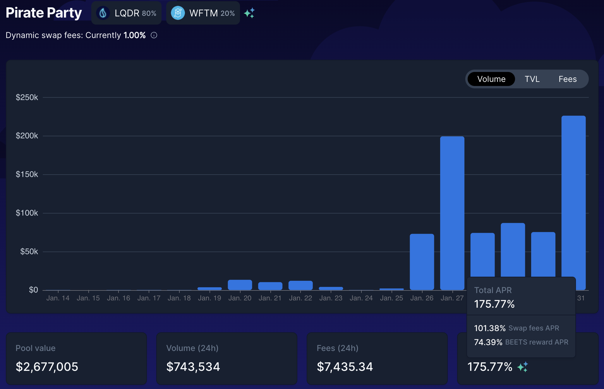

# Spooky Symfony

## 介绍

以你的资产为抵押贷款始终是一把双刃剑：它可以帮助你启动投资策略或杠杆你的资产，但你将在某个时候需要偿还债务。在本指南中，我们将使用 Market.XYZ 上的贷款，这是一种贷款协议，你可以在该协议上以较低的借款利率借入 MAI，并使用该贷款来种植 Fantom 上大多数经你实战考验的协议。我们将使用该策略来偿还贷款，并看看这可以多快完成以解锁作为抵押品存放的资产。


本指南绝对不是财务建议，它是出于教育目标而制定的。你需要注意价格变化，供需，奖励计划，结束日期，无常损失等......目标不是提出可以盲目遵循的食谱，所以请做好功课和自己的模拟，并且只投资你准备好可能失去的东西。


## Fantom Protocols: 必须全部使用它们

在这个策略中，我们将在许多不同的协议上使用许多不同的 LP（流动性提供）对，因此我们认为最好简要回顾一下每个协议的作用。

### Market.XYZ

[Market.XYZ](https://fantom.market.xyz/) 是一种借贷协议，可以为其合作伙伴构建多个储物柜。你将能够存入单一资产或 LP 代币作为抵押品，并以你的存款借入其他资产。因为你是以抵押品为抵押借款，所以确保你不会被清算很重要。当你作为抵押品存入的资产价值低于你签订的贷款价值时，就会发生清算。这就是为什么重要的是要确保这两个价值之间的比率保持相对较高，并且当市场下跌时，你的抵押品不会损失太多价值。

为了降低清算风险，我们将使用 FTM-USDC LP 代币作为抵押品

* 这对的无常损失相对较低
* USDC 是与美元挂钩的稳定币
* FTM 是 Fantom 的原生 gas 代币，具有深度流动性，无处不在
* FTM-USDC 对的奖励率很高，这意味着即使 FTM 的价格保持不变，你的抵押品价值也会上涨

你将能够从 market.xyz 上的 [Spooky LP 池](https://fantom.market.xyz/pool/10)中借用 FTM-USDC 对。存入抵押品的步骤如下：

* 通过为两种资产提供 1:1 的流动性，在 [SpookySwap 上创建 FTM-USDC LP 代币](https://spookyswap.finance/add/FTM/0x04068DA6C83AFCFA0e13ba15A6696662335D5B75)
* 在 Beefy Finance 上存入 FTM-USDC LP 代币以获得 mooBooFTM-USDC 收据（在搜索过滤器中搜索 SpookySwap 平台和 USDC 资产）
* 将 mooBooFTM-USDC 收据代币存入 Market.xyz

当你的强大 LP 收据代币在 Market.XYZ 上时，你仍然可以获得 Beefy 提供的奖励 APY。这意味着当你借入资产时，你的资产仍在为你产生收益。这是一个非常强大的工具，特别是当你看到 mSPLP-FTM-USDC (moo Spookyswap FTM-USDC = mooBooFTM-USDC) 的年利率为 51.4% 并且你可以以 2.56% 的年利率借入 MAI 时。换句话说，你的抵押品比你的债务增长得更快，所以理论上你可以用抵押品的利息很好地偿还贷款。


作为旁注，你可以看到 Spooky LP Pool 储物柜还提供了借用其他 LP 代币的可能性：ETH-FMT、DAI-FTM、BTC-FTM 和 fUSDT-FTM。根据你钱包里的资产、你的信念和你的风险承受能力，你完全可以使用任何 Spookyswap LP 作为抵押品。


在本教程中，我们还将通过以 200% 的 CDR（抵押债务比率）借款来限制风险。这意味着我们将借入抵押品价值的 50%。更多在农业战略部分。清算比率表示为与 CDR 相反的 LTV（贷款价值比）。你可以看到 mooBooFTM-USDC 代币的 LTV 为 60%，超过该值你将被清算。这相当于 166.67% 的 CDR。以 200% CDR 为目标，我们比清算比率高出 33%，这可能有风险，也可能没有风险，具体取决于你的风险承受能力。


Market.XYZ 只允许最低价值为 0.05 ETH 的贷款（在撰写本文时约为 170.00 美元）。如果你想从不同的储物柜借钱，请确保存入足够的抵押品。


### BeethovenX

[BeethovenX](https://beets.fi/#/) 是从 Balancer 分叉的去中心化交易所和自动化做市商。你将能够将你的资产存入流动资金池，以及在其应用程序上交换不同的资产。他们一直是 QiDAO 协议的可靠合作伙伴，为你可以在 Mai Finance 上找到的农场提供 LP 代币。我们将在 BeethovenX 上使用两个不同的池来执行此策略

* Monolith：一个已为 Exodia 开放的创新池，我们[在本教程中](investing-in-discounted-assets-using-bonds.md)介绍了一个 Ohm 分叉。你将能够将你的 MAI 代币直接存入该池并收集收益
* Pirate Party: 专用于 LQDR 代币的激励池，来自 Liquid Driver 的原生代币，我们将在本指南中使用的另一个大型协议

与往常一样，使用BeethovenX（或Balancer）的最大优势是你可以将单一资产存入池中，而不必以平衡的比例提供代币。

### SpookySwap

[Spookyswap](https://spookyswap.finance/) 是 Fantom 上最大的 Uniswap V2 分叉，你可以在该平台上交换资产并为许多货币对提供流动性。 Spookyswap 也一直是 Mai Finance 的可靠合作伙伴，并提出了 MAI-USDC 池。通过 Market.XYZ 扩展合作伙伴关系，你可以在其中借用某些特定 LP 对（请参阅有关 Market.xyz 的部分）以及你的 BOO 和质押的 BOO 代币，即 Spookswap 的原生代币。

对于本指南，我们将使用来自 SpookySwap 的两种不同的 LP 代币：

* FTM-USDC 将作为我们策略的起点。此 LP 代币在 market.xyz 上用作抵押品
* FTM-BOO，因为它是来自 SpookySwap 的池之一，被 Liquid Driver 接受，具有最高的 APR。我们将把 Monolith 的 BEETS 奖励换成这对（更多在耕作策略部分）

### Liquid Driver

[Liquid Driver](https://www.liquiddriver.finance/) 是一个收益优化器，你可以在上面存入来自不同农场的 LP 代币并从中赚取收益。收益优化器的工作方式是收集目标平台的奖励代币并为你合成它们。这很有用，因为 Fantom 上的气体可能很昂贵。扣除了性能费，但协议的一部分收入被重新分配给 LQDR 质押者。 LQDR 是 Liquid Driver 的原生代币。

对于此策略，我们将使用 FTM-BOO LP 对，因为它是 Spookyswap 的 LQDR 中 APR 最高的池之一。

## 农耕策略

对于这个策略，我们将使用 Market.XYZ 作为我们借入 MAI 的起点来使用 mooBooFTM-USDC LP 代币。借来的 MAI 将存放在 Monolith 池中的 BeethovenX 上。因为这是我们策略中回报率最高的矿池，所以我们将使用它作为我们的引擎来偿还我们的债务：50% 的 BEETS 将被出售以偿还 Market.xyz 上的债务，50% 将转换为FTM-BOO LP 代币。 FTM-BOO 代币将存入 LiquidDriver 以收集 LQDR 代币，然后将这些代币质押在 BeethovenX 的 Pirate Party 池中。一旦债务完全偿还，BEETS 奖励将全部转换为 FTM-BOO 代币。 Pirate Party 矿池提供的 BEETS 奖励也将复合成更多的 FTM-BOO。

对于此模拟，我们将使用以下数字

* 我们从价值 1,000 美元的 mooBooFTM-USDC 代币开始
* SpookySwap 通过 Beefy 提供的 mooBooFTM-USDC 代币的 APR 为 41.5%
* MAI 的借款利率为 2.56%
* BeethovenX 为 The Monolith 提供 304.17% 的 APR，为 Pirate Party 提供 175.77%
* LiquidDriver 在 FTM-BOO LP 对上提供 82% 的 APR

与我们的模拟一样，我们假设所有价格在整个 1 年期间保持不变，利率保持不变，并且我们也按原样使用提供的 APR。实际上，价格和费率会有所不同，APR 由交易费用和奖励代币组成，这可能会影响最终结果。同样重要的是要注意，此模拟不考虑交易费用。最后，我们使用了很多协议，每个协议都可能存在智能合约风险。确保在使用平台之前进行自己的研究，并且只投资你愿意放弃的东西。

你可以[在此电子表格中](https://docs.google.com/spreadsheets/d/19s6kBnT5w0b9GKuTkDiiD1u\_ZoeNUZtI9XYxEmk\_WM0/edit?usp=sharing)找到我们的 Spooky Symfony 模拟。随意复制并使用它，看看循环是如何工作的，以及不同的费率如何影响你的最终 APY。

### 第1天

在第 1 天，你需要为 Market.xyz 创建你的抵押品。获得等量的 FTM 和 USDC，并在 SpookySwap 上提供流动性以创建 FTM-USDC LP 代币。这些代币将存入 Beefy，这将为你提供 mooBooFTM-USDC 收据代币。这是将用作 Market.xyz 上的抵押品的代币，你将借用 MAI。由于我们希望保持 200% 的 CDR，我们将借入价值 500 美元的 MAI。最后，MAI 代币将在 BeethovenX 上质押到 Monolith 池中。

在第一天结束时，你将拥有

| 头寸             | 价值 ($)    |
| -------------- | --------- |
| mooBooFTM-USDC | 1,000.000 |
| the monolith   | 500.000   |
| pirate party   | 0.000     |
| BEETS 奖励       | 4.167     |
| FTM-BOO        | 0.000     |
| LQDR 奖励        | 0.000     |
| MAI 借贷         | 500.000   |

### 第2天

第 2 天，你必须

* 将 50% 的 BEETS 出售给 MAI，以偿还一小部分贷款
* 将你的 BEETS 奖励换成 FTM-BOO LP 对。你可以在 BeethovenX 上交换并在 SpookySwap 上创建 LP 对，或者在 SpookySwap 上做所有事情。
* 在 Liquid Driver 上质押 FTM-BOO LP 以开始收集 LQDR 代币。

第二天结束时，你将拥有

| 头寸             | 价值 ($)    |
| -------------- | --------- |
| mooBooFTM-USDC | 1,001.137 |
| the monolith   | 500.000   |
| pirate party   | 0.000     |
| BEETS 奖励       | 4.167     |
| FTM-BOO        | 2.083     |
| LQDR 奖励        | 0.005     |
| MAI 借贷         | 497.952   |

### 第3天

从第 2 天开始重复该操作，然后收获你的第一个 LQDR 代币。这些将被存入海盗派对池中的 BeethovenX 以获得额外的 BEETS 奖励，在第 3 天结束时，你将获得

| 头寸             | 价值 ($)    |
| -------------- | --------- |
| mooBooFTM-USDC | 1,002.275 |
| the monolith   | 500.000   |
| pirate party   | 0.005     |
| BEETS 奖励       | 4.167     |
| FTM-BOO        | 4.167     |
| LQDR 奖励        | 0.000     |
| MAI 借贷         | 495.903   |


Pirate Party 的收益太小了，在这一点上并不显着，但随着时间的推移，你会得到一些。


### 每日例行工作

此时系统已完全准备就绪。你的日常生活将包括

* 从 The Monolith 收获 BEETS 奖励
* 从Pirate Party中收获 BEETS 奖励
* 如果你仍有未偿债务，则将 50% 的 BEETS 换成 MAI
* 如果你还有一些债务，请偿还部分债务
* 将剩余的 BEETS 换成 FTM-BOO LP 代币
* 将 FTM-BOO 存入 LiquidDriver
* 收获 LQDR
* 存款到Pirate Party

这种策略不是很省油，所以你可以考虑每周只增加一次收益，甚至更少。

### 月复一月的原始结果

以下是月复一月的原始结果，你可以在上面链接的 Google 电子表格中获得它们。

| 天   | FTM-USDC  | The Monolith | Pirate Party | FTM-BOO   | MAI debt |
| --- | --------- | ------------ | ------------ | --------- | -------- |
| 30  | 1,033.503 | 500.000      | 1.901        | 60.500    | 440.541  |
| 60  | 1,069.343 | 500.000      | 8.031        | 123.652   | 378.905  |
| 90  | 1,106.425 | 500.000      | 18.452       | 187.988   | 317.139  |
| 120 | 1,144.794 | 500.000      | 33.265       | 254.136   | 255.242  |
| 150 | 1,184.493 | 500.000      | 52.612       | 322.738   | 193.216  |
| 180 | 1,225.569 | 500.000      | 76.681       | 394.462   | 131.058  |
| 210 | 1,268.069 | 500.000      | 105.704      | 470.006   | 68.770   |
| 240 | 1,312.043 | 500.000      | 139.963      | 550.105   | 6.351    |
| 270 | 1,357.542 | 500.000      | 181.427      | 691.752   | 0.000    |
| 300 | 1,404.619 | 500.000      | 233.046      | 846.443   | 0.000    |
| 330 | 1,453.328 | 500.000      | 295.350      | 1,009.331 | 0.000    |
| 360 | 1,503.726 | 500.000      | 368.942      | 1,182.000 | 0.000    |

### 第365天

在这一系统耕种一整年结束时，你将拥有

* Market.xyz 上价值 1,512.294 美元的 FTM-USDC 代币
* Monolith 池中价值 500.000 美元的 MAI
* 价值 382.353 美元的 LQDR 存储在 Pirate Party 池中
* Market.xyz 上价值 1.211.845 美元的 FTM-BOO 代币
* 第 243 天后全额偿还的最终债务

这相当于 260.65% 的总 APY。

### 偿债对整体业绩的影响

在我们的大多数指南中，作为战略的一部分，我们不偿还任何债务。在大多数情况下，这是因为我们使用的是 Mai Finance 的 0% 利息贷款。在这里，我们在 Market.XYZ 上以 2.56% 的借款利率借款，我们用从 The Monolith 收获的 BEETS 的 50% 偿还债务。

如果你将 50% 以上用于偿还债务，你将支付更少的利息，但你在 Liquid Driver 上的头寸增长速度会慢得多。如果你分配不到 50% 用于偿还债务，你将从其他平台获得更多奖励，但你也会在 Market.xyz 上支付更多利息。

这是一个小表格，显示了分配的 BEETS 对你的债务偿还对你的整体 APY 的影响：

| BEETS % | Overall APY | 债务偿还后    |
| ------- | ----------- | -------- |
| 100     | 242.85      | 122 days |
| 90      | 245.06      | 135 days |
| 80      | 247.75      | 152 days |
| 70      | 251.05      | 174 days |
| 60      | 255.23      | 203 days |
| 50      | 260.65      | 244 days |
| 40      | 267.92      | 305 days |
| 33.5    | 274.09      | 364 days |

如果你使用不到 33.5% 的 BEETS 奖励来偿还债务，那么你在整整一年后仍有一些 MAI 需要偿还。

也很高兴了解，如果你还款更快，你的 CDR 也会以更显着的方式增加，这使你可以更快地摆脱清算比率。

## 需要考虑的变化

该策略提供了许多具有不同好处的变体。

### Mai Finance VS Market.xyz

你完全可以从 [Mai Finance](https://app.mai.finance/) 以 0% 的利率借用 MAI。例如，如果你使用 mooScreamFTM 而不是 mooBooFTM-USDC 作为抵押品，这将具有以下优势：

* 你的抵押品没有任何无常损失
* 你以 0% 的利率借款，只需 0.5% 的还款费，在大多数情况下，这将远低于你在 Market.xyz 上支付的利息（如果有 MAI 可借入此vault）
* 你可以通过在平台上借款获得 Qi 奖励，这将让你参与协议的治理，并通过质押你的 Qi 代币获得分红。这将增加你的年收益
* 你可以免受 Market.xyz 上非常波动的借款利率的影响。 Mai Finance 会定期借出新的 MAI，以保持借贷利率尽可能低，但不保证不会上涨。你可以在[此处](https://metrics.market.xyz/d/HChNahwGk/fuse-pool-details?orgId=1\&refresh=10s\&var-poolID=10\&var-chain=250)查看借贷市场的指标。

但是，与 mooBooFTM-USDC 代币相比，mooScreamFTM 代币的 APY 低得多，因此你可能会错过这一点。

### 质押你的 LQDR

如果你质押你的 LQDR 而不是在 Pirate Party 池中使用它，你将从 Liquid Driver 获得一些红利，这些红利以不同的资产（LQDR、WFTM、LINSPIRIT、BOO、SPELL 和 BEETS）支付。你还将获得 xLQDR，它将让你参与 Liquid Driver 的治理，并可能让 LINSPIRIT 对 Spirit Swap 的奖励分配进行投票。请仔细查看 [xLQDR](https://www.liquiddriver.finance/xlqdr) 页面以获取更多详细信息。

### 质押你的 BEETS

如果 The Monolith 的 BEETS 在此策略中发挥了重要作用，那么你完全可以使用 Pirate Party 的 BEETS，如下所示：

* 将 BEETS 存入 Fidelio Duetto 池 (BEETS-FTM)
* 在BeethovenX上质押LP代币以获得fBEETS
* 质押你的 fBEETS 以获得协议红利

这也将让你对 BeethovenX 协议的改进以及平台上不同矿池的奖励分配进行投票。这对于在 The Monolith 上保持较高的 APR 特别有用。

### 在 Spookyswap 上使用 FTM-BEETS 池

在我们的策略中，我们将出售来自 The Monolith 的所有 BEETS 奖励。但是，你也可以将 Spookyswap 的 FTM-BEETS 池集成到你的循环中。你必须将 50% 的 BEETS 出售给 FTM，并将这两个代币组合成一个新的 LP 对，从而为你赚取 BOO。然后，你可以决定创建 FTM-BOO 并在 Liquid Driver 上存款，或者你可以将你的 BOO 质押在 SpookySwap 上。请注意，如果你质押你的 BOO，你将有可能存入 xBOO 收据代币并直接赚取 LQDR 代币，你甚至可以在 Market.xyz 上使用 xBOO 代币作为抵押品。这种额外的乐高积木开启了许多可能性。


请密切注意这对特定的一对，以防它在 Liquid Driver 上可用。这可能是比 FMT-BOO 更好的选择。


### 在 Liquid Driver 上使用你的 FTM-USDC

在你的贷款全部还清后，你可以将 mooBooFTM-USDC 代币保留在 Market.xyz 或 Beefy 上，它们将继续累积奖励。但是，你也可以从 Beefy 中移除 LP 对并将其存入 Liquid Driver 以获得更多 LQDR。

附带说明一下，当你偿还贷款时，你的抵押品与债务比率的价值会增长（抵押品会增加回报并增加价值，而每次部分还款后债务会减少）。这意味着你可以逐个提取抵押品以保持安全的 CDR，并将其存入 Liquid Driver 以获得更多 LQDR 代币。

### 保持一点利润泄漏

该系统是一个自给自足的闭环。但是，在你完成 Market.xyz 上的贷款后，你可以继续出售部分 BEETS 以获得其他资产。例如，你可以将你的 BEETS 奖励转换为 USDC 或其他稳定币，或者增加您的一个头寸，该头寸获得的奖励比 FTM-USDC 对授予的奖励更多。

## 免责声明

本指南主要旨在展示你可以使用农耕产量偿还债务的方式。你偿还债务的速度将极大地影响全球回报率，但也会带来一些非常积极的方面，主要是降低清算风险。

当然，你可以很容易地用这个策略偷工减料，改变一些循环的部分，用你喜欢的东西替换协议等等......但是，请确保阅读所有可用于你想要的协议的文档使用，并确保你了解所有不同的风险。


本指南绝对不是财务建议，它是出于教育目标而制定的。你需要注意价格变化，供需，奖励计划，结束日期，无常损失等......目标不是提出可以盲目遵循的食谱，所以请做好功课和自己的模拟，并且只投资你准备好可能失去的东西。

