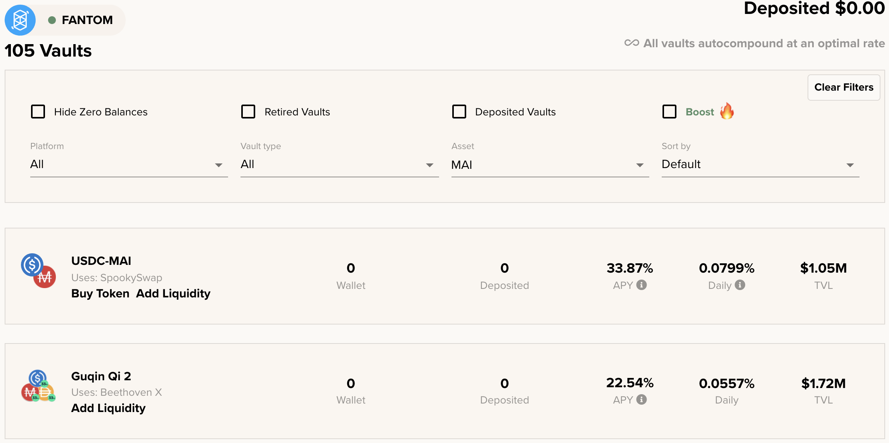

# Fantom 上的 MAI 怎么办

### 本教程的目标

本教程的目的不是详细介绍你可以使用 MAI 稳定币做什么，而是列出你可以在 Fantom 上使用的所有网站和 DeFi 应用程序，让你可以直接或组合使用你的 MAI与其他稳定币。有关使用 MAI 的具体方法的更多详细信息，你可以参考本网站上的其他教程，或在 Discord 或 Telegram 上获取帮助。

请注意，该列表不完整，并且永远不会完整，因为网络上每周都会推出新的 dapp。我无法全部回顾，所以我只会介绍主要选项，或者最著名/最“安全”的选项。

如果你希望列出特定项目，请加入 [Discord](https://discord.gg/mQq55j65xJ) 上的 Qi 社区。

## 在Bluechip项目上安全耕作

Bluechip 项目是被证明是可靠且风险较低的 DeFi 应用程序。他们通常会接受审计，他们背后的团队已经为他们工作了很长时间。他们通常没有巨大的 APR（年利率），但他们可以信任。

### BeethovenX

[BeethovenX](https://app.beets.fi/#/) 是 Balancer 的一个fork，该项目尚未在 Fantom 上启动，但已在其他网络上建立起来。与 Balancer 一样，BeethovenX 是一个自动化的投资组合管理器、流动性提供者和价格传感器。在平台上，你将能够借出你的加密货币并从交易中收取费用。如果你需要有关项目的更多信息，请访问[他们的官方文档](https://docs.beethovenx.io)。

BeethovenX 团队不仅分叉了 Balancer 项目，还构建了惊人的附加功能（投资组合管理、原生代币 BEETS 跟踪、可以随时领取的奖励）。所有这一切都有一个奇妙的宇宙和故事，帮助他们创建了一个奇妙的社区。

在 Fantom 上，你将能够将你的 MAI 添加到由 MAI（池的 65%）、DAI（池的 17.5%）和 USDC（池的 17.5%）组成的 Guqin Qi V2 池中，以及APR（年收入百分比）在 20% 和 30% 之间波动，以 BEETS 和掉期费支付。

至于 Balancer，BeethovenX 最好的地方可能是你不需要提供池的确切比例。在 3 种资产之间保持正确平衡的算法将收取你的任何存款，并将出售/购买代币以确保保持平衡。这样，你可以简单地存入 MAI，然后让矿池完成剩下的工作。

如果你想使用交换功能将你的 MAI 换成另一种货币，BeethovenX 也是最好的应用程序。

### SpookySwap

[SpookySwap](https://spookyswap.finance) 可能是 Fantom 上最好的 DEX 之一，你可以在其中交换你的 ERC20 代币，提供流动性和农场收益，创建 LP（流动性提供者）代币，质押其原生 BOO 代币，你甚至可以桥接 Fantom 的一些资产到其他链（反之亦然）。它是 Uniswap v2 的一个fork，团队在此基础上构建了额外的惊人功能。

SpookySwap 最近推出了一个 MAI-USDC 对，人们现在可以种植并赚取 BOO 代币，平均年利率在 25% 到 30% 之间。

你将能够质押你的 BOO 代币以获得额外的约 20% 的年利率，这是使用你的奖励代币的好方法。附带说明一下，通过质押 BOO 代币，你将收到 sBOO 存款证明，稍后可能会被接受为 Mai Finance 的有效抵押品。这实际上会创建一个不错的小循环，人们可以在其中存入 MAI-USDC，赚取和质押 BOO，将 sBOO 存入 Mai Finance 并借入 MAI 以添加到 MAI-USDC 池中。

### Mai Finance

[Mai Finance](https://app.mai.finance/farm) 是一个借贷平台，也是大家都喜欢的主要的项目。为了支持 MAI 的挂钩，并在 Fantom 网络上有更多的 MAI 用例，Mai Finance 平台增加了额外的矿池。因此，你将能够存入之前在 BeethovenX 上创建的 MAI-USDC LP 代币（在那里搜索 MAI Concerto 池）并获得 Qi 代币的奖励。

你将通过直接在 Mai Finance 上耕作获得的 Qi 代币可用于 Mai Finance 上的 Qi-FTM 池（你也可以创建 LP en BeethovenX），你将能够在其中赚取更多 Qi 。你还可以使用 [AnySwap 的路由器](https://anyswap.exchange/#/router)将在 Fantom 上收获的 Qi 发送到 Polygon。然后你可以在 Mai Finance 上质押 Qi，参与治理并从协议中收取分红。

## Degen 农场和聚合器

### Beefy Finance

[Beefy Finance](https://app.beefy.finance/#/fantom) 是所有主要平台上的聚合器，包括 Fantom。你将能够在 Beefy 上存入一些 LP 代币，算法将负责收获你的奖励、出售它们并将它们聚合到你存入的更多 LP 代币中。

你可以使用一些特定的 Beefy 代币作为 Mai Finance 的抵押品，请查看[本站的相应文章](leverage-your-crypto-on-fantom.md#Leverage-your-mooScreamTokens-on-Mai-Finance)。当谈到在 beethovenX 或 SpookySwap 上使用 MAI 时，你将能够存入你在 BeethovenX 或 SpookySwap 上创建的 LP 代币：

Beefy 将出售你的 BEETS 和 BOO 奖励，以增加你的 MAI-DAI-USDC 或 MAI-USDC 头寸。请注意，当 BeethovenX 和 SpookySwap 使用 APR 时，Beefy 会显示 APY（年度百分比收益率）。当你想为奖励选择一个给定的平台 VS 使用简单时，这是至关重要的点。

### Beluga

Beluga 是 Fantom 上另一个针对特定平台的聚合器，在我们的例子中，我们可以将 Beluga 用于 BeethovenX 池。 BEETS 不会出售由 BeethovenX 授予的 BEETS 代币以增加 MAI-DAI-USDC 头寸，而是将 BEETS 存入 BEETS-FTM 池中，截至 2021 年 11 月，该池将获得 350% 的年利率。 BEETS 将定期收获并在BEETS-FTM 池，你将能够收获这个 LP 代币并直接在 BeethovenX 上移除流动性。附带说明一下，由于 Beluga 使用的 BEETS-FTM 池具有非常高的 APR，因此 MAI-DAI-USDC 的最终 APY 也非常高。


请注意，Beluga 不会帮助你增加稳定的位置。最终的 APY 高度依赖于 BEETS 的价格和 BEETS-FTM 池的 APR。奖励值不会被捕获并保存在你的稳定 LP 中，因此你必须手动分解BEETS-FTM LP 并出售任何你想要的东西。


### Degen 农场

许多 degen 农场正在使用在 SpookySwap 和 SpiritSwap 上创建的 LP 代币。 SpookySwap 仅在 2021 年 11 月中旬添加了 MAI-USDC，SpiritSwap 将 MAI 列入白名单，但没有任何 MAI 池。这意味着大多数 degen 农场没有 MAI LP，但你可能很快就会在这些网站上看到 MAI-USDC 对。

要了解每天/每周推出的新农场，请关注 [RugDoc.io 上定期更新的列表](https://rugdoc.io/chain/fantom/)。此外，请确保你在使用 degen 农场时进行自己的研究，本指南不能被视为财务建议，并且除了 Mai Finance 之外，不会推广任何特定的农场或应用程序。

### Tarot

Tarot 是一个非常具体的应用程序，是 Impermax Finance 的一个分支。它允许用户

* 借出单一资产并获得他们借出的资产所支付的回报
* 借入 2 种资产以形成 LP 代币并在特定平台上耕种，并可选择杠杆其头寸来扩大其回报

Tarot 接受来自 SpookySwap、SpiritSwap 和 SushiSwap 的某些配对。但是，由于这些平台才刚刚开始接受 MAI 并提出与 MAI 的 LP 配对，因此 Tarot 目前不提出这些配对。我们可以很容易地想象，在不久的将来，你将能够在塔罗牌上借出你的 MAI，或使用 MAI LP 对在杠杆头寸上耕作收益。有关该平台如何工作的更多详细信息，请阅读 Polygon 指南中有关 [Impermax 的专用部分](../polygon/what-to-do-with-mai-on-polygon.md#Impermax)。

## 免责声明

一切都是本教程纯粹是教育性的。目标是为我认为值得在 Fantom 上的加密世界中发展的人们带来光明的项目。 Mai Finance 还提出了一个 MAI-USDC 池（在 BeethovenX 上创建你的 LP 代币），它将用 Qi 代币奖励你。最后，本指南绝对不能按原样应用，它不是任何财务建议，你不应该盲目地遵循我写的内容。在考虑投资他们的平台之前，请阅读我提到的不同项目的文档。


请记住，在给定时间运作良好的策略可能在其他时间表现不佳（或让你赔钱）。请随时了解情况，监控市场，密切关注你的投资，并一如既往地进行自己的研究。

