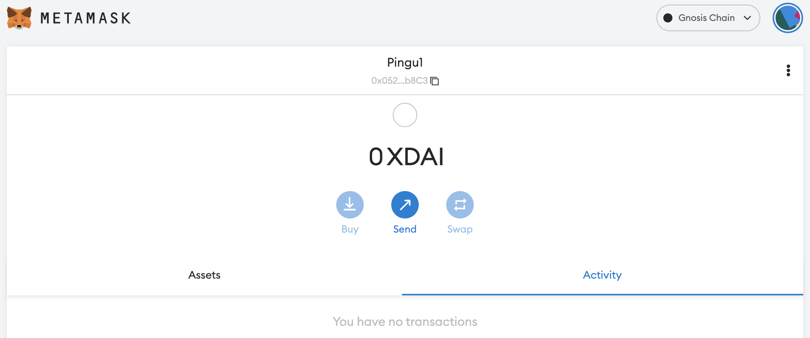
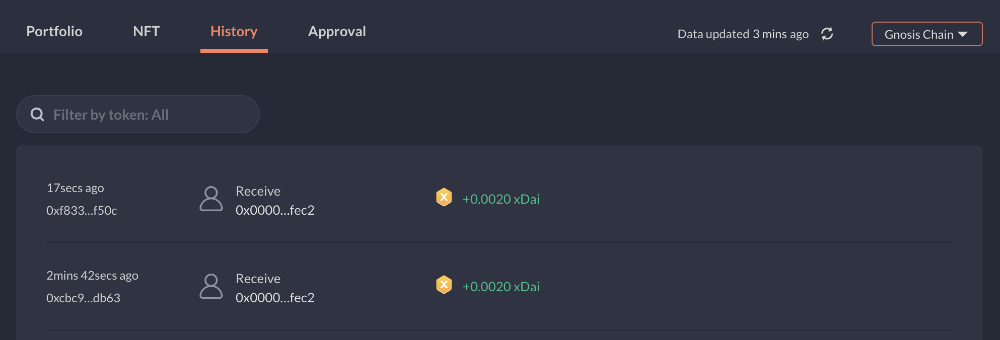
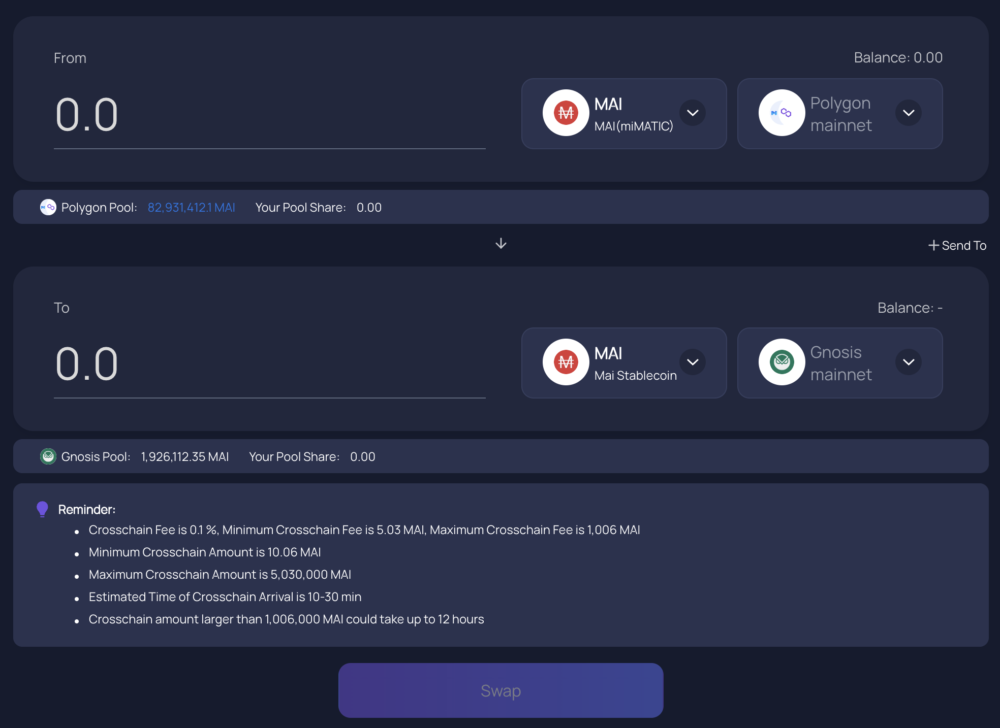
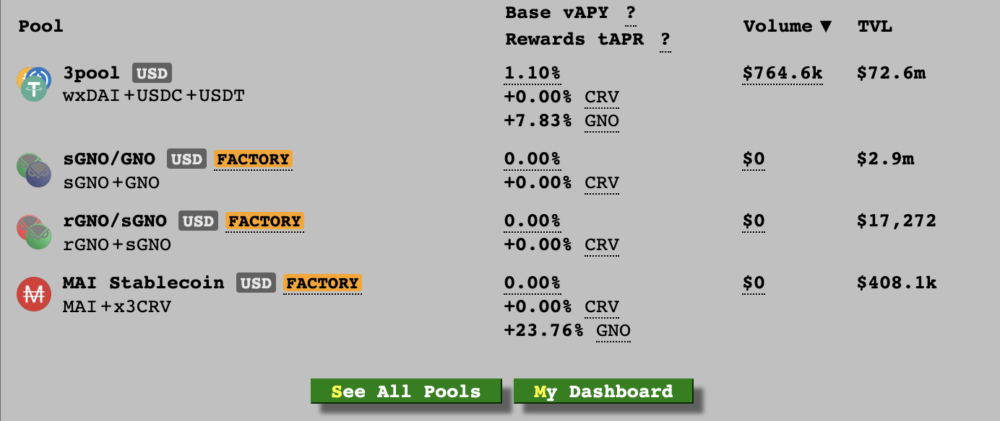
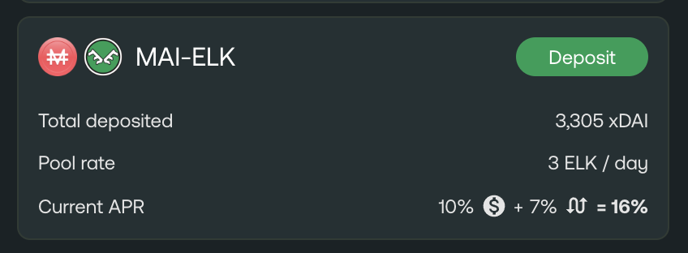
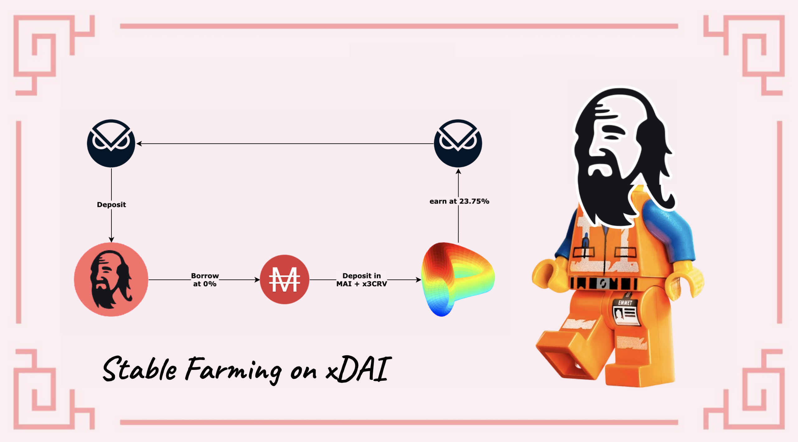

# 如何开始使用 Gnosis Chain

## 什么是 Gnosis Chain?

Gnosis Chain 是与 EVM 兼容的区块链，这意味着它与部署在以太坊网络上的代码兼容（EVM = 以太坊虚拟机）。由于大多数链都试图实现安全性/可扩展性/去中心化三重奏，Gnosis Chain 专注于速度（5s 交易最终性）和低成本的交易。它使用 xDAI（gnosis chain包裹的 DAI）作为常规交易的主要 gas 代币，但也使用 GNO 代币进行治理和质押。 Gnosis Chain最初是为建立在以太坊上的预测市场而设计的。预测市场就像交易事件结果的交易所。随着事件的发展，gnosis 代币的价值取决于预测的内容。

为了支持 Gnosis Chain的目标，增加了一个应用层，在上面你可以找到专门的去中心化应用，例如

* RealT: 代币化房地产应用程序
* Kleros: 旨在使用区块链技术解决冲突的司法即服务平台

你可以在 [DeFi Llama](https://defillama.com/chain/Gnosis) 上查看有关 Gnosis Chain 的其他详细信息，例如 TVL 和其他应用程序。

## 开始使用Gnosis Chain

在使用 Gnosis Chain之前，你需要一个钱包地址。因为 Gnosis 是一个 EVM 网络，它将接受与其他 EVM 链上相同的钱包，包括 Metamask 或 Nifty 等 Web 钱包，你将能够使用 Trezor 或 Ledger 等硬件钱包，但你可能需要额外关注能够将你的冷钱包连接到网络的步骤。

对于本教程，我们将像本网站上的所有其他指南一样坚持使用 Metamask。如果你没有安装 Metamask，你可以找到有关[如何开始使用 Polygon](../polygon/how-to-get-started-on-polygon.md) 的说明。

### 将 Gnosis Chain添加到 Metamask

理论上，Gnosis 预装了 MetaMask，这意味着你不必添加链信息以使 Metamask 工作。但是，最好通过仔细检查保存在本地钱包中的值来验证你的设置是否正确。打开 Metamask 弹出窗口，单击钱包图标，导航到设置，然后选择网络并找到 Gnosis Chain。你应该得到的数据如下：

* **网络名称:** Gnosis Chain
* **新 RPC URL:** https://rpc.gnosischain.com/
* **Chain ID:** 100
* **货币符号:** xDAI
* **阻止资源管理器 URL:** https://blockscout.com/xdai/mainnet

保存更改，Metamask 会自动将你切换到 Gnosis Chain：

## 桥接到 Gnosis Chain

### 水龙头

你可以使用Google在 Gnosis Chain 上找到一些水龙头，在那里你可以请求你的前几个 xDAI 开始交易。我不特别推荐任何东西，但发现[这个社区运行的水龙头](https://www.gimlu.com/faucet)在每次请求时都会提供 0.002 xDAI。请注意，你可以执行的请求数量是有限的，这绝对不是免费赚钱的方法。

### 桥接

* 如果你想将你的 MAI 从 Polygon 或其他网络转移到 Gnosis Chain，[Multi Chain](https://app.multichain.org/#/router) 是 Mai Finance 的官方合作伙伴。当你连接到 Polygon 时，你只需选择正确数量的目标链（Gnosis Chain）和要发送的资产（MAI 或 miMATIC），然后单击“转移”按钮。请注意直接在你转移的资产上收取的转移费用。

* 当你在 2 个网络之间转移 ELK 代币时，[Elknet](https://app.elk.finance/#/elknet) 将充当桥梁和水龙头。你将能够桥接你的 ELK，并且在接收端，你可以将一小部分 ELK 直接用作 gas 代币，在我们的例子中是 xDAI。

## Gnosis 上的 DeFi

Gnosis 将在其链上提出一些 DeFi 选项，包括：

* [SushiSwap](https://app.sushi.com/farm?chainId=100): 这是 Gnosis/xDAI 上主要的 DEX 和 AMM 之一。你将能够通过在农场提供 LP（流动性提供）对来交换你的资产，或参与流动性挖矿。
* [Curve](https://xdai.curve.fi/): 这是 Gnosis Chain上提供大部分流动性的地方。这也是你可以在 [MAI 稳定币](https://xdai.curve.fi/factory/4)池中提供 MAI 稳定币并获得 GNO 代币奖励的地方。

* [Honeyswap](https://app.honeyswap.org/#/pool), [Honeycomb](https://1hive.io/#/wallet) 和 [Agave](https://app.agave.finance/#/dashboard): 分别是一个 DEX（Uniswap fork），允许你交换代币并创建流动性提供代币，一个 AMM（Goose fork），允许你质押你在 Honeyswap 上创建的 LP 代币并获得收益以提供流动性，以及一个借贷协议（AAVE fork）这使你可以借出某些资产并借入其他资产。这 3 个 dApp 正在形成由同一团队管理的完整生态系统。
* [Elk Finance](https://app.elk.finance/#/farms): Elk 是一个 Uniswap V2 fork，可让你使用 Gnosis Chain的不同资产（包括 $MAI）操作掉期、存入流动性和种植他们的 $ELK 代币。你还可以质押你的 ELK 代币以获得更多奖励，或使用 ElkNet 桥将它们从一条链转移到另一条链。

## Gnosis Chain 上的 Mai Finance

借贷平台已经在 Gnosis Chain 上可用，你可以将你的 GNO 代币放入保险库并借用 MAI。这将允许你使用你的 GNO 代币作为抵押品，并使用你在 Curve 上的 MAI 来获取更多 GNO 代币。循环将包括

* 在 [Mai Finance](https://app.mai.finance) 创建一个 vault&#x20;
* 将你的 $GNO 代币存入vault
* 以 0% 的利率向你的抵押品借入 $MAI
* 将 $MAI 存入 Curve Finance 并获得 GNO 奖励

## 免责声明

本指南不是财务建议，应仅被视为一种教育工具。总是做自己的研究。本指南中对项目的讨论不应被视为对该项目的认可。


请记住，在给定时间运作良好的策略可能在其他时间表现不佳（或让你赔钱）。请随时了解情况，监控市场，密切关注你的投资，并一如既往地进行自己的研究。

