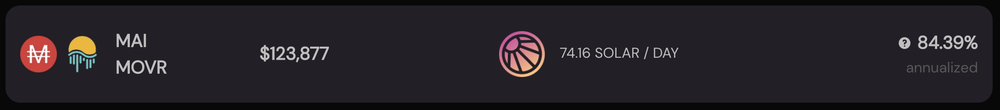
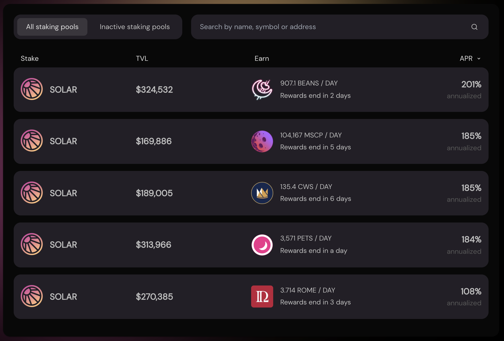
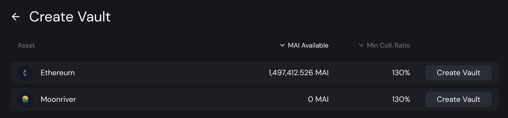

# 在 SolarBeam 上耕种MAI

本指南中展示的大多数教程都使用稳定币作为起始头寸。这主要是由于稳定币对既不受永久损失也不受其他资产波动的影响。然后几乎不可能失去你的初始值，从你稳定币的收益里你可以使用更具风险的策略来增加你的收益。

今天，我们正在使用 Solarbeam 在 Moonriver 上尝试另一种方法，这是目前唯一使用 MAI 的应用程序。LP（流动性提供）对是 MAI-MOVR。 MAI 是来自 Mai Finance 的稳定币，你也可以桥接到 Moonriver 或从金库铸造，而 MOVR 是 Moonriver 的原生气体代币。因此，MOVR 将始终具有某种实用性，价格应该永远不会大幅度地降低。这不是一个稳定的对，但代币的唯一可变部分与 MOVR 相关联，这无论如何使它成为一个很好的起点。

让我们看看我们如何在 Moonriver 上通过封闭的反馈循环产生一些非常高的收益，而不会在旅途中倾倒太多的农场代币。

## SolarBeam

### 在Solarbeam上耕种MAI

Solarbeam 是 Moonriver 上第一个也是主要的 DEX（去中心化交易所）和 AMM（自动做市商），也是链上 TVL 方面的第二个应用。它也是 Mai Finance 的第一个 Moonriver 合作伙伴，并提供一个 MAI-MVR 池，该池将获得他们的一些原生代币 SOLAR 代币作为奖励。这也是你可以为 MAI 找到一些流动性的地方。

由于池的使用率低，84% 的 APR（年度百分比率）相当高，这也使其成为我们策略的完美起点。你将获得此 APR（如果你想与 QuickSwap 上的 MAI-WMATIC 之类的产品进行比较以供参考，则相当于 131% APY），并且奖励将以 SOLAR 代币支付。截至 2021 年 12 月，1 SOLAR = 3.78 USDC。

### 单一质押 SOLAR

大多数 Uniswap 分叉现在都提议为其原生代币进行质押，Solarbeam 也在这样做。你可以将你的 SOLAR 存入 Vault 以获得更多 SOLAR，并且根据你锁定的长度，你将获得非常有趣的费率（锁定 30 天最高 200% 的年利率），但我们将使用 staking赚取外部代币。确实，你可以质押你的 SOLAR 代币，以从 Moonriver 上的不同应用程序接收大量其他代币，而我们正在寻找的就是 ROME 代币。

你会注意到 ROME 池是 APR 最低的池，但它仍然很高，你很快就会看到我们的 ROME 代币将以疯狂的速度增加。

## Rome DAO

Rome DAO 是 Moonriver 上的另一个大玩家。这是一个使用 ROME 代币作为原生代币的Ohm-fork（Olympus DAO 副本）。你将能够在应用程序上质押你的 ROME 代币以获得非常高的回报。每个Ohm-fork的目标是拥有质押尽可能多的原生代币并吸引流动性以维持排放。如果你需要有关 Ohm-forks 的更多详细信息，请查看我们关于 Polygon 的[ Klima DAO 的教程](../polygon/ohm-forks-on-polygon-the-case-of-klima.md)。

因为我们将从 Solarbeam 获得 ROME 代币，所以我们应该能够将它们质押在 Rome DAO 上，并且 rebase 系统会更快地为你提供更多。对于此策略，我们将在 Rome DAO 上质押 ROME 代币并出售每日奖励的 50%，目前对应于 Rome DAO 存款的约 1%。

## Mai Finance

Mai Finance 是一个借贷平台，你可以在其中存入你的加密资产并以 0% 的利率借入 MAI 稳定币。 Moonriver 将收取的唯一费用是你贷款的 0.5% 的还款费用。

对于我们的策略，我们将使用 ETH 保险库。将从 Rome DAO 质押池中提取的 ROME 代币将被拆分如下：

* 33% 将使用 Solarbeam 上的交换功能交换到 MOVR
* 66% 将使用 Solarbeam 上的交换功能交换为 ETH

然后，你将能够将 ETH 存入 Mai Finance 以借入 MAI，其 CDR（抵押债务比率）为 200%，以留在安全区并尝试防止清算。然后，借用的 MAI 将用于创建额外的 MAI-MOVR LP 代币，然后将其添加到 Solarbeam 的初始头寸。

例如，对于你从 Rome DAO 中提取的每 1 美元 ROME，我们将获得

* $0.33 的 MOVR
* 0.66 美元的 ETH 存入 Mai Finance
* 0.33 美元的 MAI 借贷我们的 ETH
* $0.66 worth of MAI-MOVR LP token to add to Solarbeam

## 耕种策略

通过假设一些不同的事情进行以下模拟：

* 在整个模拟期间，所有费率和价格保持不变，在我们的案例中为 1 年
  * Solarbeam 上的 MAI-MVR 农业年利率为 84%
  * 108% APR 质押 SOLAR 以耕种 ROME 代币
  * 质押 ROME 代币时，Rome DAO 的 APR 为 771%
* 所有奖励和计划也将运行一整年
* Rome DAO 每日收益的 50% 以 33% MOVR 和 66% ETH 的价格出售
* 初始投资为价值 100 美元的 MAI-MVR LP 代币

### 第1天

在第 1 天，你只需将价值 100 美元的 MAI-MOVR 存入 Solarbeam，并在当天结束时收获你的 SOLAR 代币。这将为你提供以下结果：

| MAI-MOVR | SOLAR | ROME  | ETH   | 额外的 LP |
| -------- | ----- | ----- | ----- | ------ |
| 100.000  | 0.230 | 0.000 | 0.000 | 0.000  |

### 第2天

在第 2 天，你将保留你的 MAI-MOVR 头寸以种植更多 SOLAR，但你还将质押你的第一批 SOLAR 代币，以便开始收集一些 ROME 代币。在第 2 天结束时，你将获得：

| MAI-MOVR | SOLAR | ROME  | ETH   | 额外的 LP |
| -------- | ----- | ----- | ----- | ------ |
| 100.000  | 0.460 | 0.001 | 0.000 | 0.000  |

### 第3天

在第 3 天开始时，你应该能够从 50% 的每日质押奖励中收获前几个 ROME 代币。在第 3 天只使用 100 美元的初始费用可能不是一个好主意，因为金额微不足道，但仍然如此。你将出售 33% 的 MOVR 和 66% 的 ETH，将你的保险库存入 Mai Finance，然后用你的新抵押品借入 MAI。

| MAI-MOVR | SOLAR | ROME  | ETH      | 额外的 LP   |
| -------- | ----- | ----- | -------- | -------- |
| 100.000  | 0.690 | 0.002 | 0.000005 | 0.000005 |

在这个时候系统已完全引导。

## 耕种结果

### 每日例行

系统准备就绪后，这是你的日常

* 从 MAI-MVR 池中收获 SOLAR
* 质押你刚刚获得的 SOLAR 代币
* 从 SOLAR 质押池中收获 ROME 代币
* 质押你新获得的 ROME 代币
* 在 Rome DAO 上取消质押50% 的每日收益（相当于 \~1.5 rebase）
* 出售 66% 的 ROME 代币换取 ETH
* 为 MOVR 出售 33% 的 ROME 代币
* 将 ETH 存入 Mai Finance 的 ETH 保险库
* 借入你存款的 50% 作为 MAI 稳定币
* 将借来的 MAI 与 MOVR 代币配对
* 存入你的额外 MAI-MVR 代币

### 月复一月的原始结果

| 天数  | MAI-MOVR | 质押的 SOLAR | 质押的 ROME | ETH     |
| --- | -------- | --------- | -------- | ------- |
| 30  | 100.021  | 7.135     | 0.352    | 0.023   |
| 60  | 100.190  | 14.045    | 1.550    | 0.200   |
| 90  | 100.713  | 20.978    | 3.911    | 0.740   |
| 120 | 101.872  | 27.968    | 7.869    | 1.925   |
| 150 | 104.052  | 35.072    | 14.023   | 4.148   |
| 180 | 107.788  | 42.378    | 23.204   | 7.947   |
| 210 | 113.814  | 50.019    | 36.559   | 14.065  |
| 240 | 123.142  | 58.178    | 55.580   | 23.525  |
| 270 | 137.175  | 67.158    | 82.767   | 37.745  |
| 300 | 157.848  | 77.321    | 120.875  | 58.681  |
| 330 | 187.841  | 89.226    | 174.234  | 89.041  |
| 360 | 230.861  | 103.358   | 248.711  | 132.575 |

### 第365天

经过一年的耕作，你将拥有

* Solarbeam 上价值 239.633 美元的 MAI-MVR
* Solarbeam 上价值 106.358 美元的 SOLAR 代币
* 价值 263.708 美元的 ROME 代币质押在 Rome DAO
* Mai Finance 上价值 141.450 美元的 ETH
* Mai Finance 上价值 68.817 美元的 MAI 债务

由于我们使用了三分之一的交换 ROME 代币来获得一半的新 LP 代币，额外的 MAI-MOVR 并不完全地对应于债务。

因此，这个循环将从相对稳定的初始头寸为你提供 583.15% 的等效 APY。

## 免责声明

从该策略中要了解的主要是 Moonriver 目前未得到充分利用，并且奖励率非常有趣。此外，一旦你在策略中抛出一个Ohm-fork来重新投资你的部分收益，奖励率就会非常疯狂，只要你在 DAO 中保留足够的代币来生成，你就会获得非常重要的利润质押奖励。

请记住，项目的奖励率是可变的，而且在一年内无法保证。请确保你了解你正在投资的所有项目，进行自己的研究，并确保只投资你可能准备好放弃的项目。因为这个策略是投资于一个相对稳定的初始，这里唯一有风险的是其他系统的好处。本指南不能被视为对其使用的项目的认可。
