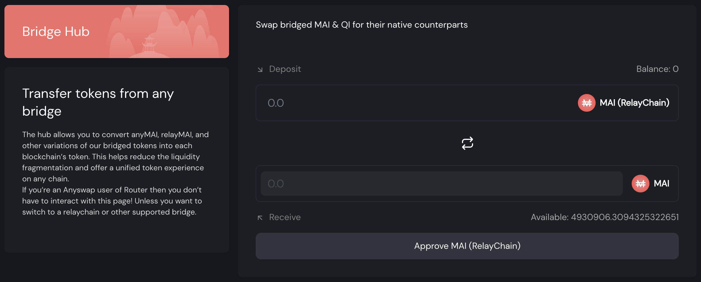
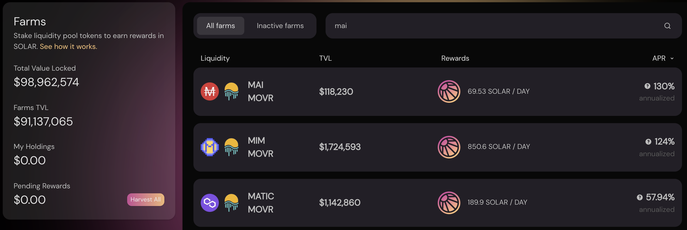

# 如何开始使用Moonriver

## 什么是Moonriver

如果不讨论其他一些链，包括 MoonBeam、Kusama 和 Polkadot，解释什么是 Moonriver 将会很复杂。.

Polkadot 是与 Ethereum、Cosmos 或 Eos 直接竞争的 L1 区块链，该链的目标是发展一个完整的加密货币和应用生态系统。使 Polkadot 与其他 L1 不同的主要一点是它分为主链（中继链）和用户创建的网络（平行链）。中继链受益于对计算资源的低要求，因为大多数开发和测试都是在平行链上进行的。另一方面，平行链继承了与中继链相同的安全性。这也创建了可以以自主方式工作并且不会向主链泄露用户数据的隔离环境。

Kusama是 Polkadot 的预生产环境，它是一条模仿 Polkadot 主中继链的独立链，并且首先测试主链的所有开发和更新。然而，作为一个预生产环境，Kusama 使用真实的加密货币和真实的交易进行操作，但规则比 Polkadot 上更宽松。然而，在 Kusama 上开发的应用程序和侧链的目标是在某个时候迁移到 Polkadot。由于规则更宽松，项目在开发协议时更容易测试事物并发展社区。一旦最终产品准备就绪，一切都可以迁移到生产的环境。

Moonriver 实际上是 Kusama 上的平行链。部署到 Moonriver 的代码是可以部署在 Moonbeam（Polkadot 上 Moonriver 的生产版本）上的代码的测试版本。一旦代码在 Moonriver 上得到验证，它就可以运送到 Moonbeam。 Moonbeam 和 Moonriver 是与 EVM 兼容的 2 条链，这意味着它们接受与以太坊网络兼容的其他链相同的智能合约。正因为如此，Moonriver 迅速成为许多希望从以太坊网络（Eth Mainnet、Polygon、Avalanche、Fantom ...）扩展到 Polkadot 网络的 DApp（去中心化应用程序）的入口点。

像其他 EVM 兼容链一样，Moonriver 使用一种用于验证交易的气体代币：MOVR 代币。

## 上Moonriver

在使用 Moonriver 网络之前，你需要一个钱包地址。因为 Moonriver 是一个 EVM 网络，它将接受与其他 EVM 链上相同的钱包，包括 Metamask 或 Nifty 等网络钱包，你将能够使用 Trezor 或 Ledger 等硬件钱包，但你可能需要遵循额外步骤能够将你的冷钱包连接到网络的步骤。你可以在[官方 moonbeam Foundation 文档](https://moonbeam.foundation/tutorials/how-to-create-moonriver-ethereum-address/)中找到非常清晰的分步指南。

对于本教程，我们将像本网站上的所有其他指南一样坚持使用 Metamask。如果你没有安装 Metamask，你可以找到有关[如何开始使用 Polygon ](../polygon/how-to-get-started-on-polygon.md)的说明。

### 将 Moonriver 添加到 Metamask

理论上，Moonriver 预装了 MetaMask，这意味着你不必添加链信息以使 Metamask 工作。但是，最好通过仔细检查保存在本地钱包中的值来验证你的设置是否正确。打开 Metamask 弹出窗口，单击钱包图标，导航到设置，然后选择网络并找到 Moonriver。你应该得到的数据如下：

* **网络名称:** Moonriver
* **New RPC URL:** https://rpc.moonriver.moonbeam.network
* **Chain ID:** 1285
* **货币符号:** MOVR
* **阻止资源管理器 URL:** https://blockscout.moonriver.moonbeam.network/

保存更改，Metamask 会自动将你切换到 Moonriver 网络：

## 桥接到Moonriver

### 水龙头

Moonriver 上最大的 DEX 之一 SolarBeam 提供[无气体交易交换](https://app.solarbeam.io/bridge/gas-swap)，以防你没有气体。这也假设你在 Moonriver 上有一些资金，但因为你的钱包里有 0 MOVR 而不能做任何事情。

请注意，此无气体交易仅接受某些资产，并且 MAI 不是受支持的硬币的一部分。

### 桥接

* 如果你想将你的 MAI 从 Polygon 转移到 Moonriver，[Relay Chain](https://app.relaychain.com/transfer#/) 是 Mai Finance 的官方合作伙伴。当你连接到 Polygon 后，你只需选择正确数量的目标链（Moonriver）和要发送的资产（MAI 或 miMATIC），然后单击“转移”按钮。注意转会费。

* 如果你需要从其他网络桥接其他资产，你可以使用Relay Chain（见上文），如果你想从 Eth Mainnet 桥接到 Moonriver，[AnySwap](https://anyswap.exchange/#/bridge) 将起作用，当然你也可以使用 [Solarbeam](https://app.solarbeam.io/bridge) 的桥接功能。
* [Elknet](https://app.elk.finance/#/elknet) 的特别说明，当你在 2 个网络之间转移 ELK 代币时，它将充当桥梁和水龙头。你将能够桥接你的 ELK，并且在接收端，你可以直接使用 ELK 的一小部分作为气体代币，在我们的例子中是 MOVR。

### 枢纽

如果你通过Relay Chain将一些 MAI 从 Polygon 桥接到 Moonriver，你将获得 MAI 的 RelayChain 版本，而不是 Moonriver 上的应用程序生成的本机 MAI。 2 个代币（RelayChain 的一个和 Mai Finance 的一个）具有相同的价值和相同的名称，但合约地址不同，并且唯一可以在 Moonriver 上种植收益的代币是来自 Mai Finance 的一个。

你可以使用 [Mai Finance 上的枢纽](https://app.mai.finance/hub)以 1:1 的比例从 Relay Chain 交换你的 MAI，然后你就可以在其他平台上使用你的真正的MAI。


作为旁注，如果你想将你的 MAI 从 Moonriver 桥接到 Polygon 或其他链，你必须先将它们转换成它们的 RelayChain 版本.


## Moonriver上的DeFi

Moonriver 获得了很大的吸引力，越来越多的应用程序正在迁移到这条新链，并有潜在可能完全迁移到 Polkadot。像这样，你将能够在以下平台上种植产量（列表不完整）：

* [Solarbeam](https://app.solarbeam.io): 这是 Moonriver 上主要的 DEX 和 AMM。你将能够交换你的资产，通过在农场提供 LP（流动性提供）对参与流动性挖掘，或质押平台的原生代币。Solarbeam 也是 Mai Finance 在 Moonriver 上的首批合作伙伴之一，你将能够种植 MAI-MOVR 对。你还会发现一个 MAI-USDC 矿池没有获得任何奖励，但可能会获得一些交易费用。

当你在 Solarbeam 上耕种时，你将获得 SOLAR 代币奖励，然后你可以在 Vault 中质押一定的归属期并获得额外的 SOLAR 代币，或者质押以获得其他对平台而言具有异国情调的代币。

* [Huckleberry Finance](https://www.huckleberry.finance): 这是 Moonriver 上的另一个 DEX/AMM，你可以在其中耕种产量，并可能使用 Beefy 来增加收益。
* [Beefy Finance](https://app.beefy.finance/#/moonriver): 著名的自动复合机也在 Moonriver 上，它将帮助你从 Solarbeam 和 Huckleberry 中获得收益。作为旁注，Beefy 在撰写本文时并未提出 MAI-MVR 对，但你可能很快就可以使用 Beefy 来收获 SOLAR 代币并从复合机中获得更多 MAI-MVR。
* [Sushiswap](https://app.sushi.com): 无需呈现 SushiSwap！你将能够将你的资产和农场收益换成某些 LP 代币，就像你在任何其他链上所做的那样。奖励在 SUSHI 和 MOVR 中被授予。
* [Rome DAO](https://romedao.finance): 这是 Moonriver 上的第一个 OHM 前叉。绑定你的资产以获得打折的 ROME 代币，你可以质押这些代币以获得非常高的 APY。在撰写本文时，5 天的投资回报率约为 10.6%。 RomeDAO 目前在其资金库中接受 FRAX 和 MIM，但可能很快也会接受 MAI。

## &#x20;Moonriver上的Mai Finance

Moonriver 上已经提供借贷平台，你可以将 mooSolarETH-USDC 代币放入保险库并借用 MAI。为了这么做：

* 在 Solarbeam 上创建 ETH-USDC对
* 将 ETH-USDC 对存入 Beefy 并获得 mooSolarETH-USDC 收据代币
* 将你的 mooToken 存入 Mai Finance上[相应的保险库](https://app.mai.finance/vaults/create)

单个 ETH 保险库也是一种选择。

虽然你的抵押品从 Beefy Finance 获得 44.08% 的年利率（截至撰写本文时），但你将能够借用 MAI 并耕种 MAI-MOVR 池，并在 Solarbeam 上获得 128% 的年利率，或很快在 RomeDAO 上获得 158,058% 的年利率。

## 免责声明

本指南不是财务建议，应仅被视为一种教育工具。总是做你自己的研究。本指南中介绍的项目或仅展示网络上的可能性，不应被视为对该项目的认可。


请牢记在给定时间运行良好的策略可能在另一个时间表现不佳（或让你赔钱）。请保持消息灵通，监测市场，留意你的投资，并一如既往地，做你的研究。

