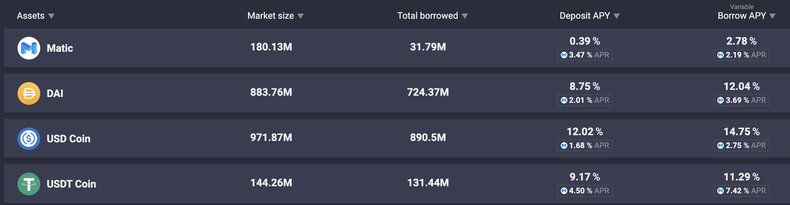
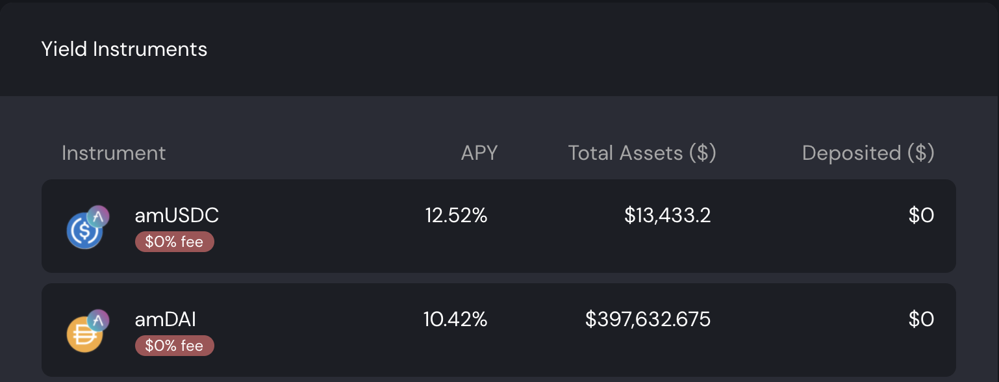
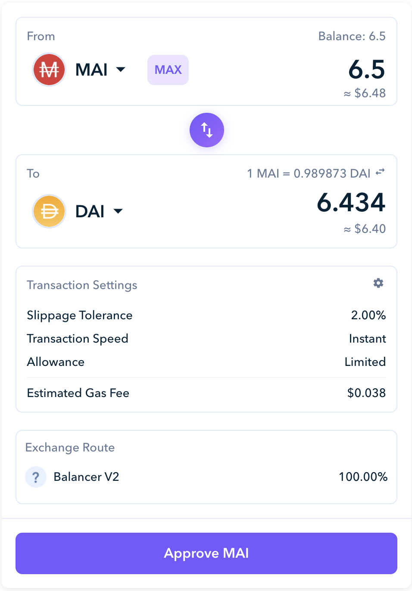
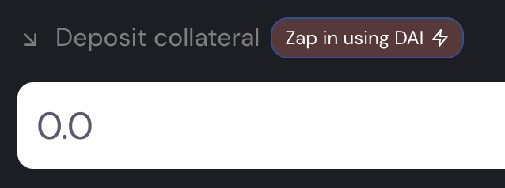
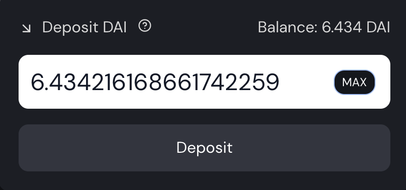
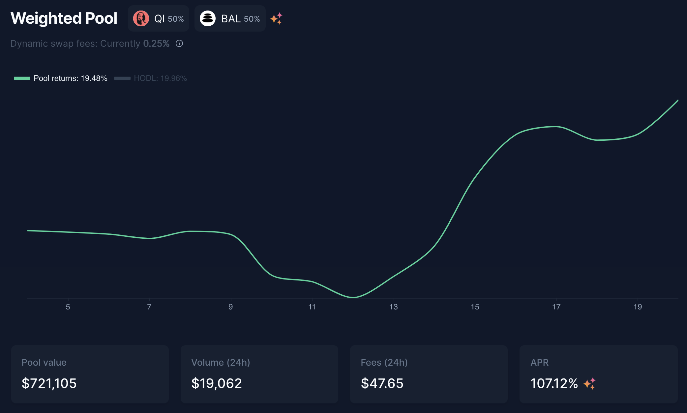

# camDAI 初学者策略

## 介绍

大多数人在想到 DeFi 时感到害怕。使用加密货币时总是要考虑一个风险因素，这个市场的波动可能会让一个人损失很多钱，而且有很多可能性，找到一个正确的策略可能非常复杂。但是，当您使用正确的工具时，一些简单且低风险的策略可以获得良好的结果，并且可能与更复杂和风险更高的选项竞争。

在本指南中，我们将尝试提出一种基于杠杆稳定币的投资策略，其中包含较高的利益风险。

## 了解杠杆的概念

我们在遥远的西部，在淘金热期间。银行想要购买黄金能够借钱给人们并从这些贷款中获得利息，而矿工希望通过将黄金出售给银行来致富。

你是一名矿工，但不是很幸运。你只找到了一个金块。然而，你超级聪明，你有另一个计划，而不是采矿！&#x20;

你去银行解释说你有黄金。你可以将黄金作为抵押存入银行，这意味着你让银行将这些黄金用于想要使用它的人，银行会给你一些存款利息。

另外，因为你借出了一些黄金，银行同意让你从他们那里借钱，以防你不能用一些利息偿还贷款。银行将使用你存入的黄金自行支付。太酷了，现在你在银行的黄金上赚取利息，他们给了你一些现金。

有了这个，你决定去见一位矿工并用你的现金购买他的黄金。这让他可以专注于采矿，并从他发现的黄金中获得现金。每个人都很高兴。

你回到银行存入你买的黄金。这意味着更多的利息，现在银行允许你从你存入的额外黄金中借入更多现金。你有更多的黄金暴露在银行的利益之下，还有更多的现金。是时候回去看看你的朋友是否找到了更多的金子，然后一遍又一遍地重复。

这就是所谓的杠杆作用。现在想象一下，你可以找到一家银行，让你以 0% 的利息借入现金，并且你拥有一台可靠的印钞机，仅从你获得的利息中获得。

## 介绍工具

### AAVE

[AAVE](https://app.aave.com) 是一个借贷平台，你可以在其中存放你的资产。通过在 AAVE 上借贷，你存入的代币将获得收益。对于我们的策略，我们将借出 DAI，一种稳定的硬币（与美元挂钩）。在 AAVE 上，价值 100 美元的 DAI 将有潜在的可能会在 1 年内产生 4% 到 10% 的回报率。

当你将资产存入 AAVE 时，你将收到存款证明。在我们的示例中，由于我们存入 DAI，我们将在钱包中获得 amDAI 代币（aave 市场 DAI）。你绝对需要保留这张收据，因为你需要它来从 AAVE 中删除你的 DAI。在我们的远西比较中，这家银行将接受你的黄金。

### Mai Finance

[Mai Finance](https://app.mai.finance) 是一个借贷平台，可让你将一些资产存入保险库，并以该存款的价值进行借贷。如果我们回到银行的类比，它将是一家允许你贷款的银行，但贷款并非来自其他人的贷款。取而代之的是，银行会根据你的个人存款打印货币，因此你只能向自己借款。

Mai Finance 将在其[收益工具](https://app.mai.finance/yield)上接受 amDAI。收益工具只是 AAVE 和 Mai Finance 的保险库之间的中间工具。正如你在 AAVE 屏幕截图中看到的那样，借出 DAI 将使你获得 8.75% 的 DAI（即复利），以及 2.01% 的 MATIC 奖励。 Mai Finance 上的收益工具将收获此 MATIC 奖励并将其交换成更多 DAI，这些 DAI 将添加到你的 DAI 存款中。因此，Mai Finance 网站上的 APY（年度百分比收益率）显示了来自 AAVE 的合计利息。

一旦你将 amDAI 存入收益工具，你的钱包中将获得一些 camDAI（复合 amDAI）。这是一张收据，表明你在收益工具中的 amDAI 池中的份额。附带说明一下，因为 camDAI 代表你在 amDAI 池中的份额，所以 amDAI 和 camDAI 之间的比例不是 1:1。有关更多详细信息，请参阅[这篇文章](leverage-aave-tokens.md#amtokens-vs-camtoken)。

你现在可以将你的 [camDAI 代币存入](https://app.mai.finance/vaults) Mai Finance 的保险库中，然后可以借用一些 MAI（与 1 美元挂钩的稳定币）作为你的抵押品。在我们的远西比较中，这是第二家银行，可让你根据你存放在第一家银行的黄金数量获得现金贷款。第二家银行接受第一家银行的收据作为担保，以防你无法偿还贷款。

### Zapper

[Zapper](https://zapper.fi/dashboard) 是 Polygon 上 DeFi 的瑞士军刀。该平台将让你在流动性池中获得收益，直接从他们的平台借出你的资产在 AAVE 上，呈现你不同投资的仪表板，并允许你将一些货币换成其他货币。这是我们将使用的最后一个功能，以便将我们刚刚借来的 MAI 稳定币换成更多 DAI。

在我们远西的例子中，Zapper 是接受你的现金并向你出售黄金的淘金者。

### Balancer

正如你在上面的屏幕截图中看到的，Zapper 使用 Balancer 的协议来操作交换。[Balancer ](https://polygon.balancer.fi/#/)是一个自动化的投资组合经理、流动性提供者和价格传感器，你可以在其中提供流动性（并从中获得费用）或使用流动性池交换货币。

对于我们的指南，我们将使用 Balancer 将我们的投资暴露在更大的波动性中并获得更好的利益。不过，这是 100% 可选的。

## 策略描绘

### 主要策略

即使我们解释了 AAVE 是什么，我们的策略也将使用 Mai Finance 的一项功能来自动化 AAVE 上的 DAI 存款、收益工具中的 amDAI 存款和 camDAI 保险库中的 camDAI 存款。

 

&#x20;`Zap in using DAI`按钮会打开一个弹出窗口，让你将 DAI 存入保险库并在引擎盖下操作 AAVE 存款。这样可以节省大量时间和一些气体。

这将是我们的第一步。假设我们有价值 100 美元的 DAI，我们会将它们存入 Mai Finance 的 camDAI 保险库中。这将允许我们用这笔初始存款借入 MAI。

camDAI 的最低 CDR（抵押债务比率）为 110%。这意味着你的抵押品（价值 100 美元的 DAI）与我们即将获得的贷款之间的比率需要保持在 110% 以上。


如果这个 CRD 比率达到 110% 的最小值，则意味着你的抵押品正在失去价值，你的债务可能会变得大于抵押品的价值。此时，你的保险库可以被清算：有人可以偿还你的部分债务并获得你的部分抵押品作为补偿。但是，由于 DAI 和 MAI 都是与美元挂钩的稳定币，因此两种资产之间获得巨大差异的风险非常低，这使得该策略相当安全。


为了将清算风险保持在较低水平，我们将尽量坚持 115% 的 CDR。为了知道我们可以借多少 MAI 以保持 115% 的 CDR，我们将使用以下公式：

$$
MAI_{available} = \frac{Collateral_{value} - Debt_{value} * Target_{CDR}}{Target_{CDR}}
$$

抵押价值为 100 美元，还没有债务，目标 CDR 为 115%，以下是我们可以借到的金额：

$$
MAI_{available}=\frac{100 - 0*1.15}{1.15}=86.95
$$

​然后你可以将你借来的 MAI 交换成 DAI 并重复。以下是你的抵押品和债务的样子：

| 循环 # | 抵押品     | 债务      | 可用的贷款  | 等效 APY | DAI 清算价格 |
| ---- | ------- | ------- | ------ | ------ | -------- |
| 1    | 100.000 | 0.000   | 86.956 | 10.42% | 0        |
| 2    | 189.956 | 86.956  | 75.614 | 19.48% | 0.512    |
| 3    | 262.571 | 162.571 | 62.751 | 27.36% | 0.681    |
| 4    | 328.323 | 228.323 | 57.175 | 34.21% | 0.765    |
| 5    | 385.498 | 285.498 | 49.718 | 40.17% | 0.815    |
| 6    | 435.216 | 335.216 | 43.233 | 45.35% | 0.847    |
| 7    | 478.449 | 278.448 | 37.593 | 49.85% | 0.870    |
| 8    | 516.042 | 416.042 | 32.690 | 53.77% | 0.887    |
| 9    | 548.732 | 448.732 | 28.426 | 57.18% | 0.899    |
| 10   | 577.158 | 477.158 | 24.718 | 60.14% | 0.909    |
| 11   | 601.877 | 501.877 | 21.494 | 62.72% | 0.917    |
| 12   | 623.371 | 523.371 | 18.691 | 64.96% | 0.924    |
| 13   | 642.062 | 542.062 | 16.253 | 66.90% | 0.929    |
| 14   | 658.315 | 558.315 | 14.133 | 68.60% | 0.933    |
| 15   | 672.448 | 572.448 | 12.289 | 70.07% | 0.936    |
| 16   | 684.737 | 584.737 | 10.686 | 71.35% | 0.939    |
| 17   | 695.423 | 595.423 | 9.293  | 72.46% | 0.942    |

我们停在 17 个循环，但如果你愿意，你可以进行更多操作。

在 17 个循环结束时，你将获得 695.423 美元的抵押品和 595.423 美元的债务。这对应于 CDR 116.79%，应该足够安全以防止清算。&#x20;

如果我们考虑收益工具授予的 10.42% APY，这将产生

$$
Interests = Collateral_{value}*APY=695.423*10.42\%= \$72.463
$$

如果我们考虑初始投资仅为 100 美元，那么单次 Staking 稳定币相当于 APY 为 72.463%！

### 替代策略

为了获得一点高波动性资产的敞口，你可以使用与上述相同的循环，但仅杠杆借入的 MAI 的 90%，并使用 10% 购买其他东西。在本例中，我们将使用 10% 购买 Qi（Mai Finance 的原生代币）并使用当前 APR（年度百分比收入）为 107.12% 的 Balancer 上的 Qi-BAL 池。

由于我们在 camDAI 保险库中重新注入了更少的 DAI，我们也将运行更少的循环。设置将如下所示：

| 循环 # | 抵押品     | 债务      | Qi     | 可用的贷款  | 等效 APY  | DAI 清算价格 |
| ---- | ------- | ------- | ------ | ------ | ------- | -------- |
| 1    | 100.000 | 0.000   | 0.000  | 86.957 | 10.42%  | 0        |
| 2    | 178.261 | 86.957  | 8.696  | 68.053 | 35.22%  | 0.537    |
| 3    | 239.509 | 155.009 | 15.501 | 53.259 | 54.63%  | 0.712    |
| 4    | 287.441 | 208.268 | 20.827 | 41.681 | 69.82%  | 0.797    |
| 5    | 324.954 | 249.949 | 24.995 | 32.620 | 81.71%  | 0.846    |
| 6    | 354.312 | 282.569 | 28.257 | 25.529 | 91.01%  | 0.877    |
| 7    | 377.288 | 308.097 | 30.810 | 19.979 | 98.29%  | 0.898    |
| 8    | 395.269 | 328.076 | 32.808 | 15.636 | 103.99% | 0.913    |
| 9    | 409.341 | 343.712 | 34.371 | 12.237 | 108.45% | 0.924    |
| 10   | 420.354 | 355.948 | 35.595 | 9.576  | 111.94% | 0.931    |

在 10 个循环结束时，你会得到

* 420.354 美元的 DAI 作为抵押品
* 355.948 美元的债务
* 35.595 美元的 Qi

与前一种情况相同的数学给出以下结果

* 最终 CDR 为 118.09%，应该被认为足够安全以防止清算
* 43.800 美元的 DAI 利息来自收益工具授予的 10.42% APY
* 如果你假设你将在 Qi-BAL 池中复合 Qi 和 BAL 奖励，则你的 Qi 来自 Balancer 池的利息为 68.139 美元
* 总APY 111.94%

这种策略存在更多风险，因为 Qi-BAL 池的投资无法得到保证。但是，你将获得一点 Qi 的接触，这将使你参与 QiDAO 协议。如果你使用 Mai Finance 上的 BAL 奖励作为抵押品并以此为抵押，你还可以在 camDAI 保险库或 Qi-BAL 池中进行再投资。如果你这样做，你还将有权获得每周以 Qi 支付的借款奖励。

## 结论

只需一些极少的投资和低维护，你只需杠杆你的DAI 即可获得相当可靠的结果。由于 DAI 是一种稳定的代币，在多个链中具有大量流动性，因此 DAI 脱钩和你的金库被清算的风险相对较低。对于任何 DeFi 初学者来说，这种“一劳永逸”的设置很容易成为一个很好的起点，而且这种策略很可能在牛市或熊市中以相同的方式执行。最后，我们还解释了如何使用相同的策略来获取一部分的贷款并测试 DeFi 在 Polygon 上的许多可能性。

## 免责声明

本教程中介绍的所有内容都是教育内容，旨在说明 Mai Finance 提出的杠杆选项。我们没有谈论偿还债务，因为这个网站上有专门的文章，但你需要记住，麦金融对借款金额收取 0.5% 的还款费。与往常一样，进行自己的研究，并毫不犹豫地在 [DAO 社区的 Discord 服务器](https://discord.com/invite/qidaoprotocol)上提问。


请牢记在给定时间运行良好的策略可能在另一个时间表现不佳（或让你赔钱）。请保持消息灵通，监测市场，留意你的投资，并一如既往地，做你的研究。

