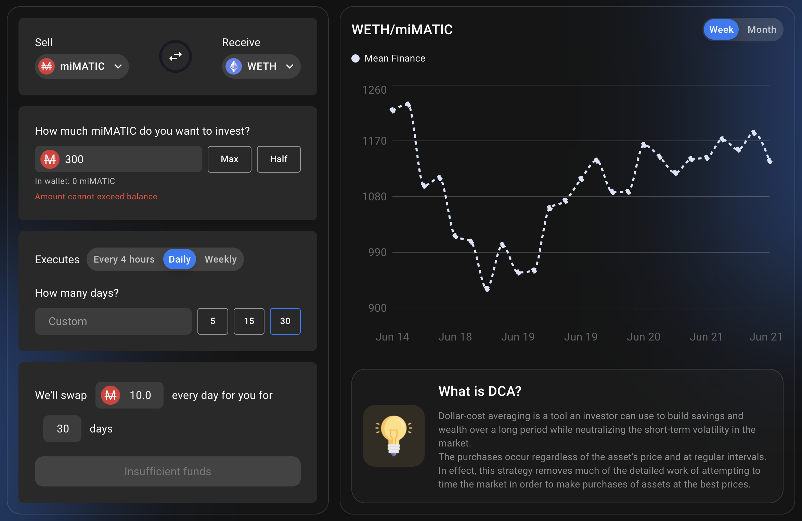

# 熊市和牛市中的 DCA

## 介绍

“在市场上的时间比在市场上的时间好得多”，你肯定已经听说过。事实上，没有人可以完美地在顶部卖出，或在底部买入。这就是为什么大多数投资者会通过 DCA（Dollar Cost Average）来积累他们最想要的资产。 DCA 包括以给定的频率购买少量，而不管价格如何。这样做可以降低平均购买价格，与在错误时间完成的单次购买相比，你有更好的机会购买更多给定资产。

你可以在[investopedia 网站](https://www.investopedia.com/terms/d/dollarcostaveraging.asp)上找到有关什么是平均美元成本的更多详细信息，该网站给出了以下定义：

> 美元成本平均 (DCA) 是一种投资策略，在该策略中，投资者将投资总额分成定期购买目标资产，以减少波动对整体购买的影响。无论资产价格如何，购买都会定期进行。

本文介绍了如何正确地将 DCA 转换为你最喜欢的资产以充值 Mai Finance 的金库，但你也可以将 DCA 转换为 MAI 稳定币以获得更好的平均售价。


请记住，在给定时间运作良好的策略可能在其他时间表现不佳（或让你赔钱）。请随时了解情况，监控市场，密切关注你的投资，并一如既往地进行自己的研究。


## 了解美元成本平均

让我们看看如何在不同的市场条件下进行 DCA，以及它在购买/销售能力方面的意义。

### 处于下降趋势（看跌市场）

当市场已经相当低迷并且（希望）接近底部时，或者至少在你觉得可以放心购买的价格水平时，那就是积累你最喜欢的资产并购买代币的时刻。因为你知道，你想在价格低的时候买入，在价格高的时候卖出。例如，这是 2022 年 6 月前 15 天 ETH 价格的真实示例

| 日期       | ETH 价格（美元） |
| -------- | ---------- |
| 06/01/22 | 1,928.60   |
| 06/02/22 | 1,814.00   |
| 06/03/22 | 1,826.39   |
| 06/04/22 | 1,751.69   |
| 06/05/22 | 1,791.55   |
| 06/06/22 | 1,876.70   |
| 06/07/22 | 1,756.89   |
| 06/08/22 | 1,776.58   |
| 06/09/22 | 1,798.50   |
| 06/10/22 | 1,791.43   |
| 06/11/22 | 1,668.25   |
| 06/12/22 | 1,467.21   |
| 06/13/22 | 1,349.25   |
| 06/14/22 | 1,170.75   |
| 06/15/22 | 1,169.67   |

这是 6 月上半月的 39.35% 的价格下跌，这是在 5 月灾难性的一个月之后。现在，假设你在同一时间段内每天都购买一点 ETH，这是你购买 ETH 的平均价格：

| 日期       | DCA 平均价格 |
| -------- | -------- |
| 06/01/22 | 1,928.60 |
| 06/02/22 | 1,871.30 |
| 06/03/22 | 1,856.33 |
| 06/04/22 | 1,830.17 |
| 06/05/22 | 1,822.45 |
| 06/06/22 | 1,831.49 |
| 06/07/22 | 1,820.83 |
| 06/08/22 | 1,815.30 |
| 06/09/22 | 1,813.43 |
| 06/10/22 | 1,811.23 |
| 06/11/22 | 1,798.23 |
| 06/12/22 | 1,770.65 |
| 06/13/22 | 1,738.23 |
| 06/14/22 | 1,697.70 |
| 06/15/22 | 1,662.50 |

均价为 1,662.50 美元，收于 1,169.67 美元，跌幅从 39% 以上降至 29.64%。从这个意义上说，DCA 减少了你的损失。这也意味着要收支平衡，你需要价格回到 1,662.50 美元而不是 1,928.60 美元，如果价格回到 1,928.60 美元，你将获得 16% 的利润。

需要注意的一件有趣的事情是，如果你在同一时期以 USDC（或其他稳定币，如 MAI）出售你的 ETH，你的平均售价也将是 1,662.50 美元，并且你每天都会以更好的价格出售，除了6 月 6 日。这再次证明 DCA 比试图把握市场时机要好得多。

### DCA 处于上升趋势（牛市）

当市场上涨时，你可能还希望 DCA 进入特定资产，以在价格上涨时拉低平均购买价格。显然，你希望在主要市场周期的加价期开始时这样做，这就是为什么即使在上升趋势中也强烈建议 DCA 这样做的原因。例如，这是 2021 年 10 月前 15 天的 ETH 价格。

| 日期       | ETH 价格（美元） |
| -------- | ---------- |
| 10/01/21 | 3,001.13   |
| 10/02/21 | 3,308.87   |
| 10/03/21 | 3,390.77   |
| 10/04/21 | 3,418.78   |
| 10/05/21 | 3,381.78   |
| 10/06/21 | 3,516.57   |
| 10/07/21 | 3,576.81   |
| 10/08/21 | 3,587.83   |
| 10/09/21 | 3,560.00   |
| 10/10/21 | 3,575.02   |
| 10/11/21 | 3,419.73   |
| 10/12/21 | 3,546.48   |
| 10/13/21 | 3,492.75   |
| 10/14/21 | 3,604.96   |
| 10/15/21 | 3,790.15   |

这或多或少与上一节相反，上一节 ETH 的价格在 15 天内上涨了 +26.29%。因此，如果你幸运地在 10 月 1 日买入，那么这就是你在 15 日卖出所获得的利润。相反，如果你在此期间每天都进行投资，以下是你购买 ETH 的平均价格：

| 日期       | ETH 价格（美元) |
| -------- | ---------- |
| 10/01/21 | 3,001.13   |
| 10/02/21 | 3,155.00   |
| 10/03/21 | 3,233.59   |
| 10/04/21 | 3,279.89   |
| 10/05/21 | 3,300.27   |
| 10/06/21 | 3,336.32   |
| 10/07/21 | 3,370.67   |
| 10/08/21 | 3,397.82   |
| 10/09/21 | 3,415.84   |
| 10/10/21 | 3,431.76   |
| 10/11/21 | 3,430.66   |
| 10/12/21 | 3,440.31   |
| 10/13/21 | 3,444.35   |
| 10/14/21 | 3,455.82   |
| 10/15/21 | 3,478.11   |

以 3,478.11 美元的均价和 3,790.15 美元的收盘价计算，你在 15 日卖出将获得 15.89% 的收益。在这种情况下，DCA 价格始终低于市场价格，10 月 11 日除外，这意味着你始终可以出售你购买的资产并获得收益。

在这种情况下，你还可以使用你的 Ether 将 DCA 转换为稳定币。平均售价为 3,478.11 美元，你将比前 5 天或第 11 天的现货销售获得更好的利润。如果你想在下一次市场下跌时获得收益、偿还贷款或积累稳定币，这尤其有用。你可能还希望将高价格“保存”到稳定币中，以便在你的波动性资产有下跌风险的不确定时期获得收益。

### 市场周期中的 DCA

无论你是投资加密货币还是股票市场，你都可能注意到市场是周期性的。再一次，你可以在[investopedia](https://www.investopedia.com/trading/market-cycles-key-maximum-returns/)中阅读有关市场周期的更多信息，但以下是你需要了解的关键事项：

* 市场分为四个阶段；了解每个阶段如何运作以及如何受益是挣扎与繁荣之间的区别。
* 在积累阶段，市场已经触底，早期采用者和逆势者看到了跳入并获得折扣的机会。
* 在加价阶段，市场似乎已经趋于平稳，早期的大多数人都在跳回，而聪明的钱正在套现。
* 分布阶段，市场情绪喜忧参半，价格震荡，卖家占优，涨势接近尾声。
* 在降价阶段，落后者试图出售和挽救他们所能做的，而早期采用者则寻找触底迹象，以便重新进入。

拐点是你需要在 DCA 策略中从买方转换为卖方的时刻：

## DCA 使用 Mai Finance 和 Mean Finance 进入波动性资产

### Mai Finance

[Mai Finance](https://app.mai.finance) 是一种借贷协议，你可以在其中存入特定资产作为抵押品，并以 0% 的利率借入 MAI 稳定币。对于本特定指南，假设我们希望从已经包含价值 1,000 美元 ETH 的现有投资组合中将 DCA 转换为 ETH。在去中心化应用程序上，你将能够

* 将 ETH 存入 ETH vault
* 用你的抵押品借 MAI

为了限制风险，我们假设你借入价值 300 美元的 MAI 以保持健康的 CDR（抵押债务比率）。

### Mean Finance

[Mean Finance](https://mean.finance/) 是一个自动化应用程序，你可以在其中设置 DCA 头寸，该头寸将在给定的时间内以给定的频率使用其他资产自动购买特定资产。

创建后，你将能够查看你的 DCA 头寸的表现以及所有掉期的历史记录。

正如你在上面看到的，DCA 策略目前是每 4 小时购买一次 ETH，并购买价值 1.61 MAI 的 ETH。与频率较低的掉期相比，较高的频率将更多地反映目标资产的波动性。

重要的是要注意有关平均财务的一些事情

* 头寸是 NFTs，这意味着你是唯一可以访问该头寸的人。
* 因为它是 NFT，所以你可以将所有权转移到另一个地址。
* 你可以在任何给定时刻提取已经交换的资产。如果平均价格远低于当前市场价格并且你想出售已转换的产品，这将特别有用。
* 你可以根据需要更新 DCA 策略的持续时间和速率。如果你可以提取并出售交换资产并获得可观的利润并重新投资于你的 DCA 头寸，这将再次特别有用。
* 你可以随时终止头寸并提取交换的资产以及用于购买的抵押品。

### DCA 策略

本指南的策略或多或少与上述部分中的说明相同。

假设你想积累以太币，你必须

* 你可以将你的 ETH 存入 Mai Finance 上的 camWETH vault，以便从 AAVE v2 借贷市场收取奖励
* 借 MAI 保持健康的 CDR
* 在给定的时间段内将你的 MAI 输入Mean Finance
* 在 DCA 期结束时收集你的 WETH
* 通过充值你的vault重复

这里的想法是，每次你更新 DCA 头寸时，你可能可以借更多或更少的 MAI，具体取决于市场价格和你在 Mai Finance 上的vault的健康因素。这种策略将允许你使用 DCA 方法慢慢积累以太币，而不是一次利用所有东西。充值你的vault也是保持健康 CDR 的好方法。

如果你更喜欢出售你的以太币，你可以做相反的循环和 DCA 成稳定币来偿还你在 Mai Finance 上的贷款：

* 在给定的时间段内将 WETH 输入 Mean Finance 并为 MAI 输出 DCA
* 在 DCA 期结束时，收集你的 MAI
* 从 Mai Finance 偿还你的贷款
* 从vault中取出你的 camWETH 代币并收集 WETH
* 重复通过 Mean Finance 出售更多 WETH

如果你正确地执行此操作，你通常能够完全偿还你的贷款并最终获得比你最初存入的更多的以太币。

或者，你可以使用 MAI 贷款来提高产量，并将奖励转换为稳定币，用于从 Mean Finance 为 DCA 引擎提供数据。

## 免责声明

本教程中介绍的所有内容都是教育内容，旨在说明如何使用平均美元成本来平均波动资产的价格，并希望以可持续的方式积累它们。这里的目标是使用自动化工具在很长一段时间内积累财富，而不是凭感觉买卖。

如果你不分析整个市场，这种策略也会带来一些风险。事实上，如果你在周期的顶部开始购买，DCA'ing 显然不会工作得那么好，并且需要很长时间才能使平均购买价格达到足够的市场价格。如果你在市场处于下降趋势开始时将你对 DCA 的所有贷款用于波动性资产，你的vault可能会面临风险。与往常一样，请确保你在投资前正确了解市场走向。


请记住，在给定时间运作良好的策略可能在其他时间表现不佳（或让你赔钱）。请随时了解情况，监控市场，密切关注你的投资，并一如既往地进行自己的研究。

