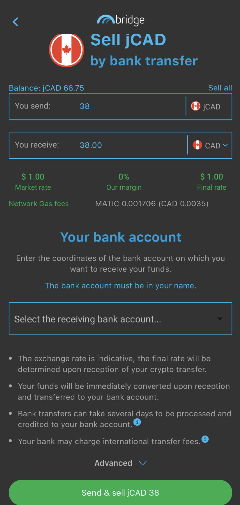
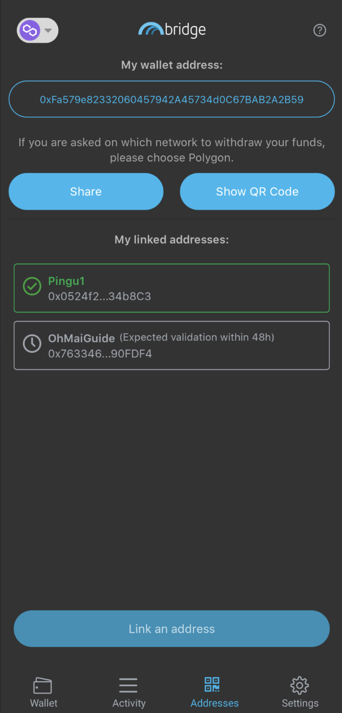

# 从传统金融到使用Jarvis的DeFi

并非所有稳定币都是平等的。对于大多数 DeFi（去中心化金融）用户来说，稳定币代表一种与美元挂钩的加密货币。像这样的资产就是这种情况：

* 由中心化实体发行并以美元为后盾的 USDC 或 USDT
* 与美元挂钩的超额抵押资产，如 DAI 或 MAI。美元，但由一篮子不同的加密货币支持
* 部分支持的算法稳定币，如 UST 或 MIM，使用特定算法维持 1 美元挂钩

但是你知道你可以找到其他稳定币吗？例如，TOMB 是一种使用算法与 FTM 价格（Fantom 网络的原生 gas 代币）挂钩的代币。

在本文中，我们将重点关注与 FIAT（政府发行的货币）挂钩的稳定币，并尝试解释它们为何对你的投资策略很重要。


请记住，在给定时间运作良好的策略可能在其他时间表现不佳（或让你赔钱）。请随时了解情况，监控市场，密切关注你的投资，并一如既往地进行自己的研究。


## 为什么我们需要合成FIATS？

假设你生活在一个欧洲国家并每天使用欧元。如果你要购买加密资产，你很可能会用欧元购买它们。对于像比特币这样的波动性资产，这并不重要，因为你将专注于比特币的欧元价格来评估你是否赚钱。希望你能做一些。

但是，如果你想投资 DeFi 和收益农业怎么办？如果为了降低风险，你只想使用稳定币提供流动性呢？许多链上的大部分稳定流动性都是作为与美元挂钩的资产提供的，这意味着你必须使用你的欧元购买 USDC/USDT/DAI/MAI。此时，你应该检查你提供的流动性是否会产生兴趣，但美元和欧元之间的价格差异是否对你不利。

如果你在 2021 年 9 月 20 日购买了价值 100 欧元的 USDC，那么你将拥有价值 117.29 美元的 USDC，因为当时欧元与美元的比率为 1:1.1729。如果你今天（2022 年 3 月 24 日）以 1:1.0994 的比率将价值 117.29 美元的 USDC 兑换成欧元，你将获得 106.69 欧元，或 6.69% 的收益。

但是，如果你在同一天（2021 年 9 月 20 日）以 1:0.7796 的比例购买了价值 100 加元（100 加元）的 USDC，那么你将拥有价值 77.96 美元的 USDC。今天将这些以 1:0.7972 的比率转换为加元，价值 97.79 加元，或损失 2.21%。

但是，无论如何，1 加元始终等于 1 加元，例如 1 美元 = 1 美元和 1 欧元 = 1 欧元。

每个国家的每种货币都因地缘政治局势、国内和国际政治、微观和宏观经济决策而异。这就是为什么你需要注意你的加密资产的价格变化，即使它们是“稳定的”。

## Jarvis Network和 Mt. Pelerin

### 什么的Jarvis Network

[Jarvis Network](https://jarvis.network/) 是一个专门的应用程序，允许用户[将他们的加密资产](https://app.jarvis.exchange/)换成合成法币。合成法币是一种与现有法币价格挂钩的加密货币。因此，Jarvis 会让你将你的 USDC 换成

* jCAD: 加元的加密版本
* jEUR: 欧元的加密表示
* jJPY: 日元的加密货币版本
* jSGD, jCHF, jGBP, 还有很多

因此，Jarvis 确实是一个链上外汇（外汇交易所），它存在于以太坊主网上，但也存在于 Polygon、BNB Chain、Gnosis Chain和 Avalanche 上。&#x20;

但它并不止于此。 Jarvis 提出了包括 jFIAT 在内的激励性流动资金池。这样做是为了吸引用户存入他们的 jFIAT 并在他们的稳定币上赚取收益（能够通过曲线池存入单一资产），帮助其他提供稳定币但没有大量流动性的协议，并使其易于DeFi 用户减少他们的收益。


你可以在上面的屏幕截图中看到 2CAD 对由 jCAD 和 CADC 组成。 CADC 代币实际上是另一种去中心化外汇解决方案 [DFX](https://app.dfx.finance/) 提供的加元的另一个版本。


### Mt. Pelerin

[Mt. Pelerin](https://www.mtpelerin.com/bridge-wallet) 是一个非托管法定加密场外交易柜台。它允许用户直接从他们的银行账户购买加密货币，并将它们直接存入他们的加密钱包。它也是 Jarvis 的直接合作伙伴，可让你购买 jFIAT。


使用 Mt. Pelerin 最简单的方法是通过 Bridge Wallet 移动应用程序。请注意，由于它是一项集中式服务，因此如果你希望能够使用该服务，则必须提供个人信息来证明你的身份。你还需要拥有一家允许你向瑞士进行银行转账的银行。但是，始终可以使用他们的网站，你可以在该网站上找到一个小部件，允许你通过银行转账或使用信用卡购买加密货币。这不受任何 KYC 约束，但有一些限制。请注意，通过使用该网站，你的购买将直接发送到你的网络钱包。不过，对于本指南的其余部分，我们将介绍 Birdge Wallet 解决方案。


银行转账可能会收取费用，并且很可能需要一些时间才能完成，但总体而言，Mt. Pelerin 让你可以轻松地为他们的 FIAT 对手买卖你的合成 FIAT。他们还有一个内部[费用结构](https://www.mtpelerin.com/pricing)，你可以更详细地阅读，并且根据你购买的资产，你每年可以免费买卖高达 100,000 美元。


如果你购买了 jFIAT，你的银行账户会自动链接到你的 Bridge 钱包账户，你可以从收款人的下拉列表中选择它。如果没有，你将必须从 IBAN 创建一个新帐户。


### 将你的 Polygon 钱包链接到你的 Mt. Pelerin 帐户（Bridge 钱包地址）

将你的钱包链接到你的 Mt. Pelerin / Bridge 钱包帐户就像

* 打开 Bridge 钱包应用程序
* 打开底部的地址选项卡
* 点击链接地址
* 为你的 Polygon 钱包的 QR 码拍照，或将完整地址复制并粘贴到字段中
* 向 Bridge 钱包地址发送一些 MATIC 进行验证


再次，你可以使用 Mt. Pelerin 网站上的小部件直接使用你的网络钱包（或硬件钱包）[购买](https://www.mtpelerin.com/buy-ehtereum)和[出售](https://www.mtpelerin.com/sell-ethereum)你的加密货币，而无需使用 Bridge 钱包。请参阅 Mt. Pelerin 网站。


### 将 jFIAT 发送到你的 Polygon 钱包

将你的 jFIAT 发送到 Polygon（或任何支持的链）上的钱包非常容易。在 Wallet 选项卡中，确保你位于要用作目的地的网络上并加载你的 jWallet 货币。

选择好要发送的 jFIAT 后，只需点击发送，填写不同的字段，然后发起交易，即可享受低 gas 和快速处理！


你可以在每个 jFIAT 的活动部分以及主屏幕上的“活动”选项卡上全面回顾所有交易。



Mt. Pelerin 是买卖加密货币和合成法币的一个非常好的解决方案。但是，如果你的朋友和家人也在使用该应用程序并且可能绕过复杂的银行转账或限制，你也可以使用此服务向他们汇款。


## 充分利用稳定的 jFIAT

你在 Polygon 上有合成 FIAT，所以现在我们需要一种巧妙的方式来使用它们。在介绍中，我们看到按原样使用它们可能是一个更好的主意，而不是用它们交换（出售它们）与美元挂钩的稳定币。

还要考虑一下这种情况：你有加元，想要一点点接触以太坊。如果你可以在不冒险实际购买以太坊的情况下购买以太坊，那不是很好吗？好吧，这就是借贷市场的目的！！！

### Market.xyz

[Market.xyz](https://www.market.xyz/) 是一种借贷协议，你可以在其中使用你的一些加密资产作为抵押品来借入其他资产。他们最近推出了一个 100% 专用于 Jarvis 合成法币的新池：https://polygon.market.xyz/pool/7。

如你所见，你可以借出 jFIAT 并从借款人那里赚取利息。储物柜还接受一些 LP（流动性提供）代币作为抵押品。这意味着你可以借出你的 m2CAD 或 m2JPY，仍然可以赚取约 27% 的 APY（年收益率），并借入 jCAD 或 jJPY 等其他 jFIAT 来利用你的头寸。你还可以借一些 MAI，这是由 Mai Finance 背后的 QiDAO 协议创建的与美元挂钩的稳定币。 QiDAO 社区同意定期提供新的 MAI，以维持 Market.xyz 上 Jarvis locker 的 MAI 贷款的低利率。


Market.xyz 储物柜的最低借款金额为 0.05 ETH，相当于 2022 年 3 月的 150 美元。由于你需要保持健康的抵押品与债务比率，如果你想贷款，请确保存入足够的抵押品在平台上。


对于 Polygon 上的任何借贷平台，Market.xyz 将强制执行健康的抵押债务比率。这就是每个抵押品的 LTV 所代表的（Loan To Value，CDR 的倒数）。例如，m2CAD 的 LTV 为 60%，这意味着你的债务与抵押品价值之间的比率需要保持在 60% 以上。

在 m2CAD 的情况下，抵押品与加元挂钩，与你将借入的 MAI（与美元挂钩）相比，可能会有所不同。但是，变化很小，所以理论上可以借到非常接近 60% 的阈值。对于我们的指南，我们将尝试坚持 200% 的 CDR，这对应于 0.4 (1 / 2.5 = 0.5) 的 LTV。为了能够借入所需的 0.05 ETH 的 MAI，我们需要抵押价值为

$$
AvailableCollateral = \frac{Debt Value}{LTV} = \frac{0.05 ETH}{0.4} = 300\$
$$

由于今天美元：加元的比率是 1:0.7972，我需要初始投资

$$
InvestmentCAD = \frac{300}{0.7972} = 376.32 CAD
$$


假设我投资了价值 300 美元的加元并借入了价值 150 美元的 MAI，我目前的抵押品将获得 27% 的年利率（23.91% 的年利率），并且必须为我的贷款支付 11.28% 的利息。在 1 年的时间里，我的抵押品增加了 81 美元，需要支付的利息为 16.92 美元。


现在让我们看看如何处理你的美元挂钩贷款。

### Uniswap V3

[Uniswap V3](https://app.uniswap.org/) 是 Uniswap 的最新版本，Uniswap 是许多 DEX（去中心化交易所）的父项目，用户将能够将他们的资产换成其他加密货币，并提供流动性来支持这些交换。

Uniswap V3 isn't incentivized on Polygon (yet), but offers a new way to provide liquidity: concentrated liquidity! You select the range on which you want to provide liquidity, and if the range is very narrow, you earn more fees than users who provide liquidity on a broader range. You can learn how to provide liquidity pairs on Uniswap V3 with [their official guide](https://help.uniswap.org/en/articles/5391541-provide-liquidity-on-uniswap-v3), and you can also watch the truly amazing [video by Finematics on UniswapV3](https://youtu.be/Ehm-OYBmlPM). Uniswap V3 尚未在 Polygon 上受到激励，但提供了一种提供流动性的新方法：集中流动性！你选择你想提供流动性的范围，如果范围很窄，你比提供更广泛范围流动性的用户赚取更多的费用。你可以通过[官方指南](https://help.uniswap.org/en/articles/5391541-provide-liquidity-on-uniswap-v3)了解如何在 Uniswap V3 上提供流动性对，还可以观看 [Finematics 在 UniswapV3 上的真正精彩视频](https://youtu.be/Ehm-OYBmlPM)。

在本教程中，我们将重点关注 MAI-USDC 对，因为我们借了一些 MAI，并且我们希望通过种植稳定币来限制风险敞口。&#x20;

首先要做的是定义一个目标范围。现在，由于流动性不断增加、更多池以及有助于保持价格非常稳定的曲线池等一些机制，MAI 的价格更加稳定），我们将 MAI:USDC 的利率设定为 1:1。实际上，1 MAI 更接近 0.998 USDC。

1 MAI 的预期价格范围在 0.99 到 1.01 USDC 之间，具体取决于市场情况。当波动性资产激增时，人们有更多的借贷能力，并且倾向于交换大量的 MAI，从而降低其价格。当市场萎缩并且人们需要偿还贷款以防止清算时，就会出现相反的效果：从市场购买 MAI 以偿还贷款，从而提高了其价格。事实上，实际价格范围往往在每 MAI 0.994 到 1.004 USDC 之间。

但是，你真正需要了解的是

* 如果你选择宽范围，你将比选择窄范围收取更少的费用，因为你的流动性分布在更大的范围内
* 如果选择一个狭窄的范围并且价格超出该范围，你将不会收取费用
* 你的流动性不会根据价格进行调整。如果你为 MAI:USDC 选择 \[0.99;1.01] 范围且 MAI 的价格为 0.99 USDC，你将拥有 100% MAI 和 0% USDC。另一方面，如果价格是每 MAI 1.01 USDC，你将拥有 100% USDC 和 0% MAI
* 如果你发现你的第一个设置没有收取足够的费用，你可以随时退出你的流动资金池并创建一个范围更广/更窄的新流动资金池
* 对于稳定币，最好设置 0.05% 的费用范围，以便 [zapper](https://zapper.fi/) 或 [1inch](https://app.1inch.io/#/137/) 等聚合器在用户交换其稳定币时选择你的池

为简单起见，我们将设置一个以 1.000 为中心的范围，每个 MAI 的 0.995 和 1.005 USDC 之间有 1% 的价差。


请注意你的货币对的代币顺序。确实，如果你选择MAI（mimatic）第一然后USDC，或者USDC第一和MAI第二，价格区间是不一样的！！！


根据你的设置，你可以预期以 MAI 和 USDC 支付的 LP 的年利率在 8%（宽范围）和 20%（窄范围）之间。这在很大程度上取决于 UniswapV3 上的价格走势和交易量。请记住，你还可以使用此工具以非常低的价格影响进行交易，并从你自己的交易中收取费用！

## 农耕策略

对于这个策略，我们将使用 Jarvis 作为我们的起点。为此，我们将使用通过 Mt. Pelerin 购买的 jCAD。 jCAD 将在 Curve Finance 上存入适当的池中，以获得 2CAD LP 代币。此 LP 代币将存入 Beefy，以便 Jarvis 提供的交换费和奖励代币可以复合成额外的 2CAD。作为存款证明，我们将收到 mooJarvis2CAD 代币，然后我们可以在 Market.xyz 上使用这些代币作为抵押，以 200% 的 CDR（50% LTV）借入一些 MAI。 MAI 贷款将用于在 UniswapV3 上创建提供流动性的代币，以便它可以按年利率 12% 收取掉期费用。

此初始设置可确保你不会受到美元相对于加元的价格变化的影响。此外，借入的金额在 UniswapV3 池中进行担保，可以随时偿还。

2CAD 和 UniswapV3 矿池的收益都将添加到“奖励助推器”中，即对初始投资或贷款影响为零但实际上会增加高回报率收益的矿池。你几乎可以使用任何奖励率高于 2CAD 池的池。它可以是 QuickSwap 上的流动资金池，如 cxDOGE/cxETH（截至 2022 年 3 月，APY 为 44.24%），甚至是 Klima 等ohm fork（截至 2022 年 3 月，APY 为 944%）。对于我们的模拟，我们将直接在 Jarvis Network 上使用 JRT-MAY22-USDC 池。流动性可以在 [Kyber Network](https://kyberswap.com/#/add/0x2791Bca1f2de4661ED88A30C99A7a9449Aa84174/0xF5f480Edc68589B51F4217E6aA82Ef7Df5cf789e/0xdaa2c66b06b62bad2e192be0a93f895c855484ee) 上购买/添加，并使用 USDC 和来自 Jarvis Network 的原生代币。此 LP 代币目前获得 143% 的年利率。

该策略专注于稳定币，但也存在许多可能的变化：

* 如果你更喜欢这些 FIAT 而不是 jCAD，你可以使用 2JPY 或 2SGD
* 你可以在 Market.xyz 上借出你的 jCAD（或任何 jFIAT）并向借款人收取借款费用
* 你可以将来自 Market.xyz 的贷款换成你将在 UniswapV3 上为其提供流动性的任何代币。选择你喜欢的池子，但要注意潜在的无常损失
* 你可以将在 UniV3 上收取的费用交换为 Mai Finance 上接受的任何费用（BTC、CRV、LINK、GHST ...），并使用在 [Mai Finance](https://app.mai.finance/) 上获得的贷款在 Market.xyz 上偿还你的贷款，实际上以 11% 的价格转移您的贷款以0％的利率贷款
* 你还可以使用收取的费用更快地偿还 Market.xyz 上的贷款
* 无限可能

与往常一样，我们将为模拟假设一些事情：

* 2CAD 的 APY 为 27% APY (23.91% APR)
* Market.xyz 上的贷款利率为 11.28%
* 你在 UniswapV3 上的头寸 APR 是 12%，因为你把它做得很大（更安全但效率更低）
* 你将在 Jarvis Network 上的 JRT-MAY22-USDC 奖励助推器上获得 143% 的年利率


如果你想为此系统运行模拟，你可以使用链接到该策略的 [Google 电子表格](https://docs.google.com/spreadsheets/d/10-n5IyZLl0GZyjM16SNuVOONNsfJ15pm2GL0e2MagzE/edit?usp=sharing)。只需更改不同的奖励率或所需的 CDR 即可估算你可以从此循环中获得的最终 APY。


### 第1天

你需要引导你的系统。这样做

* 在 Jarvis Network 上用价值 300 美元的 USDC 兑换 jCAD（或直接通过 Mt. Pelerin 购买 jCAD）
* 将 jCAD 存入 Curve Finance 的 [pool #23](https://polygon.curve.fi/factory/23/deposit)
* 将 2CAD LP 代币存入 [beefy finance](https://app.beefy.finance/#/polygon/vault/jarvis-2cad)
* 将强大的收据代币存入 Market.xyz
* 借用 CDR 或 200%（LTV 为 50%）的 MAI
* 在 Uniswap V3 上将你的部分 MAI 换成 USDC，并将 MAI 和 USDC 存入具有你选择的参数的新流动资金池

耕作第一天后，你应该

| 头寸             | 价值 ($)  |
| -------------- | ------- |
| mooJarvis2CAD  | 300.000 |
| 2CAD 奖励        | 0.197   |
| MAI-USDC UniV3 | 150.000 |
| UniV3 费用       | 0.049   |
| JRT-MAY22-USDC | 0.000   |
| Jarvis 奖励      | 0.000   |
| MAI 借贷         | 150.000 |

一切准备就绪，剩下的就是简单的维护并将奖励转移到 Jarvis 池中

### 日常维护

是时候将你的收益投入奖励助推器了：

* 在 Uniswap V3 上收获 MAI 和 USDC
* 提取 mooJarvis2CAD 的一小部分，对应于已复合的内容
* Jarvis Network 上的收获奖励
* 在 Kyber Network 上用 JRT-MAY22 和 USDC 交换所有东西，并创建 LP 代币
* 将 LP 代币存入 Jarvis Network

在第 2 天结束时，你将拥有

| 头寸             | 价值 ($)  |
| -------------- | ------- |
| mooJarvis2CAD  | 300.000 |
| 2CAD 奖励        | 0.197   |
| MAI-USDC UniV3 | 150.000 |
| UniV3 费用       | 0.049   |
| JRT-MAY22-USDC | 0.246   |
| Jarvis 奖励      | 0.001   |
| MAI 借贷         | 150.000 |

### 月复一月的原始结果

这是月复一月的原始结果，你可以在上面链接的 Google 电子表格中获得它们。

| 天数  | mooJarvis2CAD | MAI-USDC | JRT-MAY22-USDC | MAI debt |
| --- | ------------- | -------- | -------------- | -------- |
| 30  | 300.000       | 150.000  | 7.534          | 151.350  |
| 60  | 300.000       | 150.000  | 16.282         | 152.760  |
| 90  | 300.000       | 150.000  | 26.118         | 154.182  |
| 120 | 300.000       | 150.000  | 37.179         | 155.618  |
| 150 | 300.000       | 150.000  | 49.616         | 157.067  |
| 180 | 300.000       | 150.000  | 63.601         | 158.530  |
| 210 | 300.000       | 150.000  | 79.326         | 160.007  |
| 240 | 300.000       | 150.000  | 97.009         | 161.497  |
| 270 | 300.000       | 150.000  | 116.893        | 163.001  |
| 300 | 300.000       | 150.000  | 139.252        | 164.519  |
| 330 | 300.000       | 150.000  | 164.393        | 166.051  |
| 360 | 300.000       | 150.000  | 7.343          | 0.000    |

### 第365天

CDR 为 200%，N 将在第 11 个月内偿还全部债务，释放初始加元，如果你愿意，你可以将其转回你的银行账户，而且你仍然拥有

* 价值 150 美元的 MAI-USDC
* Jarvis 上价值 7.343 美元的 LP

总计 52.91% APY。


如果你从你的 2CAD 流动资金池中提取利润，并将其直接投资到 Jarvis 上的 JRT-MAY22-USDC 池中，而不在中间添加 Market.xyz，你将获得 52.68% 的总 APY。你可以查看 Google 电子表格的第二张表以了解详细信息，或将 CDR 设置为 1,000,000（无贷款）。


## 免责声明

本指南主要用于说明如何使用 Mt. Pelerin 和 Jarvis Network 将你的 FIAT 转换为加密资产（反之亦然）。对于非美国居民来说，这是一个非常好的机会，可以将资金从一个“世界”转移到另一个，影响很小，而且几乎不收费。你还可以在 Polygon 上获得合成 ​​FIAT，这一事实使其特别高效，因为天然气成本和交易时间对于 DeFi 来说仍然是最好的。

值得注意的是，越来越多的一级应用正在使用 jFIAT，尤其是 [AAVE v3](https://app.aave.com/markets/)，它开始提出 jEUR 和 EURS 借贷市场，促进了从 TradFi（传统金融）向 DeFi 的过渡。

本指南中提出的策略是假设所有价格和费率保持不变，这显然不是现实生活中发生的情况。在进行任何投资之前，请务必注意奖励借款利率，以便你可以偿还贷款。


本指南绝对不是财务建议，它是出于教育目标而制定的。你需要注意价格变化，供需，奖励计划，结束日期，无常损失等......目标不是提出可以盲目遵循的食谱，所以请做好功课和自己的模拟，并且只投资你准备好可能失去的东西。

