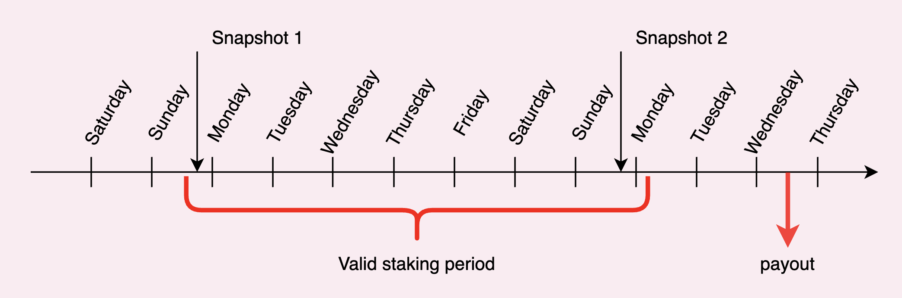
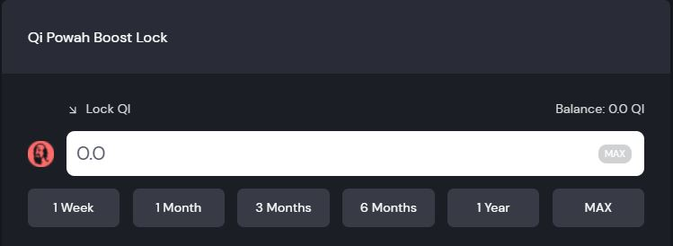

# Earning Passive Income with QiDAO

## Passive income through QI DAO?

Qi DAO lets you earn weekly share of the revenue earned by the protocol, precisely:

* 30% of weekly repayment fee revenue (plus a 25% boost).
* 100% of LP rewards received from using deposit fee revenue to farm on QuickSwap
* 30% of weekly USDC Swap fees.

This share of revenue is distributed to the people who stake and lock their QI tokens for a certain period of time, the rewards are then distributed in the form of QI tokens which is airdropped to your wallets directly. These rewards will be airdropped each Wednesday, and you can check your previous rewards [here](https://app.mai.finance/rewards).

## Introduction to snapshots

A snapshot is basically a recording of the the state of a blockchain on a particular block height, this means that the snapshot will record the contents of the entire blockchain ledger, which includes all existing addresses and their associated data (transactions, fees, balance, so on). Since Qi is on the Polygon blockchain we can check when the next snapshot is going to take place in [Polygonscan](https://polygonscan.com).

You become eligible for the rewards if you stake your Qi tokens for at least \~10 days depending on when you lock your tokens. In other words, a valid staking period should contain at least 2 snapshots, so you'll get paid the Wednesday following the 2nd snapshot.

This is an example of a bare minimal staking period. Of course, you can stake for a longer period of time, and there are actually benefits locking your Qi for a long period. The longer you lock, the bigger the reward boost will be (see [What is Qi Powah](earning-passive-income-with-qidao.md#what-is-qi-powah) and the [FAQ](earning-passive-income-with-qidao.md#faqs-of-qi-staking) for more details).

## Understanding Qi Boost and Qi Powah

Now that we know what a snapshot is, we are ready to start earning some passive income using Qi. In order to do so, we have to go to the [boost ](https://app.mai.finance/boost)page in Mai Finance.

### What is Qi Boost and Qi Powah?

Qi Boost is your opportunity to increase the power and rewards of your Qi. The longer you lock your Qi the greater your voting power (Qi Powah) and weekly reward share will be. You can boost up to 4x by locking Qi for 4 years. Your boosts slowly reduces over your locking period, eventually unlocking your Qi, however you can always increase your boost to maintain your boosted level. Your boosted Qi is represented in eQi (escrowed Qi) and will remain in escrow until your unlock date (non-transferable).

This can means that locking Qi have the following advantages:

* You can start earning weekly rewards just by locking your Qi tokens.
* As a DAO, your voice will matter and depending on how many Qi tokens you lock, and how much time it is locked, you'll have more voting power of what will happen in the community. You can check the currents proposals of Qi DAO [here](https://snapshot.org/#/qidao.eth).

### Locking your Qi

To lock your Qi tokens you need to go the Qi Powah Boost lock bar and select how many tokens do you want to lock and the time period for which you want to lock your Qi tokens. The longer the time period the more **eQi** you will get, remember that eQi is just how many Qi tokens you will have once the locking period is over.

Once you have decided all that, click on approve and approve the transaction, then click on `Increase locked QI and lock time` and confirm the transaction.


Please be aware that once you lock your Qi tokens for a given period, there's no way to unlock them before the lock period is over. Please be very cautious and aware when using this feature.


Congratulations, now you are officially a Qi staker you will receive on the following weeks a weekly pay check. If you have any doubt wether you are qualified for the next week's revenue sharing, you can see on the boost page if you are qualified or not.

.jpg>)

### Stats of the Qi Powah

If you want to check the stats of the Qi Boosting, you can go to this [page ](https://app.mai.finance/boost/stats)to check the amount of Qi locked, as well as the average lock time or the revenue that the protocol earn each week.

## FAQs of Qi Staking

* **When do I have to lock my QI?**

Snapshots are on Sunday and they record who has locked their $QI for at least a week at the time of the snapshot. If you do, you qualify for a share of the revenue for the upcoming week

* **Where can I see when is the snapshot?**

Check the boost page, copy the “Next blocks” first number and paste it on Polygonscan. It will tell you the exact estimation time of the snapshot.

* **For how long do I have to lock my QI?**

At he moment of the snapshot it has to be locked at least 1 full week. If you want to make 100% sure that you will be eligible, we recommend to lock for 2 weeks or more.

* **When do I receive my rewards?**

Every Wednesday, they will be either airdropped to your wallet or collectable from rewards page. Timing might be somewhat flexible, please be patient as the team has to verify before release them.

* **But I locked almost 2 weeks ago and I didn’t receive anything yet!**

There’s a few possibilities here: Either everything is fine but you still have to wait until next Wednesday, or at the moment of the snapshot it was locked for less than a week. Rewards are distributed roughly 10 days after snapshots.

* **What tokens will I receive?**

$QI staking rewards are distributed in $QI.

* **Where do these rewards come from?**
  * 100% gains from farming deposit fee revenue ($2,245,681 used to farm as of week 14)
  * 30% of repayment fee revenue ($18,362 average weekly revenue)
  * 30% of Anchor/Swap fee revenue ($178,365 average weekly revenue)
* **What is eQI and what can I do with it?**

eQI (escrowed QI) represents the boost that you're getting on your voting power and Qi rewards. So for the purposes of voting and getting Qi rewards, 1 eQi counts as 1 Qi

* **But wait, I locked to get rewards. What’s this voting power?**

QiDao is a DAO (Decentralized Autonomous Organization) and the future of the protocol is decided by the community. As a holder of $QI you are entitled to vote on QIP (QiDao Improvement Proposals) published on Governance page.

* **What APR can I expect by locking $QI?**

Every week is different as the rewards depends on how much eQI there is and how much revenue did the protocol collect that week. You can get some estimates from the eQI APY on boost page, the boost stats and the weekly updates where we share past revenues.

* **Can I add more QI to my current staking or make it last longer?**

Yes, you can do both without affecting your current staking. Just select the amount, the time to add, click increase and confirm.

* **Can I lock my QI for different amounts of time?**

Currently that’s not possible within the same account. However, you can quickly do that by adding a new account to your wallet. That way you can lock for a long time with your main one and for shorter periods of time with a secondary address.

* **What will happen when the lock time is due?**

You will have to click withdraw and will receive in your wallet the same amount you initially locked. But I locked for 4 years and see that I have 4 times more eQI than QI locked That’s normal. eQI will gradually decrease as time passes by and in the end it will be equal to your initial QI. In the meantime you will enjoy a boost on your voting power and weekly rewards.

## Disclaimer

You can find an article on a similar topic covered by Genkham [here](https://medium.com/@GenKham/earning-passive-income-with-qi-dao-b92a6a3721bd).

This guide is definitely not financial advice, it was made with an educational goal in mind. The goal wasn't to propose recipes that can be followed blindly, so please do your homework and your own simulation, and only invest what you're ready to possibly lose.


Keep in mind that a strategy that works well at a given time may perform poorly (or make you lose money) at another time. Please stay informed, monitor the markets, keep an eye on your investments, and as always, do your own research.

