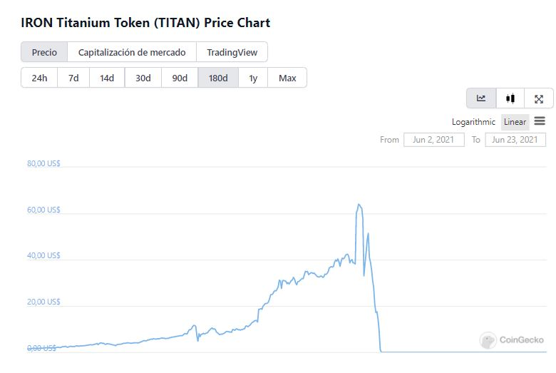
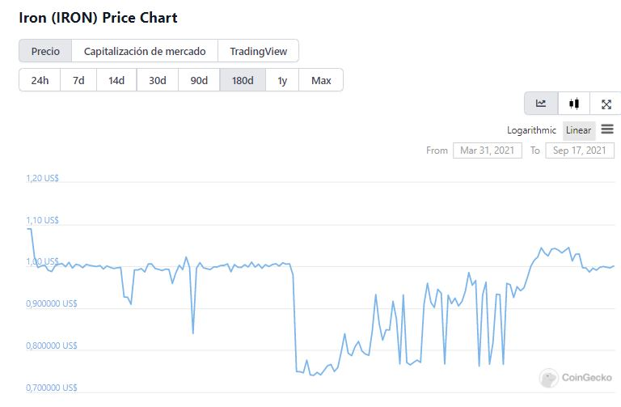

# MAI nasıl çalışır?

***

description: >- Mai Finance'i gerçekten anlamak isteyen herhangi bir yatırımcı için MAI'nin nasıl çalıştığını iyi anlamak çok önemlidir. Bu makalede MAI'nin nasıl çalıştığını anlatacağız.

## MAI nasıl çalışır?

### Stablecoin nedir?

MAI'nin ne olduğuna girmeden önce, stablecoin'in ne olduğunu anlamalıyız. Stablecoin istikrarlı bir şekilde piyasa fiyatını korumak için tasarlanmış bir tür kripto para birimidir. Stabilcoinlerin çoğu (fiyatın belirlenmiş bir varlıkla aynı kalacak şekilde tasarlandığı bir para birimi) ABD dolarına sabitlenir, ancak altın (EGold gibi) veya gümüş gibi diğer emtialara sabitlenmiş diğer sabit madeni paraları da bulabilirsiniz (Silvercoin).

Bununla birlikte, tüm stabilcoinlerin tanımlanabileceği 2 ana kategori vardır, **teminatlı** veya **teminatsız**. **Teminatlı** stablecoinler, paralarının sabitlendiği varlıkları tutanlardır. **teminatsız**, fiyatı önceden belirlenmiş bir seviyede sabit tutmak için token arzını kontrol etmek için algoritmalar kullanır.

### IRON Finance felaketi

Bir süredir kriptodaysanız, **TITAN** ve **IRON** token felaketini hatırlayabilirsiniz. Bu çılgınlığı yapmayanlarınız için kısa bir özet geçelim. IRON Finance, _IRON_ stablecoin ve _TITAN_ token olmak üzere 2 tokena sahip bir projeydi. Fakat IRON **tam olarak stablecoinlerle desteklenmedi**, IRON'un darphanesine oran **%75 USDC** ve **%25 TITAN** şeklindeydi. Yani temelde felaket için muazzam bir reçeteydi.

Haziran 2021'de TITAN tokeni 65 $'lık bir ATH'ye ulaştı ve bu da tokena büyük yatırım yapan bir grup yatırımcının satmaya karar vermesine neden oldu. Bu bir soruna neden oldu çünkü TITAN arz ve talebe göre fiyatlandırılmaktaydı. TITAN'ın mevcut arzı arttıkça fiyat düşmeye başladı. Bu da büyük bir satış baskısına neden oldu ve bu yüzden TITAN'ın fiyatı daha da hızlı düştü. TITAN anormal hızla düşmeye başladığında IRON desteğini ve sonunda sabitleyicisini kaybetti.

İnsanlar, büyük bir arbitraj fırsatıyla USDC'ye satmak ve hızlı paralar kazanmak için IRON satın almaya başladılar (bu, tokenların fiyat değişikliklerinden kâr etmek anlamına gelir) Uzun lafın kısası, bu olayda yaklaşık 1,75 milyar doların kaybedildiği hesaplandı. Şimdi, IRON stablecoin ile MAI arasında bir fark var mı birlikte inceleyelim.

### MAI nedir?

MAI, kilitli teminat tokenlar tarafından desteklenen fiyat istikrarına sahip bir tokendırç MAI'nin basımı, kasalara **onaylı teminat** yatırılarak veya **Anchor** kullanılarak yapılabilir.

MAI yatırma onaylı teminatı basarken, **CDR** (Borç Oranına Teminat) %150 arasında olmalıdır. Yani 100$ değerinde teminat yatırırsanız, yeni basılan MAI'nin en fazla 66.6667$ değerinde olabileceği anlamına gelir.Yazının devamında bunun arkasındaki nedene geleceğiz.

MAI'yi basmanın başka bir yolu da [Anchor](https://app.mai.finance/anchor) aracılığıyladır. Stablecoin değiştirdiğinizde (Eylül 2021'den itibaren MAI'yi **DAI** kullanarak basabilirsiniz, **USDC** ve **USDT**), MAI için yeni MAI hazine tarafından basılıyor ve yatırılan stabilcoin hazinede teminat olarak tutuluyor. Bu arada, stablecoin'lerinizi geri değiştirdiğinizde, sağladığınız MAI yakılacaktır.

.png>)

Aşağıdaki resimde görebileceğiniz gibi, MAI fiyatı neredeyse her zaman 1$'a yakındır, çünkü [resmi belgelerde](https://docs.mai.finance/stablecoin-economics) belirtildiği gibi, MAI fiyatı 0,99 ABD dolarının altına düştüğünde veya 1,01 ABD dolarının üzerine çıktığında kullanıcıların Anchor aracılığıyla risksiz arbitraj yapmalarına olanak tanır.

 (1) (1) (2) (2).png>)

### Neden her zaman 1$'a yakın?

$1'a sabitleme, **Anchor** aracılığıyla veya kasalara **teminat yatırılarakk** olmak üzere 2 mekanizma tarafından korunur. Makalenin bu bölümünde nedenini anlayacaksınız.

#### Anchor

Anchor, kullanıcıların MAI'yi basmasına ve MAI'den stablecoin kullanmasına olanak tanır. Ayrıca, aşağıdaki resimde de görebileceğiniz gibi, stabil coinlerinizi MAI ile değiştirirken ya da tam tersi için %1 ücret alınır, bu ücretin iki ana nedeni vardır:

* MAI oluşturmak için %1 para basma ücreti 1,01$'lık bir tavan fiyat belirler.
* MAI'den sabit paraları kullanmak için %1'lik ücret, 0,99 $'lık bir taban fiyat belirler

.png>)

Bir fiyat tavanı ve taban tabana sahip olmak, MAI'nin sabitinden çok fazla uzaklaşmamasına yardımcı olur, ancak MAI grafiğinin resminde gördüğünüz gibi, düşük riskli arbitraj fırsatlarına katılabilirsiniz (yani ahırınızı satabilirsiniz). MAI 1 doların altındayken farklı tokenlar veya hızlı para kazanmak için 1 doların üzerindeyken MAI satar).

MAI fiyatının dalgalanmasına neden olan şey hakkında, bunun iki ana nedeni olabilir:

* **Piyasa düşüş eğilimindeyse**: insanlar değişken varlıklarını satacak ve değişken varlıkların değerini kaybetmemek için daha istikrarlı paralar alacak. Bu, insanların MAI'yi satın almak ve fiyatını artırmak istedikleri anlamına gelir.
* Eğer **piyasa yükseliş eğilimindeyse**: insanlar fiyatları düşükken istikrarlı paralarını kullanarak daha değişken varlıklar satın alırlar. Bu, insanların MAI'lerini satarak fiyatını düşürdüğü anlamına gelir.

#### Teminatların kasalara yatırılması

Mai Finance'deki kasaları kullanarak MAI basmak için, oraya bir miktar teminat yatırmanız ve belirli bir eşiğin üzerinde bir **CDR** (Borç Teminat Oranı) olması gerekir. Oran %150'dir (ancak bu yüzdeye topluluk karar verirse gelecekte değişir).Basılan stablecoinleri desteklemek için her zaman teminat değeri olduğundan emin olmak için kasaların her zaman aşırı teminatlandırılacağı (%150) anlamına gelir. Bir kasanın %150'den az CDR'si varsa, topluluk tarafından kısmen tasfiye edilebileceğini, böylece bir tasfiye memuru borcunun bir kısmını öderse birilerinin teminatlarının bir kısmını kaybedebileceğini unutmayın.

Teminatın değeri arttıkça, teminat fiyatındaki artış teminat / borç oranınızı artıracağından daha fazla stablecoin basılabilir. Tersine, teminatın değeri düştükçe, daha az stablecoin basılabilir. Basım CDR'nin %150 işaretinin altına düşmesini önlemek için yapılır.

### Son Söz

Bu makale boyunca gördüğünüz gibi, MAI stabilcoin, **fazla teminatlandırılmış** bir stabilcoin türüdür. MAI fiyatını desteklemek için her zaman yeterli teminat olacaktır. Makalenin amacı stablecoin basan projelere yatırım yapmaktan çekinen yatırımcılara yeterince rahatlama sağlamalıdır. Ayrıca, MAI diğer blok zincirlerine genişledikçe, piyasada daha fazla MAI olacağını ve bunun sonucunda MAI'nin fiyatında daha az oynaklık olacağını unutmayın.

Son zamanlarda, Mai Finance'e bazı teşvikler tanıtıldı. Bunun ne olduğunu anlamak istiyorsanız, bizi izlemeye devam edin çünkü bu konuyla ilgili bir makale olacak. İçerik MAI fiyatının istikrarına daha da yardımcı olacaktır.

### Sorumluluk Reddi

Mai Finance ekibinin MAI hakkındaki orijinal makalesini [burada](https://docs.mai.finance/stablecoin-economics) bulabilirsiniz.

Bu rehber kesinlikle finansal tavsiye değildi. Eğitim amaçlı hazırlanmıştır.


Belirli bir zamanda iyi çalışan bir stratejinin başka bir zamanda kötü performans gösterebileceğini (veya para kaybetmenize neden olabileceğini) unutmayın. Lütfen olan bitenden haberdar olun, piyasaları takip edin, yatırımlarınızı takip edin ve her zaman olduğu gibi kendi araştırmanızı yapın.

