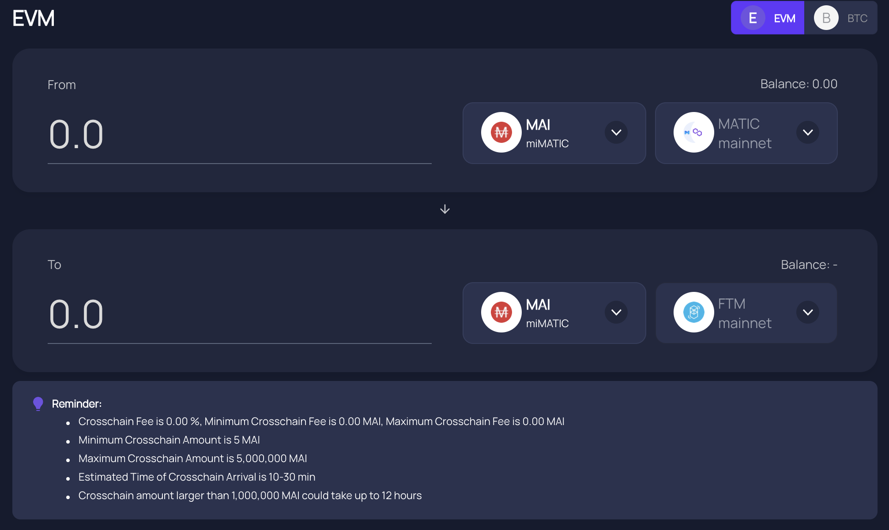

# MAI Metaverse

## Giriş

Bazen miMATIC olarak adlandırılan MAI, Polygon ağından gelen ilk stablecoindir. 1,00 ABD dolarına sabitlenmiştir ve değeri muhtemelen 0,99 ABD Doları ile 1,01 ABD Doları arasında dalgalanabilir. Sabitlemenin nasıl muhafaza edildiği hakkında daha fazla bilgiyi [resmi belgelerde](https://docs.mai.finance/stablecoin- economics) bulabilirsiniz. MAI'nin yalnızca bu ağda bulunmasının Polygon'a özgü olması değildir. Aslında, DAI'yi farklı ağlarda bulabildiğiniz gibi (DAI aslında Ethereum Mainnet'ten gelen başka bir stablecoindir), MAI yavaş ama emin adımlarla diğer ağlara da yayılıyor. Bu makale, MAI'yi bulabileceğiniz farklı ağları ve MAI'nizi bir ağdan diğerine nasıl aktarabileceğinizi vurgulayacaktır.

## Polygon

### Polygonda MAI Alma

Açıklandığı gibi, MAI Polygon'a özgüdür ve MAI'yi basabileceğiniz tek yer (Eylül 2021'de olduğu gibi) burasdır.

* daha önce Mai Finance'te bir kasaya yatırdığınız bazı teminatlara karşı MAI ödünç almak
* [Mai Finance](https://app.mai.finance/anchor) üzerinde MAI için USDC'yi değiştirme
* Polygon'daki herhangi bir DEX'te (**D**ecentralized **EX**change) başka bir varlık satmak ve MAI satın almak, en verimli olanı [Zapper](https://zapper.fi/exchange), [Dengeleyici]( https://polygon.balancer.fi/#/trade) veya [1Inch](https://app.1inch.io/#/137/classic/swap).

### Polygon'da MAI Kullanımı

MAI, özellikle QuickSwap gibi büyük projelerde diğer stablecoin olarak kullanıldığından, Polygon'daki daha fazla projede kullanılıyor. Eylül 2021 itibarıyla, QuickSwap'ta toplam 18.327.604 ABD doları tutarında 3 stable çiftlik vardır:

* 6.553.255 $ ile MAI-DAI
* 6.316.026 $ ile MAI-USDT
* 5.458.323$ ile MAI-USDC

Diğer projelerde / verim çiftliklerinde / verim optimize edicilerde ek havuzlar bulunabilir. MAI ile ne yapacağınızla ilgili daha fazla bilgiyi [özel makalede](../polygon-tutorials/what-to-with-mai-on-polygon.md) okuyabilirsiniz.

## Solana

### Solana'da MAI Alma

Solana, merkezi olmayan uygulamalar için bir blok zinciri platformudur. Ağın amacı, düşük ücretler (0.01$'dan az) ve hızlı (400ms'den az) işlemler önermektir. Bunun arkasındaki fikir, Ethereum Mainnet ve yan zincirlerine bir alternatif yaratmaktır. Solana'nın aynı varlıkları desteklememesi Ethereum ağının doğrudan rakibi olduğu için değildir. Gerçekten de, Solana artık Polygon'dan köprülenebilen MAI sabit parasını destekliyor (burada basılabilir).

MAI tokenlarınızı Solana'ya göndermek için tokenları bir zincirden diğerine aktarmanıza izin veren bir köprü platformu olan [AllBridge](https://allbridge.io) kullanabilirsiniz. AllBridge aşağıdaki ağları destekler:

* Ethereum Ana Ağı
* Polygon
* Solana
* Huobi
* Binance Smart Chain

Arayüz, iki ağı ve ikisi arasında aktarmak istediğiniz varlığı seçmeniz gerektiği anlamında gerçekten sezgiseldir.

Bir sonraki adım, Solana cüzdanınızın adresini ve aktarmak istediğiniz tutarı belirtmektir. MetaMask'in Solana cüzdanlarını desteklemediğini unutmayın (henüz?), bu ağda ayrı bir cüzdan oluşturmanız gerekecek. MetaMask gibi bir web cüzdanı veya bir uygulama cüzdanı olabilir. Lütfen birini seçmeden önce [Solana'nın resmi önerilerini](https://docs.solana.com/wallet-guide) okuyun.


Bir sonraki adım, Solana cüzdanınızın adresini ve aktarmak istediğiniz tutarı belirtmektir. MetaMask'in Solana cüzdanlarını desteklemediğini unutmayın (henüz?), bu ağda ayrı bir cüzdan oluşturmanız gerekecek. MetaMask gibi bir web cüzdanı veya bir uygulama cüzdanı olabilir. Lütfen birini seçmeden önce [Solana'nın resmi önerilerini](https://docs.solana.com/wallet-guide) okuyun.


### Solana'da MAI Kullanma

Likidite ve çiftlik verimi sağlamak için MAI'yi Polygon'da nasıl kullanabiliyorsanız, aynısını Solana'da da yapabilirsiniz. MAI'yi kullanabileceğiniz ana yer MAI/USDC havuzundaki [Saber](https://app.saber.so)'dur.

Saber'daki MAI/USDC havuzu hakkında bilinmesi gereken iyi şeylerden biri, QuickSwap'taki LP (**L**iquidity**P**roviding) havuzlarının aksine, bir oran ile LP çiftleri sağlamanız gerekmemesidir. 1:1. Tek bir varlık (**MAI** veya **USDC**) veya her iki stablecoinin bir oranını basitçe yatırabilirsiniz.

Bu durum, USDC ile takas etmek zorunda kalmadan Mai Finance'ten %100 MAI mevduatı kullanabileceğiniz anlamına gelir. Oldukça kullanışlıdır ve 2 stablecoin arasındaki küçük fiyat farklılıklarından etkilenmeyi önler. Polygon üzerinde QuickSwap'ta çiftçilik yapıyorsanız, QUICK olarak ödenecek ödüllerle aynı şekilde çiftlik tokenında ödenen ödüller alacağınızı unutmayın. Ardından, MAI/USDC pozisyonunuzu artırmak için tokenlerinizi satabilirsiniz.


Solana'da, Sabre'in ödüllerini otomatik olarak birleştirecek bir toplayıcı olan [Sunny](https://app.sunny.ag) kullanabilirsiniz. Sunny toplayıcının Mai Finance ekibi tarafından doğrulanmadığını unutmayın. AllBridge ve Sabre, Mai Finance'in resmi ortaklarıdır. Ancak sonuçlar garanti edilmez. Lütfen her zamanki gibi kendi araştırmalarınızı yapın.


## Avalanche

### Avax'ta MAI Alma

Avalanche, açık kaynaklı bir platform ve DeFi uygulamalarına ve kurumsal blok zinciri çözümlerine katman 1 protokolü sağlamak üzere tasarlanmış bir blok zinciri ağıdır. Ethereum Mainnet, Polygon ve Solana ile aynı varlıkları da destekleyen Ethereum Mainnet'e başka bir alternatif çözüm diyebiliriz. Artık MAI'nizi Polygon'dan (Eylül 2021 itibariyle MAI basabileceğiniz tek yer) [Relay Chain](https://app.relaychain.com/#/transfer) kullanarak Avax'a gönderebilirsiniz.

AllBridge'e gelince, kullanıcı arayüzü oldukça basittir. Varlığın köprü olacağı ağı, hedefini ve aktarılacak varlığı seçmeniz yeterlidir.

Metamask, [Avax cüzdanlarını](https://support.avax.network/en/articles/4626956-how-do-i-set-up-metamask-on-avalanche) **destekler**, yani Solana gibi ek bir cüzdana ihtiyacınız yoktur.

### MAI'yi Avax'ta Kullanma

MAI'yi Polygon'da verim toplamak için kullanabileceğiniz gibi, MAI'yi Avalanche'da da kullanabilirsiniz. Bunu yapmak için ana yer, bir MAI/USDC havuzu bulacağınız [Trader Joe'nun çiftlikleri](https://www.traderjoexyz.com/#/farm).

Avalanche'daki çiftlikler, Polygon'da bulabileceklerinize çok yakın çalışır. Bu nedenle, Trader Joe'nun uygulamasını QuickSwap'ı kullandığınız şekilde kullanabilirsiniz. Önce sitede aynı MAI ve USDC oranını kullanarak bir LP çifti oluşturmanız, ardından LP çiftini çiftliğe yatırmanız gerekir. QuickSwap'ta çiftçilik yaparken QUICK olarak ödeme aldığınız gibi, Trader Joe'da çiftçilik yaparken JOE tokenları ile ödüllendirileceksiniz. Daha sonra bu tokenları diğer havuzlarda kullanabilir veya MAI/USDC çiftinizi artırmak için satabilirsiniz.

## Fantom

### Fantom'da MAI Alma

Fantom, amacı diğer ağların yani Ethereum blok zincirinin ölçeklenebilirlik sorunlarını çözmek olan bir blok zinciri / akıllı sözleşme platformudur. Geliştiriciler, DApp'lerini (**D**ecentralized **A**pplication) bu ağda oluşturabilir ve diğer ağdakiyle aynı varlıkları kullanabilir. Bu nedenle, [AnySwap](https://anyswap.exchange/#/bridge)'nin köprüsünü kullanarak MAI'yi Polygon'dan Fantom'a köprüleyebilirsiniz.

AnySwap başka bir köprüleme çözümüyse, kullanıcı arayüzü AllBridge ve Relay Chain'inkine çok benzer. Polygon'dayken, önce MetaMask cüzdanınızı bağlamanız, ardından köprülemek istediğiniz varlığı (MAI) ve hedef ağı (Fantom) seçmeniz gerekecektir.

Metamask, [fantom cüzdanlarını](https://docs.fantom.foundation/tutorials/set-up-metamask) **destekler**, bu nedenle MAI'nizi Fantom'a almak ve doğru kullanmaya başlamak için ayarlamak oldukça kolaydır.

### MAI'yi Fantom'da Kullanma

Şu anda, Mai Finance ekibinin Fantom'daki herhangi bir verim çiftliği ile herhangi bir ortaklığı bulunmamaktadır. Ekip, MAI kullanan projelerden haberdar olduğunda bu belgeler güncellenecektir. Bizi izlemeye devam edin.

## Sorumluluk Reddi

Bu kılavuzda sunulan ayrıntılar tamamen eğiticidir ve bu kılavuzun bakımını yapan ekip tarafından doğrudan test edilmemiştir. Discord sunucusundaki birkaç kullanıcı, varlıklarını Solana ve/veya Avalanche'a bağlamayı denedi, böylece sorularınızı sormak için Discord topluluğuna katılabilirsiniz. Lütfen kendi araştırmalarınızı yapmayı unutmayınız, farklı ağların farklı işlem ücretleri ve uygulama süreleri, farklı ödül programları, köprüleme ücretleri vb. olacaktır... MAI'nizi başka ağlara gönderirseniz, herhangi bir durumda onları geri gönderebileceğinizden emin olun.


Belirli bir zamanda iyi çalışan bir stratejinin başka bir zamanda kötü performans gösterebileceğini (veya para kaybetmenize neden olabileceğini) unutmayın. Lütfen gelişmelerden haberdar olun, piyasaları takip edin, yatırımlarınızı takip edin ve her zaman olduğu gibi kendi araştırmanızı yapın.

