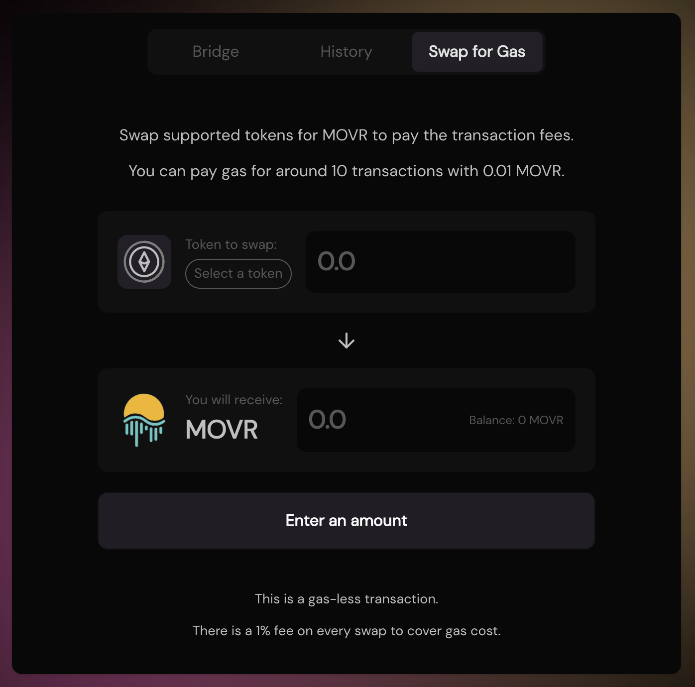
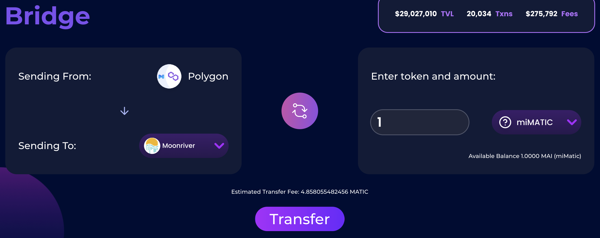

# Come iniziare con Moonriver

## Cos'è Moonriver?

Sarebbe complesso spiegare cos'è Moonriver senza parlare anche di altre chain, tra cui MoonBeam, Kusama e Polkadot.

Polkadot è una blockchain L1 che compete direttamente con Ethereum, Cosmos o Eos e l'obiettivo della chain è far crescere un ecosistema completo di crypto valute e applicazioni. Uno dei punti principali che rende Polkadot diverso dagli altri L1 è la sua composizione fatta di una chain principale (la relay chain) ed altre chain ad essa collegata (Parachain). La relay chain beneficia di bassi requisiti in termini di risorse di calcolo poiché le operazioni più complesse nonchè i test vengono effettuati sulle parachain. Le parachain si appoggiano alla relay chain solamente per mantenere la sicurezza delle stesse. Ciò crea ambienti isolati che possono funzionare in modo autonomo che non condividono i dati dell'utente con la blockchain principale.

Kusama è un ambiente di pre-produzione per Polkadot, una chain separata che imita la relay chain principale di Polkadot e in cui vengono testati prima tutti gli sviluppi e gli aggiornamenti per la chain principale. In quanto ambiente di pre-produzione, Kusama opera con crypto valute reali e transazioni reali beneficiando però di regole più flessibili rispetto a Polkadot. Tuttavia, l'obiettivo delle applicazioni e delle side chain sviluppate su Kusama è quello di migrare a Polkadot in un secondo momento. Grazie alle regole più flessibili, è più facile per un progetto testare le cose e far crescere una comunità durante lo sviluppo del protocollo. Una volta che il prodotto finale è pronto, tutto può migrare nell'ambiente di produzione.

Moonriver è in realtà una parachain di Kusama. Il codice distribuito su Moonriver è una versione di prova del codice che può essere distribuito su Moonbeam, la versione di produzione di Moonriver su Polkadot. Una volta che il codice è stato convalidato su Moonriver, può essere spedito a Moonbeam. Moonbeam e Moonriver sono 2 chain compatibili con EVM, il che significa che accettano gli stessi smart contracts di altre chain compatibili con la rete Ethereum. Per questo motivo, Moonriver è diventata rapidamente il punto di ingresso di molte DApp (**A**pplicazioni **D**ecentralizzate) che volevano espandersi dalla rete Ethereum (Eth Mainnet, Polygon, Avalanche, Fantom ...) alla rete Polkadot.

Come altre chain compatibili con EVM, Moonriver utilizza un token gas utilizzato per verificare le transazioni: il token $MOVR.

## Primi passi con Moonriver

Prima di utilizzare la rete Moonriver, avrai bisogno di un indirizzo per il portafoglio. Poiché Moonriver è una rete EVM, accetterà gli stessi portafogli di altre chain EVM, inclusi quelli web come Metamask o Nifty oltre a poter utilizzare il tuo portafoglio hardware come Trezor o Ledger, anche se potresti dover seguire qualche passaggio extra per connettere un cold wallet. Puoi trovare una guida passo passo molto chiara sui doc ufficiali della [moonbeam foundation](https://moonbeam.foundation/tutorials/how-to-create-moonriver-ethereum-address/).

Per questo tutorial, useremo Metamask come per tutte le altre guide su questo sito. Se non hai Metamask installato, puoi trovare le istruzioni su [Come iniziare con Polygon](https://qidao-qimps.gitbook.io/mai-finance-tutorials/v/italian/tutorial-di-polygon/come-iniziare-con-polygon).

### Aggiungere Moonriver a Metamask

In teoria, Moonriver viene preinstallato con MetaMask, il che significa che non dovresti aggiungere le informazioni sulla chain per far funzionare Metamask. Tuttavia, potrebbe essere una buona idea verificare che la tua configurazione sia corretta controllando due volte i valori salvati nel tuo portafoglio locale. Apri il popup Metamask, fai clic sull'icona del tuo portafoglio, vai su`Settings` e chose `Networks` e scegli `Moonriver`. I dati che dovresti vedere sono i seguenti:

* **Network Name:** Moonriver
* **New RPC URL:** https://rpc.moonriver.moonbeam.network
* **Chain ID:** 1285
* **Currency Symbol:** MOVR
* **Block Explorer URL:** https://blockscout.moonriver.moonbeam.network/

Salva le modifiche e Metamask passerà automaticamente alla rete Moonriver:

## Trasferire assets da un'altra blockchain verso  Moonriver (Bridging)

### Faucets

Uno dei più grandi DEX su Moonriver, SolarBeam, offre [una transazione di swap gasless](https://app.solarbeam.io/bridge/gas-swap) nel caso restiate senza. Questo presuppone che abbiate dei fondi su Moonriver, ma non possiate fare nulla perché avete 0 MOVR nel portafoglio.

Nota che solo alcuni assets sono accettati per questa transazione senza gas e $MAI non fa parte delle coin supportate.

### Bridges

* [Relay Chain](https://app.relaychain.com/transfer#/) è il partner ufficiale di Mai Finance se volete trasferire i $MAI a Moonriver da Polygon. Quando siete connessi a Polygon, potete semplicemente scegliere la chain di destinazione (Moonriver) e l'asset che volete inviare ($MAI o $miMATIC) con l'importo corretto e fare clic sul pulsante Transfer. Attenzione alle spese di trasferimento.

* Se avete bisogno di trasferire altri assets da un'altra rete, potete usare Relay Chain (vedi sopra), [AnySwap](https://anyswap.exchange/#/bridge) per trasferire da Eth Mainnet e ovviamente potete usare la funzione bridge di [Solarbeam](https://app.solarbeam.io/bridge).
* Una nota speciale per [Elknet](https://app.elk.finance/#/elknet) che è in grado di fare sia da bridge che da faucet quando trasferite il token $ELK tra 2 chain. Sarete in grado di trasferire i vostri $ELK e sulla chain di arrivo avere una piccola parte dei vostri $ELK già convertiti nel token gas, $MOVR nel nostro caso.

### Hub

Nel caso in cui trasferiate $MAI da Polygon a Moonriver tramite Relay Chain, otterrete la versione RelayChain di $MAI invece del $MAI nativo coniato dall'applicazione su Moonriver. I 2 token (quello di RelayChain e quello di Mai Finance) hanno lo stesso valore e lo stesso nome, ma indirizzi di contratto diversi e l'unico che sarà accettato per le farm su Moonriver è quello di Mai Finance.

Potete scambiare i $MAI da Relay Chain usando [il Bridge Hub di Mai Finance](https://app.mai.finance/hub) con un rapporto 1:1 e sarete in grado di utilizzare i vostri $MAI su altre piattaforme.


Come nota a margine, se volete trasferire $MAI da Moonriver a Polygon o altre chain, dovrete prima convertirli nuovamente nella loro versione RelayChain.


## DeFi su Moonriver

Moonriver sta ottenendo molta trazione e sempre più applicazioni si stanno spostando su questa nuova chain, avendo le potenzialità di migrare completamente a Polkadot. Pertanto, sarete in grado di farmare sulle seguenti piattaforme (l'elenco non è completo):

* [Solarbeam](https://app.solarbeam.io): Questo è il principale DEX e AMM su Moonriver. Sarete in grado di scambiare i vostri assets, partecipare al liquidity mining fornendo coppie LP (**L**iquidity **P**roviding) nelle farm o mettere in stake il token nativo della piattaforma. Solarbeam è anche uno dei primi partner di Mai Finance su Moonriver e potrete farmare la coppia $MAI-$MOVR. Troverete anche un pool $MAI-$USDC che non riceve ricompense ma potrebbe ricevere commissioni di scambio.

Quando farmate su Solarbeam, sarete ricompensati in token $SOLAR che potrete mettere in stake in un Vault per un certo periodo di tempo di maturazione e guadagnare token $SOLAR aggiuntivi o mettere a loro volta in stake per ottenere altri token "esotici" della piattaforma.

* [Huckleberry Finance](https://www.huckleberry.finance): Questo è un altro DEX/AMM su Moonriver dove potrete farmare e utilizzare Beefy per aumentare i vostri guadagni.
* [Beefy Finance](https://app.beefy.finance/#/moonriver): Il famoso auto-compounder è disponibile anche su Moonriver e vi aiuterà ad aumentare i vostri guadagni sia da Solarbeam che da Huckleberry. Come nota a margine, Beefy non propone la coppia $MAI-$MOVR al momento della scrittura ma potreste presto essere in grado di utilizzare Beefy per farmare i token $SOLAR e ottenere più $MAI-$MOVR dal compounder.
* [Sushiswap](https://app.sushi.com): Non c'è bisogno di presentare SushiSwap! Sarete in grado di scambiare i vostri assets e i rendimenti da farm con determinati token LP come fareste su qualsiasi altra chain. Le ricompense sono in $SUSHI e $MOVR.
* [Rome DAO](https://romedao.finance): Questa è la prima fork di $OHM su Moonriver. Mettin in bond i tuoi assets per ottenere token $ROMA scontati che puoi mettere in stake e guadagnare APY molto alti. Al momento della stesura, il ROI di 5 giorni è di circa il 10,6%. RomeDAO attualmente accetta $FRAX e $MIM nella sua tesoreria, ma potrebbe presto accettare anche $MAI.

## Mai Finance su Moonriver

La piattaforma di prestito è già disponibile su Moonriver dove potrete mettere i vostri token $mooSolarETH-USDC in un Vault e prendere in prestito $MAI a fronte della garanzia. Per farlo:

* Create la coppia $ETH-$USDC su Solarbeam
* Depositate la coppia LP $ETH-$USDC su Beefy ed otterrete il token ricevuta $mooSolarETH-USDC
* Depositate il vostro mooToken su Mai Finance nel [vault](https://app.mai.finance/vaults/create) dedicato

C'è anche l'opzione del vault ETH in single staking.

Mentre il vostro collaterale sta guadagnando il 44,08% APY da Beefy Finance (al momento della scrittura), sarete in grado di prendere in prestito $MAI , farmare nel pool $MAI-$MOVR e ottenere il 128% APR su Solarbeam o presto il 158,058% APY su RomeDAO.

## Disclaimer

Questa guida NON è un consiglio finanziario e va considerata a pure scopo educativo. Fai sempre le tue ricerche. La discussione di un progetto in questa guida non deve essere considerata come un'approvazione del progetto stesso.


Tieni presente che una strategia che funziona bene in un dato momento potrebbe avere un rendimento peggiore (o farti perdere denaro) in un altro. Tieniti aggiornato, monitora i mercati, tieni d'occhio i tuoi investimenti e come sempre, fai le tue ricerche.

