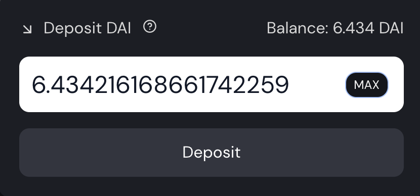

# camDAI Başlangıç Stratejisi

## Giriş

Çoğu insan DeFi hakkında bir şeyler düşündüğünde korkmaya başlar. Kripto para birimlerini kullanırken her zaman dikkate alınması gereken bir risk faktörü vardır. Piyasanın oynaklığı çok para kaybetmenize neden olabilir ve doğru bir strateji bulmanın oldukça karmaşık olabileceği pek çok olasılık vardır. Ancak, doğru araçları kullandığınızda, bazı kolay ve düşük riskli stratejilerle iyi sonuçlar alabilir ve muhtemelen daha karmaşık ve riskli seçeneklerle rekabet edebilirsiniz.

Bu kılavuzda, daha yüksek faizler için risk dokunuşuyla kaldıraçlı stabil paraya dayalı bir yatırım stratejisi sunmaya çalışacağız.

## Kaldıraç Kavramını Keşfetme

Büyük altına hücum sırasında uzak batıdayız. Bankalar insanlara borç para verebilmek ve bu kredilerden faiz alabilmek için altın almak, madenciler de altınlarını bankalara satarak zengin olmak istiyor.

Madencisin ama çok şanslı değilsin. Sadece tek bir külçe buldun. Ancak, sen süper zekisin ve madencilik yapmak yerine başka bir planın var!

Bir bankaya gidip altınınız olduğunu açıklıyorsunuz. Altını bankaya teminat olarak yatırabilirsiniz. Böylece bankanın o altını kullanmak isteyenler için kullanmasına izin verirsiniz ve banka mevduatınız üzerinden size bir miktar faiz verir.

Ayrıca, bir miktar altın ödünç verdiğiniz için, banka onlardan ödünç para almanıza izin vermeyi ve kredinizi bir miktar faizle geri ödeyememeniz durumunda kabul eder. Banka yatırdığınız altınları kullanarak kendi kendine ödeme yapacaktır. Harika, şimdi bankadaki altının faizi kazanıyorsun ve sana biraz nakit verdiler.

Bununla, bir madenci arkadaşınızı görmeye ve paranızla altınını almaya karar veriyorsunuz. Bu onun madenciliğe odaklanmasını sağlıyor ve bulduğu altın için nakit alıyor. Herkes mutlu.

Bankaya geri dönersiniz ve satın aldığınız altınları yatırırsınız. Altınları yatırınca daha fazla faiz anlamına gelir ve şimdi banka, yatırdığınız ekstra altından daha fazla nakit ödünç almanıza izin verir. Bankanın çıkarlarına maruz kalan daha fazla altınınız ve biraz daha nakitiniz var. Arkadaşınızın daha fazla altın bulup bulmadığını görmek için geri dönme zamanı, ardından tekrar tekrar.

İşte buna kaldıraç denir. Şimdi, %0 faizle nakit ödünç alabileceğiniz bir banka bulabileceğinizi ve sadece elde ettiğiniz faizlerden sağlam bir para basma makineniz olduğunu hayal edin.

## Araçları Tanıyalım

### AAVE

[AAVE](https://app.aave.com), varlıklarınızı yatırabileceğiniz bir ödünç verme ve ödünç alma platformudur. AAVE'de borç vererek, yatırılan tokenlarınız getiri elde edecektir. Stratejimiz için, sabit bir token olan (ABD dolarına sabitlenmiş) DAI'ye borç vereceğiz. AAVE'de 100 ABD doları değerindeki DAI, 1 yıllık süre boyunca potansiyel olarak %4 ila %10 arasında bir getiri oranı oluşturacaktır.

Varlıklarınızı AAVE'ye yatırdığınızda, bir depozito kanıtı alacaksınız. Örneğimizde, DAI yatırdığımız için cüzdanımıza amDAI jetonları alacağız (**a**ave **m**arket DAI). Bu makbuzu kesinlikle saklamanız gerekiyor çünkü DAI'nizi AAVE'den çıkarmak için buna ihtiyacınız olacak. Vahşi Batı karşılaştırmamızda altınlarınızı kabul edecek banka budur.

### Mai Finance

[Mai Finance](https://app.mai.finance), bazı varlıkları bir kasaya yatırmanıza ve bu mevduatın değerine karşı borç almanıza olanak tanıyan bir borç verme platformudur. Banka benzetmesine geri dönersek, kredi almanıza izin veren bir banka olurdu, ancak kredi diğer insanların borç verdiğinden gelmiyor. Bunun yerine, banka kişisel mevduatınıza karşılık gelen parayı basar, böylece sadece kendinize borç alırsınız.

(https://app.mai.finance/yield) üzerinden amDAI'yi kabul edecektir. Getiri aracı, AAVE ile Mai Finance'teki kasa arasında yalnızca bir ara araçtır. AAVE ekran görüntüsünde görebileceğiniz gibi, DAI ödünç vermek, DAI'de (birleştirilmiş) %8,75 kazanmanızı sağlar, aynı zamanda MATIC'de %2,01 ödül kazanmanızı sağlar. Mai Finance'deki getiri aracı, bu MATIC ödülünü toplayacak ve DAI mevduatınıza eklenecek daha fazla DAI ile değiştirecektir. Mai Finance sitesindeki APY (**A**nnual **P**ercentage **Y**ield) bu nedenle AAVE'den alınan toplu faizleri göstermektedir.

AmDAI'nizi getiri aracına yatırdıktan sonra, cüzdanınızda bir miktar camDAI alacaksınız (**c** amDAI'yi birleştirir). Bu, getiri aracındaki amDAI havuzundaki payınızı gösteren bir makbuzdur. Bir yan not olarak, camDAI, amDAI havuzundaki payınızın bir temsili olduğundan, amDAI ve camDAI arasındaki oran 1:1 değildir. Daha fazla ayrıntı için [bu makaleye](leverage-aave-tokens.md#amtokens-vs-camtoken) bakın.

Artık [camDAI'nizi yatırabilirsiniz](https://app.mai.finance/vaults) tokenlarınızı Mai Finance'te bir kasaya yerleştirebilir ve ardından teminatınız karşılığında bir miktar MAI (1$'a sabitlenmiş sabit bir madeni para) ödünç alabilirsiniz. Bizim Vahşi Batı karşılaştırmamızda bu, ilk bankaya yatırdığınız altın miktarına göre nakit kredi çekmenizi sağlayacak ikinci bir bankadır. Bu ikinci banka, kredinizi geri ödeyememeniz durumunda birinci bankadan alınan dekontu teminat olarak kabul eder.

### Zapper

[Zapper](https://zapper.fi/dashboard), Polygon'da  DeFi'nin bir İsviçre çakısıdır. Bu platform, likidite havuzlarında getiri elde etmenize, varlıklarınızı doğrudan kendi platformlarından AAVE'ye ödünç vermenize, farklı yatırımlarınızın bir gösterge tablosunu sunmanıza ve bazı para birimlerini diğer para birimleriyle değiştirmenize olanak tanır. Ödünç aldığımız MAI sabit parasını daha fazla DAI ile değiştirmek için kullanacağımız son özelliktir.

Vahşi Batı örneğimizde Zapper, paranızı kabul edecek ve size altın satacak olan altın madencisidir.

### Balancer

Yukarıdaki ekran görüntüsünde görebileceğiniz gibi, Zapper, Balancer'ın swap işleminin yapılacağı protokole sahiptir. [Balancer](https://polygon.balancer.fi/#/), likidite sağlayabileceğiniz (ve bundan ücret alabileceğiniz) veya likiditeyi kullanarak para birimleri takas edebileceğiniz otomatik bir portföy yöneticisi, likidite sağlayıcısı ve fiyat sensörüdür. 

Rehberimiz için, yatırımlarımızı biraz daha oynaklığa maruz bırakmak ve daha iyi çıkarlar elde etmek için Balancer'ı kullanacağız. Elbett tercihe göre değişebilir.

## Strateji Detayları

### Ana Strateji

AAVE'nin ne olduğunu açıkladık ve stratejimiz AAVE'deki DAI mevduatını, getiri enstrümanındaki amDAI mevduatını ve camDAI kasasındaki camDAI mevduatını otomatikleştirmek için Mai Finance'den bir özellik kullanacak.

 

The `Zap in using DAI` butonu, DAI'nizi kasaya yatırmanıza izin veren bir pencere açar ve elinizin altındaki AAVE mevduatını çalıştırır. Bu seçenek çok zaman kazandırırken gas tasarrufu sağlıyor.

Bu bizim ilk adımımız olacak. 100$ değerinde DAI'miz olduğunu varsayarsak, bunları bir camDAI kasasında Mai Finance'e yatıracağız. Bu, bu ilk yatırma karşılığında MAI ödünç almamızı sağlayacaktır.

camDAI için minimum CDR (**C**, **D**ebt **R**atio'nun tamamlayıcısı) %110'dur. Bu, teminatınız (100$ değerinde DAI) ile almak üzere olduğumuz kredi arasındaki oranın %110'un üzerinde kalması gerektiği anlamına gelir.


CRD oranı minimum %110 değerine ulaşırsa, teminatınızın değer kaybettiği ve borcunuzun teminatınızın değerinden daha büyük olabileceği anlamına gelir. Bu noktada kasanız likidasyon edilebilir. Birisi borcunuzun bir kısmını geri ödeyebilir ve tazminat olarak teminatınızın bir kısmını alabilir. Bununla birlikte, hem DAI hem de MAI  USD dolarına sabitlenmiş sabit paralar olduğundan, 2 varlık arasında büyük bir fark elde etme riski çok düşüktür. Bu durum stratejiyi oldukça güvenli kılar.


Likidasyon riskini oldukça düşük tutmak için %115'lik bir CDR'ye bağlı kalmaya çalışacağız. %115'lik bir CDR'de kalmak için ne kadar MAI ödünç alabileceğimizi bilmek için şu formülü kullanacağız:

$$
MAI_{available} = \frac{Collateral_{value} - Debt_{value} * Target_{CDR}}{Target_{CDR}}
$$

100$'lık teminat değeriyle, henüz borcumuz yok ve %115 hedef CDR ile, işte ne kadar borç alabileceğimiz:

$$
MAI_{available}=\frac{100 - 0*1.15}{1.15}=86.95
$$

​Daha sonra ödünç aldığınız MAI'yi DAI ile değiştirebilir ve tekrarlayabilirsiniz. Teminatınız ve borcunuz şöyle görünmelidir:

| Döngü# |  Teminat   | Borç    | Uygun Kiralama | Eş Değer APY   | DAI likidasyon fiyatı |
| ------ | ---------- | ------- | -------------- | -------------- | --------------------- |
| 1      | 100.000    | 0.000   | 86.956         | 10.42%         | 0                     |
| 2      | 189.956    | 86.956  | 75.614         | 19.48%         | 0.512                 |
| 3      | 262.571    | 162.571 | 62.751         | 27.36%         | 0.681                 |
| 4      | 328.323    | 228.323 | 57.175         | 34.21%         | 0.765                 |
| 5      | 385.498    | 285.498 | 49.718         | 40.17%         | 0.815                 |
| 6      | 435.216    | 335.216 | 43.233         | 45.35%         | 0.847                 |
| 7      | 478.449    | 278.448 | 37.593         | 49.85%         | 0.870                 |
| 8      | 516.042    | 416.042 | 32.690         | 53.77%         | 0.887                 |
| 9      | 548.732    | 448.732 | 28.426         | 57.18%         | 0.899                 |
| 10     | 577.158    | 477.158 | 24.718         | 60.14%         | 0.909                 |
| 11     | 601.877    | 501.877 | 21.494         | 62.72%         | 0.917                 |
| 12     | 623.371    | 523.371 | 18.691         | 64.96%         | 0.924                 |
| 13     | 642.062    | 542.062 | 16.253         | 66.90%         | 0.929                 |
| 14     | 658.315    | 558.315 | 14.133         | 68.60%         | 0.933                 |
| 15     | 672.448    | 572.448 | 12.289         | 70.07%         | 0.936                 |
| 16     | 684.737    | 584.737 | 10.686         | 71.35%         | 0.939                 |
| 17     | 695.423    | 595.423 | 9.293          | 72.46%         | 0.942                 |

17 döngüde duruyoruz ama isterseniz daha fazlasını çalıştırabilirsiniz.

17 döngünün sonunda, 695.423$ teminat ve 595.423$ borç alırsınız. Bu, likidasyonu önlemek için yeterince güvenli olması gereken %116,79'luk bir CDR'ye karşılık gelir.

Getiri enstrümanı tarafından verilen %10,42 APY'yi dikkate alırsak;

$$
Interests = Collateral_{value}*APY=695.423*10.42\%= \$72.463
$$

İlk yatırımın sadece 100$ olduğunu düşünürsek, bu, sabit bir coin'de tek bahiste %72.463'lük eşdeğer bir APY'dir!

### Alternatif Strateji

Yüksek volatiliteli varlıkları değerlendirmek için, yukarıdakiyle aynı döngüyü kullanabilir. Ödünç alınan MAI'nin yalnızca %90'ını kaldıraç edebilir ve %10'unu başka bir şey satın almak için kullanabilirsiniz. Bu örnekte, %10'u Qi (Mai Finance'in yerel tokenı) satın almak için kullanacağız ve şu anda 107.12% APR (**A**nnual **P**ercentage **R**evenue) olan Balancer'da Qi-BAL havuzunu kullanacağız 

camDAI kasasına yeniden daha az DAI enjekte ettiğimiz için daha az döngü çalıştıracağız. Kurulum şöyle görünecek:

| Döngü# |  Teminat   | Borç    | Qi     | Uygun Kiralama |  Eş Değer APY  | DAI likidasyon fiyatı |
| ------ | ---------- | ------- | ------ | -------------- | -------------- | --------------------- |
| 1      | 100.000    | 0.000   | 0.000  | 86.957         | 10.42%         | 0                     |
| 2      | 178.261    | 86.957  | 8.696  | 68.053         | 35.22%         | 0.537                 |
| 3      | 239.509    | 155.009 | 15.501 | 53.259         | 54.63%         | 0.712                 |
| 4      | 287.441    | 208.268 | 20.827 | 41.681         | 69.82%         | 0.797                 |
| 5      | 324.954    | 249.949 | 24.995 | 32.620         | 81.71%         | 0.846                 |
| 6      | 354.312    | 282.569 | 28.257 | 25.529         | 91.01%         | 0.877                 |
| 7      | 377.288    | 308.097 | 30.810 | 19.979         | 98.29%         | 0.898                 |
| 8      | 395.269    | 328.076 | 32.808 | 15.636         | 103.99%        | 0.913                 |
| 9      | 409.341    | 343.712 | 34.371 | 12.237         | 108.45%        | 0.924                 |
| 10     | 420.354    | 355.948 | 35.595 | 9.576          | 111.94%        | 0.931                 |

10 döngünün sonunda,

* Teminat olarak 420.354 $ DAI
* 355.948 dolar borç
* 35.595 $ Qi

Önceki durumda olduğu gibi aynı matematik aşağıdaki sonuçları verir

* Tasfiyeyi önlemek için yeterince güvenli kabul edilmesi gereken, %118,09'luk bir nihai CDR
* Getiri enstrümanı tarafından verilen %10,42 APY'den DAI üzerindeki 43.800$ faiz
* Qi ve BAL ödüllerini Qi-BAL havuzunda birleştireceğinizi varsayarsanız, Dengeleyici havuzundan Qi'nizde 68.139$ faiz
* Toplam APY %111,94

Bu strateji, Qi-BAL havuzuna yapılan yatırımın garanti edilmediği anlamında daha fazla risk sunar. Bununla birlikte, QiDAO protokolüne katılmanıza izin verecek olan Qi'ye sahip olursunuz. Mai Finance'deki BAL ödülünü teminat olarak kullanır ve buna karşı borç alırsanız, camDAI kasasına veya Qi-BAL havuzuna yeniden yatırım yapabilirsiniz. Bunu yaparsanız, her hafta Qi'de ödenen ödülleri ödünç almaya hak kazanacaksınız.

## Sonuç

Minimum yatırım ve düşük bakımla, yalnızca DAI'nizden yararlanarak oldukça sağlam sonuçlar elde edebilirsiniz. DAI, birden fazla zincirde çok fazla likiditeye sahip sabit bir madeni para olduğundan, DAI'nin sabitlenme ve kasanızın tasfiye edilme riski nispeten düşüktür. Bu, herhangi bir DeFi acemi için kolayca çok iyi bir başlangıç ​​noktası olabilecek bir tür "ayarla ve unut" kurulumudur ve bu stratejinin boğa piyasasında veya ayı piyasasında aynı şekilde performans göstermesi ihtimali vardır. Son olarak, kredinizin bir kısmını kapmak ve DeFi'nin Polygon'da sahip olduğu birçok olasılığı test etmek için aynı stratejiyi nasıl kullanabileceğinizi de açıkladık.

## Sorumluluk Reddi

Bu eğitimde sunulan her şey, Mai Finance tarafından önerilen kaldıraç seçeneğini göstermek için hazırlanmış eğitim içeriğidir. Borç geri ödemesinden bahsetmedik çünkü bu sitede bununla ilgili makaleler var, ancak Mai Finance'in ödünç alınan miktar üzerinden %0,5 geri ödeme ücreti aldığını unutmamalısınız. Her zaman olduğu gibi, kendi araştırmalarınızı yapın ve [DAO'nun Discord sunucusu](https://discord.com/invite/qidaoprotocol) topluluğuna soru sormaktan çekinmeyin.


Belirli bir zamanda iyi çalışan bir stratejinin başka bir zamanda kötü performans gösterebileceğini (veya para kaybetmenize neden olabileceğini) unutmayın. Lütfen haberdar olun, piyasaları takip edin, yatırımlarınızı takip edin ve her zaman olduğu gibi kendi araştırmanızı yapın.

