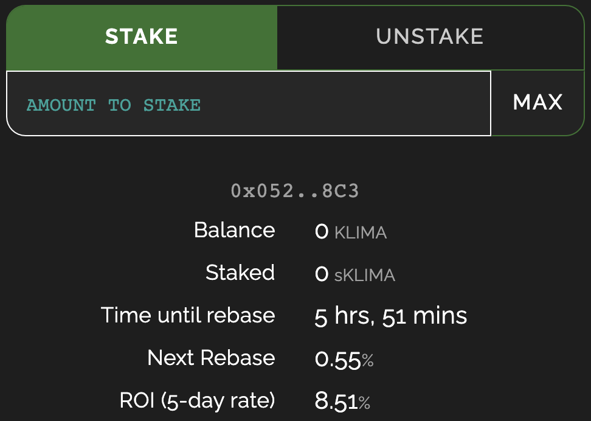
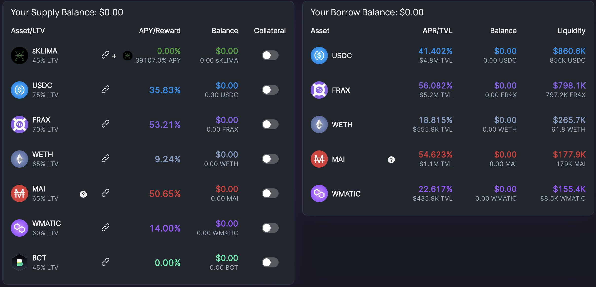

# Polygon'daki OHM kopyaları: KLIMA örneği

Son birkaç aydır kripto haberlerini takip ediyorsanız, kesinlikle birçok (3,3) referans fark etmişsinizdir ve Ohm ile ilgili projeleri duymuşsunuzdur. Bu projelerin neler olduğunu, temel ilkelerinin neler olduğunu ve bunları yatırım stratejilerinizin bir parçası olarak nasıl kullanabileceğinizi hızlıca sunmaya çalışacağım. Bu son bölümde, Polygon'daki en başarılı ohm-kopyalarından biri olan ve aynı zamanda çok ilginç bir hikayesi ve hedefi olan Klima DAO'ya odaklanacağız.

## OHM Forku(Kopyası) Nedir?

### OHM ve Fork(Kopya) nedir?

Her şey Olympus DAO ile Ethereum Mainnet'te başladı. Amaçları, para biriminin değişken bir değere sahip olması dışında dolar ile rekabet etmek için yeni bir rezerv para birimi yaratmaktır. Yerel tokenın (Ohm) bir dizi farklı varlık tarafından tamamen desteklenmesi gerekmektedir. Projenin tokenları, Ohm değerini piyasa tarafından tanımlamaktadır.

Olympus DAO Mart 2021'de piyasaya sürüldü ve hala Mainnet'te çok başarılı bir projedir. TVL'nin değeri düzinelerce milyon dolar ve Ohm fiyatı çok yüksek bir fiyatta yer alıyor. Bu başarı nedeniyle proje forklandı (kopyalandı) ve birçok zincirde birden fazla Olympus DAO klonu ortaya çıktı.

### Tokenomike genel bakış

Bu bölüm diğer kılavuzlarımızda kullandığımızdan biraz daha teknik olacak. Olympus ve diğer Ohm kopyalarının başarısını anlamak için nasıl çalıştıklarını bilmek önemlidir.

Olympus protokolünün temel fikri, yüksek bir fiyatı korumak için dolaşımdaki arzı mümkün olduğunca düşük tutarken yerel tokenı indirimli satarak hazineyi mümkün olduğunca artırmaktır. Bu, stakerlar için çok yüksek ödüller sağlayarak ve likidite üzerinde neredeyse tam kontrole sahip olarak yapılır

* **Bono İhracı:** Protokol, yerel tokenları indirimli bir fiyata önerecektir. Fiyat, Ohm desteklemek için kullanılan belirli varlıklar kullanılarak ödenir. Olympus DAO örneğinde, OHM, çoğunlukla DAI içeren birkaç token tarafından %100 desteklenir ve bu tahviller doğrudan DAI kullanılarak veya DAI-OHM LP tokenları (ve son zamanlarda FRAX dahil olmak üzere ek tokenlar) kullanılarak satın alınabilir. İnsanlar, destek varlıklarını veya LP tokenlarını kullanarak Ohm satın aldıklarında, ödeme doğrudan hazineye gider ve protokolün daha fazla token basmasına ve dolayısıyla daha uzun bir süre çalışabilmesine olanak tanır. İndirimli tokenın bir hak kazanma süresi boyunca serbest bırakılmasıdır; bu durumda, Ohm bonding kullanarak satın alan kullanıcının onu hemen tam olarak kullanamayacağı anlamına gelir.
* **Stake:** Bondingten sonra, kullanıcılar Ohm toplayacak ve bunları satma veya stake etme arasında seçim yapma şansına sahip olacak. İkinci seçeneğin seçildiğinden emin olmak için protokol, stake edenlere delicesine yüksek ödüller sunuyor (günlük %1.2 kazançtan bahsediyoruz !!!). Bu yüksek APR'lerin arkasındaki amaç, %100'e mümkün olduğunca yakın bir stoke oranı elde etmektir. Dolaşan çok fazla token yoksa, fiyat yükselir ve yüksek ödüllerle birleştiğinde, stake etmeyi daha da ilginç hale getirir. Ek bir not olarak, yükselen bir fiyat aynı zamanda yüksek ödül oranlarının korunmasına yardımcı olacaktır.
* **Hazineyi artırma ve likiditeyi kontrol etme:** Hazine, bonolardan ve Ohm'ların neredeyse tamamen protokol tarafından kontrol edilen LP tokenlarıyla bağlanabilmesi gerçeğinden artırılır. Bu LP tokenları, piyasada yerel tokenı bono yerine tam fiyattan satın almayı tercih eden kullanıcıların takas ücretlerini toplamak için kullanılır (ayrıntılar için bir sonraki bölüme bakın).
* **Geri al ve yak:** Çoğu OHM benzeri proje, tokenları geri satın alacak ve onları çok özel durumlarda yakacak bir mekanizma içerir. Kullanıcılar yerel tokenı satarken, fiyatı düşürerek sorunlar ortaya çıkar. Bununla birlikte, insanlar tokenlarını satarsa, daha az stake edilen tokenlar için basılan tokenların sayısı aynı kaldığından APY yükselir. Ancak daha yüksek APY ile bile, eğer kimse satılan tokennları almaz ve stake etmezse, protokol satın alma baskısı uygulamak, fiyatı yükseltmek ve dolaşımdaki arzı düşük tutmak için muhtemelen piyasadan geri alabilir. Geri alınan tokenlar basitçe imha edilir. Gerçekten de, hazinenin bir kısmı bu tokenları almak için kullanıldığından, onları hazinede tutmak veya dağıtmak hazineyi sulandırır. Bu da ya ödül oranını düşürür ya da protokolün çalışabileceği zaman dilimlerini etkiler.

Olympus DAO kavramı ve tokenomikleri hakkında ek kaynakları burada bulabilirsiniz:

* [DeFi 2.0 - A new Narrative? Olympus DAO, Tokemak Explained](https://www.youtube.com/watch?v=l0vRTi8\_FRk)
* [WTF is Olympus DAO](https://newsletter.banklesshq.com/p/wtf-is-olympus-dao)

### Bono İhracı mı Staking mi?

Bono yoluyla indirimli bir sürüm varken biri neden bir token için ödeme yapsın? Bu meşru bir sorudur ve cevap, bononun sunduğu indirime bağlı olacaktır.

Klima DAO ile çalışacağımız için, satın alma + staking VS bonding'i karşılaştıralım:

Klima'yı piyasadan doğrudan satın alıp ve 5 gün boyunca (bono için fiili hak kazanma süresi) stake ederse, ROI (**R**eturn **O**n **I**nvestmen) %8,51 olacaktır. Bunun yerine bir bono satın alınırsa, BCT/KLIMA sağlayarak maksimum yatırım getirisi %5,47 olacaktır.

Bu, 100 ABD Doları eşdeğeri ile 5 gün sonra alacağınız anlamına gelir.

*
  1. seçenekle 108.51 dolar
*
  1. seçenekle 105.47 dolar

Ancak, bono Klima'nın hak kazanma süresi boyunca serbest bırakıldığını anlamak önemlidir. Böylece, kazanılmış Klima'yı hasat edebilir ve yeniden temellerden (ödül dağıtımı) kâr elde etmek için stake yapabilirsiniz. Sadece hak kazanma döneminde yatırdığınız her şey için ödül alacağınızdan ve bononun tamamen serbest bırakılması için 5 gün boyunca 15 yeniden temellendirme olduğundan, 15 yeniden temelin her birinden önce potansiyel olarak %6,67 hasat edebileceğinizi varsayabiliriz. . Her rebase'in başında hasat ve stake yapacağınızı varsayarsak, şunu elde edersiniz:s:

| rebase # | Stake Edilen | Ödül  | Total Ödül |
| -------- | ------------ | ----- | ---------- |
| 1        | 7.031        | 0.038 | 0.038      |
| 2        | 14.063       | 0.077 | 0.116      |
| 3        | 21.094       | 0.116 | 0.232      |
| 4        | 28.125       | 0.155 | 0.397      |
| 5        | 35.157       | 0.193 | 0.580      |
| 6        | 42.188       | 0.232 | 0.812      |
| 7        | 49.219       | 0.271 | 1.083      |
| 8        | 56.251       | 0.309 | 1.392      |
| 9        | 63.282       | 0.348 | 1.740      |
| 10       | 70.313       | 0.387 | 2.127      |
| 11       | 77.345       | 0.425 | 2.552      |
| 12       | 84.376       | 0.464 | 3.016      |
| 13       | 91.407       | 0.503 | 3.519      |
| 14       | 98.439       | 0.514 | 4.061      |
| 15       | 105.470      | 0.580 | 4.651      |

Hak kazanma döneminin sonunda, %5,47'lik ROI'ye saygı duyulur, ancak stake ödülleri ayrıca %4,65'lik bir ilave (basitlik için birleştirilmemiştir) ekledi ve %10,12'lik bir ROI ile sonuçlandı. Bu, bonding ROI'si stake eden ROI'den daha düşük görünse bile, bonding'in doğrudan stake etmekten daha ilginç olduğu anlamına gelir.

Hak kazanma süresi boyunca N kat bahis yaparak alacağınız toplam ödül (en fazla Nmax = 15 ile):

$$Reward_{total} = \sum_{i=1}^{N}{\frac{Investment * i * (1 + APR_{Vesting})}{N} * APR_{staking}}$$

Daha sonra satın almanın ve stake yapmanın mı yoksa bono almanın mı mı daha iyi olduğunu doğrulamak için kendi simülasyonlarınızı çalıştırabilirsiniz. Örneğimiz için, 5 gün boyunca %8,51'lik bir yatırım ROI'si ile, 15 rebase ile %3,95'lik bir tbono indirimi daha iyi olurdu (%8,52'lik bir eşdeğer ROI sağlar).


Aynı simülasyonu, her yeniden temelden önce günde 3 kez yerine, hasat + hisse ile günde yalnızca bir kez çalıştırabilirsiniz. Yukarıdakiyle aynı APY için, stake etmekten daha iyi bir yatırım getirisi elde etmek için %6,76'lık bir bono indirimi gerekir.



Bonding VS staking hesaplamanız için bir simülatörü [bir google elektronik tablosu](https://docs.google.com/spreadsheets/d/1MTKTbfZAihGbEax3WEwkxToG7IlPKlwmYq59O3KG2o/edit#gid=0) biçiminde bulabilir ve düzenleyebilirsiniz. senin isteğinle. Bu sayfanın QiDAO topluluğu tarafından SAĞLANMADIĞINI unutmayın.


### Özel bir proje olarak Klima DAO

Klima DAO'yu diğer Ohm kopyalarından farklı kılan özellik, Klima token destekleyen ana varlıktır: [Toucan Protokolü](https://toucan.earth) tarafından sağlanan BCT simgesi. BCT (**B**ase **C**arbon **T**onne) aslında gerçek dünyada dünyayı karbondan arındırmak için yapılan yatırımları temsil ediyor ve gerçek dünyadan karbon denkleştirmelerini tokenlara dönüştürüyor. Nasıl çalıştığı hakkında daha fazla bilgiyi Toucan'ın [resmi belgelerinde](https://docs.toucan.earth/protocol/introduction/defi-refi) okuyabilirsiniz.

BCT daha sonra [Klima DAO uygulaması](https://dapp.klimadao.finance) tarafından KLIMA basmak için kullanılır, aynı şekilde DAI, Olympus DAO tarafından OHM basımı için kullanılır. Başka bir deyişle, Klima, iklim değişikliğiyle mücadele için gerçek yaşam fonları sağlayan bir Karbon yutağı gibi hareket eder. [Klima web sitesinde](https://www.klimadao.finance) ve [belgelerde](https://klima-dao.gitbook.io/klima-dao/) daha fazla bilgi bulunabilir ve gelip QiDAO'nun Discord sunucusunda kriptoyu daha yeşil yapmanın yollarını tartışabilirsiniz.


Olympus ve Klima arasındaki temel farklardan biri, BCT'nin sabit bir fiyatının olmamasıdır. Bu, hazinelerini inşa etmek için sabit tokenlar kullanan kopyalardan daha yüksek bir risk teşkil ediyor. Çevre sorunlarının giderek daha önemli olacağı ve atmosferden karbon çıkarmaya çalışan daha fazla projenin olacağı ve bunun da artacağı varsayılıyor. Bu varsayım da BCT'nin toplam değerini temsil ediyor.


## Strateji 1: sKLIMA kaldıracı veya (9,9)

[(3,3) oyun teorisine](https://en.wikipedia.org/wiki/Nash\_equilibrium) derinlemesine girmeden (9,9), kişinin stake pozisyonundan yararlandığı bir durumu temsil eder. Bu durum mümkündür, çünkü Klima DAO bazı platformların olası bir kredi için teminat olarak kabul edeceği bir mevduat kanıtı olarak bir sKLIMA sağlayacaktır. Detaylarına bakalım.

### MarketXYZ ve Klima kullanan kaldıraç döngüsü

Buradaki fikir, Klima DAO'ya yatırabileceğiniz ilk miktarda KLIMA elde etmektir. Çok yüksek APY (yazılı olarak, APY %38,873.08 veya %601 APR veya %1.68 günlük kazanç) elde etmenizi sağlayacaktır ve KLIMA yatırarak, depozito kanıtı olarak sKLIMA alacaksınız.

sKLIMA, depozito karşılığında kredi almanıza olanak sağlayacak olan [Green Leverage Locker](https://polygon.market.xyz/pool/5) içindeki Market XYZ'de kullanılabilir.


Ek bir not olarak, Mai Finance, Market XYZ ile ortaklık kurdu ve sKLIMA'nıza karşı MAI ödünç aldığınızda düşük faiz oranlarını garanti etmek için yeşil soyunma havuzuna 1M MAI sağladı.


MAI ödünç almak sizin için bir zorunluluk değil, aslında en düşük faiz oranıyla tokenı ödünç alabilirsiniz, Ancak krediniz için ücret ödemek zorunda kalacağınızı ve kredinizi ne kadar hızlı geri öderseniz o kadar az olacağını unutmayın.

Krediniz ile daha fazla KLIMA satın alabilecek ve döngüyü tekrar edebileceksiniz.

sKLIMA'daki APY'nin kredinizin faizlerini büyük ölçüde telafi edeceğini fark edeceksiniz.


Market.xyz'den ödünç alabileceğiniz minimum miktar vardır. Bu stratejiyi uygulamak istediğinizde lütfen limiti kontrol edin.


### Beklenen sonuçlar

Piyasa XYZ'nin de bazı likidasyon seviyeleri olacaktır, yani teminat değeriniz likidasyon seviyesinin altına düşerse, teminatınızı kaybetme riskiniz vardır. Likidasyon riskini azaltmak için aşağıdaki simülasyon, %250'lik bir C/D oranını koruyacağınızı ve MAI'yi %20,49 faizle ödünç almak için %38,873 APY'de ilk 1,000$'lık KLIMA yatırım yaptığınızı varsayar.

| sKLIMA ($) | MAI ($) | eq. APY (%) | Faiz ($) |
| ---------- | ------- | ----------- | -------- |
| 1,000.00   | 400.00  | 38,873      | 81.96    |
| 1,500.00   | 560.00  | 54,455      | 114.74   |
| 1,560.00   | 624.00  | 60,642      | 127.86   |
| 1,624.00   | 649.60  | 63,129      | 133.10   |
| 1,649.60   | 659.84  | 64,125      | 135.20   |
| 1,659.84   | 663.94  | 64,523      | 136.04   |
| 1,663.94   | 665.57  | 64,682      | 136.38   |

Tabii ki, eşdeğer APY'nin bundan fazla büyümeyeceği için 3 döngüden sonra durmak muhtemelen yeterlidir.

Bir dip not olarak, ilk yatırım 1.000$ olduğundan, her şeyin aynı kaldığını varsayarsak 1 yıl sonunda alacağınız değer 646.820,00$ olacaktır. Başka bir deyişle, 1.000$ yatırım yaparsanız, ek 136.38$ (801.95$ birikmiş borç) ile 665,57$'ı geri ödemeniz gerekecek, ancak aynı zamanda 646.820$ da kazanacaksınız.

Ayrıca, sKLIMA pozisyonunuzun değerinin çok hızlı bir şekilde arttığını (her 5 günde bir %8 civarında) görebilirsiniz, bu da bu noktada borcunuzu artırabileceğiniz ve ek kazançlar için daha da fazla kaldıraç kullanabileceğiniz anlamına gelir.

### Fayda değerini elde etme ve kredinizi geri ödeme

Ohm kopyası projelerinin temel sorunlarından biri, herkesin stake ettiğini ve kimsenin satmadığını varsaymasıdır. Kimse satmazsa, kimse fayda sağlayamaz ve çoğu durumda ilk satan pastayı alır.

Herhangi bir yatırım stratejisi için kazançlarınızın değerini yakalamak önemlidir. Bunu, Market XYZ'deki sKLIMA pozisyonunuzun bir kısmını geri çekerek yapabilir ve satabileceğiniz KLIMA'yı geri alabilirsiniz.

100$ yatırırsanız ve yukarıdaki 7 döngüyü çalıştırırsanız, KLIMA'daki yatırımınız 31 gün sonra 67.11$ gelir elde etmiş olur. Bu da kredinizi 1 ayda tamamen faiziyle geri ödeyebileceğiniz anlamına gelir. Bunu yaparsanız, bir sonraki ay 166$ ile yeniden başlayacaksınız ve ödenmemiş borcunuz kalmayacak. Market XYZ'de oldukça yükselebilecek ödünç alma APR'sine bir göz atın.

## Strateji 2: Sürekli Yatırım veya tam (4,4)

Bir kez daha (4.4), oyun teorisi ve rezerv para birimleri ile ilgilidir ve tokenları bağladıktan sonra onları stake eden kişileri gösterir. Bu stratejide, Klima ve Augury'yi düzenli olarak bono satın almak ve sürekli olarak stake etmek için nasıl kullanabileceğimizi göreceğiz.

### Augury ve Mai Finance kullanan yatırım döngüsü

Hâlâ Klima kullanıyoruz, ancak bu sefer Klima değerinin çıkarılmasını otomatikleştirmek için bir [Augury Finance'den infüzyon](https://augury.finance/infusions) kullanıyoruz. KLIMA infüzyona yatırarak, infüzyondan sorumlu algoritma her yeniden rebase'ten sonra aşağıdaki eylemleri gerçekleştirecektir:

* sKLIMA konumunuzu artırmak için hasat edilen KLIMA'nın %50'si yeniden tahsis edilir
* Hasat edilen KLIMA'nın %50'si, Ağustos ayında NFTM havuzuna eklenen USDC'ye satılır ve size NFTM olarak dağıtılır.

NFTM daha sonra değeri artarken tutulabilir veya USDC değeri için kullanılabilir. Başka bir deyişle, değeri yakalanıp NFTM olarak depolandığından, KLIMA yeniden temelden sonra değerini kaybetmesi önemli değildir.

NFTM ödüllerinizin USDC değerini kullandıktan sonra, seçtiğiniz tokenı satın alabilir ve Mai Finance'te bir kasada saklayabilirsiniz. Yukarıdaki örnek bir camWETH kasası kullanıyor. İstediğiniz herhangi bir kasayı kullanabilirsiniz. Buradaki fikir, MAI'yi ödünç almak için Mai Finance'teki kasaları kullanabilmek ve döngüyü tekrarlamak için Klima DAO'dan yeni bonolar satın alabilmek. Ardından KLIMA hasat edebilir ve Augury'de enjekte edebilirsiniz. Bonoların bir seferde çok az hak kazandığını unutmayın. Tahviliniz tamamen kazanılmadan önce düzenli olarak hasat yapmak ve Augury'de stake yapmak tamamen mümkündür.

### Beklenen sonuçlar

Önceki örnekte olduğu gibi 100$ yatırım yaptığınızı ve bunu doğrudan Augury infüzyonuna yerleştirdiğinizi varsayarsak, Klima infüzyonunun APR'sinin %552.94 (yazılı olarak mevcut değer) olduğunu ve bir C/D oranını %240 camWETH kasası ve camWETH kasasında %2.19 APY, işte bir yılın sonuçları:

| Gün | sKLIMA ($) | wETH ($)  | MAI loan ($) |
| --- | ---------- | --------- | ------------ |
| 30  | 137.751    | 27.708    | 11.545       |
| 60  | 189.776    | 64.883    | 27.035       |
| 90  | 261.474    | 116.150   | 48.396       |
| 120 | 360.282    | 186.835   | 77.848       |
| 150 | 496.453    | 284.283   | 118.451      |
| 180 | 684.115    | 418.613   | 174.422      |
| 210 | 942.737    | 603.771   | 251.571      |
| 240 | 1,299.152  | 858.978   | 357.907      |
| 270 | 1,790.339  | 1,210.720 | 504.466      |
| 300 | 2,467.258  | 1,695.500 | 706.458      |
| 330 | 3,400.140  | 2,363.625 | 984.844      |
| 360 | 4,685.775  | 3,284.424 | 1,368.510    |

Bir kez daha, tüm oran ve fiyatların aynı kaldığını varsayarsak, yıl sonunda

* 4.684.775 $ değerinde KLIMA
* 3.284.424 $ değerinde WETH
* ve 1.368.510$'lık ödenmemiş borç

Bu da %6,866.46'lık eşdeğer bir APY'dir. KLIMA'nın reklamını yaptığı %38.705.13'ten çok uzak ama yine de 100$'lık bir yatırım için oldukça etkileyici. Ayrıca, kazançlarınızın büyük bir kısmı Mai Finance'teki bir kasada wETH'ye dönüştürüldü ve başvurudaki krediniz size bazı ek Qi Tokenleri kazandıracak.


Bu strateji (9,9) çok daha düşük bir APY'ye sahipse, döngüye istediğiniz kadar KLIMA ile girebildiğiniz için aynı zamanda nispeten uygun fiyatlı bir stratejidir.


## Sorumluluk Reddi

Bu belgede sunulan her şey tamamen teoridir ve eğitim amaçlıdır. Olympus ve Klima gibi projelerdeki en büyük sorun, yine ilk satan kullanıcının yüksek fiyattan yararlanacak olmasıdır. İlk satış çok büyükse (kazançlar çok büyük olduğu için), kartopu şeklinde hızlı bir şekilde panik etkisine dönüşebilir ve bu da KLIMA fiyatını çok düşürebilir. Bu durumda, APY fırlayacak, yani satmayan kullanıcılar çok yüksek ödüllerden faydalanacak, böylece APY yeni kullanıcıları çektiğinde, elinde tutanlar büyük kazananlar olacak.

Ayrıca, projenin yalnızca hazineye ek fonlar enjekte edildiği sürece token basmaya devam edebileceğini belirtmekte fayda var.

Riskleri azaltmak için zaman zaman bazı faydalar sağlamazsanız risk çok yüksek olabilir.

Son bir not olarak, ohm kppyalarnın yeni trend olduğuna dikkat edin. Çoğu proje başarısız olabilir ve bu kopyalar sağlam projeler değildir. Doğaları gereği, bunlar henüz RugDoc tarafından doğrulanmamıştır ve gerçek uygulamaları saf dolandırıcılıktan ayırt etmek çok karmaşık olabilir.


Belirli bir zamanda iyi çalışan bir stratejinin başka bir zamanda kötü performans gösterebileceğini (veya para kaybetmenize neden olabileceğini) unutmayın. Lütfen olan bitenden haberdar olun, piyasaları takip edin, yatırımlarınızı takip edin ve her zaman olduğu gibi kendi araştırmanızı yapın.

