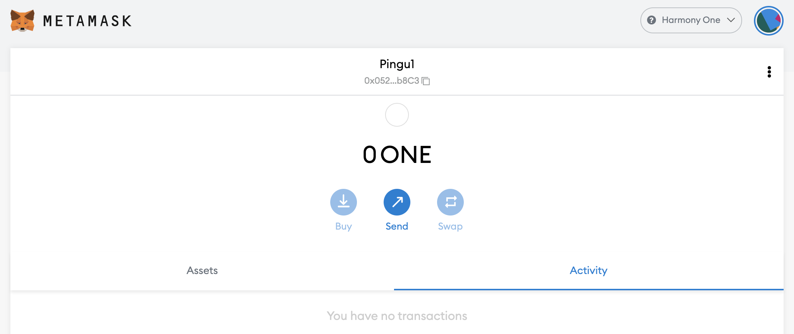

# Harmony Nasıl Kullanırım?

## Harmony Nedir?

Harmony, Ethereum Mainnet'in karşılaştığı sorunları çözmeye çalışan bir blok zinciridir: merkeziyetsizlik ve ölçeklenebilirlik arasında tatmin edici bir denge sağlamak. Zincirin ana odak noktası yüksek işlem hacmi, hız ve enerji verimliliğidir. Bunlar işlemleri aynı anda işlemek için gruplandırılacak doğrulayıcıların parçalanmasından yüksek oranda yararlanarak yapılır. Ölçeklenebilirliği desteklemek, daha hızlı işlem gerçekleştirmeye yardımcı olan parça sayısını artırmak kadar basittir. Harmony [resmi belgelerinde](https://docs.harmony.one/home/general/technology) teknolojisi hakkında daha fazla bilgi edinebilirsiniz.

## Harmony Kullanmaya Başlarken

Harmony ağını kullanmak için bir cüzdan adresine ihtiyacınız olacak. Harmony, EVM uyumlu bir ağ (Ethereum Sanal Makinesi) olduğu için, Metamask veya Nifty gibi web cüzdanı dahil olmak üzere diğer EVM uyumlu zincirlerdekiyle aynı cüzdanları kabul edecek ve Trezor veya Ledger gibi donanım cüzdanınızı kullanabileceksiniz.

Bu eğitim için, bu sitedeki diğer tüm kılavuzlarda olduğu gibi Metamask'a bağlı kalacağız. Yüklü Metamask'ınız yoksa [Polygon'u Nasıl Kullanırım](../../polygon-tutorials/how-to-get-started-on-polygon.md) rehberinden ilgili talimatları bulabilirsiniz.

### Metamask'a Harmony Ekleme

Metamask'ın en son sürümünü yüklediyseniz Harmony zincirine zaten erişiminiz olmalıdır ve Metamask'ın üst kısmındaki açılır menüsünde Harmony One'ı seçmek dışında bir şey yapmanıza gerek yoktur. Bu adımları kullanarak Harmony'ye erişmek için kendiniz de yeni bir RPC ayarlayabilirsiniz. Metamask açılır menüsünü açın, cüzdanınızın simgesine tıklayın, `Settings`e gidin, ardından `Networks` seçin ve `Harmony One` bulun. Almanız gereken veriler aşağıdaki gibidir:

* **Network Name:** Harmony One
* **New RPC URL:** https://api.harmony.one
* **Chain ID:** 1666600000
* **Currency Symbol:** ONE
* **Block Explorer URL:** https://explorer.harmony.one/

Değişiklikleri kaydedin, Metamask sizi otomatik olarak Harmony ağına geçirecektir:

## Harmony One'a Köprüleme

### Harmony Musluğu

İlk işleminizde ilk ONE tokenlarınızı almak için resmi bir musluk yoktur. Ehtereum Mainnet veya Binance'den Harmony'ye bazı belirli varlıkları köprülemenize izin verecek resmi [Harmony köprüsü](https://bridge.harmony.one/erc20) kullanarak çoğunlukla başka bir zincirden bazı tokenları köprülemeniz gerekecektir. Ayrıca Harmony ekibinin küratörlüğünü yaptığı bu listeden Fiat Gateway'ler veya Exchange Gateway'ler aracılığıyla ONE almanızı sağlayacak projelerin [listesini](https://docs.harmony.one/home/developers/harmony-stack#bridges-fiat-gateways-exchanges) de bulabilirsiniz.

Her zaman olduğu gibi bazı ELK tokenlarını diğer zincirlerden Harmony'ye aktarmak için [ElkNet](https://app.elk.finance/#/elknet) de kullanabilirsiniz. Bunu yaparsanız, transfer edilen tokenlarınızın bir kısmını ONE ile değiştirecek olan gas için `Swap $ELK 1 for gas` kutusunu işaretlediğinizden emin olun, bu da ELK tokenlarınızın geri kalanını daha fazla ONE veya diğer varlıklarla değiştirmenizi sağlar.

### Köprüler

* [Multichain.org](https://app.multichain.org/#/router) (önceden AnySwap olarak biliniyordu), MAI tokenlarınızı Polygon ve diğer zincirlerden Harmony'ye köprülemenizi sağlayacak olan Mai Finance'in resmi ortağıdır. Ek bir not olarak, Multichain, Harmony'ye köprü kurduğunuz MAI'nin borç verme platformundan ödünç alabileceğinizle aynı olduğundan emin olmak için Mai Finance geliştiricileri ile el ele çalışıyor. Harmony'de bir Merkez’e gerek yok. Multichain yönlendiriciye gidin, kaynak ağını, aktarmak istediğiniz tokenı ve hedef ağını seçin ve işiniz bitti. Transferlere, transfer ücretlerine ve köprüleme süresine ilişkin minimum tutarlara dikkat edin. İşlemler yapıldığında Harmony'deki varlığınızı alacaksınız.

* [Resmi Harmony Köprüsü](https://bridge.harmony.one/erc20) önceki paragrafta açıklandığı gibi Ethereum Mainnet veya BSC'den belirli varlıkları aktarmanızı sağlayacaktır.
* [RelayChain](https://app.relaychain.com/#/cross-chain-bridge-transfer) Harmony'ye bir şey aktarmak istiyorsanız başka bir çözümdür. Hangi varlıkların köprülenebilir olduğunu görmek için uygulamalarını kontrol edin.
* [ElkNet](https://app.elk.finance/#/elknet) Elk Finance'ten gelen köprü, EVM uyumlu herhangi bir zincirden ELK tokenını, transfer edilen miktarın küçük bir kısmını gas tokenına (hemen yukarıdaki Musluklara ayrılmış bölüme bakın) değiştirme imkanı ile konuşlandırıldıkları diğer herhangi bir EVM uyumlu zincire köprülemenizi sağlayacak özel bir durumdur.

## Harmony'de DeFi

Harmony One, çok ucuz gas ücretinin yanı sıra hızlı ve güvenli işlem sunan bir ağ olduğundan, bu ağa çok sayıda EVM uyumlu DApps (Merkeziyetsiz Uygulamalar) dağıtılmıştır. Aşağıdaki liste hepsini sunmuyor, ağı ve DApps listesini kendiniz keşfedebilirsiniz.[DefiLlama](https://defillama.com/chain/Harmony)'da tüm listeyi bulabilirsiniz.

* [ViperSwap](https://viper.exchange/#/swap): Mai Finance'in Harmony One'daki ilk ortağıdır. Bir DEX (Merkeziyetsiz Borsa) ve AMM (Otomatik Piyasa Yapıcı) olan normal bir Uniswap v2 çataldır. Burada varlıklarınızı takas edebilecek, LP (Likidite Sağlayıcı) tokenları oluşturabilecek ve likidite sağlayarak farming ödülleri kazanabileceksiniz. Daha fazla ödül kazanmak için uygulamada stake edebileceğiniz VIPER tokenı kullanabileceksiniz. Bu, MAI'nizi takas etmek veya MAI'nizi kullanarak ödül toplamak için bir miktar MAI likiditesi bulacağınız DEX'tir.

Havuzlardaki APR'lerin ((**A**nnual **P**ercentage **R**ate) çok yüksek olduğunu fark edeceksiniz. Bu çoğunlukla ViperSwap'teki ödül formatından kaynaklanmaktadır: ödüllerinizi talep ettiğinizde VIPER tokenlarının %5'i doğrudan kullanılabilirken 25-12-2021'e kadar kilitliyse %95'i kullanılabilir. Bundan sonra ödüle tam bir yıl boyunca hak kazanılır, bu da farming ödüllerine hemen erişemeyeceğiniz ve çok yavaş bir şekilde akacağı anlamına gelir. ViperSwap havuzlarında başka bir bükülme daha var: LP tokenlarınızı uzun süre stake ederseniz azalan bir para çekme ücreti ödemeniz gerekecek. Para yatırma işlemiyle aynı blok içinde (flash kredi işlemleriyle mücadele için) çekerseniz %25 ücretten bir ay sonra çekerseniz %0.01'e çıkıyor.[Farming ödüllerinize](https://docs.venomdao.org/viper/tokenomics#bbd0) ve [LP withdrawal fees](https://docs.venomdao.org/viper/fees) hakkında resmi belgelerinde daha fazla ayrıntıyı bulabilirsiniz.

* [DeFi Kingdom](https://game.defikingdoms.com/#/): DeFi ve Oyunlaştırmayı birleştiren ilginç bir projedir. Yerel tokenı olan JEWEL tokenı, likidite sağlayan kullanıcılar için bir farming ödülü olarak kullanılır ancak oyunda veya pazarda kullanılabilir. Tüm DeFi Kingdom (veya DFK) evrenini açıklamak bu kılavuz için çok fazla zaman alacaktır, bu nedenle [resmi belgeleri](https://docs.defikingdoms.com) okumanızı şiddetle tavsiye ederiz..

* [SushiSwap](https://app.sushi.com) diğer birçok zincirde de bulunan ünlü DEX/AMM'dir. Takas yapın, likidite sağlayın, ONE ve SUSHI kazanın.
* [Curve Finance](https://harmony.curve.fi) likidite (3pool ve tricrypto) sağlamanıza izin verecek ve sizi ONE ve CRV'nin yanı sıra bileşik tokenlarla ödüllendirecek başka bir zincirler arası uygulamadır.
* [Beefy Finance](https://app.beefy.finance/#/harmony) birçok zincirde mevcut olduğu için kılavuzlarımızın çoğunda zaten sunduğumuz bir getiri optimize edicidir. Şu anda, Curve ve SushiSwap'ten LP tokenlarınızı yatırabilecek ve Beefy bileşik üreticisinin farming platformu tarafından sağlanan ödülleri daha fazla LP tokenında toplamasına izin verebileceksiniz.
* [Euphoria DAO](https://app.euphoria.money/#/dashboard) şu anda Harmony'deki en büyük Ohm klonudur ve Venom DAO tarafından ViperSwap'in da arkasında geliştirilmiştir. Birkaç farklı varlığı bağlayabilir ve yerel varlıkları olan WAGMI tokenını alabilirsiniz. Çoğu OHM projesinde olduğu gibi çılgın APY (Yıllık Yüzde Verim) ile daha fazla WAGMI için WAGMI'leri kullanın.

## Harmony’de Mai Finance

Mai Finance, Aralık 2021'de Harmony One'da yayınlandı ve bu kılavuz, lansman tarihine oldukça yakın, dolayısıyla siz bu yazıyı okurken uygulama güncellenmiş olabilir.

MAI stablecoini borç almak için WETH veya ONE tokenlarınızı Mai Finance'e (https://app.mai.finance/vaults/create) yatırabileceksiniz. Daha sonra varlıklarınızdan, marj ticaretinden veya ViperSwap'teki farming getirilerinden yararlanmak için MAI'yi takas edebileceksiniz.

## Sorumluluk Reddi

Bu kılavuz finansal tavsiye değildir, sadece bir eğitim aracı olarak görülmelidir. Her zaman kendi araştırmanızı yapın. Bu kılavuzda bir projenin tartışılması, projenin onaylanması olarak değerlendirilmemelidir.


Belirli bir zamanda iyi çalışan bir stratejinin başka bir zamanda kötü performans gösterebileceğini (veya para kaybetmenize neden olabileceğini) unutmayın. Lütfen gelişmelerden haberdar olun, piyasaları takip edin, yatırımlarınızı takip edin ve her zaman olduğu gibi kendi araştırmanızı yapın.

