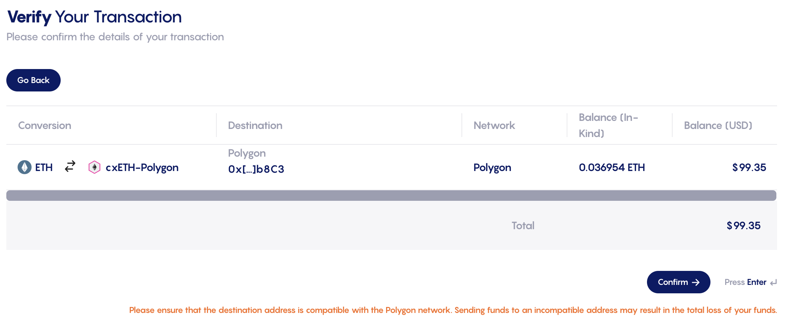
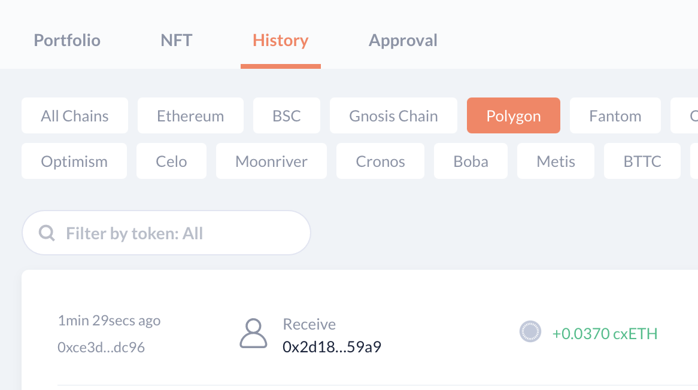
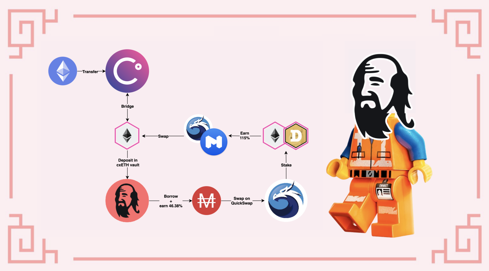

# Celsius ile CeFi'dan DeFi'ya

### Giriş

[Celsius Network](https://celsius.network) insanların banka hesaplarıyla kolayca kripto varlıkları satın alabilecekleri ve ekstra ödüller kazanmak için satın alınan tokenları stake edebilecekleri büyük CeFi aktörlerinden biridir. Örnek olarak, BTC'nizde (Bitcoin) %6,20 APY, ETH'nizde (Ether) %5,35 APY kazanabilirsiniz… Varlıklarınızı elde tutmanızın ve bileşik haftalık kazançlar elde etmenizin yanı sıra, pozisyonunuzu güçlendirmek veya diğer tokenlarla takas etmek için halihazırda sahip olduğunuz varlıklara (bunlar daha sonra teminat olarak kullanılır) karşı ek varlıklar da borç alabilirsiniz. Ancak, Celsius kapalı bir ağdır, bu yüzden genellikle bir CeFi (Centralized Finance- Merkezi Finans) uygulaması olarak anılır.

Celsius'ta varlıklarınız varsa, bunları tokenların yerel blok zincirindeki diğer uygulamalara gönderebilirsiniz. Örnek olarak, Ethereum cüzdanınızı kullanarak ETH'i Celsius'a veya Bitcoin zincirindeki adresinizi kullanarak BTC'ye aktarabilirsiniz. Buna ek olarak, Celsius şubat ayında Celsius uygulamasından Polygon'a bazı belirli varlıkları göndermenize izin veren CelsiusX adlı yeni bir köprüyü başlattı. Desteklenen mevcut tokenlar şunlardır

* ETH, Ethereum Mainnet'in yerel tokenı
* ADA, Cardano'nun yerel tokenı
* DOGE, Dogecoin blok zincirinin yerel tokenı

Varlıklarınızı Polygon'a göndererek, DeFi ekosistemine tam erişimin yanı sıra tokenlarınızı Fantom, Avalanche ve diğer birçok zincire taşımak için ek köprü seçeneklerine de sahip olursunuz. Bu kılavuz, varlıklarınızı Celsius'tan Polygon'a almak için farklı adımlarda size rehberlik edecek ve sonrasında yapabileceğiniz birkaç şeyi sunacaktır.


Bu rehber kesinlikle finansal tavsiye değildir, eğitim amaçlı hazırlanmıştır. Fiyat değişimlerine, arz ve talebe, ödül programlarının bitiş tarihlerine, kalıcı kayıplara vs. dikkat etmeniz gerekiyor... Amaç körü körüne takip edilebilecek tarifler önermek değildi. Bu yüzden lütfen kendi simülasyonunuzu yapın ve sadece kaybetmeyi göze aldığınız kadar yatırım yapın.


## Varlıklarınızı Celsius'a Taşıma

### Bir hesap oluşturun

Tabii ki Celsius'u kullanabilmek için bir Celsius hesabına ihtiyacınız olacak. Bunun için web sitelerine gidin ve [bu bağlantıyı](https://celsius.onelink.me/EyfO/5321754e) kullanarak yeni bir hesap açın. Lütfen yasal nedenlerle ve Celsius'un iş modelinin doğası gereği, KYC (Know Your Customer- Müşterini Tanı) belgeleri olarak da bilinen kimliğinizi kanıtlamanız gerekeceğini unutmayın. Ayrıca, Celsius uygulamasının ülkenizde mevcut olmayabileceğini unutmayın. Ek ayrıntılar için [Kullanım koşullarını](https://celsius.network/terms-of-use) ve [Gizlilik Politikasını](https://celsius.network/privacy-policy) kontrol edin.


Lütfen bu kılavuzun, Mai Finance ve QiDAO topluluğunun Celsius tarafından sağlanan hizmetlerden sorumlu olmadığını ve bir finansal ürüne kaydolmadan önce kendi araştırmanızı yapmanızın şiddetle tavsiye edildiğini unutmayın.


Hesabınız oluşturulduktan sonra, web uygulamasında hızlı bir tur atmaktan çekinmeyin, ayrıca mobil uygulamayı da indirebilirsiniz.

### Varlıklarınızı hesabınıza alma

Şimdilik, doğrudan Kredi Kartı veya Banka Havalesi kullanarak varlık satın almanın tek yolu mobil uygulamadır. Bu seçenek ayrıca belirli ülkeler/bölgelerle sınırlı olabilir. Bu kısıtlamalar nedeniyle, bu seçeneği ele almayacağız, ancak yapmaya istekliyseniz bu seçeneği keşfetmekten çekinmeyin.

Bu kılavuz için ETH'e odaklanacağız ve ayrıca Ethereum Mainnet'te Celsius'a köprülemek istediğiniz bir miktar Ether'iniz olduğunu varsayacağız. Web uygulamasından Al (`Receive`) sekmesine tıklamanız yeterlidir.

İlk adım, almak istediğiniz coin’i seçmektir. Bizim durumumuzda, ETH almak istiyoruz ve bunun için yapacağımız tek şey Yeni Coin Ekle’ye (`Add New Coins`) tıklayıp menüden ETH'i seçmek.

Seçtikten sonra, Ethereum ağındaki Celsius hesabınıza karşılık gelen cüzdan adresini alabileceksiniz.

Adresi Görüntüle ve Kopyala'ya (`View and Copy address`) tıklarsanız, Celsius ağındaki cüzdan adresinizi temsil eden bir QR kodu ve bunun yanı sıra basitçe kopyalayıp yapıştırabileceğiniz düz metinin bulunduğu yeni bir pencere açılır.

Cüzdan adresiyle, Ether tokenlarınızın bulunduğu yerden bir transfer başlatırsınız. Aşağıdaki örnek Coinbase'den (CeFi endüstrisindeki bir başka büyük aktör) alınmıştır:

Tabii ki ve her zaman olduğu gibi Ethereum Mainnet’te bazı işlem ücretleri ödemeniz gerekecek. Bu kesinlikle Coinbase veya Celsius ile bağlantılı değil. Aşağıda görebileceğiniz gibi, MetaMask cüzdanımdan doğrudan bir transfer de bazı ücretler ödememi gerektiriyor.


Ağın yoğunluğuna bağlı olarak ücretler oldukça yüksek olabilir. Mümkün olan en düşük ücretlerden yararlanmak için gas fiyatını kontrol ettiğinizden emin olun


Aktarım tamamlandığında, varlıklarınızı Celsius kontrol panelinizde görebilmeniz gerekir:

Bu noktada, coin’leri Celsius'ta hesabımda tutarsam her hafta stake ödülleri alacağım. Mart 2022 itibariyle ETH için APY %5,35'tir. Ancak şimdi, CelsiusX köprüsünü kullanarak varlıkları ücretsiz olarak Polygon'a taşıma olanağına sahip olacağız. Gönder sekmesine tıklayın ve Polygon'a aktarmak istediğiniz varlığı seçin.


Not: Henüz kayıtlı bir alıcı adresiniz yoksa, şimdi oluşturma zamanı. Cüzdan adresinizi Metamask'ten seçin ve para çekme adresiniz olarak ekleyin. Güvenlik nedeniyle, bir para çekme adresi oluşturduğunuzda veya değiştirdiğinizde, bu adres 24 saat boyunca kilitlenir. Aşağıdaki ekran görüntüsünde göreceğiniz gibi 100$ değerinde ETH'i Celsius'a aktardıktan 24 saat sonra bakiyem fiyat olarak değişti.


Bu ekran görüntüsünde, ETH'in sarılmış (wrapped) bir versiyonu olan Polygon'da cxETH alacağımı da fark edebilirsiniz. ADA (cxADA alacaksınız) ve DOGE (cxDOGE alacaksınız) için de aynı şey olurdu. Bu kılavuzda daha sonra cxToken’larınızla ne yapacağınıza bakacağız.


Bu transfer için kesinlikle herhangi bir ücret alınmadığını unutmayın. Ayrıca çok hızlı.


Gönderildikten sonra, aktarımı onaylamanızı isteyen bir e-posta alacaksınız ve bu aktarımı yansıtan işlem geçmişinizi Celsius uygulamasında görebileceksiniz.

Birkaç dakika sonra varlıklarınızı (cxToken’larınızı) Polygon'daki cüzdanınızda kullanabileceksiniz. Bu transferleri takip etmenin en iyi yolu muhtemelen DeBank gibi bir uygulama kullanmak ve istediğiniz zincirdeki (burada Polygon) işlem geçmişinize bakmaktır

## Polygon ve cxToken'lar

### cxTokens Nedir?

Fazla ayrıntıya girmeden cxToken’lar, sarılmış (wrapped) tokenlardır. Varlıklarınızı Celsius Network'ten Polygon'a aktardığınızda, varlıklar Celsius Network'te kilitli tutulur ve Polygon'da yeni tokenlar basılır. Bununla birlikte, Ether durumunda, Celsius'un WETH'i doğrudan Polygon üzerinde basma imkanı yoktur, bu nedenle fiyatı ETH fiyatına endekslenen bir token oluştururlar: cxETH.

Bunun tersi de mümkündür, yani cxETH'inizi Celsius'a geri aktardığınızda, cxToken yakılır ve buna karşılık gelen miktarda ETH Celsius'ta serbest bırakılır ve hesabınıza eklenir.

Celsius, cxToken fiyatının dayanak varlığın fiyatına uygun şekilde endekslendiğinden emin olmak için bir Chainlink teknolojisi kullanıyor: Rezerv Kanıtı.

Celsius'un cxToken'ları nasıl yönettiğinin ince ayrıntılarını merak ediyorsanız, tüm ayrıntıları [bu Medium makalesinden başlayarak](https://medium.com/@CelsiusX/celsius-is-integrating-chainlink-proof-of-reserve-to-unlock-cross-chain-liquidity-with-wrapped-6c85bb2f2a60). okuyabilirsiniz.

### cxToken'ları Swaplayın

cxToken'larınız, temel alınan varlıkların sarılmış sürümleri olduğundan, onları olduğu gibi kabul edecek pek fazla uygulama bulamayabilirsiniz. Neyse ki Mart 2022'den itibaren Polygon'da cxToken’lar için likiditeye sahip tek DEX olan QuickSwap DEX'i kullanarak bunları başka varlıklarla değiştirebilirsiniz.

Tabii ki, ters işlemi de gerçekleştirebilir ve diğer varlıkları kullanarak cxToken satın alabilirsiniz.


xToken’ları takas ederken slipaja olduğu kadar alınan rotaya da dikkat edin. QuickSwap en fazla 4 adım kullanıyor gibi görünüyor, örnek olarak cxDOGE'a erişmek için her zaman ETH, cxETH ve ardından cxDOGE'dan geçmeniz gerekiyor. Bu da, rotanın VARLIK > ETH > cxETH > cxDOGE olabilmesi için takas ettiğiniz varlık ile ETH arasında yeterli likiditeye sahip olmanız gerektiği anlamına gelir.

Şu anda örnek olarak MAI için durum böyle değil. Birinci takasta MAI > USDC > ETH > cxETH ve ikinci takasta cxETH > cxDOGE yapmak isteyebilirsiniz.

Aynı şey cxToken’larınızdan çıkmak istediğinizde de geçerlidir: cxDOGE'dan MAI'ye yüksek slipaj olabilir, muhtemelen önce cxETH veya ETH'den geçmek isteyeceksiniz.&#x20;


## &#x20;cxToken'larınızla Likidite Sağlama

cxToken’larınız ile QuickSwap üzerinden CelsiusX havuzlarına likidite sağlayabilirsiniz. Önceki paragraf, cxToken'larınızı nasıl takas edebileceğinizi açıklar ve bu, LP havuzları (Liquidity Poviding havuzları) kullanılarak yapılır. QuickSwap, herhangi bir kullanıcının tokenlarını takas edebileceğinden emin olmak için uygulamalarında likiditelerini stake eden kullanıcılara dQUICK ve MATIC olarak ödenen ödüller verecektir. Size ödül kazandıracak 3 çift:

* ETH/cxETH
* cxETH/cxADA
* cxETH/cxDOGE

Hepsinin farklı ödül seviyeleri vardır. Bu yüzden yapılacak en iyi şey QuickSwap uygulamasına gidip ikili madencilik programlarını kontrol etmektir.

Yukarıdaki ekran görüntüsünde, ETH-cxETH çifti için likidite sağlarsanız, dQUICK, WMATIC ve takas ücretlerinden doğrudan ETH ve cxETH'de ödenen %15'e kadar APY (ödülleri birleştireceğinizi varsayan, Annual Percentage Yield - Yıllık Yüzde Getiri) alabileceğinizi görebilirsiniz. Ödülleri birleştirmezseniz yine de %13.97'lik bir APR alırsınız ve ödül tokenlarıyla istediğiniz her şeyi yapabilirsiniz. Bunları nasıl kullanacağınıza dair daha fazla fikir almak için kılavuzlarımızı keşfetmekten çekinmeyin.


Bir likidite havuzuna girmek için seçilen çiftte 1:1 oranında [likidite sağlamanız](https://quickswap.exchange/#/add/0x7ceB23fD6bC0adD59E62ac25578270cFf1b9f619/0xfe4546feFe124F30788c4Cc1BB9AA6907A7987F9) yeterlidir. Bu da, bazı cxToken'ları başka bir şeyle değiştirmeniz gerekeceği anlamına gelebilir. LP çifti oluşturulduktan sonra çifti havuza yatırabilir ve getirileri biriktirmeye başlayabilirsiniz.


## cxToken'larınızı Teminat Olarak Kullanın ve Kredi Alın

cxToken’larınızı takas etmek, onları başka bir şey satın almak için sattığınız anlamına gelir. [Mai Finance](https://app.mai.finance), varlıklarınızı bir kasada kilitli tutmanıza ve onlara karşı bazı stablecoinler borç almanıza olanak tanıyan bir DeFi (Decentaralized Finance - Merkeziyetsiz Finans) uygulamasıdır. O zaman, krediniz ile aşağıdakiler de dahil olmak üzere istediğiniz her şeyi yapabileceksiniz;

* Stablecoin çiftçiliği
* diğer varlıkları satın almak için borç alınan MAI stablecoinini takas etmek
* cxToken’larınızdan yararlanmak
* MAI'nizi diğer zincirlere köprülemek

Kredinizi size en uygun şekilde nasıl kullanacağınız konusunda fikir edinmek için bu kılavuzun farklı yazılarını incelemeniz yeterlidir.

**Note :** MAI stablecoinini Mai Finance üzerinden borç aldığınızda, borç aldığınız miktara göre Qi tokenları ile ödeme alırsınız. Ödül oranları, o kasa için borç alınan toplam miktara, Qi'nin fiyatına ve kasa için Qi tahsisine göre değişir. [Kasa ödülleri ile ilgili kılavuzumuzda](https://github.com/0xarmagan/qidao-doc/blob/tr/mai-university/mai-loans-and-vaults-incentives.md). daha fazla ayrıntı bulabilirsiniz.

Ve elbette MAI kredinizi QuickSwap'te LP çifti cxToken’ları ve çiftçilik getirileri ile takas ederek her iki çözümü de birleştirebilirsiniz. Bu noktada yapabileceklerinizin bir sınırı yok ve ilk yatırımınız tamamen Mai Finance'teki kasanızda korunur (tasfiye etmediğiniz sürece).

## Sorumluluk Reddi

Bu kılavuz, Celsius Network ve Polygon arasında köprü olan CelsiusX'ten nasıl yararlanabileceğinizi size sunmak ve DeFi'ın Polygon'da sunabileceği şeyleri denemek için yazılmıştır. Tabii ki, Polygon üzerinden protokolleri kullanmak bazı riskler taşır. Mai Finance'te teminat olarak cxToken’ları kullanıyorsanız teminat pozisyonunuzun fiyatının tasfiye oranının altına düşmesi durumunda, kredinizin onu destekleyen varlıklardan daha büyük bir değere sahip olabileceğini gösteren bir eşik olması durumunda tasfiyelere dikkat etmeniz gerekecektir. Olası riskler bu sitedeki çeşitli eğitimlerde sunulmaktadır, bu nedenle bir kez daha, bunlardan bazılarını okumanız ve herhangi bir yatırım yapmadan önce bu kılavuzda sunulan farklı protokollerin nasıl çalıştığını anladığınızdan emin olmanız şiddetle tavsiye edilir. Ve her zaman olduğu gibi, bu kılavuz bir finansal tavsiye değildir, her zaman kendi araştırmanızı yapın.


Belirli bir zamanda iyi çalışan bir stratejinin başka bir zamanda kötü performans gösterebileceğini (veya para kaybetmenize neden olabileceğini) unutmayın. Lütfen güncel olun, piyasaları ve yatırımlarınızı takip edin ve her zaman belirttiğimiz gibi kendi araştırmanızı yapın.

