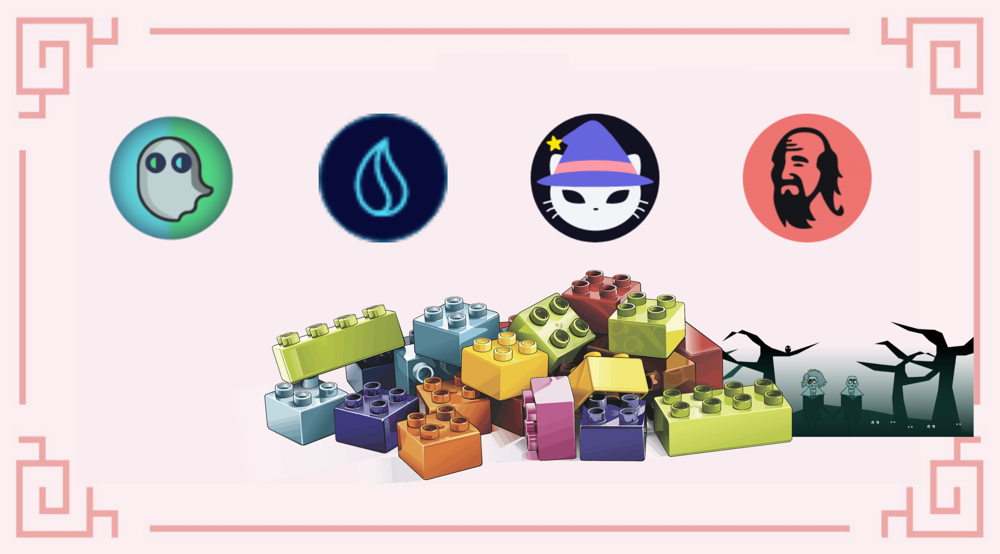
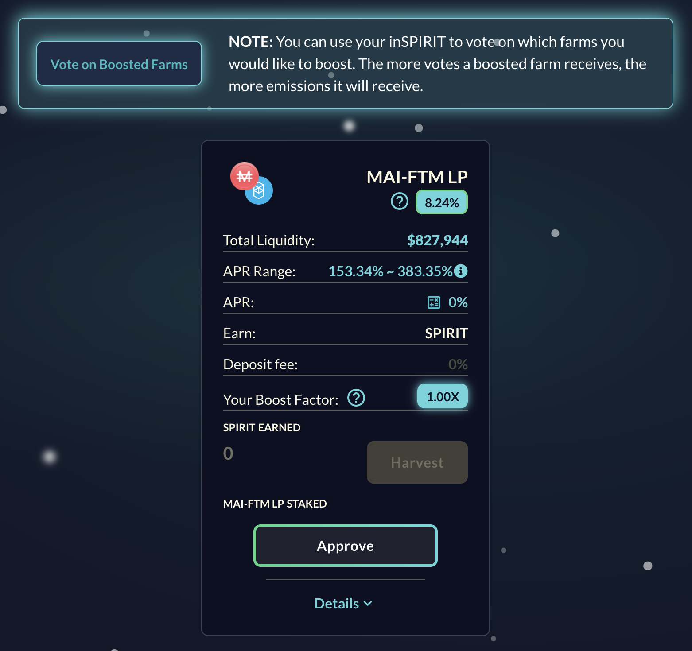
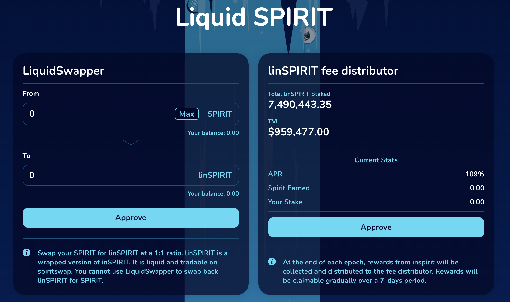
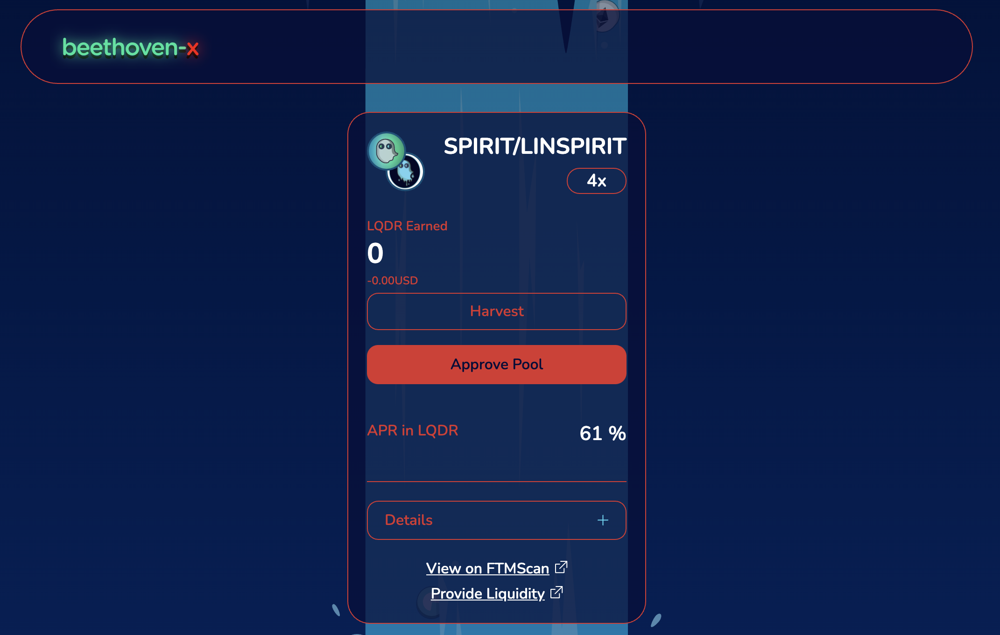
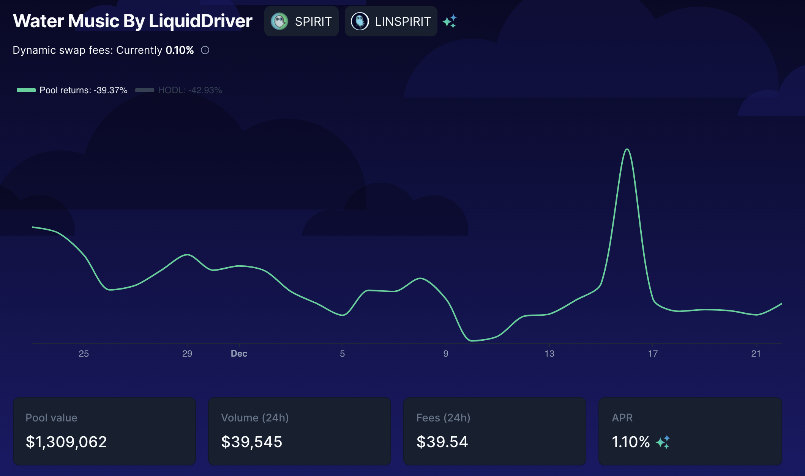
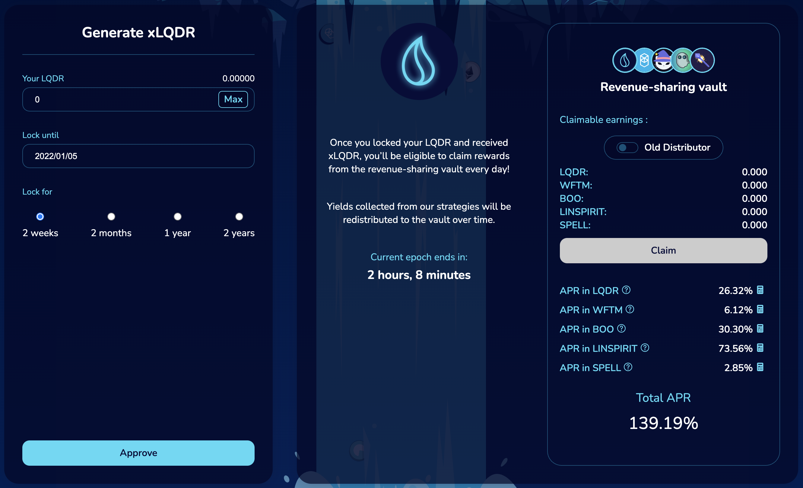
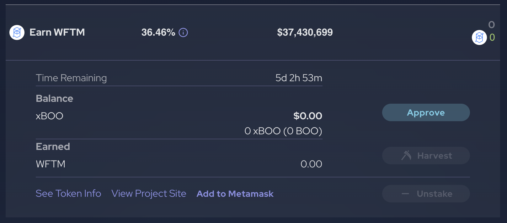
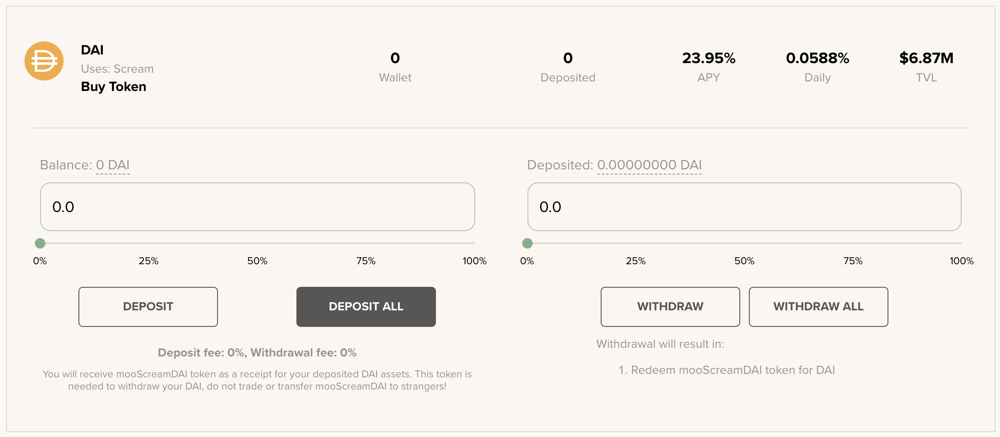
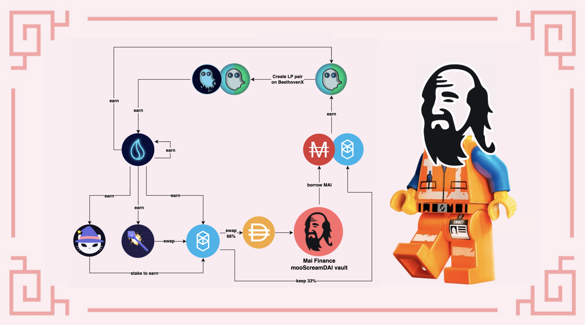

# Vòng lặp farming trên SpiritSwap

Khi tiến hành cung cấp thanh khoản, cần lưu ý đến cặp thanh khoản LP để tránh tổn thất tạm thời càng ít càng tốt tránh rủi ro cho khoản đầu tư ban đầu. Đây là một trong những lý do tại sao các hướng dẫn của chúng tôi đề xuất các chiến lược chỉ dựa trên các bể hoặc trên các cặp được bao gồm bởi một đồng tiền ổn định và một mã thông báo blue chip như Bitcoin, Ethereum hoặc mã thông báo gas bản vị của chuỗi mà chiến lược chúng ta đang sử dụng.

Hôm nay, chúng ta sẽ khám phá một vòng lặp tương đối phức tạp dựa trên cặp thanh khoản LP MAI-WFTM do SpiritSwap cung cấp với mức lãi suất hiện tại.

## Cung cấp thanh khoản MAI trên SpiritSwap

[SpiritSwap](https://app.spiritswap.finance/#/) là một trong những DEX chính (Sàn giao dịch phi tập trung) và AMM (Nhà tạo thị trường tự động) trên Fantom. Nó dựa trên nền tảng Uniswap, vì vậy tính năng cốt lõi của SpiritSwap bao gồm hoán đổi tài sản, cung cấp tính thanh khoản để kiếm lợi nhuận. Bạn sẽ nhận được phần thưởng trong mã thông báo gốc của nền tảng, mã thông báo SPIRIT mà bạn sẽ có thể đặt cược và nhận được mã thông báo inSPIRIT. Mã thông báo inSPIRIT đặc biệt hữu ích, nó sẽ cho phép bạn bỏ phiếu cho các bể thanh khoản cho phép bạn kiếm thêm lợi nhuận từ doanh thu của giao thức.

Đối với chiến lược này, chúng tôi sẽ sử dụng bể MAI-WFTM. Tính tời thời điểm tháng 12 năm 2021, bể này có thể được tìm thấy trong tab Booster Farms.


Khi hướng dẫn này được viết, bể này đang ở giai đoạn còn sơ khai (ra mắt trong vòng 24 giờ qua), điều này có thể giải thích vì sao APR (Tỷ lệ phần trăm lợi nhuận hàng năm) rất cao. Như mọi khi, trước khi áp dụng một trong các chiến lược hãy tự nghiên cứu và xác minh APR trước khi đầu tư. Để so sánh, bể USDC-WMATIC trên Polygon vào khoảng 75% và MAI-MOVR trên Moonbeam là 158%. Các bể khác như USDC-WFTM đã ổn định vào khoảng 50% trên Fantom.

Với mục đích của hướng dẫn này, chung ta sẽ bắt đầu APR thấp nhất là 153% nhằm cố gắng tạo ra độ ổn định tốt nhất cho bể.


Khi tiến hành cung cấp thanh khoản bể MAI-WFTM trên SpiritSwap, bạn sẽ nhận được phần thưởng được trả bằng SPIRIT, mã thông báo gốc của nền tảng. Tính đến tháng 12 năm 2021, 1 SPIRIT = 0,130 USDC.

## Cung cấp thanh khoản SPIRIT trên Liquid Driver

[Liquid Driver](https://www.liquiddriver.finance) là một bản fork khác của Uniswap tập trung vào việc cung cấp tính thanh khoản trên Fantom. Một trong những tính năng được quan tâm nhất trên Liquid Driver là việc họ có thể tạo mã thông báo linSPIRIT từ mã thông báo SPIRIT. LinSPIRIT là phiên bản linh hoạt của mã thông báo inSPIRIT. Tỷ lệ giữa linSPIRIT và inSPIRIT là 1: 1, nó thực sự chỉ là một phiên bản gói của mã thông báo inSPIRIT và bạn có thể giao dịch cả hai mã thông báo cho nhau trực tiếp trên Liquid Driver.

Tuy nhiên, chúng ta sẽ không sử dụng tính năng này. Chúng ta sẽ tiếp tục canh tác lợi suất bể SPIRIT-linSPIRIT trên Liquid Driver, nhưng có một điểm nhỏ rất thú vị:

Như bạn có thể thấy, bạn cần tạo mã thông báo LP trên BeethovenX để nhận được 61% APR được trả bằng mã thông báo LQDR. Tính đến tháng 12 năm 2021, 1 LQDR = 4,560 USDC. Hãy xem cách bạn có thể nhận được mã thông báo LP này.

## Tạo cặp SPIRIT-linSPIRIT trên BeethovenX

[BeethovenX](https://app.beets.fi/#/) đã được công nhận là bể Balancer chính thức trên Fantom. Đối với Balancer, bạn không cần phải gửi cùng một số lượng bằng cả hai mã thông báo để tạo mã thông báo LP. Điều này có nghĩa là bạn chỉ cần gửi trực tiếp 100% mã thông báo SPIRIT của mình và để thuật toán phụ trách việc tái cân bằng các mã trong bể.

Đổi lại, bạn sẽ nhận được mã thông báo LP mà bạn sẽ có thể ký gửi trên Liquid Driver.


Như bạn có thể thấy, bể này không được cung cấp bởi BeethovenX, vì vậy bạn sẽ không nhận được BEETS. Các ưu đãi chỉ được cung cấp bởi Liquid Driver khi bạn gửi mã thông báo LP trên nền tảng của họ và phần thưởng duy nhất bạn sẽ nhận được là  LQDR.


## Đặt LQDR trên Liquid Driver

Khi bạn đã tạo cặp SPIRIT-linSPIRIT LP trên BeenthovenX và gửi nó vào đúng bể trên Liquid Driver, bạn sẽ bắt đầu kiếm được mã thông báo LQDR. Sau đó, bạn có thể đặt cược các mã thông báo LQDR để kiếm một phần doanh thu từ giao thức. Điều thú vị là bạn có thể chọn khoảng thời gian mà LQDR của bạn sẽ được gửi nó sẽ quyết định trực tiếp đến APR của bạn (nó giống như khi bạn gửi Qi để kiếm doanh thu từ giao thức). Thời gian khóa trung bình ít hơn 2 năm  (thời gian khóa tối đa) và phần thưởng được trả lần lượt như sau

* LQDR: bạn sẽ có thể tiếp tục gửi lại phần thưởng này
* WFTM: chúng ta sẽ sử dụng mã thông báo này sau&#x20;
* BOO: chúng ta sẽ sử dụng mã thông báo này sau
* linSPIRIT: điều này có thể được sử dụng để tăng vị thế SPIRIT-linSPIRIT Liquid Driver
* SPELL: hoán đổi thành WFTM !!!

## Gửi BOO trên SpookySwap

[SpookySwap](https://spookyswap.finance)  là mảnh ghép cuối cùng trong câu đố của chúng ta trong hướng dẫn này. Đặt LQDR trên Liquid Driver sẽ kiếm được mã thông báo BOO, mã thông báo gốc từ SpookySwap. SpookySwap là DEX/AMM lớn nhất trên Fantom, vì vậy bạn có thể làm tương tự như trên SpiritSwap. Việc này đặc biệt hữu ích vì bạn có thể đặt cược mã thông báo BOO của mình trên SpookySwap để nhận mã thông báo xBOO và phiên bản khác của BOO có thể được sử dụng để cung cấp các mã thông báo khác (đó là một tính năng phổ biến cho các fork Uniswap). Vì vậy, khi bạn có xBOO, bạn sẽ có thể gửi  mã thông báo này trên SpookySwap để kiếm thêm WFTM.

## Kiếm thêm cặp MAI-WTFM

Liquid Driver và SpookySwap sẽ tạo thêm mã thông báo WFTM, tuy nhiên chúng ta thực sự thiếu MAI để tạo thêm nhiều mã thông báo LP hơn để tăng vị thế ban đầu của chúng ta trong SpiritSwap. Điều này có thể được thực hiện bằng một số cách khác nhau:

* hoán đổi 50% số WFTM thành MAI
* cho vay 66% của WFTM của bạn trên Beefy hoặc Yearn Finance để nhận mooScreamFTM hoặc yvWFTM, sau đó gửi các mã thông báo thế chấp vào Mai Finance và vay MAI
* hoán đổi 66% WFTM của bạn cho một tài sản khác và sử dụng chiến lược tương tự như trên để vay MAI


Nếu bạn cần thêm thông tin chi tiết về 2 cách hoán đổi cuối cùng, chúng tôi có một bài viết riêng về cách tận dụng tài sản của bạn trên Fantom


Đối với hướng dẫn này chúng ta sẽ cố gắng tối đa hóa lợi ích của mình và sử dụng mooScreamDAI. Điều này có nghĩa là chúng ta sẽ hoán đổi 66% WFTM của mình lấy DAI trên Spirit Swap, sau đó gửi tiền DAI trực tiếp trên Beefy bằng cách sử dụng SCREAM làm nền tảng chính để nhận mooScreamDAI. Mã thông báo này sau đó sẽ được gửi vào một kho tiền trên Mai Finance để có thể vay MAI. Để giảm rủi ro thanh lý, chúng ta sẽ giữ CDR (Tỷ lệ tài sản đảm bảo trên Nợ) là 200%, có nghĩa là chúng tôi sẽ vay một nửa giá trị khoản ký gửi của mình. Điều này là hoàn hảo vì điều này tương ứng với cùng tỷ lệ giá trị của WFTM mà chúng ta đang giữ, do đó có thể tạo thêm mã thông báo MAI-WFTM LP.

Vào cuối vòng lặp, chúng tôi sẽ nhận được thêm MAI-WFTM và một mã thông báo mang lại lợi nhuận được sử dụng làm tài sản thế chấp trên Mai Finance.

## Chiến lược farming

Mô phỏng sau được thực hiện với giả định một số điều:

* Tất cả các tỷ lệ và giá cả vẫn giữ nguyên trong toàn bộ thời gian của mô phỏng, trong trường hợp của chúng tôi là 1 năm
  * 153% APR khi cung cấp thanh khoản bể MAI-WFTM trên SpiritSwap
  * không phầnn thưởng từ linSPIRIT
  * 61% APR từ cặp SPIRIT-linSPIRIT trên Liquid Driver
  * 139% APR từ việc đặt LQDR
    * 26% APR với LQDR
    * 6% với WFTM
    * 30% với BOO
    * 74% với linSPIRIT
    * 3% với SPELL
  * 36% APR cho việc gửi xBOO
  * 21% APR cho mooScreamDAI
* Tất cả các phần thưởng và chương trình cũng chạy trong suốt một năm
* Khoản đầu tư ban đầu trị giá 1.000 đô la cho mã thông báo MAI-WFTM LP

### Ngày  1

Vào ngày 1, chỉ cần gửi cặp MAI-WFTM của bạn trên SpiritSwap. Vào cuối ngày, hãy thu thập mã thông báo SPIRIT của bạn và kết hợp chúng thành một cặp SPIRIT-linSPIRIT trên BeethovenX, sau đó gửi mã thông báo LP này trên Liquid Driver. Vào cuối ngày, bạn sẽ nhận được

| MAI-WFTM | linPIRIT-SPIRIT | LQDR | xBOO | mooScreamDAI |
| -------- | --------------- | ---- | ---- | ------------ |
| 1,000.00 | 4.19            | 0.00 | 0.00 | 0.00         |

### Ngày 2

Vào ngày thứ 2, MAI-WFTM của bạn vẫn đang tạo mã thông báo SPIRIT mà bạn sẽ gửi vào nhóm linSPIRIT-SPIRIT trên Liquid Driver, nhưng bạn cũng có thể thu thập một số mã thông báo LQDR đầu tiên của mình và đặt cược chúng để nhận nhiều phần thưởng . Vào cuối ngày, bạn sẽ nhận được

| MAI-WFTM | linPIRIT-SPIRIT | LQDR  | xBOO | mooScreamDAI |
| -------- | --------------- | ----- | ---- | ------------ |
| 1,000.00 | 8.38            | 0.007 | 0.00 | 0.00         |

### Ngày 3

Vào ngày thứ 3, điều tương tự ngoại trừ LQDR của bạn sẽ tạo ra một số mã thông báo đầu tiên từ doanh thu giao thức. Đừng quên rằng bạn sẽ thực sự đặt cược BOO của mình, thêm linSPIRIT của bạn vào nhóm, LQDR của bạn sẽ được đặt lại và phần còn lại sẽ được hoán đổi cho WFTM. WFTM kết quả sau đó được hoán đổi một phần cho DAI và sau đó mooScreamDAI được gửi vào Vault để mượn MAI, tạo thành MAI-WFTM bổ sung sau đó được gửi vào SpiritSwap. Vào cuối Ngày 3, bạn sẽ nhận được

| MAI-WFTM | linPIRIT-SPIRIT | LQDR  | xBOO | mooScreamDAI |
| -------- | --------------- | ----- | ---- | ------------ |
| 1,000.00 | 12.58           | 0.021 | 0.00 | 0.00         |


Vị trí xBOO và mooScreamDAI quá nhỏ để hiển thị, vì vậy bạn có thể bỏ qua các bước này trong vài ngày đầu tiên. Ngoài ra, để đơn giản, chúng ta cũng không xem xét phí giao dịch, điều này có thể ảnh hưởng đến lợi nhuận của bạn.


Tại thời điểm này, hệ thống đã được khởi động đã đến lúc ngồi xuống và thu lợi nhuận.

## Kết quả farming

### Công việc hàng ngày

Sau khi hệ thống được khởi động hoàn toàn, đây là công việc hàng ngày bạn sẽ phải làm

* thu hoạch mã thông báo SPIRIT từ bể MAI-WFTM trên SpiritSwap
* thu hoạch phần thưởng từ nhóm đặt cược Liquid Driver
* thu hoạch phần thưởng từ nhóm đặt cược SpookySwap&#x20;
* gửi SPIRIT từ SpiritSwap và linSPIRIT từ Liquid Driver vào pool trên BeethovenX&#x20;
* gửi mã thông báo SPIRIT-linSPIRIT LP trên Trình điều khiển lỏng&#x20;
* đặt cược BOO của bạn trên SpookySwap để nhận xBOO&#x20;
* đặt cược xBOO của bạn để trang trại WFTM&#x20;
* hoán đổi SPELL của bạn cho WFTM đổi 66% WFTM của bạn lấy DAI&#x20;
* gửi DAI được tạo trên Beefy để nhận mooScreamDAI&#x20;
* gửi mã thông báo mooScreamDAI trên Mai Finance vay MAI và giữ CDR là 200% (50% số tiền bạn đã ký gửi)&#x20;
* cung cấp thanh khoản cho nhóm MAI-WFTM trên SpiritSwap

### Kết quả theo từng tháng

| day | MAI-WFTM  | linPIRIT-SPIRIT | LQDR    | xBOO   | mooScreamDAI | MAI debt |
| --- | --------- | --------------- | ------- | ------ | ------------ | -------- |
| 30  | 1,000.004 | 130.010         | 3.281   | 0.026  | 0.005        | 0.002    |
| 60  | 1,000.039 | 256.218         | 13.014  | 0.210  | 0.041        | 0.021    |
| 90  | 1,000.140 | 383.220         | 29.369  | 0.712  | 0.147        | 0.074    |
| 120 | 1,000.349 | 511.436         | 52.538  | 1.698  | 0.364        | 0.182    |
| 150 | 1,000.708 | 641.302         | 82.741  | 3.338  | 0.738        | 0.369    |
| 180 | 1,001.268 | 773.275         | 120.224 | 5.810  | 1.323        | 0.661    |
| 210 | 1,002.081 | 907.835         | 165.263 | 9.295  | 2.175        | 1.088    |
| 240 | 1,003.207 | 1,045.486       | 218.165 | 13.984 | 3.360        | 1.680    |
| 270 | 1,004.710 | 1,186.759       | 279.268 | 20.075 | 4.947        | 2.473    |
| 300 | 1,006.659 | 1,332.316       | 348.947 | 27.773 | 7.014        | 3.507    |
| 330 | 1,009.130 | 1,482.451       | 427.613 | 37.296 | 9.645        | 4.823    |
| 360 | 1,012.205 | 1,638.095       | 515.717 | 48.870 | 12.935       | 6.467    |

### Ngày 365

Sau một năm hoàn thành, bạn sẽ nhận được

* $1,012.782 giá trị của MAI-WFTM trên SpiritSwap&#x20;
* $ 1.664,608 linSPIRIT-SPIRIT trên Liquid Driver&#x20;
* LQDR trị giá $ 531,353 được đặt trên Liquid Driver&#x20;
* XBOO trị giá $ 51,015 trên SpookySwap&#x20;
* MooScreamDAI trị giá $ 13,554 trên Mai Finance trong một kho tiền&#x20;
* Khoản nợ MAI trị giá 6,777 đô la

Xem xét khoản đầu tư ban đầu là 1.000 đô la, con số này sẽ tương đương với APY là 227,096%

### Những điều chỉnh nhỏ đối với chiến lược

Nếu bạn muốn có mức rủi ro thấp hơn, bạn có thể bắt đầu với khoản đầu tư ban đầu của mình là mooScreamDAI trị giá 1.000 đô la trong một kho tiền, vay MAI trị giá 500 đô la và hoán đổi 50% cho WFTM. Điều này sẽ giảm đáng kể nguy cơ mất một phần số tiền ban đầu của bạn trong trường hợp giá FTM giảm quá nhiều.

Hiện tại, đây là bể có tỷ lệ lãi suất cao nhất do nhóm SpiritSwap đề xuất, vì vậy một cách đơn giản hóa vòng lặp có thể thực hiện được là chỉ cần hoán đổi tất cả các mã thông báo LQDR bạn nhận được trên Liquid Driver để có thêm MAI-WFTM.

## Tuyên bố  từ chối trách nhiệm

Hướng dẫn này là phiên bản lý thuyết  bạn có thể triển khai trên Fantom. Khi chúng tôi hiển thị các vòng lặp trong hướng dẫn này, chúng tôi thực sự đang cố gắng không bán phá giá mã thông báo và luôn cố gắng tìm cách tốt nhất có thể để sử dụng mọi thứ  thu thập được. Đây là một cách tốt để giữ giá tăng vì việc canh tác lợi suất và bán phá giá mã thông báo thường dừng lại khi giá của mã thông báo đi xuống, làm cho sản lượng ngày càng kém hấp dẫn.&#x20;

Nếu tất cả mọi người đều giữ các mã thông báo đ của họ, giá của chúng sẽ chỉ tăng lên theo thời gian. Trong mọi trường hợp, hướng dẫn này cũng dựa trên nhiều giả định (giá không thay đổi, tỷ lệ phần thưởng không thay đổi) và không tính phí giao dịch, vì vậy nếu bạn muốn triển khai loại vòng lặp khép kín này, hãy đảm bảo để sinh lời vào cuối ngày hoặc gộp số tiền của bạn chỉ một lần một tuần. Và như thường lệ, DYOR!


Hướng dẫn này chắc chắn không phải là lời khuyên tài chính, nó được thực hiện với mục tiêu giáo dục. Bạn cần chú ý đến sự thay đổi giá cả, cung và cầu, ngày kết thúc chương trình thưởng, khoản lỗ vô thường, v.v. đầu tư những gì bạn sẵn sàng để có thể mất.

