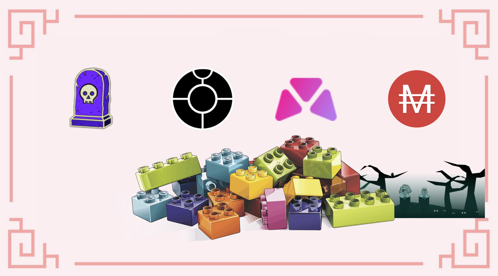
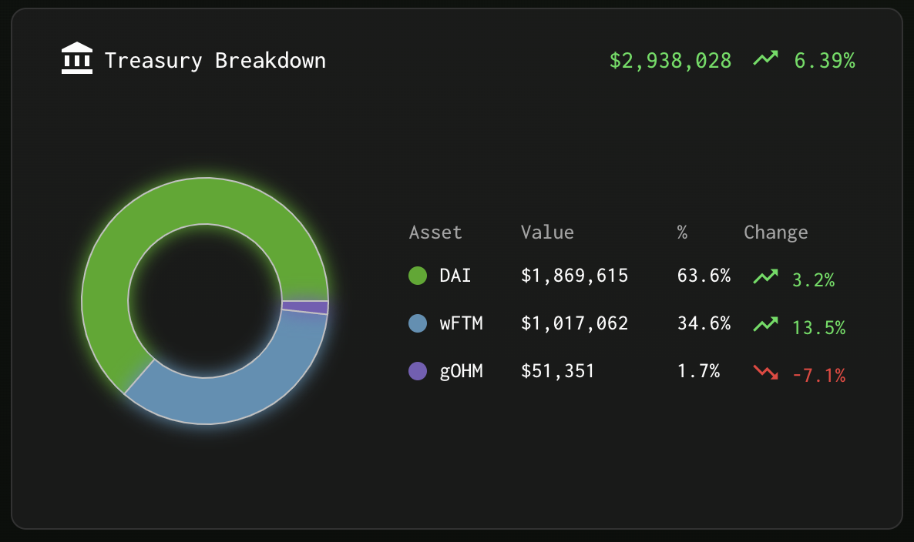
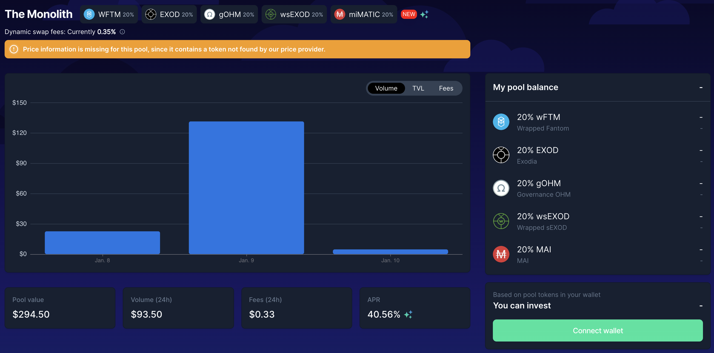
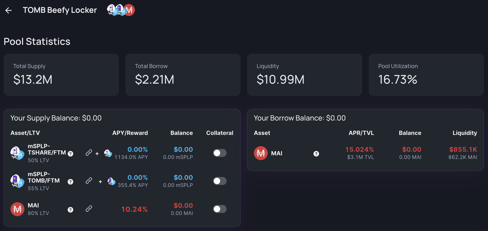
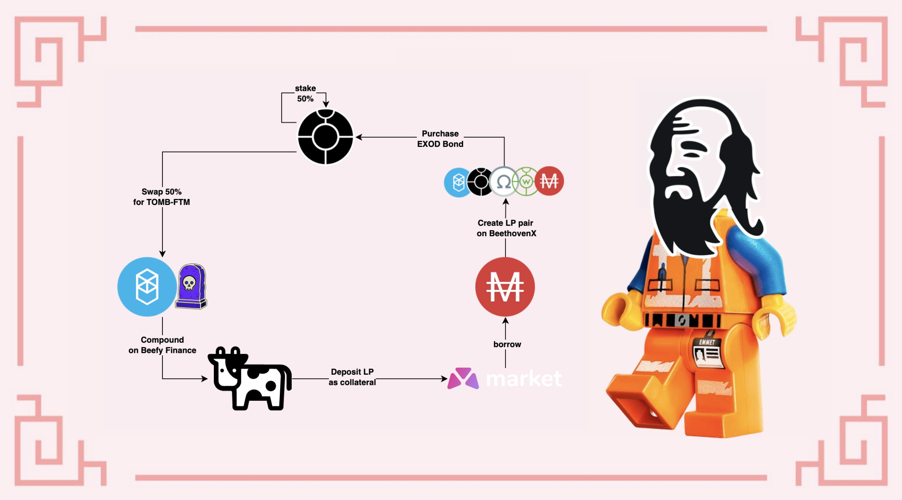

# Vòng lặp với Exodia trên Fantom

## Giới thiệu tổng quan

Một trong những điều quan trọng nhất cần ghi nhớ khi bạn đầu tư vào tiền điện tử là đảm bảo rằng số tiền ban đầu của bạn được bảo toàn. Nếu bạn ghi nhớ điều cơ bản này, lợi nhuận của bạn sẽ gặp ít rủi ro. Tuy nhiên, có một lựa chọn khác nếu bạn muốn đầu tư vào một mã thông báo có tính chất biến động cao: mua nó với chiết khấu và đảm bảo phần thưởng đủ cao để hoàn vốn ban đầu của bạn nhanh nhất có thể.

Trong thời gian gần đây, điều này có thể thực hiện được nhờ sự ra đời của trái phiếu và tỷ lệ thưởng cao được cung cấp bởi một số dự án. Vì vậy, hôm nay, chúng ta tìm hiểu hai dự án trên Fantom đang sử dụng khái niệm trái phiếu để đạt được 2 mục tiêu.

## Exodia

### Trình bày dự án

[Exodia](https://app.exodia.fi/dashboard) là một dự án sao chép OHM trên Fantom có tiềm năng rất lớn dựa trên mã thông báo EXOD, một loại tiền tệ dự trữ được hỗ trợ bởi các tài sản khác nhau. Các tài sản hỗ trợ ban đầu được thêm vào kho bạc Exodia là DAI và FTM, nhưng đội ngũ phát triển và DAO phụ trách giao thức đã quyết định phát triển mối quan hệ với cộng đồng Olympus và phân bổ 33% dự trữ dư thừa củ để mua các tài sản có giá trị bằng OHM. Do đó, một phần nhỏ của kho bạc được tính bằng mã thông báo gOHM.

### New bonding LP Token

Để tăng cường mối quan hệ, Exodia đã bỏ phiếu để tăng số lượng mã thông báo liên quan đến OHM trong kho bạc và sẽ sớm chấp nhận mã thông báo mới như một phần của chương trình phát hành trái phiếu. Mã thông báo mới là mã thông báo LP có thể tạo trên BeethovenX. Một trong những điều tốt nhất về các mã thông báo trên BeethovenX là chúng có thể được tạo ra ngay cả khi bạn chỉ sở hữu một tài sản duy nhất từ một bể thanh khoản được lựa chọn tạo điều kiện thuận lợi. Mã thông báo LP bao gồm

* 20% wFTM
* 20% EXOD
* 20% wsEXOD
* 20% gOHM
* 20% MAI

Đây có lẽ là bản fork Ohm đầu tiên sử dụng token LP của bản fork Balancer để tạo liên kết. Điều này hết sức thú vị theo nghĩa là bây giờ bạn có thể mua trái phiếu mới chỉ bằng cách sử dụng mã thông báo EXOD. Các bước bao gồm:

* gửi mã thông báo EXOD vào bể`The Monolith` trên BeethovenX để nhận mã thông báo LP
* bán mã thông báo LP của bạn trên Exodia để mua EXOD mới với giá chiết khấu
* đợi hết kỳ hạn và nhận lại mã thông báo EXOD
* lặp lại

Điều này làm giảm đáng kể áp lực bán đối với mã thông báo EXOD mang lại lợi ích đáng kể cho giao thức. Trước đây, các tay chèo trái phiếu sẽ phải bán EXOD của họ cho DAI để mua trái phiếu bổ sung, điều này gây bất lợi một phần do giảm giá mã thông báo và có tác động phân tầng đối với kho bạc.


Nếu bạn không quen thuộc với các dự án Ohm, tôi thực sự khuyên bạn nên đọc thêm một số bài viết về chủ đề này. Bạn có thể tham khảo hướng dẫn của chúng tôi về Klima ( tại phần Polygon) hoặc [truy cập trực tiếp vào tài liệu chính thức của Exodia](https://docs.exodia.finance/). Ngoài ra, bạn có thể tham gia vào máy chủ Discord và đăng ký vào chương trình giáo dục của họ.


Bạn cũng thấy rằng bể mã thông báo LP chấp nhận MAI, đồng tiền ổn định được đúc trên Mai Finance. Khi bạn đã mua trái phiếu của mình với mức chiết khấu, bạn sẽ nhận được mã thông báo EXOD của mình vào cuối kỳ hạn. Bạn cũng có thể gửi mã thông báo này ở mức APY (Lợi tức cộng dồn phần trăm hàng năm) là 38,787%, tương đương với APR (Tỷ lệ lợi nhuận hàng năm) là 601% hoặc mức tăng hàng ngày là 1,65%.

Chúng ta sẽ sử dụng hệ thống trái phiếu để mua mã thông báo EXOD với chiết khấu và thu lợi nhuận từ APY rất cao sau mỗi kỳ rebase.

## Tomb Finance

[Tomb Finance](https://tomb.finance/) là một dự án rất đặc biệt, nguyên bản theo nhiều phương diện. Mã thông báo TOMB là một đồng tiền ổn định theo thuật toán được neo với mã thông báo FTM và được thiết kế để trở thành một phương tiện trao đổi và thêm thanh khoản bổ sung cho FTM, mã thông báo bản vị trên chuỗi khối Fantom.

Hệ sinh thái Tomb Finance đề xuất thêm 2 mã thông báo:

* TSHARE: đây là mã thông báo quản trị của Tomb Finance. Người nắm giữ TSHARE có quyền biểu quyết. Ngoài ra khi gửi TSHARE cũng sẽ nhận được thêm TOMB. Việc phát hành mã thông báo TOMB bổ sung cho người nắm giữ TSHARE tuân theo cơ chế tương tự như các bản Ohm-fork với mã thông báo mới được đúc vào cuối mỗi kỷ nguyên với APY rất cao.
* TBOND: đây là một mã thông báo đặc biệt được sử dụng với mục đích neo giá với 1 FTM. Khi giá TOMB giảm xuống dưới 1 FTM, người dùng có thể mua TBOND theo giá hiện tại của token TOMB bằng cách bán mã thông báo TOMB cho giao thức và các mã thông báo này bị dốt, điều này làm tăng giá trị của TOMB trở lại 1 FTM. Mua TBOND với mức chiết khấu và có thể đổi mã thông báo TOMB là lý do cho sự ra đời mã thông báo TBOND. Khi mã thông báo TOMB nằm trên các chốt này, mọi người có thể đổi TBOND của họ lấy TOMB. TOMB mới được đúc, làm giảm giá trị của mã thông báo. Nói cách khác, đây là một mã thông báo chênh lệch giá!

Tomb Finance cũng đề xuất 2 bể LP sẽ giúp bạn kiếm được mã thông báo TSHARE. Điều này đặc biệt quan trọng để Tomb Finance có độ sâu thanh khoản. Tuy nhiên, để đạt được mục tiêu định vị TOMB như một giải pháp thay thế cho FTM, điều quan trọng đối với giao thức là phải có người dùng sử dụng TOMB, do đó sở hữu tính thanh khoản. Khi bạn canh tác lợi suất các bể TOMB-FTM và TSHARE-FTM, bạn sẽ được thưởng bằng mã thông báo TSHARE cho phép bạn kiếm được nhiều mã thông báo TOMB hơn, đây là một vòng lặp khép kín khá thú vị trên nền tảng.

## Một số mảnh bổ sung cho vòng lặp

Trên đây chúng tôi đã trình bày 2 mảnh ghép lớn cho chiến lược của mình, chúng ta cũng khám phá các mảnh ghép khác.

### Beefy Finance

[Beefy Finance](https://app.beefy.finance/#/fantom) là một công cụ tối ưu hóa lợi nhuận sẽ chấp nhận mã thông báo LP từ các DEX (Sàn giao dịch phi tập trung) cụ thể, mã thông báo phần thưởng và cho phép các thuật toán của họ bán phần thưởng để lấy tăng vị thế LP. Do đó, bạn có thể nhận được vị thế đầu tư ngày càng tăng, sẽ chỉ gộp các mã thông báo từ LP và nhận giá trị của mã thông báo phần thưởng tại thời điểm phần thưởng được thu hoạch.

Đối với chiến lược của chúng tôi, chúng tôi sẽ sử dụng cặp mã thông báo TOMB-FTM LP với nhiều lý do sau đây:

* TOMB được chốt cố định với mã thông báo FTM do đó không có IL (Tổn thất tạm thời) trên cặp này, vì vậy biến động duy nhất sẽ được liên kết với biến động giá của FTM.
* TOMB-FTM được thưởng bằng TSHARE, vì vậy việc bán TSHARE sẽ không ảnh hưởng đến giá của 2 mã thông báo này.
* TOMB-FTM có APY khá cao đối với không có rủi ro về IL (Tổn thất tạm thời)
* sử dụng mã thông báo LP trên lực lưỡng sẽ cho phép bạn nhận được nã thông báo biên lai `mooTombTOMB-FTM`&#x20;


Theo mục đích của hướng dẫn này, chúng tôi sử dụng mã thông báo TOMB-FTM vì nó ít gây rủi ro hơn do không có sự mất mát tạm thời. Tuy nhiên, bạn hoàn toàn có thể sử dụng cặp TSHARE-FTM để nhận phần thưởng cao hơn. Hãy chắc chắn rằng bạn hiểu các rủi ro và DYOR trước.


### Thị trường cho vay Market XYZ&#x20;

[Market.XYZ](https://fantom.market.xyz/pool/3) là một giao thức cho vay mà bạn sẽ có thể gửi một số tài sản cụ thể và vay bằng chính những tài sản. Khi bạn cho vay tài sản của mình, bạn có thể nhận được một số ưu đãi cho vay được trả trong tài sản bạn cho vay. Khi bạn vay, bạn sẽ phải trả một số tiền lãi tại thời điểm trả bằng chính tài sản mà bạn đã vay.

Market XYZ bắt đầu hợp tác với Mai Finance vào năm 2021 để bổ sung một số tài sản sử dụng làm tài sản thế chấp nhằm vay đồng ổn định MAI. Những tài sản này được coi là rủi ro hơn những tài sản hiện được chấp nhận trực tiếp trên Mai Finance hoặc đang chờ được tích hợp từ ChainLink Oracle và không được chấp nhận trực tiếp trên ứng dụng chính. Điều này mang lại những lợi ích bổ sung: giao thức QiDAO đang thu phí từ MAI đã vay, người đi vay đang nhận MAI với lãi suất thấp (Mai Finance đang bổ sung thêm MAI từ kho bạc thường xuyên dựa trên nhu cầu) do đó thúc đẩy nhu cầu sử dụng. Mặt khác, thị trường cho vay là một cách tuyệt vời để bắt đầu mối quan hệ bền chặt với các đối tác khác nhau trong khi họ đang chờ đợi tài sản của mình được chấp nhận trực tiếp trên Mai Finance.

Thị trường cho vay mà chúng ta quan tâm cho chiến lược này là TOMB Beefy. Sau khi chúng ta gửi mã thông báo TOMB-FTM của mình trên Beefy, chúng tôi nhận được mã thông báo biên nhận là mooTombTOMB-FTM được coi là "bằng chứng về quyền sở hữu" đối với mã thông báo đó là phần thưởng đang được cộng dồn trên Beefy. Mã thông báo biên nhận này có thể được sử dụng làm tài sản thế chấp trên MarketXYZ để vay thêm MAI.


Market.XYZ chỉ cho phép các khoản vay có giá trị tối thiểu là 0,05 ETH (\~ $ 170,00 tại thời điểm viết bài). Đảm bảo bạn gửi đủ tài sản thế chấp nếu bạn muốn vay từ các tài sản thế chấp khác nhau.


Trong ảnh chụp màn hình ở trên, bạn có thể thấy rằng chúng tôi có thể

* gửi mã thông báo mooTombTOMB-FTM làm tài sản thế chấp và nhận 355,4% APY do Beefy cung cấp.
* vay MAI dựa trên tài sản thế chấp này với lãi suất 15,02% (APR)

Có thể dễ dàng để nhận thấy rằng lợi nhuận mà chúng ta nhận được từ việc canh tác lợi suất LP vượt xa lãi vay, điều này làm cho chiến lược này trở nên khả thi. Tuy nhiên, hãy đảm bảo rằng bạn theo dõi sát sao giá FTM và TOMB để tránh bị thanh lý và đảm bảo bạn vay ở mức CDR (Tỷ lệ thế chấp trên nợ) đủ cao nhằm giúp bạn có đủ thời gian để trả khoản vay của mình trong trường hợp giá giảm mạnh.


Nếu bạn không quan tâm đến chiến lược này nhưng bạn là người dùng của Mai Finance, Market XYZ là một ứng dụng tuyệt vời để cho vay MAI. Bạn sẽ được trả bằng MAI bổ sung sẽ được cộng dồn vào vị thế của bạn.


## Chiến lược canh tác lợi suất

Để hoàn thành vòng đầu tư của chúng tôi, chúng tôi sẽ bắt đầu với việc mua trái phiếu EXOD bằng cách sử dụng MAI. Phần thưởng EXOD rebase sẽ được sử dụng để mua mã thông báo TOMB-FTM LP. Các mã thông báo sẽ được sử dụng trên Beefy để kết hợp phần thưởng TSHARE. Ngoài ra, biên lai mã thông báo LP sẽ được sử dụng làm tài sản thế chấp trên Thị trường XYZ để vay thêm MAI, điều này sẽ đưa chúng ta trở lại bước ban đầu.

húng tôi sẽ mô phỏng với một vài giả định như sau:

* tất cả tỷ lệ phần thưởng và giá cả vẫn giữ nguyên trong một năm
* APY Exodia là 38,787%
* APY TOMB-FTM trên beefy là 318.51%
* lãi suất vay trên Thị trường XYZ là 15,02% APR (lãi suất không cộng gộp, vì vậy chúng tôi đang sử dụng APR khi đề cập đến phí vay)

Ngoài ra, chúng ta sẽ giả định rằng bạn đang thu thập trái phiếu của mình và các token EXOD bổ sung hàng ngày và đặt cược 50% để hưởng lợi từ các khoản giảm giá càng sớm càng tốt. Trái phiếu sẽ được mua với mức chiết khấu trung bình là 0% để đơn giản hóa, nhưng bạn hy vọng sẽ nhận được chúng với mức chiết khấu tốt hơn và chúng ta sẽ giả định rằng có thể mua trái phiếu mới cứ sau 5 ngày.

### Ngày 1

Đầu tiên chúng ta cần tìm ra điểm vào lệnh nào ít rủi ro nhất. TOMB-FTM LP dường như phù hợp chính xác với điều này (xem lý do chi tiết trên mô tả cặp LP), vì vậy chúng tôi sẽ bắt đầu vòng lặp tại thời điểm này với cặp mã thông báo TOMB-FTM trị giá 1.000 đô la. Khi mã thông báo LP đã được tạo trên SpookySwap, bạn có thể gửi nó trên Beefy Finance và bắt đầu dùng để vay.

Đối với chiến lược này, chúng ta sẽ cố gắng duy trì CDR là 300%. nghĩa là chúng ta sẽ có thể vay MAI trị giá 333 đô la từ số thế chấp với lãi suất vay là 15,02%. MAI mượn sẽ được sử dụng trên BeethovenX để tạo mã thông báo wFTM-EXOD-gOHM-wsEXOD-MAI LP. Cuối cùng, chúng ta sẽ mua trái phiếu EXOD với LP. Lưu ý rằng tất cả quá trình thiết lập có thể được thực hiện vào Ngày 1. Vào cuối ngày đầu tiên (giả sử là 3 lần rebase), chúng ta sẽ có:

| Vị thế           | giá trị($) |
| ---------------- | ---------- |
| TOMB-FTM         | 1,000.000  |
| khoản nợ MAI     | 333.333    |
| EXOD             | 66.667     |
| TOMB-FTM bổ sung | 3.930      |
|  EXOD bổ sung    | 1.098      |

### Ngày 2, 3, 4 và 5

Trong vài ngày tới, sẽ là vô ích nếu làm bất cứ điều gì như thu hoạch và cộng gộp phần thưởng EXOD vì trái phiếu chúng ta đã mua vào vẫn trong kỳ hạn. Vì vậy, chúng ta có thể để mã thông báo TOMB-FTM LP tăng trưởng mà không cần vay thêm và tập trung vào phần thưởng EXOD trong đó 50% phần thưởng sẽ được thêm nhiều EXOD hơn và 50% còn lại sẽ được thêm để tăng vị thế cặp TOMB-FTM LP. Vào cuối Ngày 5, khi kỳ hạn kết thúc, chúng ta sẽ có:

| Vị thế           | giá trị ($) |
| ---------------- | ----------- |
| TOMB-FTM         | 1,021.369   |
| khoản nợ MAI     | 333.333     |
| EXOD             | 338.869     |
| TOMB-FTM bổ sung | 4.014       |
| EXOD bổ sung     | 5.582       |


TOMB-FTM và EXOD bổ sung chỉ là những gì được tạo ra vào ngày thứ 5 và được cộng dồn vào đầu ngày thứ 6.


### Ngày 6

TOMB-FTM cộng dồn vào ngày thứ 5, cũng như 50% EXOD thu được cho bạn tổng số TOMB-FTM trị giá 1.028,173 đô la vào đầu Ngày 6. Điều này có nghĩa là khoản vay có thể có của bạn là 342,724 đô la, cho phép bạn vay MAI trị giá thêm 9.391$ sẽ được sử dụng để mua một trái phiếu mới trên Exodia. Tại thời điểm này, hệ thống đã được khởi động và có thể quản lý đơn giản khoản đầu tư của bạn thông qua danh sách những công việc làm hàng ngày.

### Công việc hàng ngày

Quy trình này được chia thành 2 phần: công việc hàng ngày y và công việc bạn sẽ phải hoạt động 5 ngày một lần.

Hàng ngày, bạn sẽ phải:

* Nhận phần thưởng mã thông báo EXOD được cấp trên Exodia&#x20;
* Gửi 50% số token EXOD trên Exodia&#x20;
* Bán 25% mã thông báo EXOD cho FTM trên SpookySwap&#x20;
* Bán 25% mã thông báo EXOD lấy TOMB trên SpookySwap&#x20;
* Tạo mã thông báo TOMB-FTM LP trên SpookySwap&#x20;
* Gửi mã thông báo TOMB-FTM LP trên Beefy Finance&#x20;
* Gửi mã thông báo biên lai mooTombTOMB-FTM trên Market.xyz

Cứ sau 5 ngày, bạn sẽ phải:

* Vay thêm MAI từ Market.xyz để giữ CDR là 300%&#x20;
* Gửi MAI đã vay vào BeethovenX trong bể The Monolith&#x20;
* Đổi mã thông báo Beethoven LP của bạn để lấy trái phiếu EXOD trên Exodia

### Kết quả hàng tháng

Đây là kết quả sơ bộ theo từng tháng

| day | TOMB-FTM   | EXOD       | MAI debt   |
| --- | ---------- | ---------- | ---------- |
| 30  | 1,222.088  | 488.438    | 407.363    |
| 60  | 1,531.135  | 735.586    | 510.378    |
| 90  | 1,956.250  | 1,093.089  | 652.083    |
| 120 | 2,546.404  | 1,609.179  | 848.801    |
| 150 | 3,371.740  | 2,353.088  | 1,123.913  |
| 180 | 4,532.773  | 3,424.178  | 1,510.924  |
| 210 | 6,173.591  | 4,965.049  | 2,057.864  |
| 240 | 8,500.790  | 7,180.350  | 2,833.597  |
| 270 | 11,810.653 | 10,363.762 | 3,936.884  |
| 300 | 16,528.139 | 14,936.728 | 5,509.380  |
| 330 | 23,262.834 | 21,504.023 | 7,754.278  |
| 360 | 32,889.239 | 30,933.491 | 10,963.080 |

### Ngày 365

Sau một năm hoàn chỉnh với hệ thống này và giả sử mọi thứ đều giống như Ngày 1 (giá cả, tỷ lệ và mọi thứ khác ...), bạn sẽ có:

* $34,855.954 giá trị mã thông báo TOMB-FTM LP trên Beefy
* $32,863.908 giá trị của mã thông báo EXOD
* khoản nợ MAI trị giá 11.618,651 đô la trên Market.xyz, với một số khoản lãi bổ sung phải trả (tương ứng với tổng số nợ là 13.363,772 đô la)

Điều rất quan trọng cần lưu ý là Tỷ lệ Tài sản đảm bảo trên Nợ của bạn vẫn gần hoặc trên 300% vào bất kỳ lúc nào trong thời gian thực hiện, vì bạn hoàn toàn có thể bán một phần TOMB-FTM hoặc EXOD của mình để hoàn trả và giảm rủi ro bị thanh lý. Cũng có thể điều chỉnh phần EXOD bạn bán hàng ngày để chỉ cần hoàn trả khoản vay ban đầu và mua trái phiếu EXOD mới bằng cách bán TOMB-FTM. Các biến thể là vô tận, vì vậy hãy thoải mái điều chỉnh theo những gì bạn thấy phù hợp nhất.

Cuối cùng, từ khoản đầu tư ban đầu là 1.000 đô la, bạn sẽ nhận được 67.719,862 đô la và khoản nợ là 13.363,772 đô la, tương ứng với APY là 5.335,56%.

## Tuyên bố từ chối trách nhiệm

Đây là hướng dẫn minh họa đưa ra cách bạn có thể tăng lợi nhuận của mình bằng cách thêm các bản fork Ohm vào vòng lặp đầu tư của mình. Mô phỏng được thực hiện vào thời điểm Exodia có APY rất cao trên các mã thông báo EXOD đã gửi. Điều tương tự cũng có thể nói về TOMB-FTM. Các tỷ lệ rất cao này thường thay đổi rất nhiều, vì vậy bạn nên mong đợi ít lợi ích hơn rất nhiều trong khoảng thời gian của một năm hoàn chỉnh. Thật vậy, hầu hết các bản sao chép Ohm không được thiết kế để duy trì lợi suất cao như vậy trong hơn một vài tháng và thường giảm đáng kể lượng phát hành.

Luôn cập nhật thông tin về các dự án bạn đang sử dụng, đừng ngần ngại đặt câu hỏi và như mọi khi, hãy tự nghiên cứu.


Hướng dẫn này chắc chắn không phải là lời khuyên tài chính, nó được thực hiện với mục đích giáo dục. Bạn cần chú ý đến sự thay đổi giá cả, cung và cầu, ngày kết thúc chương trình thưởng, khoản lỗ tạm thời, v.v. đầu tư những gì bạn sẵn sàng để có thể mất.

