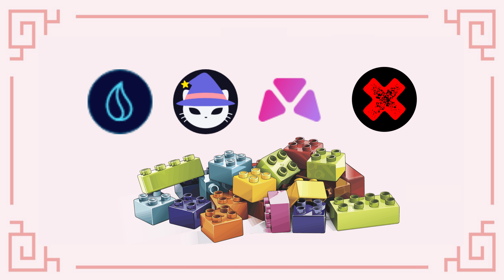

# Spooky Symfony

## Giới thiệu tổng quan

Việc vay nợ bằng tài sản của bạn luôn là con dao hai lưỡi: nó có thể giúp bạn khởi động chiến lược đầu tư của bạn hoặc tạo đòn bẩy tài sản của bạn, nhưng bạn có khoản nợ mà bạn phải trả bất cứ lúc nào. Trong hướng dẫn này, chúng tôi sẽ tạo khoản vay trên Market.XYZ, một giao thức cho vay mà bạn sẽ có thể vay MAI với tỷ lệ vay thấp và sử dụng khoản vay này được sử dụng hầu hết các giao thức minh họa trên Fantom. Chúng tôi sẽ sử dụng chiến lược để hoàn trả khoản vay và xem việc này có thể được thực hiện nhanh như thế nào để mở khóa các tài sản thế chấp.


Hướng dẫn này chắc chắn không phải là lời khuyên tài chính, nó được thực hiện với mục tiêu giáo dục. Bạn cần chú ý đến sự thay đổi giá cả, cung và cầu, chương trình thưởng, ngày kết thúc, khoản lỗ tạm thời, v.v. và chỉ đầu tư những gì bạn sẵn sàng để có thể mất.


## Các giao thức Fantom: Gotta use 'em all

Trong chiến lược này, chúng tôi sẽ sử dụng rất nhiều cặp LP (Cung cấp tính thanh khoản) khác nhau trên nhiều giao thức khác nhau, vì vậy chúng tôi nghĩ sẽ là một ý kiến hay khi cung cấp cho bạn một bản tóm tắt ngắn gọn về mỗi giao thức đang hoạt động.

### Market.XYZ

[Market.XYZ](https://fantom.market.xyz/) là một giao thức cho vay xây dựng một số hầm khóa cho các đối tác của họ. Bạn sẽ có thể gửi các tài sản đơn lẻ hoặc mã thông báo LP làm tài sản thế chấp để vay các tài sản khác. Bởi vì bạn đang vay thế chấp, điều quan trọng là phải đảm bảo rằng bạn không bị thanh lý. Việc thanh lý xảy ra khi giá trị của tài sản bạn ký gửi làm tài sản thế chấp thấp hơn giá trị của khoản vay mà bạn đã ký hợp đồng. Đây là lý do tại sao điều quan trọng là đảm bảo tỷ lệ giữa 2 giá trị vẫn tương đối cao và tài sản thế chấp của bạn không mất quá nhiều giá trị khi thị trường đi xuống.

Để giảm thiểu rủi ro thanh lý, chúng tôi sẽ sử dụng mã thông báo FTM-USDC LP làm tài sản thế chấp

* Tổn thất tạm thời đối với cặp thanh khoản này tương đối thấp
* USDC là một đồng tiền ổn định được gắn với đồng đô la Mỹ
* FTM là mã thông báo gas gốc của Fantom, nó có tính thanh khoản cao và được sử dụng ở mọi nơi
* tỷ lệ phần thưởng trên cặp FTM-USDC cao, có nghĩa là ngay cả khi giá của FTM không đổi, giá trị tài sản thế chấp của bạn sẽ tăng lên

Bạn sẽ có thể vay cặp FTM-USDC từ bể [Spooky LP](https://fantom.market.xyz/pool/10) trên market.xyz. Các bước để ký gửi tài sản thế chấp của bạn như sau:

* Tạo mã thông báo [FTM-USDC LP trên SpookySwap](https://spookyswap.finance/add/FTM/0x04068DA6C83AFCFA0e13ba15A6696662335D5B75) bằng cách cung cấp tính thanh khoản theo tỷ lệ 1: 1 cho cả hai tài sản
* Gửi mã thông báo FTM-USDC LP trên tài chính Beefy để nhận biên lai mooBooFTM-USDC (tìm kiếm nền tảng SpookySwap và tài sản USDC trên thanh lọc tìm kiếm)
* Gửi mã thông báo biên nhận mooBooFTM-USDC trên Market.xyz

Khi mã thông báo nhận LP Beefy của bạn có trên Market.XYZ, bạn vẫn nhận được phần thưởng APY do Beefy cung cấp. Điều này có nghĩa là tài sản của bạn vẫn tạo ra lợi tức cho bạn trong khi bạn vay nợ. Đây là một công cụ rất mạnh mẽ, đặc biệt là khi bạn thấy rằng mSPLP-FTM-USDC (moo Spookyswap FTM-USDC = mooBooFTM-USDC) đang kiếm được 51,4% APY và bạn có thể vay MAI với mức 2,56% APR. Nói cách khác, tài sản thế chấp của bạn tăng nhanh hơn so với nợ của bạn, vì vậy về lý thuyết, bạn rất có thể hoàn trả khoản vay của mình với các khoản lãi của tài sản thế chấp của bạn.


Một lưu ý nhỏ, bạn có thể thấy rằng tủ khóa bể Spooky LP cũng cung cấp khả năng vay bằng các mã thông báo LP khác: ETH-FMT, DAI-FTM, BTC-FTM và fUSDT-FTM. Tùy thuộc vào tài sản bạn có trong ví, niềm tin và khả năng chấp nhận rủi ro của bạn, bạn hoàn toàn có thể sử dụng bất kỳ Spookyswap LP nào làm tài sản thế chấp.


Đối với hướng dẫn này, chúng ta cũng sẽ hạn chế rủi ro bằng cách vay với CDR (Tỷ lệ tài sản đảm bảo trên Nợ) là 200%. Nghĩa là chúng ta chỉ vay 50% giá trị tài sản thế chấp. Xem thêm trong phần chiến lược canh tác. Tỷ lệ thanh khoản được biểu thị bằng LTV (Khoản vay trên Giá trị), ngược lại với CDR. Bạn có thể thấy rằng LTV cho mã thông báo mooBooFTM-USDC là 60%, trên đó bạn sẽ bị thanh lý. Con số này tương đương với CDR là 166,67%. Với mục tiêu 200% CDR, chúng tôi cao hơn tỷ lệ thanh lý là 33%, điều này có thể rủi ro hoặc không, tùy thuộc vào mức độ chấp nhận rủi ro của bạn.


Market.XYZ chỉ cho phép các khoản vay có giá trị tối thiểu là 0,05 ETH (\~ $ 170,00 tại thời điểm viết bài). Đảm bảo bạn gửi đủ tài sản thế chấp nếu bạn muốn vay tiền từ các tủ khóa khác nhau.


### BeethovenX

[BeethovenX](https://beets.fi/#/) là một Sàn giao dịch phi tập trung và Nhà tạo thị trường tự động được phân tách từ Balancer. Bạn sẽ có thể gửi tài sản của mình vào các bể thanh khoản, cũng như hoán đổi các tài sản khác nhau trên nền tảng của họ. Họ là đối tác vững chắc của giao thức QiDAO, cung cấp mã thông báo LP cho các bể mà bạn có thể tìm thấy trên Mai Finance. Chúng tôi sẽ sử dụng hai bể khác nhau trên BeethovenX cho chiến lược này.

* The Monolith: một bể khuyến khích đã được mở cho Exodia, một bản sao chép Ohm mà chúng tôi đã trình bày [trong hướng dẫn này](investing-in-discounted-assets-using-bonds.md). Bạn sẽ có thể gửi trực tiếp mã thông báo MAI của mình vào bể này và thu lợi nhuận.
* Pirate Party: một bể khuyến khích dành riêng cho mã thông báo LQDR, mã thông báo gốc từ Liquid Driver, một giao thức lớn khác mà chúng tôi sẽ sử dụng trong hướng dẫn này

Như mọi khi, lợi thế lớn nhất của việc sử dụng nền tảng BeethovenX (hoặc Balancer) là bạn có thể gửi các tài sản đơn lẻ vào các bể thay vì phải cung cấp mã thông báo theo tỷ lệ cân bằng.

### SpookySwap

[Spookyswap](https://spookyswap.finance/) là bản fork Uniswap V2 lớn nhất trên Fantom, một nền tảng nơi bạn có thể hoán đổi tài sản và cung cấp thanh khoản cho nhiều cặp. Spookyswap cũng là đối tác vững chắc của Mai Finance và đề xuất quỹ MAI-USDC. Mối quan hệ hợp tác được mở rộng thông qua Market.XYZ, nơi bạn sẽ có thể mượn MAI đối với một số cặp LP cụ thể (xem phần về Market.xyz) cũng như mã thông báo BOO và BOO đặt cọc của bạn, mã thông báo gốc của Spookswap.

Đối với hướng dẫn này, chúng tôi sẽ sử dụng hai mã thông báo LP khác nhau từ SpookySwap:

* FTM-USDC sẽ được sử dụng làm điểm khởi đầu cho chiến lược của chúng tôi. Mã thông báo LP này được sử dụng làm tài sản thế chấp trên market.xyz
* FTM-BOO đây là một trong những bể từ SpookySwap được chấp nhận trên Liquid Driver với APR cao nhất. Chúng tôi sẽ hoán đổi phần thưởng BEETS từ Monolith cho cặp này (xem thêm trong phần Chiến lược canh tác lợi suất)

### Liquid Driver

[Liquid Driver](https://www.liquiddriver.finance/) là một công cụ tối ưu hóa lợi nhuận mà bạn sẽ có thể gửi mã thông báo LP từ các bể thanh khoản khác nhau và kiếm được lợi nhuận từ chúng. Cách thức hoạt động của trình tối ưu hóa lợi nhuận là thu thập các mã thông báo phần thưởng của nền tảng mục tiêu và cộng dồn chúng lại. Điều này rất hữu ích vì gas trên Fantom có thể là một khoản chi phí đáng kể. Một khoản phí vận hành được tính nhưng một phần doanh thu của giao thức được phân phối lại cho các cổ đông LQDR. LQDR là mã thông báo gốc của Liquid Driver.

Đối với chiến lược này, chúng ta sẽ sử dụng cặp FTM-BOO LP vì đây là bể có một trong những APR cao nhất trong LQDR cho Spookyswap.

## Chiến lược canh tác lợi suất

Đối với chiến lược này, chúng tôi sẽ sử dụng Market.XYZ làm điểm khởi đầu để vay MAI đối với mã thông báo mooBooFTM-USDC LP. MAI đã mượn sẽ được gửi vào BeethovenX trong hồ bơi The Monolith. Bởi vì đây là bể có tỷ lệ phần thưởng cao nhất trong chiến lược của chúng ta, chúng ta sẽ sử dụng nó làm động cơ để trả nợ: 50% BEETS sẽ được bán để trả nợ trên Market.xyz và 50% sẽ được chuyển thành Mã thông báo FTM-BOO LP. Các mã thông báo FTM-BOO sẽ được gửi trên LiquidDriver để thu thập các mã thông báo LQDR sau đó sẽ được gửi trong bể Pirate Party trên BeethovenX. Khi khoản nợ được hoàn trả đầy đủ, phần thưởng BEETS sẽ được chuyển đổi hoàn toàn thành mã thông báo FTM-BOO. Phần thưởng BEETS do bể Pirate Party cung cấp cũng sẽ được cộng lại thành nhiều FTM-BOO hơn.

Đối với mô phỏng này, chúng tôi sẽ sử dụng các số liệu sau

* Chúng ta bắt đầu với khoản đầu tư trị giá 1.000 USD cặp mooBooFTM-USDC
* APR cho mã thông báo mooBooFTM-USDC do SpookySwap cung cấp qua Beefy là 41,5%
* Lãi suất vay đối với MAI là 2,56%
* BeethovenX cung cấp APR là 304,17% cho The Monolith và 175,77% cho Pirate Party
* LiquidDriver cung cấp 82% APR cho cặp FTM-BOO LP

Như thường lệ đối với các mô phỏng này chúng tôi giả định rằng tất cả các mức giá vẫn giữ nguyên trong suốt thời gian 1 năm, tỷ giá giữ nguyên cũng như sử dụng các APR được cung cấp như hiện tại. Trên thực tế, giá cả và tỷ lệ sẽ khác nhau và APR bao gồm phí giao dịch và mã thông báo thưởng, có thể ảnh hưởng đến kết quả cuối cùng. Điều quan trọng cần lưu ý là không có **phí giao dịch** nào được tính cho mô phỏng này. Cuối cùng, chúng tôi đang sử dụng rất nhiều giao thức và mỗi giao thức có thể có rủi ro hợp đồng thông minh. Đảm bảo bạn thực hiện các nghiên cứu của riêng mình trước khi sử dụng nền tảng và chỉ đầu tư những gì bạn sẵn sàng bỏ ra.

Bạn có thể tìm thấy mô phỏng Symfony Spooky của chúng tôi trong [Bảng tính này](https://docs.google.com/spreadsheets/d/19s6kBnT5w0b9GKuTkDiiD1u\_ZoeNUZtI9XYxEmk\_WM0/edit#gid=0). Hãy sao chép nó và nghiên cứu với nó để xem vòng lặp hoạt động như thế nào và các tỷ lệ khác nhau có thể ảnh hưởng đến APY cuối cùng của bạn như thế nào.

### Ngày 1

Vào Ngày 1, bạn cần tạo tài sản thế chấp của mình cho Market.xyz. Bằng phần bằng nhau của FTM và USDC và cung cấp tính thanh khoản trên SpookySwap để tạo mã thông báo FTM-USDC LP. Các mã thông báo này sẽ được gửi trên Beefy, sẽ giúp bạn nhận được mã thông báo nhận mooBooFTM-USDC. Đây là mã thông báo sẽ được sử dụng làm tài sản thế chấp trên Market.xyz và bạn sẽ vay MAI. Vì chúng tôi muốn giữ CDR là 200%, chúng tôi sẽ vay MAI trị giá 500 đô la. Cuối cùng, các token MAI sẽ được gửi trên BeethovenX vào bể The Monolith.

Vào cuối ngày đầu tiên, bạn sẽ có

| vị thế            | giá trị ($) |
| ----------------- | ----------- |
| mooBooFTM-USDC    | 1,000.000   |
| the monolith      | 500.000     |
| pirate party      | 0.000       |
| phần thưởng BEETS | 4.167       |
| FTM-BOO           | 0.000       |
| phần thưởng LQDR  | 0.000       |
| Nợ MAI            | 500.000     |

### Ngày 2

Vào ngày 2, bạn sẽ phải&#x20;

* bán 50% BEETS của bạn cho MAI để trả một phần nhỏ khoản vay của bạn&#x20;
* đổi phần thưởng BEETS của bạn cho cặp LP FTM-BOO. Bạn có thể hoán đổi trên BeethovenX và tạo cặp LP trên SpookySwap hoặc thực hiện mọi thứ trên SpookySwap.&#x20;
* gửi FTM-BOO LP trên Liquid Driver để bắt đầu thu thập mã thông báo LQDR.

Vào cuối ngày thứ hai, bạn sẽ có

| vị thế            | giá trị ($) |
| ----------------- | ----------- |
| mooBooFTM-USDC    | 1,001.137   |
| the monolith      | 500.000     |
| pirate party      | 0.000       |
| phần thưởng BEETS | 4.167       |
| FTM-BOO           | 2.083       |
| phần thưởng LQDR  | 0.005       |
| nợ MAI            | 497.952     |

### Ngày 3

Lặp lại thao tác từ Ngày 2, sau đó thu thập các mã thông báo LQDR đầu tiên của bạn. Chúng sẽ được gửi vào BeethovenX trong bể Pirate Party để nhận thêm phần thưởng BEETS và vào cuối Ngày 3, bạn sẽ có

| vị thế            | giá trị ($) |
| ----------------- | ----------- |
| mooBooFTM-USDC    | 1,002.275   |
| the monolith      | 500.000     |
| pirate party      | 0.005       |
| phần thưởng BEETS | 4.167       |
| FTM-BOO           | 4.167       |
| phần thưởng LQDR  | 0.000       |
| nợ MAI            | 495.903     |


Lợi nhuận từ bể Pirate Party là quá nhỏ vào thời điểm này, nhưng bạn sẽ nhận được một số theo thời gian.


### Công việc hàng ngày

Tại thời điểm này, hệ thống đã được khởi động hoàn toàn. Công việc hàng ngày của bạn sẽ bao gồm

* thu hoạch phần thưởng BEETS từ The Monolith&#x20;
* thu hoạch phần thưởng BEETS từ Pirate Party&#x20;
* đổi 50% BEETS cho MAI nếu bạn vẫn còn nợ chưa thanh toán&#x20;
* trả một phần nợ của bạn nếu bạn vẫn còn một số đổi phần còn lại của BEETS&#x20;
* lấy mã thông báo FTM-BOO LP gửi FTM-BOO trên LiquidDriver&#x20;
* thu hoạch LQDR&#x20;
* gửi tiền vào Pirate Party

Chiến lược này khá tốn xăng, vì vậy bạn có thể cân nhắc tiến hành cộng dồn chỉ một lần một tuần hoặc thậm chí ít thường xuyên hơn.

### Kết quả theo từng tháng

Đây là kết quả tháng này qua tháng khác, vì bạn có thể lấy chúng trong Bảng tính Google được liên kết ở trên.

| ngày | FTM-USDC  | The Monolith | Pirate Party | FTM-BOO   | MAI nợ  |
| ---- | --------- | ------------ | ------------ | --------- | ------- |
| 30   | 1,033.503 | 500.000      | 1.901        | 60.500    | 440.541 |
| 60   | 1,069.343 | 500.000      | 8.031        | 123.652   | 378.905 |
| 90   | 1,106.425 | 500.000      | 18.452       | 187.988   | 317.139 |
| 120  | 1,144.794 | 500.000      | 33.265       | 254.136   | 255.242 |
| 150  | 1,184.493 | 500.000      | 52.612       | 322.738   | 193.216 |
| 180  | 1,225.569 | 500.000      | 76.681       | 394.462   | 131.058 |
| 210  | 1,268.069 | 500.000      | 105.704      | 470.006   | 68.770  |
| 240  | 1,312.043 | 500.000      | 139.963      | 550.105   | 6.351   |
| 270  | 1,357.542 | 500.000      | 181.427      | 691.752   | 0.000   |
| 300  | 1,404.619 | 500.000      | 233.046      | 846.443   | 0.000   |
| 330  | 1,453.328 | 500.000      | 295.350      | 1,009.331 | 0.000   |
| 360  | 1,503.726 | 500.000      | 368.942      | 1,182.000 | 0.000   |

### Ngày thứ 365

Vào cuối một năm canh tác lợi suất, bạn sẽ có

* $1,512.294 giá trị của mã thông báo FTM-USDC trên Market.xyz&#x20;
* MAI trị giá 500.000 đô la trong bể Monolith&#x20;
* LQDR trị giá $ 382.353 được lưu trữ trong bể Pirate Party&#x20;
* Mã thông báo FTM-BOO trị giá $1,211,845 trên Market.xyz món nợ cuối cùng được hoàn trả đầy đủ sau ngày # 243

Kết quả này tương đương với tổng APY là 260,65%

### Ảnh hưởng của việc trả nợ đến kết quả chung

Trong hầu hết các hướng dẫn này, chúng ta không trả bất kỳ khoản nợ nào như một phần của chiến lược. Trong hầu hết các trường hợp, điều này là do chúng ta đang sử dụng khoản vay 0% lãi suất tại Mai Finance. Ở đây, chúng ta đang vay trên Market.XYZ với tỷ lệ đi vay là 2,56% và chúng ta trả nợ bằng 50% BEETS thu được từ The Monolith.

Nếu bạn phân bổ hơn 50% cho việc trả nợ, bạn sẽ trả ít tiền lãi hơn, nhưng bạn sẽ phát triển vị thế của mình chậm hơn nhiều trên Liquid Driver. Nếu bạn phân bổ ít hơn 50% cho việc trả nợ, bạn sẽ nhận được nhiều phần thưởng hơn từ các nền tảng khác, nhưng bạn cũng sẽ trả nhiều lãi hơn trên Market.xyz.

Dưới đây là một bảng nhỏ cho biết ảnh hưởng của BEETS được phân bổ đối với việc trả nợ của bạn trên APY tổng thể của bạn:

| BEETS % |  APY tổng thể | Sau khi nợ được trả |
| ------- | ------------- | ------------------- |
| 100     | 242.85        | 122 ngày            |
| 90      | 245.06        | 135 ngày            |
| 80      | 247.75        | 152 ngày            |
| 70      | 251.05        | 174 ngày            |
| 60      | 255.23        | 203 ngày            |
| 50      | 260.65        | 244 ngày            |
| 40      | 267.92        | 305 ngày            |
| 33.5    | 274.09        | 364 ngày            |

Nếu bạn sử dụng ít hơn 33,5% phần thưởng BEETS của mình để trả nợ, bạn vẫn sẽ có một số MAI để trả sau một năm hoàn chỉnh.

Cũng nên hiểu rằng nếu bạn trả nợ nhanh hơn, bạn cũng tăng CDR của mình một cách đáng kể hơn, điều này cho phép bạn thoát khỏi tỷ lệ thanh lý nhanh hơn.

## Một số biến số cần lưu ý&#x20;

Chiến lược này có nhiều biến thể mang lại những lợi ích khác nhau.

### Mai Finance và Market.xyz

Bạn hoàn toàn có thể vay MAI tại[ Mai Finance ](https://app.mai.finance/)với lãi suất 0%. Ví dụ: nếu bạn sử dụng mooScreamFTM thay vì mooBooFTM-USDC làm tài sản thế chấp, điều này sẽ mang lại những ưu điểm sau:

* Bạn không có bất kỳ tổn thất tạm thời nào đối với tài sản thế chấp của mình&#x20;
* Bạn vay ở mức 0% với một khoản phí hoàn trả 0,5% duy nhất, trong hầu hết các trường hợp, sẽ thấp hơn nhiều so với lãi suất bạn sẽ trả trên Market.xyz (nếu có MAI để vay cho kho tiền này)&#x20;
* Bạn có thể nhận được phần thưởng Qi khi vay trên nền tảng này, điều này sẽ cho phép bạn tham gia vào việc quản lý giao thức, cũng như nhận được cổ tức nếu bạn gửi Qi của mình. Điều này sẽ làm tăng lợi nhuận hàng năm của bạn&#x20;
* Bạn được bảo vệ khỏi tỷ lệ đi vay rất dao động trên Market.xyz. Mai Finance sẽ thường xuyên cho vay MAI mới để giữ lãi suất vay ở mức thấp nhất có thể nhưng không phải là đảm bảo rằng nó sẽ không tăng lên. Bạn có thể kiểm tra các chỉ số cho thị trường cho vay [tại đây](https://metrics.market.xyz/d/HChNahwGk/fuse-pool-details?orgId=1\&refresh=10s\&var-poolID=10\&var-chain=250).

Tuy nhiên, mã thông báo mooScreamFTM có APY thấp hơn nhiều so với mã thông báo mooBooFTM-USDC, vì vậy bạn có thể bỏ lỡ điều đó.

### Gửi số LQDR

Nếu bạn gửi LQDR của mình thay vì sử dụng nó trong bể Pirate Party, bạn sẽ kiếm được một số cổ tức từ Liquid Driver được trả bằng các tài sản khác nhau (LQDR, WFTM, LINSPIRIT, BOO, SPELL và BEETS). Bạn cũng sẽ nhận được xLQDR cho phép bạn tham gia quản lý Liquid Driver và có thể LINSPIRIT để bỏ phiếu về việc phân bổ phần thưởng trên Spirit Swap. Vui lòng kiểm tra trang [xLQDR](https://www.liquiddriver.finance/xlqdr) cẩn thận để biết thêm chi tiết.

### Gửi số BEETS

Nếu BEETS từ The Monolith đóng một vai trò cao trong chiến lược này, bạn hoàn toàn có thể sử dụng những thứ từ Pirate Party như sau:

* gửi BEETS trong bể Fidelio Duetto (BEETS-FTM)
* gửi mã thông báo LP trên BeethovenX để nhận fBEETS
* gửi fBEETS của bạn để nhận cổ tức từ giao thức

Điều này cũng sẽ cho phép bạn bỏ phiếu về các cải tiến giao thức BeethovenX, cũng như phân bổ phần thưởng cho các bể khác nhau trên nền tảng. Điều này đặc biệt hữu ích để giữ APR cao trên The Monolith.

### Sử dụng bể FTM-BEETS trên Spookyswap

Trong chiến lược của mình, chúng tôi đang bán tất cả phần thưởng BEETS từ The Monolith. Tuy nhiên, bạn cũng có thể tích hợp bể FTM-BEETS từ Spookyswap trong vòng lặp của mình. Bạn sẽ phải bán 50% BEETS của mình cho FTM và kết hợp hai mã thông báo thành một cặp LP mới sẽ kiếm được BOO cho bạn. Sau đó, bạn có thể quyết định tạo FTM-BOO và gửi trên Liquid Driver hoặc bạn có thể đặt cược BOO của mình trên SpookySwap. Lưu ý rằng nếu bạn đặt cược BOO của mình, bạn sẽ có khả năng gửi mã thông báo nhận xBOO và kiếm mã thông báo LQDR trực tiếp và thậm chí bạn có thể sử dụng mã thông báo xBOO làm tài sản thế chấp trên Market.xyz mở ra nhiều khả năng.


Hãy theo dõi cặp cụ thể này trong trường hợp nó có sẵn trên Liquid Driver. Đây có thể là một lựa chọn tốt hơn FMT-BOO.


### Sử dụng FTM-USDC của bạn trên Liquid Driver

Sau khi khoản vay của bạn được hoàn trả đầy đủ, bạn có thể giữ mã thông báo mooBooFTM-USDC trên Market.xyz hoặc trên Beefy, chúng sẽ tiếp tục tích lũy phần thưởng. Tuy nhiên, bạn cũng có thể rút cặp LP khỏi Beefy và gửi vào Liquid Driver để nhận thêm LQDR.&#x20;

Lưu ý thêm, trong khi bạn đang trả nợ, giá trị của Tỷ lệ thế chấp trên Nợ sẽ tăng lên (tài sản thế chấp là phần thưởng kép và tăng giá trị trong khi khoản nợ sẽ thu hẹp lại sau mỗi lần hoàn trả một phần). Điều này có nghĩa là bạn có thể rút từng phần tài sản thế chấp để giữ CDR an toàn và gửi chúng vào Liquid Driver để có thêm mã thông báo LQDR.

### Giữ một phần lợi nhuận

Hệ thống này là một vòng khép kín. Tuy nhiên, bạn rất có thể tiếp tục bán các phần BEETS của mình để lấy các tài sản khác sau khi hoàn tất việc trả khoản vay của mình trên Market.xyz. Ví dụ: bạn có thể chuyển đổi phần thưởng BEETS của mình thành USDC hoặc một đồng ổn định khác, hoặc tăng một trong các vị thế của bạn để kiếm được nhiều phần thưởng hơn cho cặp FTM-USDC.

## Từ chối trách nhiệm

Hướng dẫn này chủ yếu được thiết kế để giới thiệu cách bạn có thể trả nợ bằng cách sử dụng năng suất canh tác. Tốc độ bạn trả nợ sẽ ảnh hưởng lớn đến tỷ lệ phần thưởng tổng quan, nhưng cũng thể hiện một số khía cạnh rất tích cực, mặt chính là giảm rủi ro thanh lý.&#x20;

Tất nhiên, bạn có thể dễ dàng cắt bỏ các góc với chiến lược này, thay đổi các phần của vòng lặp cho một số cái khác, thay thế giao thức bằng thứ gì đó bạn thích, v.v. Tuy nhiên, hãy đảm bảo đọc tất cả tài liệu có sẵn cho các giao thức mà bạn muốn sử dụng, và đảm bảo rằng bạn hiểu tất cả các rủi ro khác nhau.


Hướng dẫn này chắc chắn không phải là lời khuyên tài chính, nó được thực hiện với mục tiêu giáo dục. Bạn cần chú ý đến sự thay đổi giá cả, cung và cầu, chương trình thưởng, ngày kết thúc, khoản lỗ tạm thời, v.v. chỉ đầu tư những gì bạn sẵn sàng để có thể mất.

