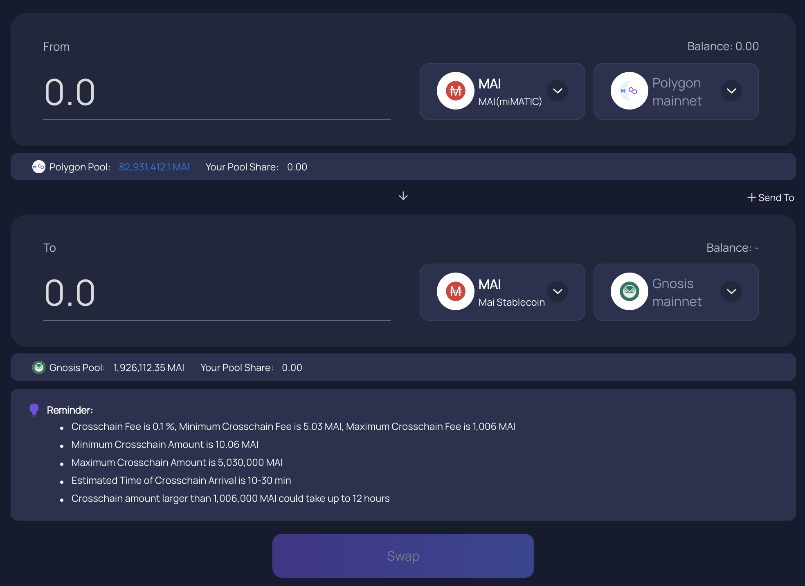

# Khởi động trên chuỗi Gnosis

## Chuỗi Gnosis là gì?

Chuỗi Gnosis là chuỗi khối tương thích với máy ảo Ethereum (EVM), có nghĩa là toàn bộ mã được triển khai trên Ethereum cũng có thể triển khai tương ứng trên chuỗi Gnosis. Cũng tương tự như các chuỗi khối lớp 1 hiện nay đang cố gắng đạt được 3 tiêu chuẩn bao gồm phi tập trung/bảo mật/khả năng mở rộng, chuỗi Gnosis đang tập trung vào tốc độ (khả năng hoàn thành 1 giao dịch trung bình là 5 giây) và chi phí giao dịch thấp. Chuỗi Gnosis sử dụng xDAI (dạng bọc của DAI trên Gnosis) làm mã thông báo chính cho các giao dịch thông thường đồng thời sử dụng GNO là mã thông báo quản trị và đặt cọc. Mục đích ban đầu chuỗi Gnosis là xây dựng thị trường dự đoán trên chuỗi Ethereum. Thị trường dự đoán được định nghĩa như các sàn giao dịch nơi giao dịch các sự kiện. Khi sự kiện diễn ra thì mã thông báo Gnosis tăng hoặc giảm tùy thuộc kết quả dự đoán.&#x20;

Đề hỗ trợ mục tiêu của chuỗi Gnosis các ứng dụng phi tập trung được xây dựng  với các chức năng riêng biệt như:

* RealT: ứng dựng token hóa các bất động sản&#x20;
* Kleros: một nền tảng được xây dựng các xung đột như một dịch vụ dựa trên công nghệ chuỗi khối.&#x20;

Bạn có thể tìm kiếm thông tin bổ sung về các ứng dụng phi tập trung trên chuỗi Gnosis trên trang web của [DeFi Llama](https://defillama.com/chain/Gnosis).

## Cách bắt đầu trên chuỗi Gnosis&#x20;

Trước khi sử dụng chuỗi Gnosis, bạn sẽ cần một địa chỉ ví. Bởi vì Gnosis là một mạng EVM, nó sẽ chấp nhận các ví giống như trên các chuỗi EVM khác, bao gồm ví web như Metamask hoặc Nifty và bạn sẽ có thể sử dụng ví phần cứng của mình như Trezor hoặc Ledger, nhưng bạn có thể phải theo dõi thêm các bước để có thể kết nối ví lạnh của bạn với mạng.

Đối với hướng dẫn này, chúng tôi sẽ sử dụng ví Metamask giống như tất cả các hướng dẫn khác trên trang web này. Nếu bạn chưa cài đặt Metamask, bạn có thể tìm hướng dẫn về [Cách bắt đầu trên Polygon.](../polygon/how-to-get-started-on-polygon.md)

### Thêm chuỗi Gnosis vào Metamask

Về lý thuyết, Gnosis được cài đặt sẵn với MetaMask, có nghĩa là bạn không cần phải thêm thông tin chuỗi để Metamask hoạt động. Tuy nhiên, có thể là một ý tưởng hay để xác minh rằng thiết lập của bạn là chính xác bằng cách kiểm tra kỹ các giá trị được lưu vào ví cục bộ của bạn. Mở cửa sổ bật lên Metamask, nhấp vào biểu tượng ví của bạn, điều hướng đến Cài đặt, sau đó chọn Mạng và tìm Chuỗi Gnosis. Dữ liệu bạn sẽ nhận được như sau:

* **Tên mạng:** Gnosis Chain
* **New RPC URL:** https://rpc.gnosischain.com/
* **Chain ID:** 100
* **Biểu tượng tài sản:** xDAI
* **Trình khám phá khối URL:** https://blockscout.com/xdai/mainnet

Lưu các thay đổi và Metamask sẽ tự động chuyển bạn sang chuỗi Gnosis:

## Kết nối với chuỗi Gnosis

### Faucets

Bạn có thể sử dụng Google để tìm một số faucet trên Gnosis Chain, nơi bạn có thể yêu cầu một số xDAI đầu tiên của mình để bắt đầu giao dịch. Tôi không đề xuất cụ thể bất cứ nguồn gì, nhưng nhận thấy [faucet do cộng đồng điều hành này cung cấp](https://www.gimlu.com/faucet) 0,002 xDAI cho mọi yêu cầu. Hãy lưu ý rằng số lượng yêu cầu bạn có thể làm là có hạn và đó hoàn toàn không phải là cách để kiếm tiền miễn phí.

### Cầu nối

* [Multi Chain](https://app.multichain.org/#/router) là đối tác chính thức của Mai Finance nếu bạn muốn chuyển MAI của mình sang Chuỗi Gnosis từ chuỗi Polygon hoặc sang các chuỗi khác. Khi bạn đã kết nối với Polygon, bạn có thể chỉ cần chọn chuỗi đích (Chuỗi Gnosis) và tài sản bạn muốn gửi (MAI hoặc miMATIC) với số tiền chính xác và nhấp vào nút Chuyển. Hãy chú ý đến phí chuyển khoản được tính trực tiếp trên tài sản bạn đang chuyển.

* [Elknet](https://app.elk.finance/#/elknet) hoạt động như một cầu nối và một nguồn faucet khi bạn chuyển mã thông báo ELK giữa 2 mạng. Bạn sẽ có thể kết nối ELK của mình và ở đầu nhận, bạn có thể có một phần nhỏ ELK của mình trực tiếp dưới dạng mã thông báo gas, xDAI trong trường hợp này.

## DeFi trên Gnosis

Gnosis sẽ đề xuất một số lựa chọn DeFi trên chuỗi của mình, bao gồm:

* [SushiSwap](https://app.sushi.com/farm?chainId=100): Đây là một trong những DEX và AMM chính trên Gnosis / xDAI. Bạn sẽ có thể hoán đổi tài sản của mình hoặc tham gia khai thác thanh khoản bằng cách cung cấp cặp LP (Cung cấp thanh khoản) trong các bể thanh khoản.
* [Curve](https://xdai.curve.fi/): Đây là nơi phần lớn thanh khoản được cung cấp trên Chuỗi Gnosis. Đây cũng là nơi bạn có thể cung cấp đồng ổn định MAI trong bể MAI và nhận phần thưởng bằng mã thông báo GNO.

* [Honeyswap](https://app.honeyswap.org/#/pool), [Honeycomb](https://1hive.io/#/wallet) và [Agave](https://app.agave.finance/#/dashboard): Tương tự như một DEX (Uniswap fork) cho phép bạn hoán đổi mã thông báo và tạo mã thông báo Cung cấp tính thanh khoản, một AMM (Goose fork) cho phép bạn đặt cược mã thông báo LP của mình được tạo trên Honeyswap và nhận được lợi nhuận để cung cấp thanh khoản và giao thức cho vay (AAVE fork) cho phép bạn cho mượn một số tài sản nhất định và cho người khác vay. 3 dApp này đang tạo thành một hệ sinh thái hoàn chỉnh do cùng một nhóm quản lý.
* [Elk Finance](https://app.elk.finance/#/farms): Elk là một fork của Uniswap V2 sẽ cho phép bạn vận hành các giao dịch hoán đổi, ký quỹ thanh khoản và tạo mã thông báo $ ELK của họ bằng cách sử dụng các tài sản khác nhau của Chuỗi Gnosis, bao gồm cả MAI. Bạn cũng sẽ có thể đặt cược mã thông báo ELK của mình để nhận thêm phần thưởng hoặc chuyển chúng từ chuỗi này sang chuỗi khác bằng cầu nối ElkNet.

## Mai Finance trên Gnosis Chain

Nền tảng cho vay đã có sẵn trên Gnosis Chain, nơi bạn có thể gửi mã thông báo GNO của mình vào một kho tiền để thế chấp và mượn MAI. Điều này sẽ cho phép bạn sử dụng mã thông báo GNO của mình làm tài sản thế chấp và sử dụng MAI trên Curve của bạn để tạo ra nhiều mã thông báo GNO hơn. Vòng lặp sẽ bao gồm

* Tạo kho tiền trên [Mai Finance](https://app.mai.finance)
* Gửi mã thông báo $GNO vào kho tiền
* Mượn $MAI dựa trên khoản thế chấp với 0% lãi suất
* Gửi $ MAI vào Curve Finance và nhận phần thưởng GNO

## Tuyên bố từ chối trách nhiệm

Hướng dẫn này KHÔNG phải là lời khuyên tài chính, và chỉ nên được coi là một công cụ giáo dục. Luôn luôn làm nghiên cứu riêng của bạn. Thảo luận về một dự án trong hướng dẫn này không nên được coi là sự chứng thực của dự án.


Hãy nhớ rằng một chiến lược hoạt động tốt tại một thời điểm nhất định có thể hoạt động kém (hoặc khiến bạn mất tiền) vào một thời điểm khác. Hãy cập nhật thông tin, theo dõi thị trường, theo dõi các khoản đầu tư của bạn và như mọi khi, hãy tự nghiên cứu.

