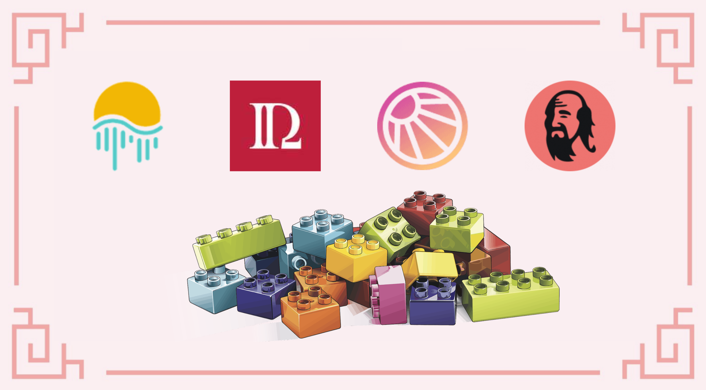

# Cung cấp thanh khoản trên SolarBeam với MAI

Hầu hết các chiến lược được trình bày trong hướng dẫn này này đều sử dụng các đồng tiền ổn định để khởi đầu. Điều này chủ yếu là do các cặp tiền ổn định không bị ảnh hưởng bởi sự mất mát tạm thời cũng như sự biến động của các tài sản khác. Sau đó với vị thế ổn định này bạn có thể sử dụng các chiến lược mạo hiểm hơn với lợi nhuận hấp dẫn hơn để tăng vị thế ổn định của bạn.

Với chiến lược này, Solarbeam là nền tảng duy nhất có MAI trong các bể thanh khoản của nó làm điểm khởi đầu. Đồng ổn định MAI bạn có thể đúc trong các kho tiền trên MAI Finance hoặc đưa chúng trực tiếp lên mạng Mooriver thông qua các cầu nối. Solarbeam đề xuất một bể thanh khoản của cặp MOVR-MAI với MOVR là đồng bản vị được sử dụng như phí gas trên chuỗi Moonriver. Đây không phải một bể ổn định tuy nhiên chúng rất đáng để thử với một số biến nhỏ khiến chúng trở thành một điểm khởi đầu tốt.&#x20;

Hãy xem cách chúng ta có thể tạo ra một số lợi nhuận rất cao với vòng phản hồi khép kín trên Moonriver mà không cần bán quá nhiều mã thông báo gốc.

## SolarBeam

### Cung cấp thanh khoản với MAI trên SolarBeam

Solarbeam là DEX (Sàn trao đổi phi tập trung) và AMM (Nền tảng tạo thị trường tự động) đầu tiên và chính trên Moonriver, đồng thời là ứng dụng thứ hai về chỉ số TVL trên chuỗi. Đây cũng là đối tác Moonriver đầu tiên của Mai Finance và đề xuất bể MAI-MOVR được thưởng bằng một số mã thông báo gốc của họ, mã thông báo SOLAR.

Với APR (Tỷ lệ lãi suất hàng năm) là 84% là khá cao do mức độ sử dụng bể thấp, do vậy nó cũng là lý do cho sự khởi đầu chiến lược của chúng ta. Bạn sẽ nhận được APR này (tương ứng với 131% APY nếu bạn muốn so sánh với MAI-WMATIC trên QuickSwap làm tham khảo) và phần thưởng sẽ được trả bằng mã thông báo SOLAR. Tại thời điểm tháng 12 năm 2021, 1 SOLAR = 3,78 USDC.

### Đặt cọc đơn SOLAR

Cũng như hầu hết các bản fork của Uniswap, Solarbeam cũng đề xuất đặt cọc mã thông báo gốc của họ với APR khá ấn tượng (lên đến 200% nếu khóa trong vòng 30 ngày). Tuy nhiên chúng ta sẽ tiến hành đặt cọc SOLAR để có thể nhận được các mã thông báo của các ứng dụng khác trên cùng mạng Moonriver. Ở trường hợp này chính là mã thông báo ROME

Bạn sẽ để ý rằng bể ROME có APR thấp nhất nhưng khi nó được sử dụng trên nền tảng RomeDAO thì tỷ lệ lãi cao điên rồ.&#x20;

## Rome DAO

Rome DAO là một nền tảng lớn khác trên Moonriver. Đó là một Ohm-fork (bản sao Olympus DAO) sử dụng mã thông báo ROME làm mã thông báo gốc. Bạn sẽ có thể đặt cược mã thông báo ROME của mình trên nề tảng để nhận được mức lợi nhuận rất cao. Mục tiêu của mỗi Ohm-fork là có càng nhiều mã thông báo gốc được đặt cọc và thu hút tính thanh khoản để có thể tiếp tục duy trì lượng phát hành. Nếu bạn cần thêm thông tin chi tiết về Ohm, vui lòng xem hướng dẫn của chúng tôi về [Klima DAO trên Polygon.](https://app.gitbook.com/o/-MgVaUztoRBw-4TjbJaB/s/-MgS6h4h2L6e5O5bUNqY-3869408753/c/GsLroQetJno1rAdTTMgT/huong-dan-toan-tap/polygon/ohm-forks-on-polygon-the-case-of-klima)

Bởi vì chúng ta sẽ nhận được mã thông báo ROME từ Solarbeam, chúng ta sẽ có thể đặt chúng trên Rome DAO. Đối với chiến lược này, chúng ta sẽ đặt cược mã thông báo ROME trên Rome DAO và bán 50% phần thưởng hàng ngày, hiện tương ứng với \~ 1% số tiền gửi trên Rome DAO.

## Mai Finance

Mai Finance là một nền tảng cho vay, nơi bạn có thể gửi tài sản tiền điện tử của mình và vay đồng tiền ổn định MAI với lãi suất 0%. Phí duy nhất sẽ được tính trên Moonriver là phí hoàn trả 0,5% khoản vay của bạn.

Đối với chiến lược này, chúng ta sẽ sử dụng một kho tiền ETH. Mã thông báo ROME sẽ được trích xuất từ ​​bể trên Rome DAO sẽ được chia như sau:

* 33% sẽ được hoán đổi thành MOVR bằng tính năng hoán đổi trên Solarbeam
* 66% sẽ được đổi sang ETH bằng cách sử dụng tính năng hoán đổi trên Solarbeam

Sau đó, bạn sẽ có thể gửi ETH vào Mai Finance để vay MAI với CDR (Tỷ lệ thế chấp trên nợ) là 200% để ở trong vùng an toàn và ngăn chặn ngăn chặn rủi ro thanh lý. Với số MAI mượn sau đó sẽ được sử dụng để tạo thêm thanh khoản cho bể MAI-MOVR LP  ban đầu trên Solarbeam.

Ví dụ: với mỗi $ 1 ROME mà bạn kiếm được từ ​​Rome DAO, chúng tôi sẽ nhận được

* $0.33  MOVR
* $0.66  giá trị của ETH được gửi trên Mai Finance
* $0.33  giá trị của  MAI được mượn từ kho ETH trên Mai Finance
* $0.66 giá trị của  MAI-MOVR LP được thêm trên Solarbeam

## Chiến lược canh tác lợi suất

Mô phỏng sau được thực hiện bằng cách giả định sau:

* Tất cả các tỷ lệ và giá cả vẫn giữ nguyên trong toàn bộ thời gian của mô phỏng, trong trường hợp này là 1 năm
  * 84% APR của bể MAI-MOVR trên Solarbeam
  * 108% APR đặt cọc SOLAR để nhận ROME&#x20;
  * 771% APR trên Rome DAO khi đặt cọc ROME
* Tất cả các phần thưởng và chương trình cũng chạy trong suốt một năm
* 50% lợi nhuận hàng ngày trên Rome DAO được bán với tỷ lệ  33% MOVR và 66% ETH
* Vốn ban đầu là 100$ giá trị của cặp MAI-MOVR LP

### Ngày  1

Vào ngày 1, bạn chỉ cần gửi MAI-MOVR trị giá 100 đô la của mình trên Solarbeam và sẽ thu hoạch các mã thông báo SOLAR của bạn vào cuối ngày. Điều này sẽ cho bạn kết quả sau:

| MAI-MOVR | SOLAR | ROME  | ETH   | Additional LP |
| -------- | ----- | ----- | ----- | ------------- |
| 100.000  | 0.230 | 0.000 | 0.000 | 0.000         |

### Ngày 2

Vào ngày thứ 2, bạn sẽ giữ vị trí MAI-MOVR của mình để nhận thêmày  thêm SOLAR, nhưng bạn cũng sẽ đặt cược thu hoạch mã thông báo SOLAR đầu tiên của mình để bắt đầu thu thập một số mã thông báo ROME. Vào cuối ngày thứ 2, bạn sẽ nhận được:

| MAI-MOVR | SOLAR | ROME  | ETH   | Additional LP |
| -------- | ----- | ----- | ----- | ------------- |
| 100.000  | 0.460 | 0.001 | 0.000 | 0.000         |

### Ngày 3

Vào đầu ngày 3, bạn sẽ có thể thu hoạch một số mã thông báo ROME đầu tiên của mình từ phần thưởng đặt cược hàng ngày 50%. Tuy nhiên sẽ khôn ngoan khi sử dụng  số tiền không thực sự đáng kể này. Bạn sẽ bán 33% cho MOVR và 66% cho ETH mà bạn sẽ gửi kho tiền của mình trên Mai Finance, sau đó vay MAI dựa vào số ETH mới của bạn.

Tại thời điểm này, hệ thống bắt đầu khởi động hoàn chỉnh

| MAI-MOVR | SOLAR | ROME  | ETH      | Additional LP |
| -------- | ----- | ----- | -------- | ------------- |
| 100.000  | 0.690 | 0.002 | 0.000005 | 0.000005      |

## Kết quả

### Công việc hàng ngày

Sau khi hệ thống được khởi động đầy đủ, dưới đây chính là công viễ hàng ngày của bạn

* thu hoạch SOLAR từ bể MAI-MOVR&#x20;
* gửi các mã thông báo SOLAR mà bạn vừa kiếm được&#x20;
* thu hoạch mã thông báo ROME từ bể SOLAR&#x20;
* đặt cược mã thông báo ROME mới có được của bạn&#x20;
* bỏ 50% số tiền kiếm được hàng ngày của bạn trên Rome DAO (tương ứng với \~ 1,5 rebase) bán 66% mã thông báo ROME của bạn để lấy ETH bán 33% mã thông báo ROME của bạn cho MOVR
* gửi ETH vào kho ETH trên Mai Finance vay 50% số tiền gửi của bạn dưới dạng đồng xu ổn định MAI&#x20;
* ghép mã MAI mượn với mã thông báo MOVR thêm vào bể MAI-MOVR&#x20;

### Kết quả thô theo từng tháng

### Ngày thứ 365

| day | MAI-MOVR | staked SOLAR | staked ROME | ETH     |
| --- | -------- | ------------ | ----------- | ------- |
| 30  | 100.021  | 7.135        | 0.352       | 0.023   |
| 60  | 100.190  | 14.045       | 1.550       | 0.200   |
| 90  | 100.713  | 20.978       | 3.911       | 0.740   |
| 120 | 101.872  | 27.968       | 7.869       | 1.925   |
| 150 | 104.052  | 35.072       | 14.023      | 4.148   |
| 180 | 107.788  | 42.378       | 23.204      | 7.947   |
| 210 | 113.814  | 50.019       | 36.559      | 14.065  |
| 240 | 123.142  | 58.178       | 55.580      | 23.525  |
| 270 | 137.175  | 67.158       | 82.767      | 37.745  |
| 300 | 157.848  | 77.321       | 120.875     | 58.681  |
| 330 | 187.841  | 89.226       | 174.234     | 89.041  |
| 360 | 230.861  | 103.358      | 248.711     | 132.575 |

Sau một năm cung cấp thanh khoản hoàn chỉnh, chúng ta sẽ có

* $239.633 giá trị của cặp MAI-MOVR trên Solarbeam
* $106.358 giá trị của SOLAR trên Solarbeam
* $263.708 giá trị của ROME được gửi trên Rome DAO
* $141.450 giá trị của  ETH trên Mai Finance
* $68.817 giá trị của MAI đang nợ trên Mai Finance

MAI-MOVR bổ sung không hoàn toàn tương ứng với khoản nợ vì chúng tôi đang sử dụng một phần ba số mã thông báo ROME được hoán đổi để nhận một nửa số mã thông báo LP mới

Do đó, vòng lặp này sẽ cung cấp cho bạn APY tương đương là 583,15% từ vị trí cung cấp thanh khoản cặp MAI-MOVR ban đầu.

## Tuyên bố từ chối trách nhiệm

Một số  điều chính cần lưu ý từ chiến lược này là Moonriver hiện đang được sử dụng ít và tỷ lệ phần thưởng rất thú vị. Ngoài ra, ngay sau khi bạn sử dụng Ohm-fork vào chiến lược của mình để đầu tư lại một phần lợi nhuận của mình, tỷ lệ phần thưởng cao ngất ngưởng đến mức bạn sẽ kiếm được lợi nhuận đáng kể miễn là bạn giữ đủ số mã thông báo trong DAO để tạo ra  phần thưởng.

Tuy nhiên, hãy nhớ rằng các dự án sẽ có tỷ lệ phần thưởng thay đổi và sẽ không được đảm bảo trong khoảng thời gian một năm. Vui lòng đảm bảo rằng bạn hiểu tất cả các dự án bạn đang đầu tư, tự nghiên cứu và đảm bảo chỉ đầu tư vào những gì bạn có thể sẵn sàng để mất. Bởi vì chiến lược này đang đầu tư vào ban đầu tương đối ổn định, điều duy nhất gặp rủi ro ở đây là lợi ích từ các hệ thống khác. Hướng dẫn này không thể được coi là sự chứng thực cho các dự án mà nó sử dụng.


Hướng dẫn này chắc chắn không phải là lời khuyên tài chính, nó được thực hiện với mục tiêu giáo dục trong. Bạn cần chú ý đến sự thay đổi giá cả, cung và cầu, ngày kết thúc chương trình thưởng, khoản lỗ vô thường, v.v. đầu tư những gì bạn sẵn sàng để có thể mất.

