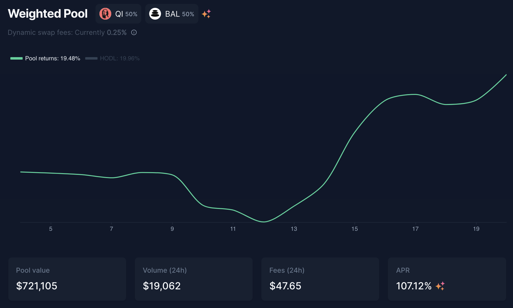

# Làm gì với camDAI?

## Giới thiệu

Hầu hết mọi người đều sợ hãi khi nghĩ về DeFi. Luôn có một yếu tố rủi ro cần tính đến khi sử dụng tiền mã hóa, sự biến động của thị trường này có thể khiến người ta mất rất nhiều tiền khiến việc tìm ra một chiến lược phù hợp có thể khá phức tạp. Tuy nhiên, khi bạn đang sử dụng các công cụ chính xác, một số chiến lược dễ dàng và rủi ro thấp có thể thu được kết quả tốt và có thể tránh được các lựa chọn phức tạp và rủi ro hơn.

Trong hướng dẫn này, chúng tôi sẽ trình bày một chiến lược đầu tư tạo đòn bẩy cho các đồng tiền ổn định nhằm giảm rủi ro với lợi suất đáng mong đợi.&#x20;

## Toàn tập về khái niệm đòn bẩy

Tưởng tượng rằng chúng ta đang có vùng viễn Tây xa xôi, nơi mà cơn sốt vàng đang khiến các thợ đào ngày càng đông đảo hơn với mong muốn làm giàu. Các ngân hàng muốn có vàng để cho vay và kiếm lãi.

Tiếp theo bạn hãy tượng tưởng rằng bạn là một thợ đào tuy nhiên không được may mắn lắm vì chỉ đào được một ít. Tuy thế, bạn là người thông minh nên thay vì dốc sức khai thác, bạn lại có một kế hoạch khác.

Bạn đến một ngân hàng và giải thích rằng bạn có vàng để thế chấp với mục đích nhận một phần lãi suất từ việc cho vay những người có nhu cầu.

Cũng  bởi vì bạn có thể dùng số vàng đó làm thế chấp nên bạn có thể vay thêm ngân hàng vay một số tiền nhất định.

Với số tiền vay được bạn quyết định tìm đến những thợ đào khác để mua lại số vàng của họ.

Bạn quay lại ngân hàng để gửi số vàng đó để kiếm được nhiều lãi hơn đồng thời tiếp tục vay tiền để mua thêm vàng từ các thợ đào. Bạn tiếp tục lặp lại nhiều lần như vậy.

Đây gọi là tạo đòn bẩy. Bây giờ bạn thử tưởng tượng rằng có một ngân hàng cho bạn vay với lãi suất 0% và một cỗ máy in tiền từ những khoản lãi mà bạn nhận được.

## Giới thiệu công cụ

### AAVE

[AAVE](https://app.aave.com) là một nền tảng cho vay và đi vay nơi bạn có thể gửi tài sản mã hóa của mình để kiếm được lợi nhuận. Đối với chiến lược minh họa dưới đây, chúng ta sẽ cho vay DAI, một đồng tiền ổn định (được gắn với đô la Mỹ). Trên AAVE, DAI trị giá 100 đô la sẽ có khả năng tạo ra tỷ suất lợi nhuận từ 4% đến 10% trong khoảng thời gian 1 năm.

Khi bạn gửi tài sản của mình trên AAVE, bạn sẽ nhận được hóa đơn về việc gửi tiền. Trong ví dụ này, vì chúng ta đang gửi DAI, chúng ta sẽ nhận được mã thông báo amDAI trong ví của mình (hóa đơn của DAI). Bạn nhất thiết phải giữ lại biên lai này vì bạn sẽ cần nó để lấy lại DAI của mình khỏi AAVE. Đây là ngân hàng sẽ chấp nhận vàng của bạn trong cuộc so sánh viễn tây của chúng tôi.

### Mai Finance

[Mai Finance](https://app.mai.finance) là một nền tảng cho vay sẽ cho phép bạn gửi một số tài sản mã hóa vào một kho tiền và vay theo giá trị của khoản tiền gửi này. Nếu chúng ta so sánh với khái niệm ngân hàng, đó sẽ là ngân hàng cho phép bạn vay, nhưng khoản vay không đến từ những gì người khác đang cho vay. Thay vào đó, ngân hàng này in tiền tương ứng với khoản tiền gửi của bạn.

Bạn có thể sử dụng amDAI trên thanh tab [lợi nhuận](https://app.mai.finance/yield) trên nền tảng Mai Finance bằng cách cho vay tại các kho tiền với lãi suất cộng dồn lên tới 8.75% với phần thưởng 2.01% bằng WMATIC. Công cụ lợi nhuận trên nền tảng Mai Finance sẽ trực tiếp hoán đổi số MATIC này thành DAI do vậy tỷ lệ APY hiện thị trên Mai Finance là số lãi suất cộng dồn từ thị trường AAVE.

Sau khi  bạn gửi số amDAI của mình vào công cụ lợi nhuận trên Mai Finance bạn sẽ nhận lại một số camDAI token được coi như bằng chứng cho số token mà bạn đã gửi vào bể amDAI với tỷ lệ phụ thuộc vào phần trăm cổ phần của bạn trong bể. Bạn có thể xem chi tiết tại [hướng dẫn này.](leverage-aave-tokens.md#amtokens-vs-camtoken)

Giờ đây bạn có thể vay thêm MAI (một đồng tiền ổn định neo tại mức 1$) bằng số camDAI nhận được dùng làm thế chấp từ các kho tiền của Mai Finance. Nền tảng này tương tự như ngân hàng thứ hai cho phép bạn vay tiền dựa trên số vàng bạn đã thế chấp tại ngân hàng thứ nhất như một sự đảm bảo trong trưởng hợp bạn không có khả năng hoàn trả khoản vay của mình.&#x20;

### Zapper

[Zapper](https://zapper.fi/dashboard) giống như một con dao sắc bén trên mạng Polygon. Nền tảng này cho phép bạn canh tác lợi suất tại các bể thanh khoản, cho vay tài sản của bạn trên AAVE trực tiếp trên nền tảng của họ. Các bảng theo dõi trực quan cho phép người dùng có thể theo dõi danh mục đầu tư của mình cũng như cho phép hoán đổi một số loại tiền tệ. Chúng ta sẽ sử dụng nền tảng này là bước cuối để hoán đổi đồng MAI sang DAI.

Zapper chính là những người thợ đào vàng chấp nhận tiền bạn vay được để đổi lấy vàng.

### Balancer

Như bạn thấy trên thì Zapper đang sử dụng [Balancer](https://polygon.balancer.fi/#/) như một giao thức vận hành cung cấp thanh khoản. Balancer là trình quản lý danh mục đầu tư tự động, cung cấp thanh khoản và cảm biến giá, nơi bạn có thể cung cấp tính thanh khoản (và nhận phí từ việc này) hoặc hoán đổi tiền tệ bằng cách sử dụng các bể thanh khoản.

Đối với hướng dẫn này, Balancer đóng vai trò như một công cụ để tăng độ biến động của các khoản đầu tư của chúng ta nhằm kiếm được lợi nhuận tốt hơn.

## Miêu tả chiến lược

### Chiến lược chính

Như đã giải thích ở trên thì AAVE đóng vai trò là nguồn cung thế chấp cho những kho tiền trên nền tảng Mai Finance bằng công cụ lợi nhuận.

 

Nút `Zap khi sử dụng DAI` sẽ mở ra một cửa sổ bật lên cho phép bạn gửi DAI của mình vào kho tiền và vận hành tiền gửi AAVE . Điều này giúp tiết kiệm rất nhiều thời gian và một phí giao dịch.&#x20;

Đây là bước đầu tiên với giả định rằng chúng ta có 100$ DAI được gửi vào kho tiền camDAI với mục đích vay MAI.

CDR (Tỷ lệ tài sản đảm bảo trên Nợ) tối thiểu đối với camDAI là 110%. Điều này có nghĩa là tỷ lệ giữa tài sản thế chấp của bạn (DAI trị giá 100 đô la) và khoản vay cần phải duy trì trên 110%.


Nếu tỷ lệ CRD này đạt đến giá trị tối thiểu là 110%, điều đó có nghĩa là tài sản thế chấp của bạn đang mất giá trị và khoản nợ của bạn trở lên lớn hơn giá trị tài sản thế chấp của bạn. Tại thời điểm này, kho tiền của bạn có thể được thanh lý: ai đó có thể trả một phần nợ của bạn và lấy một phần tài sản thế chấp của bạn như một khoản bồi thường. Tuy nhiên, vì cả DAI và MAI đều là những đồng tiền ổn định được gắn với đồng đô la Mỹ, nên rủi ro giữa 2 tài sản là rất thấp làm cho chiến lược này khá an toàn.


Để duy trì rủi ro thanh lý thấp, chúng ta sẽ duy trì CDR ở mức 115%. Với tỷ lệ này chúng ta có thể biết được số lượng MAI có thể vay được dựa vào công thức dưới đây.

$$
MAI_{khả.dụng} = \frac{tài.sản .thế.chấp_{giá.trị} - Nợ_{giá.trị} * Mục.tiêu_{CDR}}{Mục.tiêu_{CDR}}
$$

Với giá trị tài sản thế chấp là 100 đô la, chưa có nợ và CDR mục tiêu là 115%, đây là số tiền chúng tôi có thể vay:

$$
MAI_{khả.dụng}=\frac{100 - 0*1.15}{1.15}=86.95
$$

​Sau đó, bạn có thể hoán đổi MAI mà bạn đã mượn cho DAI và lặp lại. Sau đây là số liệu thống kê tài sản và nợ của bạn:

| Vòng lặp # | Tài sản thế chấp | Nợ      | Nợ khả dụng | APY tương ứng | DAI liquidation price |
| ---------- | ---------------- | ------- | ----------- | ------------- | --------------------- |
| 1          | 100.000          | 0.000   | 86.956      | 10.42%        | 0                     |
| 2          | 189.956          | 86.956  | 75.614      | 19.48%        | 0.512                 |
| 3          | 262.571          | 162.571 | 62.751      | 27.36%        | 0.681                 |
| 4          | 328.323          | 228.323 | 57.175      | 34.21%        | 0.765                 |
| 5          | 385.498          | 285.498 | 49.718      | 40.17%        | 0.815                 |
| 6          | 435.216          | 335.216 | 43.233      | 45.35%        | 0.847                 |
| 7          | 478.449          | 278.448 | 37.593      | 49.85%        | 0.870                 |
| 8          | 516.042          | 416.042 | 32.690      | 53.77%        | 0.887                 |
| 9          | 548.732          | 448.732 | 28.426      | 57.18%        | 0.899                 |
| 10         | 577.158          | 477.158 | 24.718      | 60.14%        | 0.909                 |
| 11         | 601.877          | 501.877 | 21.494      | 62.72%        | 0.917                 |
| 12         | 623.371          | 523.371 | 18.691      | 64.96%        | 0.924                 |
| 13         | 642.062          | 542.062 | 16.253      | 66.90%        | 0.929                 |
| 14         | 658.315          | 558.315 | 14.133      | 68.60%        | 0.933                 |
| 15         | 672.448          | 572.448 | 12.289      | 70.07%        | 0.936                 |
| 16         | 684.737          | 584.737 | 10.686      | 71.35%        | 0.939                 |
| 17         | 695.423          | 595.423 | 9.293       | 72.46%        | 0.942                 |

Trong minh họa này, chúng ta dừng lại ở vòng lặp thứ 17, bạn có thể tăng vòng lặp nếu muốn.

Vào cuối 17 vòng, bạn sẽ nhận được 695,423 đô la tài sản thế chấp và 595,423 đô la nợ. Điều này tương ứng với 116,79% CDR, đủ an toàn để ngăn chặn rủi ro thanh lý.

Với mức APY là 10.42% được cấp từ kho camDAI trên Mai Finance thì lợi nhuận sau một năm với 100$ vốn ban đầu là

$$
Lợi.nhuận  = Tài.sản.thế.chấp_{giá.trị}*APY=695.423*10.42\%= \$72.463
$$

### Chiến lược thay thế

Để có thể tiếp xúc nhiều hơn với tài sản biến động cao, bạn có thể sử dụng vòng lặp như trên nhưng chỉ tạo đòn bẩy cho 90% MAI và 10% còn lại mua token Qi nhằm cung cấp thanh khoản cho bể BAL-Qi trên Balancer .

Vì chúng ta tái đầu tư ít DAI hơn nên chúng ta cũng sử dụng ít vòng lặp hơn :

| Vòng lặp # | Tài sản thế chấp | Nợ      | Qi     | Nợ khả dụng | APY tương ứng  | DAI liquidation price |
| ---------- | ---------------- | ------- | ------ | ----------- | -------------- | --------------------- |
| 1          | 100.000          | 0.000   | 0.000  | 86.957      | 10.42%         | 0                     |
| 2          | 178.261          | 86.957  | 8.696  | 68.053      | 35.22%         | 0.537                 |
| 3          | 239.509          | 155.009 | 15.501 | 53.259      | 54.63%         | 0.712                 |
| 4          | 287.441          | 208.268 | 20.827 | 41.681      | 69.82%         | 0.797                 |
| 5          | 324.954          | 249.949 | 24.995 | 32.620      | 81.71%         | 0.846                 |
| 6          | 354.312          | 282.569 | 28.257 | 25.529      | 91.01%         | 0.877                 |
| 7          | 377.288          | 308.097 | 30.810 | 19.979      | 98.29%         | 0.898                 |
| 8          | 395.269          | 328.076 | 32.808 | 15.636      | 103.99%        | 0.913                 |
| 9          | 409.341          | 343.712 | 34.371 | 12.237      | 108.45%        | 0.924                 |
| 10         | 420.354          | 355.948 | 35.595 | 9.576       | 111.94%        | 0.931                 |

Khi kết thúc 10 vòng lặp, bạn sẽ nhận được

* $420.354 DAI tài sản thế chấp
* $355.948 nợ
* $35.595 Qi

Với cùng công thức áp dụng như trên ta sẽ có số liệu như sau:

* Mức CDR là 118.09% được coi là đủ an toàn để ngăn chặn rủi ro về thanh lý
* 43,800 đô la tiền lãi từ DAI với 10,42% APY được cấp bởi công cụ lợi suất
* 68,139 đô la tiền lãi cho Qi từ Balancer trong bể thanh khoản Bal-Qi
* Tổng cộng là 111.94% APY

Chiến lược này rủi ro hơn rất nhiều đặc biệt với bể thanh khoản Bal-Qi. Tuy nhiên với chiến lược này, chúng ta có thể tiếp xúc với Qi từ giao thức QiDAO. Nếu bạn sử dụng phần thưởng Bal từ bể thanh khoản để làm thế chấp tại kho tiền để vay thêm MAI bạn có thể tiếp tục tái đầu tư vào kho tiền camDAI hoặc bể thanh khoản Bal-Qi. Làm như vậy bạn sẽ được thưởng Qi thêm từ việc vay tiền hàng tuần.

## Kết luận

Với số vốn đầu tư tối thiểu và giám sát ít bạn có thể nhận được số lợi nhuận khá bền vững chỉ bằng cách tạo đòn bẩy cho DAI. DAI là đồng ổn định nên thanh khoản dồi dào trên rất nhiều mạng lưới vì vậy khả năng bị thanh lý là rất thấp. Giống như việc " set up và quên" tạo khởi đầu thuận lợi cho bất cứ những newbie nào bắt đầu bước chân vào Defi trong bất kì bối cảnh thị trường uptrend hay downtrend.

## Tuyên bố từ chối trách nhiệm

Tất cả mọi thứ được trình bày trong hướng dẫn với mục đích giáo dục được thực hiện để minh họa tùy chọn tạo đòn bẩy cho DAI được Mai Finance đề xuất. Chúng tôi không nói về việc trả nợ vì có những bài viết dành riêng cho vấn đề này trên trang web này, nhưng bạn cần lưu ý rằng  phí hoàn trả 0,5% trên số tiền đã vay. Như mọi khi, hãy tự nghiên cứu và đừng ngần ngại đặt câu hỏi trên  [Discord ](https://discord.com/invite/qidaoprotocol)của cộng đồng DAO.


Hãy nhớ rằng một chiến lược hoạt động tốt tại một thời điểm nhất định có thể hoạt động kém (hoặc khiến bạn mất tiền) vào một thời điểm khác. Hãy cập nhật thông tin, theo dõi thị trường, theo dõi các khoản đầu tư của bạn và như mọi khi, hãy tự nghiên cứu.

