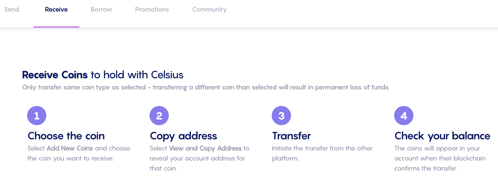
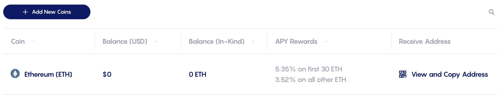

# Từ CeFi tới DeFi với Celsius

## Giới thiệu tổng quan

[Celsius Network](https://celsius.network) là một trong những mạng lưới lớn của CeFi, nơi mọi người có thể dễ dàng mua tài sản tiền điện tử bằng tài khoản ngân hàng của họ và đặt cọc các mã thông báo đã mua để nhận thêm phần thưởng. Ví dụ: bạn có thể kiếm được 6,20% APY trên BTC (Bitcoin), 5,35% trên ETH (Ether) của bạn, v.v. đã sở hữu (sau đó được sử dụng làm tài sản thế chấp) để tận dụng vị thế của bạn hoặc hoán đổi lấy các mã thông báo khác. Tuy nhiên, Celsius là một mạng kín và đây là lý do tại sao nó thường được gọi là ứng dụng CeFi (Tài chính tập trung). Nếu bạn có tài sản tại Celsius, bạn vẫn có thể gửi chúng đến các ứng dụng khác trên chuỗi khối gốc của mã thông báo. Ví dụ: bạn có thể chuyển ETH vào và ra khỏi Celsius bằng ví Ethereum hoặc BTC  bằng địa chỉ của bạn trên chuỗi Bitcoin. Ngoài ra, vào tháng 2, Celsius đã ra mắt một cầu nối mới có tên là CelsiusX cho phép bạn gửi một số tài sản cụ thể từ ứng dụng Celsius tới Polygon. Các tài sản hiện tại được hỗ trợ là

* ETH, mã thông báo gốc của Ethereum Mainnet
* ADA, mã thông báo gốc của Cardano
* DOGE, mã thông báo gốc của chuỗi khối Dogecoin

Bằng cách gửi tài sản của mình trên Polygon, bạn cũng có quyền truy cập toàn bộ vào hệ sinh thái DeFi, cũng như các tùy chọn cầu nối bổ sung để di chuyển mã thông báo của bạn sang Fantom, Avalanche và nhiều chuỗi khác. Hướng dẫn này sẽ hướng dẫn bạn qua các bước khác nhau để chuyển nội dung của bạn từ Celsisus sang Polygon và sẽ giới thiệu một số điều bạn có thể làm ở đó.


Hướng dẫn này chắc chắn không phải là lời khuyên tài chính, nó được thực hiện với mục tiêu giáo dục trong tâm trí. Bạn cần chú ý đến sự thay đổi giá cả, cung và cầu, chương trình thưởng, ngày kết thúc, khoản lỗ vô thường, v.v. chỉ đầu tư những gì bạn sẵn sàng để có thể mất.


## Nhận tài sản trên Celsius

### Tạo một tài khoản

Tất nhiên, để có thể sử dụng Celsius, bạn sẽ cần một tài khoản Celsius. Chỉ cần truy cập trang web của họ và đăng ký một tài khoản mới bằng liên kết này. Xin lưu ý rằng vì lý do pháp lý và vì bản chất của mô hình kinh doanh của Celsius, bạn sẽ cần cung cấp bằng chứng về danh tính của mình, còn được gọi là tài liệu KYC (Biết khách hàng của bạn), chẳng hạn như giấy phép lái xe. Ngoài ra, lưu ý rằng ứng dụng độ C có thể không khả dụng ở quốc gia của bạn. Kiểm tra [Điều khoản sử dụng](https://celsius.network/terms-of-use) và[ Chính sách quyền riêng tư](https://celsius.network/privacy-policy) của họ để biết thêm chi tiết.


Xin lưu ý rằng hướng dẫn này, Mai Finance hoặc cộng đồng QiDAO không chịu trách nhiệm về các dịch vụ Celsius cung cấp và bạn nên tự nghiên cứu trước khi đăng ký sản phẩm tài chính.


Sau khi tài khoản của bạn được tạo, vui lòng quan sát nhanh ứng dụng web và bạn cũng có thể tải xuống ứng dụng di động.

### Chuyển tài sản của bạn vào tài khoản của bạn

Hiện tại, ứng dụng di động là cách duy nhất để bạn mua tài sản trực tiếp bằng Thẻ tín dụng hoặc Chuyển khoản ngân hàng. Tùy chọn này cũng có thể bị hạn chế ở một số quốc gia / khu vực nhất định. Do những hạn chế này, chúng tôi sẽ không đề cập đến tùy chọn này, nhưng vui lòng khám phá tùy chọn này nếu đó là điều bạn muốn làm.

Đối với hướng dẫn này, chúng tôi sẽ tập trung vào ETH và chúng tôi cũng sẽ giả sử bạn đã có một số Ether trên Ethereum Mainnet mà bạn muốn chuyển sang Celsius. Từ ứng dụng web, chỉ cần điều hướng đến tab Receive.

Bước đầu tiên là thêm số xu bạn muốn nhận. Trong trường hợp của chúng tôi, chúng tôi muốn nhận ETH và thật dễ dàng bằng cách nhấp vào nút Thêm tiền mới và chọn ETH từ menu thả xuống.

Sau khi được chọn, bạn sẽ có khả năng nhận được địa chỉ ví tương ứng với tài khoản Celsius của bạn trên mạng Ethereum.

Nếu bạn nhấp vào Xem và sao chép địa chỉ, một cửa sổ bật lên mới sẽ mở ra với mã QR đại diện cho địa chỉ ví của bạn trên Celsius Network, cũng như giá trị của nó ở dạng văn bản thuần túy mà bạn có thể chỉ cần sao chép và dán.

Với địa chỉ ví, bạn bắt đầu chuyển từ nơi bạn có mã thông báo Ether của mình. Ví dụ dưới đây được lấy từ Coinbase (một ông lớn khác trong ngành CeFi):

Tất nhiên, và như mọi khi với Ethereum Mainnet, bạn sẽ phải trả một số phí giao dịch. Điều này hoàn toàn không liên kết với Coinbase hoặc Celsius. Như bạn có thể thấy bên dưới, chuyển khoản trực tiếp từ ví MetaMask của tôi cũng sẽ yêu cầu tôi trả một số phí.


Tùy thuộc vào sự tắc nghẽn của mạng, phí có thể khá cao. Hãy chắc chắn rằng bạn kiểm tra giá xăng để hưởng mức phí thấp nhất có thể.


Sau khi quá trình chuyển hoàn tất, bạn sẽ có thể thấy tài sản của mình trong trang tổng quan Celsius của mình:

Tại thời điểm này, nếu tôi giữ tiền trong tài khoản của mình trên Celsius, tôi sẽ nhận được phần thưởng đặt cọc hàng tuần. Đối với ETH và tính đến tháng 3 năm 2022, APY là 5,35%. Tuy nhiên, bây giờ chúng tôi sẽ có khả năng di chuyển tài sản sang Polygon bằng cách sử dụng cầu CelsiusX **miễn phí**. Chỉ cần chuyển đến tab Gửi và chọn nội dung bạn muốn chuyển sang Polypon.


Lưu ý: nếu bạn chưa lưu bất kỳ địa chỉ người nhận nào, bây giờ là lúc để tạo một địa chỉ. Chọn địa chỉ ví của bạn từ Metamask và thêm nó làm địa chỉ rút tiền của bạn. Vì lý do bảo mật, khi bạn tạo hoặc thay đổi địa chỉ rút tiền, địa chỉ này sẽ bị khóa trong 24h. Như bạn sẽ thấy trong ảnh chụp màn hình bên dưới, 24 giờ sau khi tôi chuyển ETH trị giá 100 đô la sang Celsius, số dư của tôi đã thay đổi về giá.


Bạn cũng có thể nhận thấy trên ảnh chụp màn hình này rằng tôi sẽ nhận được cxETH trên Polygon, là một phiên bản được bao bọc của ETH. Nó sẽ giống như vậy đối với ADA (bạn sẽ nhận được cxADA) và DOGE (bạn sẽ nhận được cxDOGE). Chúng ta sẽ xem phần sau của hướng dẫn này phải làm gì với cxTokens của bạn.


Lưu ý rằng hoàn toàn không có phí cho việc chuyển tiền này. Nó cũng rất nhanh.


Sau khi được gửi, bạn sẽ nhận được một email yêu cầu bạn xác nhận chuyển khoản (luôn bảo mật hơn) và bạn sẽ có thể xem lịch sử giao dịch của mình phản ánh việc chuyển khoản này trong ứng dụng Celsius.

Sau một vài phút, bạn sẽ có tài sản của mình (cxTokens) trong ví của bạn trên Polygon. Cách tốt nhất để theo dõi những lần chuyển tiền này có lẽ là sử dụng một ứng dụng như [DeBank](https://debank.com) và xem lịch sử giao dịch của bạn trên chuỗi mong muốn (tại đây Polygon):

## Polygon và cxTokens

### cxTokens là gì?

Không đi quá sâu vào chi tiết, cxTokens được bao bọc bởi các mã thông báo. Khi bạn chuyển tài sản của mình từ Mạng Celsius sang Polygon, tài sản được giữ trong Mạng Celsius và các mã thông báo mới được đúc trên Polygon. Tuy nhiên, đối với trường hợp của Ether, Celsius không có khả năng đúc WETH trên Polygon trực tiếp, vì vậy họ tạo mã thông báo có giá được lập chỉ mục dựa trên giá của ETH: cxETH.&#x20;

Điều ngược lại cũng đúng, có nghĩa là khi bạn chuyển cxETH của mình về Celsius, cxToken sẽ bị đốt và một lượng ETH tương ứng được giải phóng ở Celsius và  thêm vào tài khoản của bạn. Để đảm bảo giá của cxToken được lập chỉ mục chính xác trên giá của tài sản cơ bản, Celsius đang sử dụng công nghệ của Chainlink: Bằng chứng Dự trữ.&#x20;

Nếu bạn tò mò về các chi tiết nhỏ về cách Celsius đang quản lý cxTokens của họ, bạn có thể đọc tất cả các chi tiết trong [bài đăng Medium](https://medium.com/@CelsiusX/celsius-is-integrating-chainlink-proof-of-reserve-to-unlock-cross-chain-liquidity-with-wrapped-6c85bb2f2a60) của họ từ tháng 1 năm 2022.

### Hoán đổi cxTokens của bạn

Vì cxTokens của bạn là các phiên bản bao bọc của các tài sản cơ bản, bạn có thể không tìm thấy nhiều nền tảng chấp nhận chúng để sử dụng. May mắn thay, bạn có thể hoán đổi chúng cho một số tài sản khác bằng cách sử dụng [QuickSwap DEX](https://quickswap.exchange/#/swap), DEX duy nhất có tính thanh khoản cho cxTokens trên Polygon kể từ tháng 3 năm 2022.

Rõ ràng, bạn cũng có thể vận hành hoạt động ngược lại và mua cxTokens bằng cách sử dụng các tài sản khác.


Khi bạn hoán đổi ra hoặc vào cxTokens, hãy chú ý đến lộ trình, cũng như độ trượt giá. QuickSwap dường như chỉ sử dụng tối đa 4 bước nhảy và để truy cập cxDOGE làm ví dụ, bạn luôn cần phải đi qua ETH, cxETH, và sau đó là cxDOGE. Điều này có nghĩa là bạn cần có đủ thanh khoản giữa tài sản bạn hoán đổi và ETH để lộ trình có thể là TÀI SẢN> ETH> cxETH> cxDOGE.&#x20;

Đó không phải là trường hợp của MAI là một ví dụ. Bạn có thể muốn thực hiện MAI> USDC> ETH> cxETH trong lần hoán đổi đầu tiên và cxETH> cxDOGE trong lần hoán đổi thứ hai.&#x20;

Điều tương tự cũng xảy ra khi bạn muốn thoát khỏi cxTokens: cxDOGE đến MAI có thể bị trượt giá cao và có thể bạn sẽ muốn chuyển qua cxETH hoặc ETH trước.


## Cung cấp tính thanh khoản với cxTokens của bạn

Với cxTokens, bạn có thể cung cấp thanh khoản cho các  bể CelsiusX trên QuickSwap. Đoạn trước giải thích cách hoán đổi cxTokens của bạn và điều này được thực hiện bằng cách sử dụng cặp LP (Bể thanh khoản). Để đảm bảo bất kỳ người dùng nào cũng có thể hoán đổi mã thông báo của họ, QuickSwap sẽ trao phần thưởng được trả bằng dQUICK và MATIC cho những người dùng cung cấp thanh khoản trên ứng dụng của họ. 3 cặp sẽ giúp bạn nhận được phần thưởng là

* ETH/cxETH
* cxETH/cxADA
* cxETH/cxDOGE

Tất cả chúng đều có các mức phần thưởng khác nhau và điều tốt nhất nên làm là truy cập ứng dụng QuickSwap và kiểm tra các chương trình khai thác kép của họ.

Trong ảnh chụp màn hình ở trên, bạn có thể thấy rằng nếu bạn cung cấp thanh khoản cho cặp ETH-cxETH, bạn có thể nhận được tới 15% APY (Lợi nhuận phần trăm hàng năm, giả sử bạn sẽ gộp phần thưởng) được trả bằng dQUICK, WMATIC và trực tiếp vào ETH và cxETH từ phí hoán đổi. Nếu bạn không gộp phần thưởng, đó vẫn là APR 13,97% mà bạn sẽ nhận được và bạn sẽ có thể làm bất cứ điều gì bạn muốn với mã thông báo phần thưởng. Vui lòng khám phá hướng dẫn này để có thêm ý tưởng về cách sử dụng chúng.


Để tham gia nhóm thanh khoản, chỉ cần[ cung cấp tính thanh khoản ](https://quickswap.exchange/#/add/0x7ceB23fD6bC0adD59E62ac25578270cFf1b9f619/0xfe4546feFe124F30788c4Cc1BB9AA6907A7987F9)cho cặp tiền đã chọn theo tỷ lệ 1: 1. Điều này có thể có nghĩa là bạn sẽ phải hoán đổi một số cxTokens cho một thứ khác. Khi cặp LP được tạo, bạn có thể gửi nó vào nhóm và bắt đầu tích lũy lợi nhuận.


## Sử dụng cxTokens của bạn làm tài sản thế chấp và vay

Trao đổi cxTokens của bạn có nghĩa là bạn thực sự đang bán chúng để mua thứ khác. [Mai Finance ](https://app.mai.finance)là một ứng dụng DeFi (Tài chính phân biệt) cho phép bạn giữ tài sản của mình bị khóa trong kho tiền và vay một số tiền ổn định để chống lại chúng. Sau đó, bạn sẽ có thể làm bất cứ điều gì bạn muốn với khoản vay của mình, bao gồm

* canh tác lợi suất đồng ổn định
* hoán đổi MAI ổn định đã vay để mua các tài sản khác
* tạo đòn bẩy cho cxTokens của bạn
* bắc cầu MAI của bạn sang các chuỗi khác

Chỉ cần khám phá các trang khác nhau của hướng dẫn này để thu thập các ý tưởng về cách sử dụng khoản vay của bạn theo cách phù hợp nhất với bạn.

**Lưu ý**: khi bạn mượn đồng ổn định MAI trên Mai Finance, bạn sẽ được thanh toán bằng mã thông báo Qi dựa trên số tiền bạn vay. Tỷ lệ phần thưởng khác nhau dựa trên tổng số tiền đã vay cho kho tiền đó, giá Qi và phân bổ Qi cho kho tiền. Thêm chi tiết trong[ hướng dẫn của chúng tôi về phần thưởng vault.](../../mai-university/mai-loans-and-vaults-incentives.md)

Và tất nhiên, bạn có thể kết hợp cả hai giải pháp bằng cách hoán đổi khoản vay MAI của mình thành cặp cxTokens LP và canh tác lợi suất trên QuickSwap. Tại thời điểm này, không có giới hạn nào đối với những gì bạn có thể làm và khoản đầu tư ban đầu của bạn được lưu giữ hoàn toàn trong kho tiền của bạn trên Mai Finance (miễn là bạn không bị thanh lý).

## Tuyên bố từ chối trách nhiệm

Hướng dẫn này được viết để trình bày cho bạn cách bạn có thể hưởng lợi từ CelsiusX, cầu nối giữa Celsius và Polygon, cũng như thử nghiệm với mọi thứ mà DeFi có thể cung cấp trên Polygon. Tất nhiên, việc sử dụng các giao thức trên Polygon có rủi ro. Nếu bạn đang sử dụng cxTokens làm tài sản thế chấp trên Mai Finance, bạn sẽ phải chú ý đến việc thanh lý trong trường hợp giá vị thế tài sản thế chấp của bạn thấp hơn tỷ lệ thanh lý, một ngưỡng cho thấy khoản vay của bạn có thể có giá trị lớn hơn tài sản hỗ trợ nó. . Những rủi ro này được trình bày trong một số hướng dẫn trên trang web này, vì vậy một lần nữa, chúng tôi rất khuyến khích bạn đọc một số trong số chúng và đảm bảo rằng bạn hiểu các giao thức khác nhau được trình bày trong hướng dẫn này hoạt động như thế nào trước khi đầu tư bất kỳ thứ gì. Và như mọi khi, đây không phải là lời khuyên tài chính, hãy luôn tự nghiên cứu.


Hãy nhớ rằng một chiến lược hoạt động tốt tại một thời điểm nhất định có thể hoạt động kém (hoặc khiến bạn mất tiền) vào một thời điểm khác. Hãy cập nhật thông tin, theo dõi thị trường, theo dõi các khoản đầu tư của bạn và như mọi khi, hãy tự nghiên cứu.

