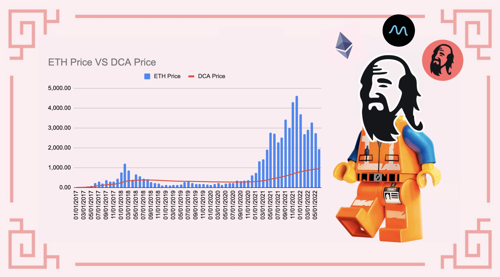
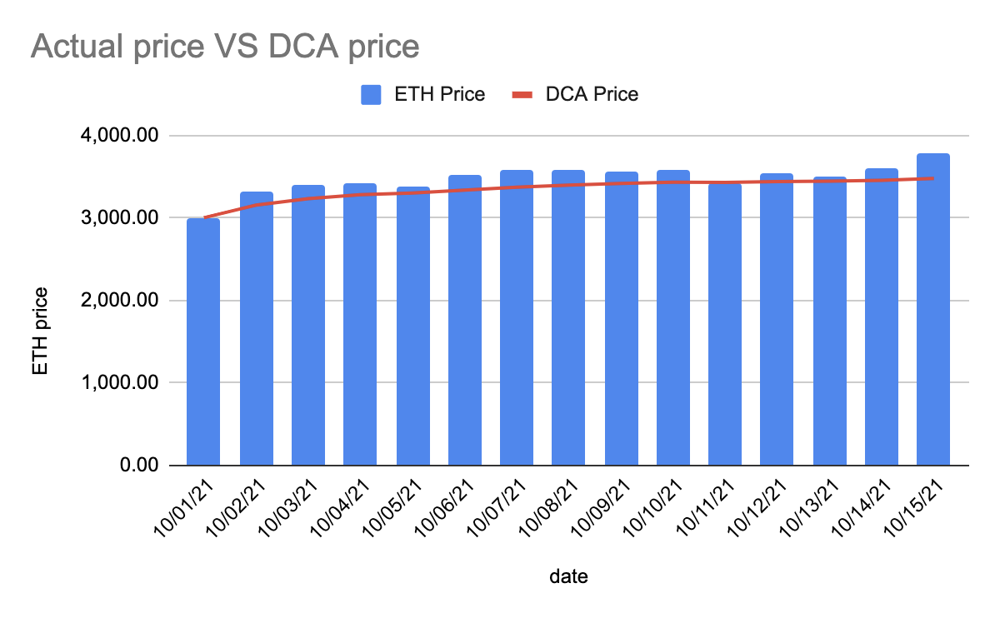

# Chiến lược trung bình giá trong thị trường gấu và bò

## Giới thiệu

"Thời gian trên thị trường luôn tốt hơn thời điểm trên thị trường" có thể là điều mà bạn chắc chắn đã nghe. Trên thực tế, không ai hoàn toàn có thể bán ở đỉnh, hoặc mua ở dưới cùng. Đây là lý do tại sao hầu hết các nhà đầu tư sẽ DCA (Trung bình Chi phí Đô la Mỹ) để tích lũy tài sản mà họ muốn nhất. DCA bao gồm việc mua một số lượng nhỏ với tần suất nhất định, bất kể giá cả. Làm như vậy, giá mua trung bình được hạ xuống và bạn có cơ hội tốt hơn để mua nhiều tài sản nhất định hơn so với một lần mua được thực hiện không đúng thời điểm.

Bạn có thể tìm thêm chi tiết về Trung bình chi phí đô la là gì trên [trang web Investopedia](https://www.investopedia.com/terms/d/dollarcostaveraging.asp) đưa ra định nghĩa sau:

> Chiến lược trung bình theo chi phí đô la (DCA) là một chiến lược đầu tư trong đó nhà đầu tư chia tổng số tiền được đầu tư cho các lần mua định kỳ một tài sản mục tiêu với nỗ lực giảm tác động của sự biến động đối với giao dịch mua tổng thể. Các giao dịch mua diễn ra không phụ thuộc vào giá của tài sản và trong những khoảng thời gian đều đặn.

Bài viết này giải thích cách bạn có thể áp dụng DCA vào tài sản yêu thích của mình một cách hợp lý để nạp vào các hũ tiền trên Mai Finance, nhưng bạn cũng có thể áp dụng DCA vào đồng tiền ổn định MAI để có được giá bán trung bình tốt hơn.


Hãy nhớ rằng một chiến lược hoạt động tốt tại một thời điểm nhất định có thể hoạt động kém (hoặc khiến bạn mất tiền) vào một thời điểm khác. Hãy cập nhật thông tin, theo dõi thị trường, theo dõi các khoản đầu tư của bạn và như mọi khi, hãy tự nghiên cứu.


## Hiểu về chiến lược trung bình giá

Hãy xem làm thế nào bạn có thể DCA trong các điều kiện thị trường khác nhau, và ý nghĩa của nó về quyền lực mua / bán.

### DCA trong xu hướng giảm giá (thị trường gấu)

Khi thị trường đã khá xuống và (hy vọng) gần đáy, hoặc ít nhất là ở mức giá mà bạn cảm thấy thoải mái khi mua, đó là thời điểm để tích lũy tài sản yêu thích của bạn. Bởi vì bạn biết đấy, bạn muốn mua khi giá thấp và bán khi giá cao. Ví dụ, đây là một ví dụ thực tế về giá ETH trong 15 ngày đầu tiên của tháng 6 năm 2022

| Ngày     | Giá ETH tính theo USD |
| -------- | --------------------- |
| 06/01/22 | 1,928.60              |
| 06/02/22 | 1,814.00              |
| 06/03/22 | 1,826.39              |
| 06/04/22 | 1,751.69              |
| 06/05/22 | 1,791.55              |
| 06/06/22 | 1,876.70              |
| 06/07/22 | 1,756.89              |
| 06/08/22 | 1,776.58              |
| 06/09/22 | 1,798.50              |
| 06/10/22 | 1,791.43              |
| 06/11/22 | 1,668.25              |
| 06/12/22 | 1,467.21              |
| 06/13/22 | 1,349.25              |
| 06/14/22 | 1,170.75              |
| 06/15/22 | 1,169.67              |

Đây là mức giảm giá 39,35% trong nửa đầu tháng 6, sau một tháng 5 thảm họa. Bây giờ, giả sử bạn mua một ít ETH mỗi ngày trong cùng một khoảng thời gian, đây là giá trung bình mà bạn sẽ mua ETH:

| Ngày     | giá DCA trung bình |
| -------- | ------------------ |
| 06/01/22 | 1,928.60           |
| 06/02/22 | 1,871.30           |
| 06/03/22 | 1,856.33           |
| 06/04/22 | 1,830.17           |
| 06/05/22 | 1,822.45           |
| 06/06/22 | 1,831.49           |
| 06/07/22 | 1,820.83           |
| 06/08/22 | 1,815.30           |
| 06/09/22 | 1,813.43           |
| 06/10/22 | 1,811.23           |
| 06/11/22 | 1,798.23           |
| 06/12/22 | 1,770.65           |
| 06/13/22 | 1,738.23           |
| 06/14/22 | 1,697.70           |
| 06/15/22 | 1,662.50           |

Với giá trung bình là 1.662,50 đô la và giá kết thúc là 1.169,67 đô la, mức giảm từ hơn 39% xuống còn 29,64%. Theo nghĩa đó, DCA làm giảm tổn thất của bạn. Điều này cũng có nghĩa là, để hòa vốn, bạn cần giá quay trở lại 1.662,50 đô la thay vì 1.928,60 đô la và trong trường hợp giá quay trở lại 1.928,60 đô la, bạn sẽ có lợi nhuận là 16%.

Một điều thú vị cần lưu ý là nếu bạn bán ETH của mình cho USDC (hoặc một đồng tiền ổn định khác như MAI) trong cùng thời gian, giá bán trung bình của bạn cũng sẽ là $ 1,662,50 và bạn sẽ bán được với giá tốt hơn mỗi ngày ngoại trừ ngày 6 tháng Sáu. Điều này một lần nữa chứng minh rằng DCA là cách tốt hơn so với việc cố gắng căn đúng thời điểm thị trường.

### DCA trong xu hướng tăng giá (thị trường bò)

Khi thị trường đi lên, bạn cũng có thể muốn DCA vào các tài sản cụ thể để kéo giá mua trung bình xuống trong khi giá tăng. Rõ ràng, bạn muốn làm điều đó vào đầu giai đoạn đánh dấu của chu kỳ thị trường chính, đó là lý do tại sao nó được khuyến nghị mạnh mẽ đối với DCA ngay cả trong xu hướng tăng. Ví dụ: đây là giá ETH trong 15 ngày đầu tiên của tháng 10 năm 2021.

| Ngày     | Giá ETH tính theo USD |
| -------- | --------------------- |
| 10/01/21 | 3,001.13              |
| 10/02/21 | 3,308.87              |
| 10/03/21 | 3,390.77              |
| 10/04/21 | 3,418.78              |
| 10/05/21 | 3,381.78              |
| 10/06/21 | 3,516.57              |
| 10/07/21 | 3,576.81              |
| 10/08/21 | 3,587.83              |
| 10/09/21 | 3,560.00              |
| 10/10/21 | 3,575.02              |
| 10/11/21 | 3,419.73              |
| 10/12/21 | 3,546.48              |
| 10/13/21 | 3,492.75              |
| 10/14/21 | 3,604.96              |
| 10/15/21 | 3,790.15              |

Điều này ít nhiều ngược lại với phần trước khi giá ETH tăng + 26,29% trong 15 ngày. Vì vậy, nếu bạn may mắn và mua được vào ngày 1 tháng 10, đó là lợi nhuận mà bạn có thể nhận ra khi bán vào ngày 15. Thay vào đó, nếu bạn đã đầu tư hàng ngày trong khoảng thời gian này, thì đây là giá trung bình mà bạn sẽ mua ETH:

| Ngày     | Giá ETH tính theo USD |
| -------- | --------------------- |
| 10/01/21 | 3,001.13              |
| 10/02/21 | 3,155.00              |
| 10/03/21 | 3,233.59              |
| 10/04/21 | 3,279.89              |
| 10/05/21 | 3,300.27              |
| 10/06/21 | 3,336.32              |
| 10/07/21 | 3,370.67              |
| 10/08/21 | 3,397.82              |
| 10/09/21 | 3,415.84              |
| 10/10/21 | 3,431.76              |
| 10/11/21 | 3,430.66              |
| 10/12/21 | 3,440.31              |
| 10/13/21 | 3,444.35              |
| 10/14/21 | 3,455.82              |
| 10/15/21 | 3,478.11              |

Với giá trung bình là 3.478,11 USD và giá cuối kỳ là 3.790,15 USD, bạn sẽ kiếm được 15,89% khi bán vào ngày 15. Trong trường hợp này, giá DCA luôn thấp hơn giá thị trường, ngoại trừ ngày 11 tháng 10, có nghĩa là bạn sẽ luôn có thể bán tài sản bạn đã mua với mức lợi nhuận nhất định.

Trong trường hợp này, bạn cũng có thể chuyển DCA thành stablecoin bằng Ether của mình. Với giá bán trung bình là $ 3,478,11, bạn sẽ kiếm được lợi nhuận tốt hơn so với bán giao ngay trong 5 ngày đầu tiên hoặc vào ngày 11. Điều này đặc biệt tốt nếu bạn muốn nắm bắt lợi nhuận, trả một khoản vay hoặc tích lũy stablecoin cho lần thị trường đi xuống tiếp theo. Bạn cũng có thể muốn "tiết kiệm" giá cao vào stablecoin để tăng lợi suất trong những thời điểm không chắc chắn mà tài sản biến động của bạn có nguy cơ đi xuống.

### DCA theo chu kỳ thị trường

Cho dù bạn đang đầu tư vào tiền điện tử hay thị trường chứng khoán, bạn có thể nhận thấy rằng thị trường có tính chu kỳ. Một lần nữa, bạn có thể đọc thêm về các chu kỳ thị trường trong từ điển đầu tư, nhưng đây là những điều chính bạn cần biết:

* Thị trường chuyển động theo bốn giai đoạn; hiểu được cách thức hoạt động của từng giai đoạn và cách thức kiếm lợi nhuận là sự khác biệt giữa suy thoái và hưng thịnh.
* Trong giai đoạn tích lũy, thị trường đã chạm đáy, và những người chấp nhận sớm cũng như những người bảo thủ nhìn thấy cơ hội để nhảy vào và nhận chiết khấu.
* Trong giai đoạn tăng giá, thị trường dường như đã chững lại và phần lớn sớm đang quay trở lại, trong khi dòng tiền thông minh đang chảy ra.
* Trong giai đoạn phân phối, tâm lý chuyển sang trái chiều sang giảm nhẹ, giá dao động, bên bán chiếm ưu thế và giai đoạn cuối của đợt tăng đã gần kề.
* Trong giai đoạn giảm giá, những người tụt hậu cố gắng bán và vớt vát những gì họ có thể, trong khi những người đầu tiên chấp nhận tìm kiếm dấu hiệu của đáy để họ có thể quay trở lại.

Điểm sơ lược là thời điểm bạn cần chuyển từ người mua sang người bán trong chiến lược DCA của mình:

## Sử dụng DCA với tài sản biến động bằng Mai Finance và Mean Finance

### Mai Finance

[Mai Finance](https://app.mai.finance)là một giao thức cho vay, nơi bạn sẽ có thể gửi các tài sản cụ thể làm tài sản thế chấp và vay stablecoin MAI với lãi suất 0%. Đối với hướng dẫn cụ thể này, giả sử chúng ta muốn áp dụng chiến lược DCA vào ETH từ danh mục đầu tư hiện có đã có ETH trị giá tương đương 1.000 đô la. Trên ứng dụng phi tập trung, bạn sẽ có thể

* gửi ETH vào một kho tiền trên nền tảng
* vay MAI đối với tài sản thế chấp của bạn

Để hạn chế rủi ro, chúng tôi sẽ giả định rằng bạn vay MAI trị giá 300 đô la để giữ một CDR an toàn (Tỷ lệ thế chấp trên nợ)

### Mean Finance

[Mean Finance](https://mean.finance/) là một ứng dụng phi tập trung hoàn toàn tự động, nơi bạn có thể thiết lập vị trí DCA sẽ tự động mua các tài sản cụ thể bằng cách sử dụng các tài sản khác, với tần suất nhất định trong một khoảng thời gian nhất định.

Sau khi được tạo, bạn sẽ có thể xem hiệu suất của vị trí DCA của mình cũng như lịch sử của tất cả các giao dịch hoán đổi.

Như bạn có thể thấy ở trên, chiến lược DCA hiện đang mua ETH sau mỗi 4 giờ và mua ETH trị giá 1,61 MAI. Tần suất cao hơn sẽ phản ánh sự biến động của tài sản mục tiêu nhiều hơn so với hoán đổi ít thường xuyên hơn.

Điều quan trọng cần lưu ý về Mean Finance

* Vị trí là NFT, có nghĩa là bạn là người duy nhất có quyền truy cập vào vị trí.
* Bởi vì đó là một NFT, bạn có thể chuyển quyền sở hữu sang một địa chỉ khác.
* Bạn có thể rút tài sản đã được hoán đổi vào bất kỳ thời điểm nào. Điều này đặc biệt hữu ích nếu giá trung bình thấp hơn giá thị trường hiện tại và bạn muốn bán những gì bạn đã chuyển đổi.
* Bạn có thể cập nhật thời lượng và tốc độ của chiến lược DCA như bạn muốn. Điều này một lần nữa đặc biệt hữu ích nếu bạn có thể rút và bán tài sản đã hoán đổi với một khoản lợi nhuận đáng kể và đầu tư lại vào vị trí DCA của mình..
* Bạn có thể chấm dứt vị thế bất kỳ lúc nào và rút cả tài sản đã hoán đổi cũng như tài sản thế chấp được sử dụng để mua.

### Chiến lược DCA

Chiến lược cho hướng dẫn này ít nhiều là những gì đã được giải thích trong các phần trên.

Giả sử bạn muốn tích lũy Ether, bạn sẽ phải

* Bạn có thể nạp ETH của mình vào kho camWETH trên Mai Finance để nhận phần thưởng từ thị trường cho vay AAVE v2
* Mượn MAI để giữ một CDR lành mạnh
* Nạp MAI của bạn trong Mean Finance trong một khoảng thời gian nhất định
* Vào cuối giai đoạn DCA, hãy thu thập WETH của bạn
* Lặp lại&#x20;

Ý tưởng ở đây là bạn có thể vay nhiều hơn hoặc ít hơn MAI mỗi khi bạn gia hạn vị trí DCA của mình, tùy thuộc vào giá thị trường và yếu tố sức khỏe của kho tiền của bạn trên Mai Finance. Chiến lược này sẽ cho phép bạn tích lũy Ether từ từ bằng cách sử dụng phương pháp DCA thay vì tạo đòn bẩy mọi thứ cùng một lúc. Nạp tiền vào kho tiền cũng là một cách tốt để giữ cho CDR lành mạnh.

Nếu bạn thích bán Ether của mình hơn, bạn có thể thực hiện vòng lặp ngược lại và chuyển DCA thành các đồng tiền ổn định để trả khoản vay của mình trên Mai Finance:

* Nạp WETH vào Mean Finance trong một khoảng thời gian nhất định và DCA ra thành MAI
* Vào cuối giai đoạn DCA, hãy thu thập MAI của bạn
* Hoàn trả khoản vay của bạn từ Mai Finance
* Lấy mã thông báo camWETH của bạn từ kho tiền và thu thập WETH
* Repeat by selling more WETH via Mean Finance

Nếu bạn đang làm điều này một cách chính xác, thông thường bạn sẽ có thể hoàn trả đầy đủ khoản vay của mình và nhận được nhiều Ether hơn những gì bạn đã gửi ban đầu.

Ngoài ra, bạn có thể sử dụng khoản vay MAI để thu lợi nhuận và chuyển đổi phần thưởng thành stablecoin sẽ được sử dụng để nạp vào động cơ DCA từ Mean Finance.

## Từ chối trách nhiệm

Mọi thứ được trình bày trong hướng dẫn này là nội dung giáo dục được thực hiện để minh họa cách bạn có thể sử dụng Trung bình chi phí đô la để tính trung bình giá của các tài sản biến động và hy vọng tích lũy chúng một cách bền vững. Mục tiêu ở đây là xây dựng sự giàu có trong thời gian dài bằng cách sử dụng các công cụ tự động chứ không phải là mua bán theo cảm tính.

Chiến lược này cũng có một số rủi ro nếu bạn không phân tích toàn bộ thị trường. Thật vậy, nếu bạn bắt đầu mua ở đầu chu kỳ, DCA rõ ràng sẽ không hoạt động tốt và sẽ mất rất nhiều thời gian trước khi giá mua trung bình đạt được mức giá thị trường tương xứng. Và kho tiền của bạn có thể gặp rủi ro nếu bạn sử dụng tất cả khoản vay của mình cho DCA thành một tài sản biến động cao trong khi thị trường đang bắt đầu xu hướng giảm. Như mọi khi, hãy đảm bảo rằng bạn hiểu đúng về thị trường đang diễn ra trước khi đầu tư.


Hãy nhớ rằng một chiến lược hoạt động tốt tại một thời điểm nhất định có thể hoạt động kém (hoặc khiến bạn mất tiền) vào một thời điểm khác. Hãy cập nhật thông tin, theo dõi thị trường, theo dõi các khoản đầu tư của bạn và như mọi khi, hãy tự nghiên cứu.

