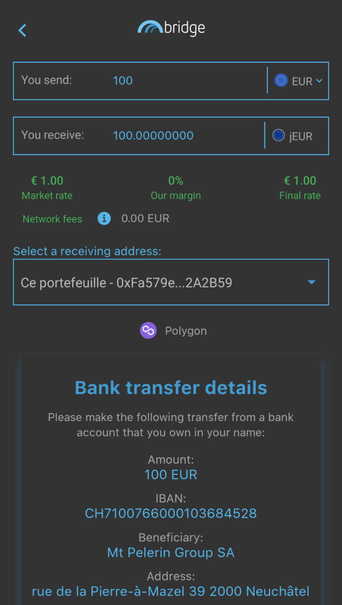

# Từ tài chính truyền thống đến tài chính phi tập trung với Javis

Không phải đồng ổn định nào cũng giống nhau. Trong tài chính phi tập trung, khi nhắc tới các đồng ổn định thì chủ yếu là các tài sản được neo vào đồng đô la Mỹ:

* USDC và USDT được phát hành bởi thực thể tập quyền neo vào đồng đô la Mỹ bằng tài sản bảo chứng thực tế.&#x20;
* DAI hay MAI là những đồng ổn định chốt linh hoạt vào đồng đô la Mỹ được thế chấp quá với những tài sản điện tử khác nhau.
* MIM hay UST là những đồng ổn định thuật toán được thế chấp một phần được neo sử dụng môt số thuật toán cụ thể.&#x20;

Ngoài ra bạn có thể tìm thấy một số đồng ổn định khác, chẳng hạn như TOMB là đồng ổn định được chốt vào mã thông báo gốc của chuỗi khối Fantom là FTM.&#x20;

Trong bài viết này, chúng tôi tập trung vào những đồng ổn định được gắn với đồng tiền được chính phủ phát hành (FIAT) và giải thích vì sao những đồng ổn định này lại quan trọng đối với chiến lược đầu tư của bạn.


Hãy nhớ rằng một chiến lược hoạt động tốt tại một thời điểm nhất định và có thể hoạt động kém (hoặc khiến bạn mất tiền) vào một thời điểm khác. Hãy cập nhật thông tin, theo dõi thị trường, theo dõi các khoản đầu tư của bạn và như mọi khi, hãy tự nghiên cứu.


## Tại sao chúng ta lại cần những đồng FIAT tổng hợp ?

Hãy hình dung rằng bạn đang sống ở Châu Âu và dự định mua một số tài sản mã hóa bằng đồng Euro. Đối với những tài sản điện tử biến động cao như Bitcoin thì hầu hết bạn chỉ quan tâm đến giá của chúng với Euro và liệu có thể kiếm được lợi nhuận từ sự biến động đó hay không mà thôi.

Tuy nhiên nếu bạn muốn tham gia vào DeFi bằng cách cung cấp thanh khoản cho những đồng ổn định nhằm giảm thiểu rủi ro lỗ tạm thời thì tỷ giá giữa các đồng ổn định là điều bạn phải cân nhắc thay vì lãi suất giữa các đồng ổn định cùng neo vào đồng đô la Mỹ.&#x20;

Nếu bạn mua USDC trị giá 100 € vào ngày 20 tháng 9 năm 2021, bạn sẽ có USDC trị giá 117,29 đô la vì tỷ lệ EUR: USD là 1: 1,1729 tại thời điểm đó. Nếu bạn quy đổi USDC trị giá 117,29 đô la sang Euro hôm nay (ngày 24 tháng 3 năm 2022) với tỷ lệ 1: 1.0994, bạn sẽ nhận được 106,69 €, hoặc lợi nhuận là 6,69%.

Nhưng nếu bạn mua USDC trị giá 100 CAD (100 Đô la Canada) vào cùng ngày (20 tháng 9 năm 2021) với tỷ lệ 1: 0,7796, bạn sẽ có USDC trị giá 77,96 USD. Chuyển đổi những đồng tiền này ngày hôm nay sang CAD với tỷ lệ 1: 0,7972, sẽ có giá trị là 97,79 CAD, hoặc thua lỗ là 2,21%.

Tuy nhiên, 1 CAD luôn bằng 1 CAD, 1 EUR luôn bằng 1 EUR tương tự 1 USD luôn bằng 1 USD.

Mỗi đồng Fiat phụ thuộc vị trí địa lý, kinh tế chính trị trong và ngoài nước.

## Mạng lưới Jarvis và Mt. Pelerin

### &#x20;Mạng lưới Jarvis là gì?

Mạng lưới Javis là một ứng dụng phi tập trung chuyên biệt cho phép người dùng có thể hoán đổi tài sản điện tử của bạn lấy các tài sản tổng hợp Fiat bao gồm:

* jCAD: phiên bản mã hóa của đồng Canadian Dollar
* jEUR: phiên bản mã hóa của đồng Euro
* jJPY: phiên bản mã hóa của đồng yên Nhật
* jSGD, jCHF, jGBP, và nhiều hơn thế nữa

Cứ như vậy Javis Network được coi như một sàn trao đổi ngoại hối trên chuỗi hoạt động trên Ethereum Mainnet, Polygon, BNB Chain, Gnosis Chain, và Avalanche.

Nhưng không dừng ở đó, Javis còn đưa ra các chương trình khuyến khích thanh khoản nhằm thu hút người dùng tham gia cung cấp thanh khoản và kiếm lợi nhuận từ những đồng ổn định này bằng cách gửi các tài sản độc lập.


Bạn có thể thấy hình chụp màn hình xuất hiện bể 2CAD bao gồm JCAD và CADC. Mã thông báo CADC là một phiên bản khác của đồng đô la Canada trên [DFX](https://app.dfx.finance/), một sàn ngoại hối phi tập trung khác.


### Mt. Pelerin

[Mt. Pelerin](https://www.mtpelerin.com/bridge-wallet) là một sàn giao dịch tiền Fiat điện tử OTC không giám sát nơi bạn có thể mua trực tiếp phiên bản Fiat mã hóa thông qua tài khoản ngân hàng. Tài sản sẽ được gửi trực tiếp vào ví điện tử tương ứng của họ. Hiện Mt. Pelerin là đối tác trực tiếp với Javis nơi bạn mua JFIAT.


Cách dễ nhất để sử dụng Mt. Pelerin là thông qua ứng dụng di động Bridge Wallet. Lưu ý rằng vì là dịch vụ tập trung nên bạn sẽ phải cung cấp thông tin cá nhân để chứng minh danh tính của mình nếu bạn muốn có thể sử dụng dịch vụ. Bạn cũng cần phải có một ngân hàng cho phép bạn thực hiện chuyển khoản ngân hàng đến Thụy Sĩ. Tuy nhiên, bạn luôn có thể sử dụng trang web của họ, nơi bạn sẽ tìm thấy một tiện ích cho phép bạn mua tiền điện tử từ chuyển khoản ngân hàng hoặc sử dụng Thẻ tín dụng. Điều này không tuân theo bất kỳ KYC nào nhưng có một số hạn chế. Lưu ý rằng bằng cách sử dụng trang web, giao dịch mua của bạn sẽ được gửi trực tiếp đến ví web của bạn. Đối với phần còn lại của hướng dẫn này, chúng tôi sẽ trình bày giải pháp Birdge Wallet.


Chuyển khoản ngân hàng có thể bị tính phí và rất có thể sẽ mất một khoảng thời gian để hoàn thành, nhưng nhìn chung, Mt. Pelerin cho phép bạn dễ dàng mua và bán các FIAT tổng hợp của mình cho các đối tác FIAT của họ. Họ cũng có [cấu trúc phí nội bộ ](https://www.mtpelerin.com/pricing)mà bạn có thể đọc chi tiết hơn và tùy thuộc vào tài sản bạn mua, bạn có thể mua và bán lên đến 100.000 đô la mỗi năm miễn phí.


Nếu bạn đã mua jFIAT, tài khoản ngân hàng của bạn sẽ tự động được liên kết với tài khoản Bridge Wallet của bạn và bạn có thể chọn nó từ danh sách người nhận thả xuống. Nếu không, bạn sẽ phải tạo một tài khoản mới từ IBAN.


### Liên kết ví Polygon với tài khoản Mt.Pelerin

Liên kết ví của bạn với tài khoản Mt. Pelerin / Bridge Wallet của bạn dễ dàng

* Mở ứng dụng Bridge Wallet
* Mở tab địa chỉ ở dưới cùng
* Nhấn vào `Liên kết địa chỉ`
* Chụp ảnh mã QR của ví Polygon của bạn hoặc sao chép và dán địa chỉ đầy đủ vào trường
* Gửi một vài MATIC đến địa chỉ Bridge Wallet để xác thực nó


Một lần nữa, bạn có thể sử dụng tiện ích trên trang web Mt. Pelerin để [mua](https://www.mtpelerin.com/buy-ehtereum) và bán tiền điện tử của mình bằng ví web (hoặc ví phần cứng) trực tiếp mà không cần sử dụng Ví Bridge. Vui lòng tham khảo trang web Mt. Pelerin.


### Gửi jFIATs tới địa chỉ ví Polygon

Việc gửi jFIAT vào ví của bạn trên Polygon (hoặc bất kỳ chuỗi nào được hỗ trợ) rất dễ dàng. Từ tab Wallet, hãy đảm bảo rằng bạn đang ở trên mạng mà bạn muốn sử dụng làm điểm đến và tải  jWallet của mình.

Sau khi bạn chọn jFIAT bạn muốn gửi, chỉ cần nhấp vào gửi, điền vào các trường khác nhau, sau đó bắt đầu giao dịch và tận hưởng mức phí thấp và nhanh.


Bạn có thể nhận được bản tóm tắt đầy đủ về tất cả các giao dịch của mình trong phần hoạt động của mỗi jFIAT, cũng như trên tab Activity trên màn hình chính.



Mt. Pelerin là một giải pháp rất tốt để mua và bán tiền điện tử và các FIAT tổng hợp. Nhưng bạn cũng có thể sử dụng dịch vụ này để gửi tiền cho bạn bè và gia đình của mình nếu họ cũng đang sử dụng ứng dụng và có thể bỏ qua các giới hạn hoặc chuyển khoản ngân hàng phức tạp.


## Tận dụng tối đa đồng ổn định jFIAT của bạn

Bạn có các FIAT tổng hợp trên Polygon, vì vậy bây giờ chúng tôi cần một cách thông minh để sử dụng chúng. Trong phần giới thiệu, chúng tôi thấy rằng có thể là một ý tưởng tốt hơn nếu sử dụng chúng nguyên trạng thay vì hoán đổi chúng (bán chúng) lấy các đồng tiền ổn định được chốt bằng USD.&#x20;

Cũng hãy suy nghĩ về kịch bản này: bạn có đô la Canada và muốn tiếp xúc một chút với Ethereum. Sẽ thật tuyệt nếu bạn có thể mua Ethereum mà không chịu rủi ro khi thực sự mua nó? Chà, đây là những gì thị trường cho vay dành cho !!!

### Market.xyz

[Market.xyz](https://www.market.xyz/) là một giao thức cho vay, nơi bạn sẽ có thể sử dụng một số tài sản tiền điện tử của mình làm tài sản thế chấp để vay các tài sản khác. Gần đây, họ đã ra mắt một pool mới 100% dành riêng cho các FIAT tổng hợp của Jarvis: https://polygon.market.xyz/pool/7.

Như bạn thấy, bạn có thể cho mượn jFIAT của mình và kiếm tiền lãi từ những người đi vay. Tủ khóa cũng chấp nhận một số mã thông báo LP (Cung cấp tính thanh khoản) làm tài sản thế chấp. Điều này có nghĩa là bạn có thể cho mượn m2CAD hoặc m2JPY của mình và vẫn kiếm được \~ 27% APY (Lợi tức phần trăm hàng năm) trên chúng và vay các jFIAT khác như jCAD hoặc jJPY để tận dụng vị thế của bạn. Bạn cũng có thể mượn một số MAI, đồng tiền ổn định được chốt bằng USD được tạo ra bởi giao thức QiDAO đằng sau Mai Finance. Cộng đồng QiDAO đã đồng ý cung cấp MAI mới một cách thường xuyên để duy trì mức lãi suất thấp đối với các khoản vay MAI từ khóa Jarvis trên Market.xyz.


Có số tiền vay tối thiểu là 0,05 ETH trên các tủ khóa của Market.xyz, tương đương với 150 đô la kể từ tháng 3 năm 2022. Vì bạn cần phải giữ một Tỷ lệ thế chấp trên Nợ lành mạnh, hãy đảm bảo rằng bạn gửi đủ tài sản thế chấp nếu bạn muốn vay vốn trên nền tảng này.


Đối với bất kỳ nền tảng cho vay nào trên Polygon, Market.xyz sẽ khuyến khích người dùng duy trì Tỷ lệ thế chấp trên Nợ lành mạnh. Đây là giá trị LTV của mỗi tài sản thế chấp thể hiện (Khoản vay đến Giá trị, nghịch đảo của CDR). Ví dụ: LTV của m2CAD là 60%, có nghĩa là tỷ lệ giữa nợ và giá trị tài sản thế chấp của bạn cần phải duy trì trên 60%.

Trong trường hợp của m2CAD, tài sản thế chấp được chốt với Đô la Canada, có thể thay đổi so với MAI mà bạn sẽ vay (được chốt với Đô la Mỹ). Tuy nhiên, sự khác biệt là rất nhỏ, vì vậy về lý thuyết, bạn có thể vay rất gần ngưỡng 60%. Đối với hướng dẫn này, chúng ta sẽ cố gắng bám sát CDR là 200%, tương ứng với LTV là 0,4 (1 / 2,5 = 0,5). Để có thể vay MAI trị giá 0,05 ETH theo yêu cầu, chúng ta sẽ cần giá trị tài sản thế chấp là

$$
Thế.chấp.sẵn.có = \frac{Giá.trị.nợ}{LTV} = \frac{0.05 ETH}{0.4} = 300\$
$$

Kể từ hôm nay, tỷ lệ USD: CAD là 1: 0,7972, chúng ta sẽ cần khoản đầu tư ban đầu là

$$
số.vốn.CAD = \frac{300}{0.7972} = 376.32 CAD
$$


Giả sử tôi đầu tư CAD trị giá 300 đô la và vay MAI trị giá 150 đô la, tôi hiện sẽ kiếm được 27% APY (23,91% APR) trên tài sản thế chấp của mình và sẽ phải trả 11,28% lãi suất cho khoản vay của mình. Trong khoảng thời gian 1 năm, điều đó thể hiện sự tăng trưởng 81 đô la tài sản thế chấp của tôi và 16,92 đô la tiền lãi phải trả.


Bây giờ chúng ta hãy xem phải làm gì với khoản vay được chốt bằng USD của bạn.

### Uniswap V3

[Uniswap V3](https://app.uniswap.org/) là phiên bản mới nhất của Uniswap, dự án mẹ của nhiều DEX (Sàn giao dịch phi tập trung), nơi người dùng có thể hoán đổi tài sản của họ cho các loại tiền điện tử khác, cũng như cung cấp tính thanh khoản để hỗ trợ các giao dịch hoán đổi này.

Uniswap V3 không được khuyến khích trên Polygon ( vẫn chưa), nhưng cung cấp một cách mới để cung cấp tính thanh khoản: thanh khoản tập trung! Bạn có thể chọn phạm vi giá mà bạn muốn cung cấp thanh khoản và nếu phạm vi rất hẹp, bạn sẽ kiếm được nhiều phí hơn những người dùng cung cấp thanh khoản trên phạm vi rộng hơn. Bạn có thể tìm hiểu cách cung cấp các cặp thanh khoản trên Uniswap V3 với[ hướng dẫn chính thức của họ](https://help.uniswap.org/en/articles/5391541-provide-liquidity-on-uniswap-v3) và bạn cũng có thể xem[ video tuyệt vời của Finegraphic](https://www.youtube.com/watch?v=Ehm-OYBmlPM) về UniswapV3.

Đối với hướng dẫn này, chúng tôi sẽ tập trung vào cặp MAI-USDC vì chúng tôi đã vay một số MAI và chúng tôi muốn hạn chế rủi ro thấp nhất bằng cách cung cấp thanh khoản các đồng tiền ổn định.

Điều đầu tiên cần làm là xác định phạm vi giá mục tiêu. Giờ đây, giá của MAI đã ổn định hơn rất nhiều do tính thanh khoản ngày càng tăng, nhiều bể hơn và một số cơ chế như Curve giúp giữ giá rất ổn định vì vậy chúng ta sẽ nhắm mục tiêu tỷ lệ 1: 1 cho MAI: USDC. Trên thực tế, 1 MAI gần hơn với 0,998 USDC.

Phạm vi giá dự kiến là từ 0,99 đến 1,01 USDC cho 1 MAI, tùy thuộc vào điều kiện thị trường. Khi tài sản biến động tăng mạnh, mọi người có nhiều khả năng vay hơn và có xu hướng hoán đổi nhiều MAI, làm giảm giá của nó. Tác động ngược lại xảy ra khi thị trường thu hẹp và mọi người cần phải trả các khoản vay của họ để ngăn chặn việc bị thanh lý: MAI được mua từ thị trường để trả nợ, làm tăng giá của nó. Trên thực tế, phạm vi giá thực tế có xu hướng nằm trong khoảng từ 0,994 đến 1,004 USDC mỗi MAI.

Điều mà bạn phải thật sự hiểu đó là

* Nếu bạn chọn một phạm vi rộng, bạn sẽ thu ít phí hơn so với khi bạn chọn một phạm vi hẹp vì tính thanh khoản của bạn bị dàn trải trên một phạm vi lớn hơn
* Nếu chọn một phạm vi hẹp, khi giá vượt ra ngoài phạm vi đó, bạn sẽ không thu được phí
* Thanh khoản của bạn không được điều chỉnh dựa trên giá cả. Nếu bạn chọn phạm vi \[0,99; 1,01] cho MAI: USDC và giá của MAI là 0,99 USDC, bạn sẽ có 100% MAI và 0% USDC. Mặt khác, nếu giá là 1,01 USDC cho mỗi MAI, bạn sẽ có 100% USDC và 0% MAI
* Bạn có thể thoát khỏi bể thanh khoản của mình bất cứ lúc nào và tạo một vị thế mới với phạm vi rộng hơn / hẹp hơn nếu bạn thấy rằng thiết lập đầu tiên của mình không hiệu quả
* Đối với đồng ổn định, tốt hơn nên đặt phạm vi phí 0,05% để các giao thức tổng hợp như [zapper](https://zapper.fi/) hoặc [1inch](https://zapper.fi/) chọn bể của bạn khi người dùng hoán đổi đồng ổn định của họ.

Để đơn giản hóa hướng dẫn này, chúng tôi sẽ đặt phạm vi tập trung vào 1.000 với mức chênh lệch 1% từ 0,995 đến 1,005 USDC mỗi MAI.


Hãy để ý đến thứ tự mã thông báo cho cặp của bạn. Phạm vi giá sẽ không giống nhau nếu bạn chọn MAI (mimatic) đầu tiên và USDC thứ hai, hoặc USDC đầu tiên và MAI thứ hai !!!


Tùy thuộc vào thiết lập của bạn, bạn có thể nhận được từ 8% APR (phạm vi rộng) đến 20% APR (phạm vi hẹp) trên LP của bạn được thanh toán bằng MAI và USDC. Điều này sẽ phụ thuộc nhiều vào chuyển động giá và khối lượng giao dịch được vận hành trên UniswapV3. Hãy nhớ rằng bạn cũng có thể sử dụng công cụ này để vận hành các giao dịch của mình với tác động giá rất thấp và thu phí từ các giao dịch của riêng bạn!

## Chiến lược canh tác lợi suất

Đối với chiến lược này, chúng ta sẽ sử dụng Jarvis làm điểm xuất phát ban đầu. Chúng ta sẽ sử dụng jCAD được mua qua Mt. Pelerin cho việc này. JCAD sẽ được gửi trên Curve Finance vào bể thích hợp để nhận mã thông báo LP 2CAD. Mã thông báo LP này sẽ được gửi trên Beefy để phí hoán đổi và mã thông báo thưởng do Jarvis cung cấp có thể gộp thành 2CAD bổ sung. Như một bằng chứng về khoản tiền gửi, chúng tôi sẽ nhận được mã thông báo mooJarvis2CAD mà sau đó chúng tôi có thể sử dụng trên Market.xyz làm tài sản thế chấp để vay một số MAI với CDR là 200% (50% LTV). Khoản vay MAI sẽ được sử dụng để tạo mã thông báo cung cấp thanh khoản trên UniswapV3 để nó có thể thu phí hoán đổi ở mức 12% APR.

Thiết lập ban đầu này đảm bảo rằng bạn không bị ảnh hưởng bởi sự thay đổi giá của USD liên quan đến CAD. Ngoài ra, số tiền đã vay được bảo đảm trong bể Uniswap V3 và có thể được hoàn trả bất cứ lúc nào.

Cả hai khoản lợi nhuận từ bể 2CAD và UniswapV3 sẽ được thêm vào một "phần thưởng tăng cường", tức là một bể sẽ không có tác động đến khoản đầu tư ban đầu hoặc khoản vay nhưng sẽ thực sự tăng lợi nhuận từ tỷ lệ phần thưởng cao. Bạn có thể sử dụng khá nhiều bất kỳ bể nào có tỷ lệ phần thưởng cao hơn nhóm 2CAD. Nó có thể là một bể thanh khoản trên QuickSwap như cxDOGE / cxETH (44,24% APY vào tháng 3 năm 2022), hoặc thậm chí một ohm-fork như Klima (944% APY vào tháng 3 năm 2022). Đối với mô phỏng này, chúng ta sẽ sử dụng bể JRT-MAY22-USDC trực tiếp trên Mạng lưới Jarvis. Thanh khoản có thể được mua / thêm trên[ Kyber Network](https://kyberswap.com/#/add/0x2791Bca1f2de4661ED88A30C99A7a9449Aa84174/0xF5f480Edc68589B51F4217E6aA82Ef7Df5cf789e/0xdaa2c66b06b62bad2e192be0a93f895c855484ee) và sử dụng USDC và mã thông báo gốc từ Jarvis Network. Mã thông báo LP này hiện đang nhận được 143% APR

Chiến lược này đang tập trung vào các đồng tiền ổn định, nhưng cũng đưa ra rất nhiều biến thể có thể có:

* Bạn có thể sử dụng 2JPY hoặc 2SGD nếu bạn thích các FIAT này hơn jCAD
* Bạn có thể cho vay thêm từ jCAD của mình (hoặc bất kỳ jFIAT nào) trên Market.xyz và thu phí vay từ những người đi vay
* Bạn có thể hoán đổi khoản vay của mình từ Market.xyz thành bất kỳ mã thông báo nào mà bạn sẽ cung cấp thanh khoản trên UniswapV3. Chọn bể bạn thích, nhưng hãy để ý đến các khoản lỗ vô thường có thể xảy ra
* Bạn có thể hoán đổi các khoản phí bạn thu được trên UniV3 thành bất kỳ khoản phí nào được chấp nhận trên Mai Finance (BTC, CRV, LINK, GHST ...) và trả khoản vay của bạn trên Market.xyz bằng khoản vay được thực hiện trên Mai Finance, thực tế chuyển khoản vay của bạn là 11% cho vay với lãi suất 0%.
* Bạn cũng có thể sử dụng phí thu được để hoàn trả khoản vay của mình trên Market.xyz nhanh hơn
* Khả năng là vô tận

Như mọi khi, chúng tôi sẽ giả định một số điều cho mô phỏng:

* APY cho 2CAD là 27% (23,91% APR)
* Lãi suất cho khoản vay trên Market.xyz là 11,28%
* APR cho vị thế của bạn trên UniswapV3 là 12% vì bạn làm cho phạm vi giá khá lớn (an toàn hơn nhưng kém hiệu quả hơn)
* Bạn sẽ nhận được 143% APR khi tăng phần thưởng JRT-MAY22-USDC trên Mạng lưới Jarvis.


Nếu bạn muốn chạy mô phỏng cho hệ thống này, bạn có thể sử dụng Bảng tính Google [tại đây](https://docs.google.com/spreadsheets/d/10-n5IyZLl0GZyjM16SNuVOONNsfJ15pm2GL0e2MagzE/edit#gid=0). Chỉ cần thay đổi tỷ lệ phần thưởng khác nhau hoặc CDR mong muốn để ước tính APY cuối cùng mà bạn có thể nhận được từ vòng lặp này.


### Ngày 1

Bạn cần phải khởi động hệ thống:&#x20;

* đổi USDC trị giá $ 300 lấy jCAD trên Jarvis Network (hoặc mua jCAD trực tiếp qua Mt. Pelerin)
* gửi jCAD trên Curve Finance vào [pool #23](https://polygon.curve.fi/factory/23/deposit)
* gửi mã thông báo LP 2CAD trên [beefy finance](https://app.beefy.finance/#/polygon/vault/jarvis-2cad)
* gửi mã thông báo biên nhận mạnh mẽ trên Market.xyz
* vay MAI với CDR hoặc 200% (LTV là 50%)
* hoán đổi một phần MAI của bạn lấy USDC trên Uniswap V3 và gửi MAI và USDC vào một bể thanh khoản mới với các thông số do bạn lựa chọn

Sau ngày đầu tiên, bạn sẽ có

| vị thế               | giá trị ($) |
| -------------------- | ----------- |
| mooJarvis2CAD        | 300.000     |
| phầ thưởng 2CAD      | 0.197       |
| MAI-USDC UniV3       | 150.000     |
| UniV3 fees           | 0.049       |
| JRT-MAY22-USDC       | 0.000       |
| phần thưởng từ Javis | 0.000       |
| nợ MAI               | 150.000     |

Bạn đã sẵn sàng, việc còn lại là bảo trì đơn giản và chuyển phần thưởng vào hồ bơi Jarvis

### Công việc hàng ngày

Đã đến lúc đặt lợi nhuận của bạn vào phần thưởng tăng cường:

* thu hoạch MAI và USDC trên Uniswap V3
* trích xuất một phần nhỏ mooJarvis2CAD của bạn tương ứng với những gì đã được cộng dồn
* phần thưởng thu hoạch trên mạng lưới Jarvis
* hoán đổi mọi thứ lấy JRT-MAY22 và USDC trên Kyber Network và tạo mã thông báo LP
* gửi mã thông báo LP trên mạng lưới Jarvis

Vào cuối Ngày thứ 2, bạn sẽ có

| vị thế             | giá trị ($) |
| ------------------ | ----------- |
| mooJarvis2CAD      | 300.000     |
| phần thưởng 2CAD   | 0.197       |
| MAI-USDC UniV3     | 150.000     |
| phí UniV3          | 0.049       |
| JRT-MAY22-USDC     | 0.246       |
| phần thưởng Jarvis | 0.001       |
| Nợ MAI             | 150.000     |

### Kết quả thô hàng tháng

Đây là kết quả thô tháng này qua tháng khác, vì bạn có thể lấy chúng trong Bảng tính Google được liên kết ở trên.

| ngày | mooJarvis2CAD | MAI-USDC | JRT-MAY22-USDC | MAI debt |
| ---- | ------------- | -------- | -------------- | -------- |
| 30   | 300.000       | 150.000  | 7.534          | 151.350  |
| 60   | 300.000       | 150.000  | 16.282         | 152.760  |
| 90   | 300.000       | 150.000  | 26.118         | 154.182  |
| 120  | 300.000       | 150.000  | 37.179         | 155.618  |
| 150  | 300.000       | 150.000  | 49.616         | 157.067  |
| 180  | 300.000       | 150.000  | 63.601         | 158.530  |
| 210  | 300.000       | 150.000  | 79.326         | 160.007  |
| 240  | 300.000       | 150.000  | 97.009         | 161.497  |
| 270  | 300.000       | 150.000  | 116.893        | 163.001  |
| 300  | 300.000       | 150.000  | 139.252        | 164.519  |
| 330  | 300.000       | 150.000  | 164.393        | 166.051  |
| 360  | 300.000       | 150.000  | 7.343          | 0.000    |

### Ngày thứ 365

Với CDR là 200%, bạn sẽ trả được toàn bộ khoản nợ của mình trong tháng thứ 11, giải phóng CAD ban đầu mà bạn có thể chuyển lại vào tài khoản ngân hàng của mình nếu bạn muốn và bạn vẫn sẽ có

* $150 giá trị MAI-USDC
* $7.343 giá trị của LP trên Jarvis

&#x20;APY tổng cộng là 52.91% .


Nếu bạn lấy lợi nhuận từ bể thanh khoản 2CAD của mình và đầu tư trực tiếp vào nhóm JRT-MAY22-USDC trên Jarvis, mà không thêm Market.xyz ở giữa, bạn sẽ nhận được tổng APY là 52,68%. Bạn có thể xem trang thứ 2 trên Google Spreadsheet để biết chi tiết hoặc đặt CDR thành 1.000.000 (không cho vay).


## Tuyên bố từ chối trách nhiệm

Hướng dẫn này được viết chủ yếu để minh họa cách bạn có thể chuyển đổi FIAT của mình thành tài sản tiền điện tử (và ngược lại) bằng cách sử dụng Mt. Pelerin và Jarvis Network. Đối với những người không phải là cư dân Hoa Kỳ, đây là một cơ hội rất tốt để chuyển tiền từ "thế giới" này sang "thế giới" khác với rất ít tác động và hầu như không mất phí. Thực tế là bạn cũng có thể tải các FIAT tổng hợp của mình trên Polygon làm cho nó đặc biệt hiệu quả vì chi phí giao dịch thấp cùng với tốc độ giao dịch tốt vẫn nằm trong số những điều kiện tốt nhất cho DeFi.

Cũng rất thú vị khi lưu ý rằng ngày càng có nhiều ứng dụng cấp một đang sử dụng jFIATs, đặc biệt là [AAVE v3](https://app.aave.com/markets/) bắt đầu đề xuất thị trường cho vay jEUR và EURS, tạo điều kiện thuận lợi cho việc chuyển đổi từ TradFi (Tài chính truyền thống) sang DeFi.

Chiến lược được đề xuất trong hướng dẫn này, đó là giả định tất cả các mức giá và tỷ giá vẫn giữ nguyên, điều này rõ ràng không phải là những gì xảy ra trong cuộc sống thực. Hãy chắc chắn rằng bạn chú ý đến lãi suất vay thưởng trước khi đầu tư bất cứ thứ gì để có thể hoàn trả khoản vay của mình.


Hướng dẫn này chắc chắn không phải là lời khuyên tài chính, nó được thực hiện với mục tiêu giáo dục. Bạn cần chú ý đến sự thay đổi giá cả, cung và cầu, chương trình thưởng, ngày kết thúc, khoản lỗ vô thường, v.v. chỉ đầu tư những gì bạn sẵn sàng để có thể mất.

