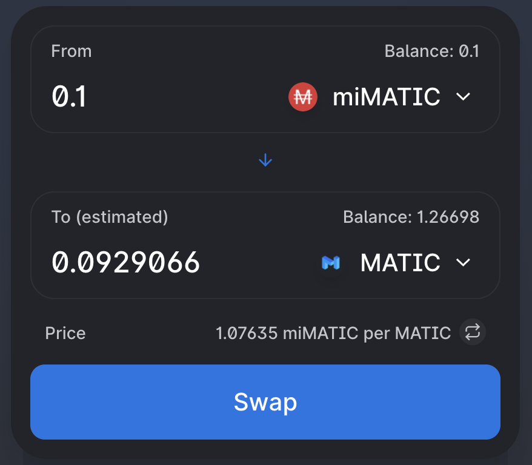

# Tạo đòn bẩy cho các token từ thị trường Aave

## Trăm nghe không bằng mắt thấy

 (1).png>)

## Tuy vậy ngàn lời nói cũng không phải là vô dụng hoàn toàn

Hình ảnh ở trên minh họa làm thế nào để có thể tận dụng Mai Finance để nâng cao khả năng sinh lợi của các khoản đầu tư tiền mã hóa của bạn

Giả sử rằng bạn thực sự tin tưởng vào MATIC và nghĩ rằng hiện giờ nó đang được định giá thấp. Bạn cho rằng nó có tiềm năng đạt 2$, 5$ hoặc 10$ cho mỗi token (và bạn có thể thực sự đúng). Tuy nhiên, là một nhà đầu tư nhỏ, bạn chỉ có số lượng token MATIC trị giá 100$ trong ví của mình trên chuỗi Polygon. Bạn đừng buồn, bởi vị thông qua hướng dẫn này, Mai Finance sẽ chỉ cho bạn làm thế nào có thể tạo ra nhiều MATIC hơn từ các token hiện tại của bạn. Holding là tốt nhưng để khoản đầu tư của bạn hoạt động sẽ tốt hơn nhiều.

### Sử dụng Aave để tăng vốn của bạn

[Aave](https://app.aave.com) là một nền tảng cho vay và đi vay hàng đầu nơi mà bạn có thể gửi MATIC (trong rất nhiều token khác). Bằng cách cho vay trên Aave, các token được ký gửi sẽ nhận thêm lãi. Ví dụ, với 100$ MATIC của bạn sẽ có khả năng tạo ra lợi  nhuận 1.2% trong khoảng thời gian 1 năm. Đôi khi Aave cũng có các chương trình cụ thể cung cấp thêm phần thưởng trên tỷ lệ APYs cho vay cơ bản.

Bởi vì MATIC bạn nằm trong bể của Aave, tiền lãi sẽ được tự động cộng dồn, có nghĩa là số MATIC sẽ tăng theo thời gian.

Bằng cách cho Aave vay token MATIC, bạn sẽ được nhận lại một lượng token MATIC tương đương được bọc bởi giao thức Aave ký hiệu là amWMATIC. Bạn có thể không thấy trực tiếp mã token trong ví trừ khi bạn thêm mã token này thủ công, tuy nhiên bạn thật sự sở hữu chúng.

### Sử dụng Mai Finance để cộng dồn các token của thị trường Aave

Mai Finance sẽ chấp nhận token amWMATIC của bạn trên trang Yield được hiện thị trên trang web. Bằng cách gửi amWMATIC vào Mai Finance, tiền của bạn sẽ được "chuyển" từ Aave sang Mai Finance. Có thể thấy rằng lợi nhuận do Mai Finance tạo ra tương đương với lợi nhuận mà bạn sẽ nhận được trên Aave.

Tuy nhiên ngoài mức lãi suất cộng dồn APY cơ bản, Mai Finance sẽ cộng dồn bất cứ phần thưởng bổ sung hiện có nào từ Aave trở lại mã token bạn đã chọn, do đó  tạo ra nhiều token hơn theo thời gian. Trong ví dụ ở trên, Aave trả 1.16% APY cho MATIC đã gửi, cũng như 3,69% APR thêm được trả bằng MATIC, tuy nhiên số APR này lại không tạo ra thêm bất cứ lợi nhuận bổ sung nào. Bằng cách gửi amWMATIC vào Main Finance, phần thưởng nhận định kỳ sẽ được đưa trở lại số vốn chính của bạn để áp dụng cả mức lãi suất cộng dồn 1.12% APY cho cả khoản APR thưởng thêm đó.

Khi bạn gửi amMATIC vào Mai Finance thì bạn sẽ nhận lại số lượng token có ký hiệu là camWMATIC. Tỷ lệ giữa các token này không hoàn toàn là 1:1 bởi vì số camWMATIC hiện có đại diện cho số cổ phần của amWMATIC có trong bể, ở đó lợi nhuận và phần thưởng được tự động cộng dồn. Cũng cần lưu ý rằng, một khi bạn gửi token amMATIC vào nền tảng Mai Finance thì token này sẽ bị xóa khỏi giao thức Aave. Tuy nhiên, khi bạn rút amMATIC ra khỏi Mai Finance thì bạn sẽ thấy chúng trở lại trên Aave. &#x20;


Chỉ cần gửi amWMATIC (hoặc bất kì amToken nào) vào nền tảng Mai Finance  sẽ cho phép bạn tạo ra doanh thu nhiều hơn so với việc cho Aave vay tiền đơn thuần. Thực tế cho thấy, lãi suất cơ bản và phần thưởng bổ sung của bạn được tự động cộng dồn, có nghĩa là bạn không phải nhận phần thưởng thủ công nữa.


### amTokens VS camToken

Rất nhiều  người gặp phải khó khăn trong việc hiểu rõ sự khác biệt giữa các amToken và các camToken. amToken là những token đại diện cho những khoản tiền bạn đang gửi trên giao thức Aave, trong đó số lượng amToken được xác định bởi số lượng token được gửi. Còn camToken là những token đại diện số cổ phần của bạn trong một bể amToken cụ thể trên Mai Finance..

Giả sử rằng khi một bể amToken được tạo ra trên Mai Finance trong đó đã có 1.000 amToken, bạn gửi 100 amToken vào trong bể đó. Vì là bể mới được tạo ra nên tỷ lệ giữa amToken và camToken là 1:1 trong đó có 10% số cổ phẩn của bạn. Giả sử rằng trong vòng một năm không ai thêm hay rút amToken, thì sau 1 năm bể này với tỷ lệ sinh lời là 4,93% bể này sẽ có 1049,3 amToken. Tuy nhiên, bạn vẫn sở hữu 10% tương đương với 100 camToken bạn đang nắm giữ. Tỷ lệ hiện tại là 1:1.0493, có nghĩa là 1 camToken tương đương với 1.0493 amToken.

### Đi vay đồng ổn định Mai

Nền tảng Mai Finance cho phép bạn vay đồng ổn định Mai khi bạn gửi tài sản thế chấp. Hiện tại Mai Finance chấp nhận nhiều loại tài sản thế chấp bao gồm cả các camToken. Trên nền tảng Mai Finance, số camToken của bạn sẽ tiếp tục sinh lời trong khi được gửi làm tài sản thế chấp, có nghĩa là số lượng tài sản cơ bản tiếp tục tăng lên theo thời gian.


Khi camToken được gửi vào các Vault thì số dư trên mục Yield sẽ là 0. Tuy nhiên, nó không có nghĩa là nó không cộng dồn lợi nhuận và phần thưởng trên Aave của bạn.&#x20;


Khi bạn điều hướng đến mục Vault của trang web, bạn sẽ được cung cấp các tùy chọn để tạo ra các Vault mới nơi bạn có thể gửi camToken của mình. Bạn cũng cần lưu ý rằng, bạn cần giữ tỷ lệ thế chấp trên nợ (CDR) ít nhất là 155% khi bạn vay MAI với camToken của mình.

**Xin lưu ý:** Trên trang này, bạn có thể thấy tài sản thế chấp của mình được quy đổi thành USD và giá trị sẽ thay đổi theo loại tài sản bạn dùng làm thế chấp, giá của token và lợi nhuận được tạo ra trong bể này.

**Mẹo:** Khi đặt tài sản thế chấp để vay MAI, bạn nên luôn vay 50% giá trị tài sản thế chấp. Lý tưởng nhất là duy trì CDR trên 200% và ​​nếu giá trị tài sản thế chấp tăng lên (token không bị mất giá trị và tiền lãi đang tăng lên) thì nó đủ an toàn. Ngoài ra, nếu bạn thêm nhiều tài sản thế chấp vào Vault, bạn sẽ không phải cố gắng khớp 200% CDR khi vay, trừ khi CDR dưới 200%. (Bạn có thể xem ví dụ với số cụ thể bên dưới).


Khi bạn gửi các tài sản có mức độ biến động giá lớn, thì bạn nên thường xuyên để ý mục Vault để chắc chắn rằng tỷ lệ CDR luôn cao hơn tỷ lệ thanh lý. Ngoài ra, bạn có thể thêm tài sản thế chấp nếu CDR giảm tới "tỷ lệ an toàn". Tùy vào danh mục đầu tư rủi ro của bạn, ngưỡng an toàn này có thể khác nhau.


Tôi đã vay 0.1 MAI tương ứng với 214.56% CDR. Bây giờ hãy thử một vài thí nghiệm với nó nhé.

### Mua nhiều MATIC hơn

Với số MAI vay được bạn có thể đến các DEX (QuickSwap hoặc SushiSwap luôn là những lựa chọn tốt) và đổi MAI của để lấy thêm MATIC

Sau khi swap, bạn có thêm MATIC.

### Lặp lại vòng lặp

Ban đầu giả sử bạn có 0,20 MATIC trong ví của mình. MATIC này hiện được gửi vào Mai Finance, tạo ra lãi suất 4,93% hàng năm và bạn có thêm 0,09 MATIC tùy ý sử dụng từ MAI mà bạn đã vay. 0,09 MATIC bổ sung này có thể được gửi trên Aave, giống như MATIC ban đầu của ban và bạn có thể bắt đầu lại quá trình tương tự.

### Lúc nào thì bạn nên thoát khỏi vòng lặp

Về trình tự các bước, cách tiếp cận tốt nhất là dừng lại khi bạn gửi camWMATIC vào các Vaults mà số lợi nhuận tạo ra không đáng kể. Làm như vậy sẽ tăng tỷ lệ tài sản thế chấp trên nợ, làm giảm nguy cơ bị thanh lý. Tuy nhiên, tùy thuộc vào số tiền cuối cùng bạn gửi, số tiền này có thể không đáng kể. Đối với số lần lặp lại, tôi thường dừng lại khi tôi ở trong khoảng 1% so với khoản đầu tư ban đầu của mình. Theo đó thì tôi sẽ tiếp tục vòng lặp cho đến khi tôi gửi 0,002 camWMATIC. Tôi cũng có thể dừng lại trước đó nếu giá gas trả cho các giao dịch trở nên lớn hơn những gì tôi có thể được bằng cách tiếp tục vòng lặp.

## Minh họa với con số cụ thể

Các ví dụ sau đây dựa trên MATIC trị giá 1.000 đô la, với các tỷ lệ CDR khác nhau để minh họa cách sử dụng đòn bẩy cho số vốn của bạn bằng cách sử dụng Mai Finance.

### 200% Tỷ lệ tài sản thế chấp trên nợ

| Số vòng lặp |   Số vốn  |    Nợ   | Doanh thu ước lượng | APY tương ứng |
| :---------: | :-------: | :-----: | :-----------------: | :-----------: |
|      1      | $1,000.00 | $500.00 |        $49.30       |     4.930%    |
|      2      | $1,500.00 | $750.00 |        $73.95       |     7.395%    |
|      3      | $1,750.00 | $875.00 |        $86.75       |     8.628%    |
|      4      | $1,875.00 | $937.50 |        $92.44       |     9.244%    |
|      5      | $1,937.50 | $968.75 |        $95.52       |     9.552%    |
|      6      | $1,968.75 | $984.38 |        $97.06       |     9.706%    |
|      7      | $1,984.38 | $992.19 |        $97.83       |     9.783%    |
|      8      | $1,992.19 |    -    |        $98.21       |     9.821%    |

Thêm nhiều nợ hơn trong vòng thứ 7 sẽ chỉ làm tăng khoản đầu tư của tôi ít hơn 10 đô la (1% khoản đầu tư ban đầu của tôi), vì vậy đây là thời điểm thích hợp để dừng lại. Mức tăng APY là không đáng kể trong giai đoạn này, và tôi giữ được tỷ lệ tài sản thế chấp trên nợ là 200,79%, đủ an toàn

Như bạn có thể dễ dàng thấy, việc sử dụng kết hợp Aave và Mai Finance cho tôi gần gấp đôi APY ban đầu và khai thác được thị trường nhiều hơn đáng kể đối với token được lựa chọn, khi so sánh với việc chỉ nắm giữ hoặc sử dụng Aave một cách riêng lẻ.

### 175% Tỷ lệ tài sản thế chấp trên nợ

| Số vòng lặp |   Số vốn  |     Nợ    | Doanh thu ước lượng | APY tương ứng |
| :---------: | :-------: | :-------: | :-----------------: | :-----------: |
|      1      | $1,000.00 |  $571.43  |        $49.30       |     4.930%    |
|      2      | $1,571.43 |  $897.96  |        $77.47       |     7.747%    |
|      3      | $1,897.96 | $1,084.55 |        $93.57       |     9.357%    |
|      4      | $2,084.55 | $1,191.17 |       $102.77       |    10.277%    |
|      5      | $2,191.17 | $1,252.10 |       $108.02       |    10.802%    |
|      6      | $2,252.10 | $1,286.91 |       $111.03       |    11.103%    |
|      7      | $2,286.91 | $1,306.81 |       $112.74       |    11.274%    |
|      8      | $2,306.81 | $1,318.18 |       $113.73       |    11.373%    |
|      9      | $2,318.18 | $1,324.67 |       $114.29       |    11.429%    |
|      10     | $2,324.67 |     -     |       $114.61       |    11.461%    |

Thêm vòng khi đến vòng 9 sẽ không làm tăng khoản đầu tư  quá 10 đô la, vì vậy đây là một điểm dừng thích hợp. CDR kết quả từ 9 vòng lặp là 175,49%. Chúng ta có thể dễ dàng nhận thấy rằng với cách tiếp cận mạo hiểm hơn, APY cuối cùng cũng hấp dẫn hơn. Điều này thường đúng với bất kỳ chiến lược DeFi nào: "Liều ăn nhiều".

### Các con số lớn hơn

Nếu bạn có khả năng toán học, thì bạn có thể tính toán khoản đầu tư cuối cùng của mình dựa trên khoản đầu tư ban đầu và tỷ lệ tài sản thế chấp trên nợ mà bạn muốn. Công thức như sau

$$
Số.vốn. cuối. cùng = Số. vốn. ban. đầu*\sum_{i=0}^{n}{\frac{100}{CDR}}^i
$$

Trong đó n là số vòng lặp bạn muốn áp dụng, và CDR là tỷ lệ tài sản thế chấp trên nợ mà bạn muốn tính theo phần trăm.

Trong ví dụ trên nếu tỷ lệ CDR mục tiêu là 200% với 7 vòng lặp, cách tính sẽ như sau:

$$
Số.vốn.cuối.cùng = 1000 *\sum_{i=0}^{7}{\frac{100}{200}}^i
$$

$$
Số.vốn.cuối.cùng= 1000 * (\frac{1}{2}^0 + \frac{1}{2}^1 + \frac{1}{2}^2 + \frac{1}{2}^3 + \frac{1}{2}^4 + \frac{1}{2}^5 + \frac{1}{2}^6 + \frac{1}{2}^7)
$$

$$
Số.vốn.cuối.cùng= 1000 * (1 + 0.5 + 0.25 + 0.125 + 0.0625 + 0.03125 + 0.015625 + 0.0078125)
$$

$$
Số.vốn.cuối.cùng = 1000 * 1.9921875 = 1992.1875
$$

Sử dụng cùng một phương pháp, bạn cũng có thể tính APY cuối cùng của mình bằng công thức bên dưới:

$$
APY tương .đương = APY ban.đầu * \sum_{i=0}^{n}{\frac{100}{CDR}}^i
$$

Một lần nữa, với CDR mục tiêu của chúng ta là 200%, APY ban đầu là 4,93% và 7 vòng lặp, chúng ta tính cùng một APY cuối cùng như được hiển thị ở trên các bảng..

$$
APY tương .đương = 4.93 * 1.9921875 = 9.821484375
$$

## Tuyên bố từ chối trách nhiệm

Mọi thứ được trình bày theo chiến lược trên dựa vào các giả định sau:

* Tỷ lệ APY của Aave ổn định và giữ nguyên trong vòng 1 năm( APY sẽ có một số phương sai nhất định).
* Tỷ lệ APR thưởng MATIC của Aave là ổn định và giữ nguyên trong vòng 1 năm (khả năng xảy ra rất thấp).
* Token MATIC giữ giá tương đối ổn định trong vòng 1 năm (rất khó xảy ra).


Luôn nhớ rằng, một chiến lược có thể hoạt động tốt tại một thời điểm cũng có thể xấu tại một thời điểm khác ( khiến bạn mất tiền).Hãy cập nhật thông tin, theo dõi thị trường, theo dõi các khoản đầu tư của bạn và luôn DYOR (hãy tự mình nghiên cứu thật kỹ). Chúc các bạn may mắn.

