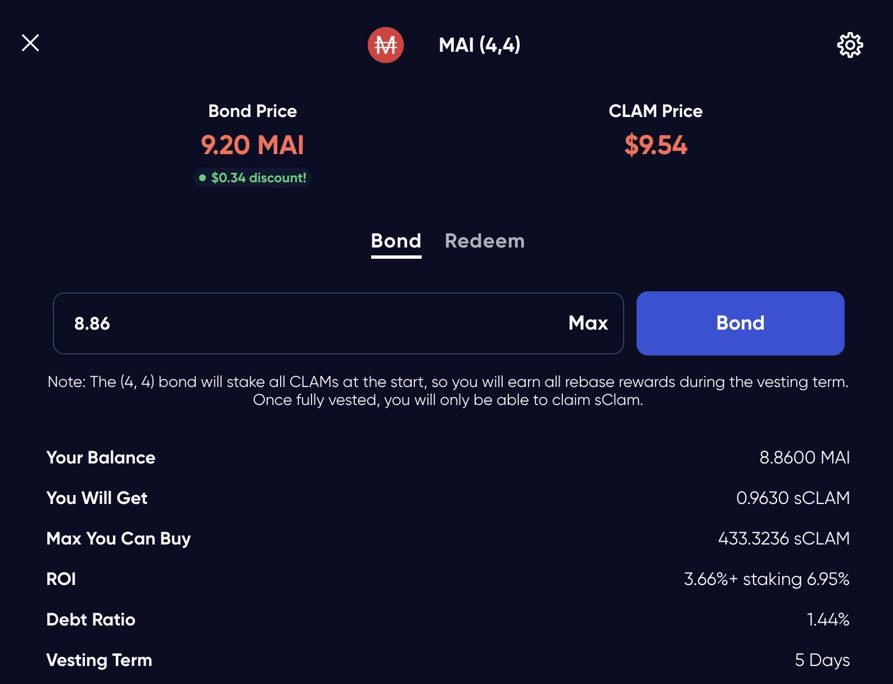

# Voi, khỉ và hải ly

## Giới thiệu

Đây có vẻ như tiêu đề của một bài thơ nhưng thật sự đây là ba con vật biểu trưng cho ba giao thức sẽ xuất hiện trong hướng dẫn này. Hôm nay chúng ta sẽ thảo luận một số những bổ sung mới nhất cho bộ sưu tập những tài sản thế chấp cho đồng ổn định MAI: mã thông báo sdam3CRV. Chúng tôi cũng sẽ hướng dẫn cách để có thể có được mã thông báo thế chấp này chi tiết ở phía dưới và sử dụng chúng cho các giao thức nhằm tăng lợi nhuận lên theo cấp số nhân.&#x20;

## Stake DAO

### Trình bày Stake DAO

[Stake DAO](https://app.stakedao.org) là một nền tảng tối ưu hóa lợi nhuận nơi người dùng có thể gửi tài sản và cho phép nền tảng sử dụng các chiến lược tốt nhất để tối đa hóa lợi nhuận cho họ. Các chiến lược được hiện thị một cách chi tiết và sắp xếp một cách khoa học nhằm tạo điều kiện cho người dùng có thể dễ dàng theo dõi và lựa chọn. Ethereum là chuối khối đầu tiên được StakeDAO chọn để ra mắt nền tảng của mình, sau đó mở rộng ra các chuỗi khỗi khác như Polygon và Avalanche. Bạn có thể tìm hiểu thêm về StakeDAO thông qua tài liệu chính thức của họ [tại đây.](https://stakedao.gitbook.io/stakedaohq/)

### Chiến lược am3CRV

Trong hướng dẫn này, chúng tôi sẽ sử dụng chiến lược tiết kiệm thụ động USD trên Polygon. Đây là chiến lược sử dụng bể 3amCRV từ [Curve Finance](https://polygon.curve.fi): bạn gửi USDT, USDC và DAI vào bể Aave từ Curve và bạn sẽ nhận được mã thông báo biên nhận là am3CRV. Với mã thông báo này bạn có thể gửi trực tiếp trên nền tảng Curve để nhận phần thưởng là CRV và WMATIC hoặc gửi lên nền tảng StakeDAO để nền tảng trực tiếp bán phần thưởng và tự động cộng dồn vào vị thế ổn định ban đầu của bạn.

Như bạn có thể thấy ở trên, khi gửi mã thông báo 3amCRV trên Curve thì APR tổng thể là 8.35% mỗi năm, tuy nhiên nếu bạn gửi mã thông báo này trên StakeDAO thì sẽ nhận được 11.1% APY mỗi năm và được trả lại mã thông báo biên lai là stam3CRV với giả định rằng phần thưởng được cộng dồn hàng ngày.&#x20;


Xin lưu ý rằng StakeDAO sẽ tính phí vận hành trên trên số lợi nhuận của bạn vào khoảng 15% tại thời điểm tháng 1 năm 2022. Ngoài ra bạn sẽ phải chịu phí rút tiền là 0.5%. Đảm bảo rằng bạn có thể hiểu điều này trước khi gửi vào bể.


Chiến lược này được coi là khá an toàn do chỉ sử dụng các đồng ổn định vì tổn thất tạm thời gần như không có. Tuy nhiên khi sử dụng chiến lược này bạn cũng cần cân nhắc về rủi ro hợp đồng giao thức từ ba giao thức chồng nhau bao gồm bể trên Aave được sử dụng trên Curve và gửi mã thông báo biên lai trên StakeDAO.

Ngoài ra bạn cũng có thể gửi mã thông báo am3CRV tại các hợp đồng khác để nhận 9% APR bao gồm mã thông báo gốc của StakeDAO là SDT. Tuy nhiên đối với hướng dẫn này chúng tôi chỉ sử dụng với cách hoàn toàn khác.&#x20;

## Mai Finance

[Mai Finance](https://app.mai.finance) là một giao thức cho vay nơi bạn có thể gửi tài sản thế chấp để vay đồng ổn định MAI. Đây không phải là nền tảng cho vay thông thường nơi mà bạn vay từ những tài sản của người cho vay mà bạn vay từ chính tài sản của mình. Để tìm hiểu thêm chi tiết về MAI Finance vui lòng tham khảo [tài liệu này.](https://docs.mai.finance)

Vào thời điểm tháng 1 năm 2022, mã thông báo sdam3CRV được chấp nhận là tài sản thế chấp để vay đồng ổn định MAI. Điều này đặc biệt tuyệt vời bởi những lý do sau:

* mã thông báo biên lai sdam3CRV chỉ bao gồm các đồng ổn định nên không bị ảnh hưởng bởi tổn thất tạm thời.
* vì giá không thay đổi nhiều nên khó bị thanh lý cho dù bạn vay ở gần mức thanh lý.
* tài sản thế chấp của bạn tăng theo thời gian bởi đây là tài sản sinh lời. Tại thời điểm viết bài APR vào khoảng 11%.&#x20;

Hầm tiền này sử dụng CDR cao ngằm khuyến khích tỷ lệ thanh lý thấp ngoài ra với CDR cao còn mang lại một số lợi ích như sau:

* Giúp bạn tránh được rủi ro thanh lý khi những sự kiện từ thị trường xảy ra đột ngột khiến bạn bị thanh lý không đáng có
* Ngoài ra tỷ lệ CDR cao tạo điều kiện để bạn có thể rút một phần vốn ra để trả nợ ( xem hướng dẫn [tại đây](../../mai-university/debt-repayment-how.md)).

Tuy nhiên, bạn có thể lựa chọn tỷ lệ cao hơn miễn là phù hợp với khả năng chịu đựng rủi ro của bạn


Kho tiền sdam3CRV đang sử dụng đồng ổn định là để làm thế chấp vì thế nó không nhận được bất cứ khoản ưu đãi khi vay nào cả, ngoài ra tỷ lệ CDR có thể giảm xuống 110% tương tự đối với kho tiền camDAI.


Với MAI vay được từ kho sdam3CRV bạn có thể tạo đòn bẩy cho vị thế của mình. Nếu bạn cần biết thêm hướng dẫn chi tiết, vui lòng truy cập tại hướng dẫn [tạo đòn bẩy cho camDAI.](camdai-beginner-strategy.md) Bạn có thể nhận được mức APR đáng kể nếu tạo đòn bẩy cho vị thế đồng ổn định của bạn. Tuy nhiên, nó lại tạo ra áp lực bán cho MAI, do vậy chúng tôi đề xuất một chiến lược thay thế dưới đây.

## OtterClam DAO

[OtterClam Finance](https://app.otterclam.finance) là một bản sao chép của OHM rất độc đáo trên chuỗi khối Polygon. Ra mắt vào tháng 11 năm 2021, Otter Clam đã có nhiều sự phát triển và hiện đang đi theo con đường GameFi.

Một trong những điều thú vị nhất đó chính là quan hệ đối tác giữa OtterClam và QiDAO- nền tảng đằng sau Mai Finance bởi phần lớn trái phiếu được phát hành trên Otter là được hỗ trợ bởi đồng ổn định MAI. Do đó, bạn có thể mua được trái phiếu được chiết khấu tại Otter bằng cách đúc MAI trên nền tảng Mai Finance. Hầu hết các bản sao chép OHM đều đưa ra mức APY rất cao nhằm thu hút nguồn vốn, Otter lại có chính sách cho phép mua sCLAM(trái phiếu đã được gửi) vẫn sinh lời ngay cả trong thời gian kỳ hạn.

Như trên hình chụp trên, bạn có thể thấy rằng thực sự thì chúng ta đang mua sCLAM  với giá chiết khấu là 3,66% với ROI trong kỳ hạn 5 ngày là 6,95%. Với APY lên tới 13.400% tại thời điểm viết bài, bạn có thể cân nhắc để đặt cổ phần, tuy nhiên trong hướng dẫn này chúng ta sẽ bán chúng và tăng vị thế ổn định trên Curve.

Nếu bạn kiểm tra giá sCLAM thì sẽ thấy rằng giá biến động rất cao giống như hầu hết các bản sao chép OHM khác, tuy nhiên chúng ta chỉ quan tâm đến việc sử dụng OtterClam làm hệ số nhân cho phần thưởng. OtterClam thiết kế để giảm giá Clam xuống 1 đô để trở thành tài sản dự trữ với vai trò như phương tiện thanh toán.


Phần thưởng đặt cọc được tích lũy vào mã thông báo sCLAM trong suốt kỳ hạn mà bạn không thể truy cập trong thời gian đó trước khi phần thưởng được trả đầy đủ sau khi kỳ hạn kết thúc.


## Chiến lược canh tác lợi suất

Như trong hầu hết cách chiến lược, điểm khởi đầu tốt nhất là từ vị thế ổn định, bằng cách đó rủi ro mất mát vô thường được giảm thiểu một cách tối đa. Vì vậy, vòng lặp bắt đầu từ việc gửi vốn đầu tư của bạn vào Curve để nhận lại mã thông báo biên lai am3CRV, sau đó được gửi lên StakeDAO để nhận lại mã thông báo biên lai sdam3CRV. Mã thông báo lại sau đó được dùng làm tài sản thế chấp để vay đồng ổn định MAI nhằm mua trái phiếu được chiết khấu trên Otter. Sau kì hạn, phần thưởng được đổi thành các đồng ổn định nhằm tăng vị thế của bạn tại Curve. Bạn cũng có thể giữ lại CLAM để nhận phần thưởng nhiều hơn, tuy nhiên trong trường hợp này chúng ta sẽ bán 100% phần thưởng thu được.

Như mọi minh họa trước đây, chúng ta sẽ giữ nguyên các chỉ số dưới đây:

* APY cho mã thông báo sdam3CRV trên Stake DAO là 11.11%
* APR cho CLAMs đặt cọc trên OtterClam là 13,400%

Chúng ta cũng không đề cập đến việc trả nợ và sẽ cho rằng tất cả các mức giá vẫn giữ nguyên. Với  số lượng USDC trị giá 100 đô la làm điểm khởi đầu và chúng ta cũng sẽ cố gắng duy trì mức CDR 235% khi có thêm MAI được vay. Cuối cùng, chúng ta sẽ giả định, vì sự đơn giản của mô phỏng này, sau mỗi kỳ hạn, có một trái phiếu MAI có sẵn với chiết khấu 0%.

### Ngày 1

Vào ngày đầu tiên, bạn có thể chuẩn bị khá nhiều thứ:

* Gửi USDC trị giá 100 đô la của bạn (hoặc USDT hoặc DAI, tùy bạn) vào Curve&#x20;
* Gửi mã thông báo biên nhận am3CRV lên StakeDAO để nhận lại sdam3CRV
* Gửi mã thông báo biên nhận sdam3CRV của bạn trên Mai Finance&#x20;
* Vay với CDR 200%, hoặc MAI trị giá 50 đô la cho khoản vay đầu tiên&#x20;
* Mua trái phiếu MAI trên OtterClam Finance

Tại thời điểm này, bạn đã sẵn sàng và sẽ phải đợi toàn bộ kỳ hạn  để thu thập phần thưởng rebase. Vào cuối Ngày 1, bạn sẽ có

| Vị thế            | giá trị ($) |
| ----------------- | ----------- |
| sdam3CRV          | 100.000     |
| khoản nợ MAI      | 50.000      |
| sCLAM             | 50.000      |
|  sdam3CRV bổ sung | 0.030       |
| sCLAM bổ sung     | 0.000       |

### Ngày  2, 3 và 4

Không có gì để nói, sdam3CRV của bạn đang thu lợi nhuận, không có gì để thu hoạch trong khi trái phiếu đang trong kỳ hạn.

### Ngày 5

Vào cuối ngày 5, trái phiếu hết kì hạn, phần thưởng được cộng dồn trong suốt kỳ hạn

| Vị thế           | giá trị($) |
| ---------------- | ---------- |
| sdam3CRV         | 100.122    |
| Nợ MAI           | 50.000     |
| sCLAM            | 53.382     |
| sdam3CRV bổ sung | 0.030      |
| sCLAM bổ sung    | 0.722      |

### Ngày 6

Bạn có một số mã thông báo sdam3CRV bổ sung từ số MAI đi vay để mua trái phiếu mới. Đây là một khoản trái phiếu trị giá rất nhỏ, tuy nhiên theo thời gian bạn sẽ mua được nhiều sCLAM với MAI của mình hơn. Đến cuối ngày thứ 6 bạn sẽ có

| Vị thế           | Giá trị($) |
| ---------------- | ---------- |
| sdam3CRV         | 100.875    |
| MAI nợ           | 50.437     |
| sCLAM            | 53.820     |
| sdam3CRV bổ sung | 0.031      |
| sCLAM bổ sung    | 0.728      |

Tại thời điểm này, số CLAM đã đặt cọc sẽ sinh lời hàng ngày bạn có thể cộng dồn kho tiền sdam3CRV hoặc có thể cộng dồn sau kì hạn 5 ngày

### Công việc hàng ngày

Giả sử bạn cộng dồn hàng ngày, công việc hàng ngày sẽ là:

* rút số tiền thưởng sau 3 lần rebase từ số CALM đã đặt cọc
* đổi thành bất kỳ loại coin ổn định nào mà bạn sẽ thu được nhiều nhất dựa trạng thái thị trường&#x20;
* gửi tiền ổn định bổ sung vào bể aave trên Curve Finance&#x20;
* gửi mã thông báo am3CRV trên Stake DAO&#x20;
* gửi mã thông báo sdam3CRV trên Mai Finance

Sau đó, cứ mỗi 5 ngày, bạn có thể thực hiện một số bước bổ sung:

* vay thêm MAI để giữ CDR là 200%
* mua thêm trái phiếu CLAM bằng MAI trên OtterClam

### Kết quả sau mỗi tháng

| ngày | sdam3CRV  | CLAM    | MAI debt |
| ---- | --------- | ------- | -------- |
| 30   | 121.249   | 64.007  | 60.625   |
| 60   | 150.866   | 78.815  | 75.433   |
| 90   | 187.350   | 97.057  | 93.675   |
| 120  | 232.294   | 119.529 | 116.147  |
| 150  | 287.659   | 147.212 | 143.830  |
| 180  | 355.863   | 181.314 | 177.931  |
| 210  | 439.882   | 223.323 | 219.941  |
| 240  | 543.383   | 275.074 | 271.691  |
| 270  | 670.884   | 338.825 | 335.442  |
| 300  | 827.950   | 417.358 | 413.975  |
| 330  | 1,021.437 | 514.101 | 510.719  |
| 360  | 1,259.790 | 633.277 | 629.894  |

### Ngày 365

Sau một năm hoàn chỉnh với giả định rằng tất cả các chỉ số bao gồm giá cả, lãi suất và tất cả mọi chỉ số đều được giữ nguyên chúng ta sẽ có:

* Số mã thông báo sdam3CRV trị giá 1.304,575 đô la trong kho tiền của bạn trên Mai Finance
* CLAM trị giá $ 655,670 trên nền tảng OtterClam
* khoản nợ MAI trị giá $ 652,288

Bạn có thể thấy rằng vào cuối năm, bạn vẫn có CDR là 200% bằng cách có thể rút tài sản thế chấp để trả nợ và mở khóa phần còn lại của tài sản thế chấp. Bạn cũng có thể trả nợ bằng cách bán CLAM và mở khóa 100% tài sản thế chấp của bạn.

Cuối cùng, từ khoản đầu tư ban đầu là 100 đô la, bạn sẽ nhận được 1.307,958 đô la và khoản nợ là 652,288 đô la, tương ứng với APY tổng thể là 1.207,958%.

Nếu bạn chỉ trích 50% phần thưởng rebase của mình từ OtterClam Finance và giữ phần còn lại đặt cọc, thì APY cao sẽ được áp dụng cho một vị thế phát triển nhanh hơn nhiều. Điều này gây ra nhiều rủi ro hơn, nhưng giả sử mọi thứ vẫn như cũ và nếu bạn chỉ bán 50% phần thưởng của mình, bạn có thể nhận được 3.608.447 đô la chia cho kho tiền của bạn và OtterClam, và khoản nợ 750.828 đô la cho APY tương đương là 2.757,619%.

## Tuyên bố từ chối trách nhiệm

Chiến lược này khá thú vị, bởi vì nó có rất ít rủi ro về mặt ban đầu. Thật vậy, tiền của bạn đang hoạt động mạnh, và số tiền ban đầu được "bảo vệ", vì vậy xác suất mất nó là rất nhỏ. Rủi ro thanh lý cũng rất nhỏ do CDR rất cao được sử dụng cho một mức chênh lệch giá rất nhỏ giữa tài sản thế chấp và tài sản đi vay. Nếu không có các công cụ bổ sung, bạn có thể sẽ nhận được \~ 12% APY nhưng rõ ràng rằng việc sử dụng các giao thức khác để tối đa hóa phần thưởng có thể dẫn đến lợi nhuận rất cao.

Tuy nhiên, hãy đảm bảo rằng bạn hiểu chiến lược đầu tư này đến từng chi tiết nhỏ nhất. Đảm bảo rằng bạn chấp nhận rủi ro hợp đồng thông minh vì chúng tôi đang sử dụng nhiều giao thức khác nhau. Ngoài ra, bạn cần hiểu cách thức hoạt động của phuộc Ohm và đừng chú ý đến giá của CLAM, chúng có thể thay đổi rất nhiều. Cuối cùng, nếu tỷ lệ có thể giữ nguyên trên Stake DAO, tỷ lệ phần thưởng trên OtterClam chắc chắn sẽ giảm theo thời gian vì ohm fork không thể duy trì APY cao như vậy trong thời gian dài. Như mọi khi, hãy đọc tài liệu về các dự án khác nhau mà bạn sẽ sử dụng và đảm bảo rằng bạn hiểu tất cả các rủi ro.


Hướng dẫn này chắc chắn không phải là lời khuyên tài chính, nó được thực hiện với mục tiêu giáo dục. Bạn cần chú ý đến sự thay đổi giá cả, cung và cầu, chương trình thưởng, ngày kết thúc, khoản lỗ vô thường, v.v. chỉ đầu tư những gì bạn sẵn sàng để có thể mất.

