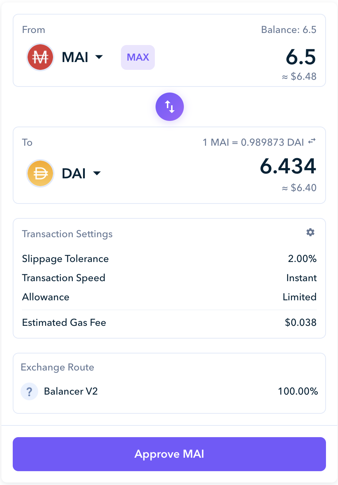

# Estratégia de principiante camDAI

## Introdução

A maioria das pessoas se assusta quando pensam em DeFi. Existem sempre fatores de risco a considerar quando estamos a falar de criptomoedas, a volatilidade do mercado pode resultar na perda de dinheiro para algumas pessoas e existem tantas possibilidades disponíveis, o que dificulta a tarefa de encontrar uma estratégia adequada para a tua métrica de risco. No entanto, se você utilizar as ferramentas corretas, algumas estratégias fáceis e de baixo risco podem te garantir bons resultados, podendo até competir com estratégias mais complexas e arriscadas.

Neste guia, vamos apresentar uma estratégia de investimento com base na alavancagem de uma _stablecoin_, ou moeda estavel, com uma pitada de risco para obter maiores taxas de juros.

## Entendendo o conceito de alavancagem

Estamos no faroeste, durante a grande corrida do ouro. Os bancos querem comprar ouro para oferecerem como empréstimo aos clientes e recebem taxas de juros nesses empréstimos, enquanto que os mineiros querem ficar ricos ao vender ouro aos bancos.

Vamos considerar que você é um mineiro, mas sem grande sorte. Apenas encontra uma pepita de ouro. No entanto, como é super inteligente, em vez de minerar, tem outro plano em mente!

Você vai a um banco e diz que tem ouro. Você pode depositar o ouro no banco como garantia, o que significa que o banco pode utilizar aquele ouro para empréstimos, fornecendo-te em troca taxas de juros pelo teu depósito.

E agora, porque você depositou ouro, o banco aceita te emprestar dinheiro, e no caso de você não conseguir pagar o emprestimo, o banco pagará a si mesmo, utilizando o ouro que você depositou. Agora, você recebe juros do ouro que depositou, e também consegue dinheiro.

Com isso, você decide visitar um colega minerador e comprar o seu ouro com teu dinheiro. Assim, ele pode focar na mineração e ele ganha dinheiro pelo ouro que ele encontrou. Todos ficam felizes.&#x20;

Você volta ao banco e deposita o ouro que comprou. Isso resulta em juros maiores, e agora o banco permite você pegar emprestado mais dinheiro, pelo ouro adicional que você depositou. Você possui mais ouro exposto ao juros bancários, e agora um pouco mais de dinheiro. Hora de voltar e visitar novamente o seu amigo para ver se ele encontrou mais ouro, e então repete-se o processo várias e várias vezes.&#x20;

Isso é o que nós chamamos de alavancagem. Agora, imagine encontrar um banco que permite você tomar emprestado, a juros de 0%. Uma excelente maquina de imprimir dinheiro, de fato. E tudo graças aos juros que você esta recebendo.

## Introduzindo as ferramentas

### AAVE

[AAVE](https://app.aave.com) é uma plataforma de empréstimos onde você consegue depositar seus ativos. Emprestando na AAVE, seus tokens depositados te geram juros. Para a nosa estratégia nós iremos depositar DAI, uma stablecoin (pareada ao dolar americano). Na AAVE, 100$ de DAI, podem geram entre 4% a 10% de retorno ao seu investimento em um prazo de 1 ano.

Ao depositar seus ativos na AAVE, você receberá uma prova de deposito. Nos nossos exemplos, como nós estamos depositando DAI, nós iremos receber tokens amDAI em nossa carteira. Você precisa guardar este comprovante pois é somente com ele que você pode posteriormente retirar os seus tokens DAI da AAVE. Esse é o banco que irá aceitar o seu ouro no nosso exemplo do faroeste.

### Mai Finance

[Mai Finance](https://app.mai.finance) é uma plataforma de emprestimentos que permite a você depositar ativos em um cofre, e transforma-los em garantia, para assim receber emprestimos do mesmo valor do cofre. Se nós voltarmos a analogia do banco, este seria o banco que permite a você tomar emprestado. Mas este emprestimo não vem do que as outras pessoas estão emprestando. Ao invez, o banco imprime dinheiro correspondente ao seu depósito pessoal, então você apenas pega emprestado sobre o que você depositou.

Mai finance aceitará o amDAI como seu [instrumento de rendimento](https://app.mai.finance/yield). O instrumento de rendimentos é apenas um intermediario entre a AAVE a o cofre na Mai Finance. Como você pode observar na foto acima, emprestar DAI irá garantir a você um retorno de 8.75% em DAI (como juros compostos), e também 2.01% de recompensas em MATIC. O instrumento de rendimento na Mai Finance irá produzir esta recompensa em MATIC e trocar por mais DAI, que será adicionado ao seu deposito de DAI. O _APY_ (_**A**nnual **P**ercentag_e _**Y**ield_, ou rendimento percentual anual) na Mai Finance está, portanto, mostrand os juros agregados da AAVE.

Após você depositar seu amDAI no instrumento de rendimento, você irá receber camDAI na sua carteira (**c**ompounding amDAI, ou amDAI com juros **c**ompostos). Este é o comprovante que indica a sua parcela na _pool_ (ou piscina de liquidez) amDAI do instrumento de rendimento. Uma observação, porque o camDAI é uma representação da sua parcela na _pool_ amDAI, a razão entre amDAI e camDAi não é de 1:1. Leia [este artigo](../investment-tutorials/leverage-aave-tokens.md#amtokens-vs-camtoken) para maiores informaçoes.

Agora, você pode [depositar seus tokens camDAI](https://app.mai.finance/vaults) em um cofre na Mai Finance, e então será possível pegar emprestado mais MAI (uma stablecoin pareada ao dolar) graças a sua garantia. No nosso exemplo do faroeste, este é o segundo banco que permite você pegar um empréstimo em dinheiro baseado na quantidade de ouro que você tem depositado no primeiro banco. Este segundo banco aceita o comprovante do primeiro banco como uma garantia em caso de você não poder pagar o empréstimo.&#x20;

### Zapper

[Zapper](https://zapper.fi/dashboard) é um canivete suiço de DeFi na rede Polygon. Esta plataforma permite a você obter rendimento em pools de liquidez, emprestar os seus ativos na AAVE diretamente de sua plataforma, e permite a você trocar algumas moedas por outras. Este é o ultimo recurso que nós utilizaremos para trocar a stablecoin MAI, que acabamos de pegar emprestado, para obter mais DAI.&#x20;

No nosso exemplo do faroeste, a Zapper seria o minerador que aceita o nosso dinheiro, em troca de mais ouro.

### Balancer

Como você pode ver na foto acima, a Zapper está utilizando o Balancer, como protocolo para operar o _swap_, ou troca em inglês. [Balancer](https://polygon.balancer.fi/#/) é um gerenciador automatizado de portfólio, provedor de liquidez, e detector de preços onde você será capaz de prover liquidez (e com isso receber taxa) ou trocar moedas utilizando as pools de liquidez.&#x20;

Para o nosso guia, nós utilizaremos o Balancer para expor os nossos investimentos a um pouco mais de volatilidade e ganhar taxas de juros maiores. Porém, isso é totalmente opcional.

## Explicando a estratégia

### Estratégia principal

Mesmo após explicar como funciona a AAVE, preferimos utilizar na nossa estratégia uma função da Mai Finance para automatizar o depósito de DAI na AAVE, o depósito de amDAI no instrumento de rendimento e o depósito de camDAI no cofre.

 

O botão `Zap in using DAI` abre uma janela popup que te permite depositar seu DAI no cofre e operar o deposito na AAVE por baixo dos panos. Isso garante uma grande economia de tempo de de gas.

Essa será a nossa primeira etapa. Assumindo que nós tempos 100$ de DAI, nós iremos depositá-los na Mai Finance em um cofre camDAI. Isso irá nos permitir pegar mais MAI emprestado, de acordo com o emprestimo inicial.&#x20;

A CDR mínima (**C**ollateral to **D**ebt **R**atio, ou Relação entre Garantia e Dívida) para a camDAI é de 110%. Isso significa que a relação entre a sua garantia (os 100$ de DAI) e o emprestimo que pegaremos precisa manter-se acima de 110%.


Caso a taxa CRD alcance o valor mínimo de 110%, entende-se que a sua garantia está perdendo valor e a sua dívida pode ser maior do que o valor da garantia. Nessa hora, seu cofre pode ser liquidado: alguém pode repagar parte da tua dívida e obter parte da sua garantia como recompensa. Entretanto, como ambos DAI e MAI são moedas pareadas ao dolar americano, o risco de obter uma grande diferença entre estes 2 ativos e muito pequeno, o que faz esta estratégia ser bem segura.


Para manter o risco de liquidação razoavelmente baixo, nós tentaremos manter a taxa CDR em 115%. Para saber o quanto de MAI podemos pegar emprestado para mantermos a taxa em 115%, nós utilizaremos a seguinte fórmula:

$$
MAI_{disponível} = \frac{Garantia_{valor} - Dívida_{valor} * Alvo_{CDR}}{Alvo_{CDR}}
$$

Com uma garantia de 100$, sem dívida ainda, e uma taxa CDR com alvo de 115%, aqui está o quanto podemos tomar emprestado:

$$
MAI_{disponível}=\frac{100 - 0*1.15}{1.15}=86.95
$$

​Você pode então trocar o MAI que você pegou emprestado por DAI e repetir o processo. Veja agora como será a relação entre sua garantia e dívida:

| Loop # | Garantia | Dívida  | Empréstimo disponível | APY equivalente | Preço de liquidação de DAI |
| ------ | -------- | ------- | --------------------- | --------------- | -------------------------- |
| 1      | 100.000  | 0.000   | 86.956                | 10.42%          | 0                          |
| 2      | 189.956  | 86.956  | 75.614                | 19.48%          | 0.512                      |
| 3      | 262.571  | 162.571 | 62.751                | 27.36%          | 0.681                      |
| 4      | 328.323  | 228.323 | 57.175                | 34.21%          | 0.765                      |
| 5      | 385.498  | 285.498 | 49.718                | 40.17%          | 0.815                      |
| 6      | 435.216  | 335.216 | 43.233                | 45.35%          | 0.847                      |
| 7      | 478.449  | 278.448 | 37.593                | 49.85%          | 0.870                      |
| 8      | 516.042  | 416.042 | 32.690                | 53.77%          | 0.887                      |
| 9      | 548.732  | 448.732 | 28.426                | 57.18%          | 0.899                      |
| 10     | 577.158  | 477.158 | 24.718                | 60.14%          | 0.909                      |
| 11     | 601.877  | 501.877 | 21.494                | 62.72%          | 0.917                      |
| 12     | 623.371  | 523.371 | 18.691                | 64.96%          | 0.924                      |
| 13     | 642.062  | 542.062 | 16.253                | 66.90%          | 0.929                      |
| 14     | 658.315  | 558.315 | 14.133                | 68.60%          | 0.933                      |
| 15     | 672.448  | 572.448 | 12.289                | 70.07%          | 0.936                      |
| 16     | 684.737  | 584.737 | 10.686                | 71.35%          | 0.939                      |
| 17     | 695.423  | 595.423 | 9.293                 | 72.46%          | 0.942                      |

Nós iremos para em 17 loops mas você pode continuar se quiser.&#x20;

No final dos 17 loops, voce teria $695.243 como garantia e $595.423 de dívida. Isso corresponde a uma taxa CDR de 116.79%, o que deve ser suficiente para nos prevenir de sermos liquidados.

Se nós considerarmos o APY de 10.42% garantido pelo instrumento de rendimento, então teremos:

$$
Juros = Garantia_{valor}*APY=695.423*10.42\%= \$72.463
$$

Se nós considerarmos o investimento inicial de apenas 100$, temos um retorno com APY de 72.463% em apenas uma única stablecoin!

### Estratégia alternativa

Para conseguir um pouco de exposição a ativos de maior volatilidade, você pode utilizar o mesmo loop acima, mas alavancar apenas 90% do MAI emprestado, e utilizar os 10% restantes para comprar outro ativo. Neste exemplo, nós iremos utilizar os 10% para comprar Qi (o token nativo da Mai Finance), e utilizar a pool de liquidez Qi-BAL no Balancer que atualmente possui um APR  (**R**eceita **P**ercentual **A**nual) de 107.12%.

Como nós estamos re-injetando menos DAI no cofre camDAI, nós também faremos menos loops. A operação se paracerá com isto:

| Loop # | Garantia | Dívida  | Qi     | Empréstimo disponível | APY equivalente | Preço de liquidação de DAI |
| ------ | -------- | ------- | ------ | --------------------- | --------------- | -------------------------- |
| 1      | 100.000  | 0.000   | 0.000  | 86.957                | 10.42%          | 0                          |
| 2      | 178.261  | 86.957  | 8.696  | 68.053                | 35.22%          | 0.537                      |
| 3      | 239.509  | 155.009 | 15.501 | 53.259                | 54.63%          | 0.712                      |
| 4      | 287.441  | 208.268 | 20.827 | 41.681                | 69.82%          | 0.797                      |
| 5      | 324.954  | 249.949 | 24.995 | 32.620                | 81.71%          | 0.846                      |
| 6      | 354.312  | 282.569 | 28.257 | 25.529                | 91.01%          | 0.877                      |
| 7      | 377.288  | 308.097 | 30.810 | 19.979                | 98.29%          | 0.898                      |
| 8      | 395.269  | 328.076 | 32.808 | 15.636                | 103.99%         | 0.913                      |
| 9      | 409.341  | 343.712 | 34.371 | 12.237                | 108.45%         | 0.924                      |
| 10     | 420.354  | 355.948 | 35.595 | 9.576                 | 111.94%         | 0.931                      |

No final dos 10 loops, você terá:

* $420.354 de DAI como garantia
* $355.948 de dívida
* $35.595 de Qi

A mesma matemática do caso anterior irá providenciar os seguintes resultados:

* Uma taxa CDR final de 118.09%, que deve ser considerada segura o suficiente pra prevenir liquidação
* $43.800 de juros em DAI, graças ao APY de 10.42% APY garantidos pelo instrumento de rendimento
* $68.139 de juros em Qi da pool de liquidez do Balancer, se nós assumirmos que você re-investir as recompensas de Qi e BAL da pool, o que resulta em juros compostos
* Um APY total de 111.94%

Esta estratégia apresenta mais riscos já que o investimento na pool de Qi-BAL pool não é garantido. Entretanto, você conseguirá certa exposição ao Qi, que te permitirá participar do protocol QiDAO. Se você utilizar as recompendas BAL na Mai Finance como garantia e pegar emprestado, você também poderá reinvestir no cofre camDAI ou na pool Qi-BAL. Se você assim fizer, você também estaria entitulado a receberer recompensas pagas em Qi toda semana.

## Conclusion

With some minimal investment and low maintenance, you can get some pretty solid results simply by leveraging your DAI. Since DAI is a stablecoin that has a lot of liquidity across multiple chains, the risk is relatively low for DAI to go off peg and for your vault to be liquidated. It's the kind of "set and forget" setup that can easily be a very good starting point for any DeFi beginner, and chances are this strategy will perform the same way in a bull market or in a bear market. Finally, we also explained how you can use the same strategy to grab a portion of your loan and test out the many possibilities that DeFi has on Polygon.

## Disclaimer

Everything presented in this tutorial is educational content made to illustrate the leverage option proposed by Mai Finance. We didn't talk about debt repayment because there are articles dedicated to this on this site, but you need to keep in mind that Mai Finance charges a 0.5% repayment fee on the borrowed amount. As always, make your own researches and don't hesitate to ask question on the [Discord server of the DAO](https://discord.com/invite/qidaoprotocol) community.


Keep in mind that a strategy that works well at a given time may perform poorly (or make you lose money) at another time. Please stay informed, monitor the markets, keep an eye on your investments, and as always, do your own research.

