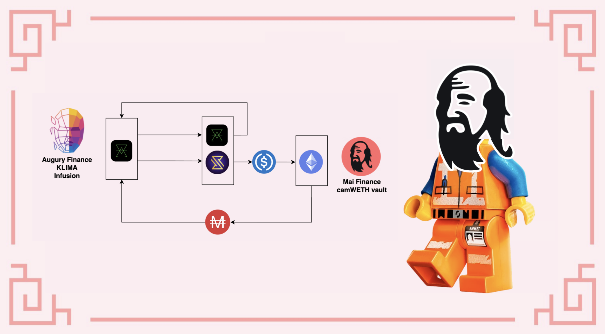

# Forks da OHM na rede Polygon: o caso da KLIMA

Se você tem seguido as notícias do mundo cripto nos últimos meses, você certamente notou muitas referencias a (3,3), e ouviu sobre projetos relacionados à OlympusDAO. Eu tentarei apresentar rapidamente o que esses projetos são, quais são as regras e princípios essenciais deles, e como você pode integrá-los às suas estratégias de investimento. Para essa última parte, nós focaremos na Klima DAO, um dos forks mais bem sucedidos na rede Polygon, que também possui uma história e objetivo interessantes.

## O que são forks da OHM

### O que é OHM e o que é um fork?

Tudo começou na rede Ethereum Mainnet com a Olympus DAO. O seu objetivo era criar uma nova moeda de reserva para competir com o dolar, exceto que diferente das outras stablecoins, esta nova moeda teria um valor flutuante. O token nativo (OHM) precisa ser respaldado por uma cesta de diferentes ativos, entretanto o tokenomics (economia de token) do projeto faz o valor da OHM ser definido pelo mercado.

A Olympus DAO foi lançada em Março de 2021 e ainda é um projeto muito bem sucedido na Mainnet. O TVL é representado em duzias de milhōes de dólares, e o preço de OHM tem se mantido bem alto. Por conta deste sucesso, o projeto foi copiado, e varios forks (ou seja, cópias) da Olympus DAO apareceram em varias blockchains.

### Visão geral do tokenomics

Esta seção será um pouco mais técnica do que nós geralmente apresentamos em nossos outros guias, mas para entender o sucesso da Olympus e outros forks da OHM, é importante entender como eles funcionam.

A ideia principal da Olympus é aumentar o seu tesouro o máximo possivel através da venda do seu token nativo com um desconto (bond), e manter o fornecimento em circulação o mais baixo possível para manter um preço alto. Isso é alcançado oferecendo recompensas bem altas aos stakers, e tendo praticamente controle total da liquidez.

* **Bonding:** o protocolo irá oferecer tokens nativos com desconto. O preço é pago utilizando diferentes ativos que são usados para respaldar o token nativo. No exemplo da Olympus DAO, o token OHM é 100% respaldado por alguns tokens que incluém principalmente DAI, então bonds podem ser comprados utilizando DAI diretamente, ou usando tokens LP DAI-OHM (e posterioremente tokens adicionais incluindo FRAX). Quando pessoas compram os tokens nativos usando os ativos do tesouro ou tokens LP, o pagamento vai diretamente ao tesouro, permitindo ao protocolo cunhar mais tokens, e portanto sobreviver por mais tempo. A unica coisa é que o token com desconto é liberado por um período de vesting, o que significa que o usuário que comprou o token através do bonding não será capaz de usá-lo imediatamente.&#x20;
* **Staking:** após o bonding, usuários irão coletar os tokens nativos e terão a escolha entre vendê-los ou fazer staking com eles. Para ter certeza que a segunda opção será a preferida, o protocolo oference recompensas que chegam a ser insanas aos stakers (estamos falando de 1.2% diariamente). O objetivo por trás destes APRs altíssimos é conseguir uma proporção de staking próxima a 100%. Se não há muitos tokens em circulação, o preço é jogado para cima, e aliado a altas recompensas, torna-se mais interessante ainda o staking. Como observação, um preço que se valoriza também ajudará a manter altas taxas de recompensas.
* **Aumentar o tesouro e controlar a liquidez:** O tesouro é expandido através do bonding, e do fato de que os tokens nativos podem passar pelo bonding com tokens LP que são praticamente controlados pelo protocolo. Estes tokens LP são usados para coletar taxas das transaçōes para os usuários que preferem comprar o token nativo a mercado em seu preço total, ao invés de obter o desconto oferecido pelos bonds (veja o próximo capítulo para detalhes).
* **Comprar de volta e queimar:** A maioria dos forks da OHM incluem um mecanismo que irá comprar de volta os tokens nativos e queimá-los em situaçōes específicas. Problemas ocorrem quando usuários estão vendendo o token nativo, que joga o preço para baixo. Porém, se pessoas venderem seus tokens, o APY aumenta já que o número de tokens cunhados permanece o mesmo para menos tokens em staking. Mas mesmo com um APY mais alto, se ninguém compra e faz staking dos tokens vendidos, o protocolo pode comprá-los de volta de volta do mercado para criar pressão compradora, levantar os preços, e manter a circulação do token baixa. Tokens que são comprados de volta são simplesmente destruídos. De fato, como parte do tesouro foi usado para adquirir estes tokens, mantê-los no tesouro ou distribuí-los iria, na verdade, acabar diluindo o tesouro, o que por si só iria reduzir a taxas de recompensas, ou afetar o período de tempo em que o protocolo poderia funcionar.

Você pode encontrar mais conteúdo sobre o conceito da Olympus DAO e seu tokenomics aqui:

* [DeFi 2.0 - A new Narrative? Olympus DAO, Tokemak Explained](https://www.youtube.com/watch?v=l0vRTi8\_FRk)
* [WTF is Olympus DAO](https://newsletter.banklesshq.com/p/wtf-is-olympus-dao)

### Bonding VS Staking

Porque alguém pagaria por um token se há uma versão mais barata dele por meio de um bond? Isso é uma pergunta legítima, e a resposta irá depender do desconto oferecido pelo bond.

Como nós iremos trabalhar com a KlimaDAO, vamos comparar o ato de comprar e fazer staking com o bonding:

Se alguém compra Klima diretamente do mercado e faz staking por 5 dias (a duração do periodo de vesting do bond), o ROI (**R**eturn **O**n **I**nvestment, Retorno Sobre Investimento) será de 8.51%. Se alguém preferir o bond, o ROI máximo seria de 5.47% ao prover BCT/KLIMA.

Isso significa que, com uma quantia de $100, você teria após 5 dias:

* $108.51 com a primeira opção
* $105.47 com a segunda opção

Entretanto, é importante entender que Klima que passa por bonding é liberada ao longo do período de vesting. Portanto, você pode colher a Klima do vesting e fazer staking com elait's important to understand that bonded Klima are released over the vesting period. Hence you can harvest the vested Klima and stake it in order to profit from rebases (reward distribution). Since you will only get rewards for whatever you staked during the vesting period, and since there are 15 rebases during the 5 days for the bond to be fully released, we can assume that you can potentially harvest 6.67% before each one of the 15 rebases. Assuming you will harvest and stake at the beginning of each rebase, you would get this:

| rebase # | Amount staked | Reward | Total reward |
| -------- | ------------- | ------ | ------------ |
| 1        | 7.031         | 0.038  | 0.038        |
| 2        | 14.063        | 0.077  | 0.116        |
| 3        | 21.094        | 0.116  | 0.232        |
| 4        | 28.125        | 0.155  | 0.397        |
| 5        | 35.157        | 0.193  | 0.580        |
| 6        | 42.188        | 0.232  | 0.812        |
| 7        | 49.219        | 0.271  | 1.083        |
| 8        | 56.251        | 0.309  | 1.392        |
| 9        | 63.282        | 0.348  | 1.740        |
| 10       | 70.313        | 0.387  | 2.127        |
| 11       | 77.345        | 0.425  | 2.552        |
| 12       | 84.376        | 0.464  | 3.016        |
| 13       | 91.407        | 0.503  | 3.519        |
| 14       | 98.439        | 0.514  | 4.061        |
| 15       | 105.470       | 0.580  | 4.651        |

At the end of the vesting period, the 5.47% ROI is respected, but staking rewards also added an extra 4.65% (that haven't been compounded for simplicity), resulting in a 10.12% ROI. This means that bonding is actually more interesting than staking directly, even if the bonding ROI seems lower than the staking ROI.

The total reward you will get by staking N times over the vesting period (with Nmax = 15 at most) is:

$$Reward_{total} = \sum_{i=1}^{N}{\frac{Investment * i * (1 + APR_{Vesting})}{N} * APR_{staking}}$$

You can then run your own simulations in order to verify if it's better to buy and stake, or to bond. For our example, with a staking ROI of 8.51% over 5 days, a bonding discount of 3.95% with 15 rebases would be better (giving an equivalent ROI of 8.52%).


You can run the same simulation with harvest + stake only once a day instead of 3 times a day before each rebase. For the same APY as above, you would need a bonding discount of 6.76% to get a better ROI than staking.



You can find a simulator for your bonding VS staking calculation under the form of [a google spreadsheet](https://docs.google.com/spreadsheets/d/1MTKTbf-ZAihGbEax3WEwkxToG7IlPKlwmYq59O3KG2o/edit#gid=0) you can copy and edit at your will. Note that this page is NOT maintained nor provided by the QiDAO community.


### The special case of Klima DAO

The specificity that makes Klima DAO different from other Ohm-forks is the main asset backing the Klima token: the BCT token, provided by the [Toucan Protocol](https://toucan.earth). The BCT (**B**ase **C**arbon **T**onne) is actually representing investments in the real world to decarbonize the earth, turning carbon offsets from the real world into tokens. You can read a lot more about how it works in the [official documentation](https://docs.toucan.earth/protocol/introduction/defi-refi) of Toucan.

BCT is then used by the [Klima DAO app](https://dapp.klimadao.finance) to mint the KLIMA tokens, the same way DAI is used by the Olympus DAO to mint OHM. In other words, Klima acts like a Carbon sink, providing real life funds to fight climate change. More info can be found on the [Klima website](https://www.klimadao.finance) and [documentation](https://klima-dao.gitbook.io/klima-dao/), and you can come and discuss ways to make crypto greener on the Discord server of QiDAO.


One of the main differences between Olympus and Klima is that BCT doesn't have a stable price. This presents a higher risk than for forks using stable coins to build their treasury, however it's assumed that environmental problems will be more and more important, and there will be more and more projects trying to extract carbon from the atmosphere, which would in turn increase the overall value of BCT.


## Strategy 1: sKLIMA leverage, or full (9,9)

Without going deep into the [(3,3) game theory](https://en.wikipedia.org/wiki/Nash\_equilibrium), (9,9) represent a situation where one is leveraging a staked position. This is actually possible because Klima DAO will provide a sKLIMA token as a proof of deposit that some platform will accept as a collateral for a possible loan. Let's see the details of it.

### The leverage loop using MarketXYZ and Klima

The idea is to get an initial amount of KLIMA token that you can deposit on Klima DAO. This will allow you to get very high APY (as of writing, the APY is 38,873.08%, or 601% APR or a daily gain of 1.68%) and by depositing your KLIMA token, you will get sKLIMA as a proof of deposit.

This sKLIMA token can be used on Market XYZ in the [Green Leverage Locker](https://polygon.market.xyz/pool/5) which will allow you to take a loan against this deposit.


As a side note, Mai Finance partnered with Market XYZ and seeded the green locker pool with 1M MAI to guarantee low interest rates when you borrow MAI against your sKLIMA.


It's not an obligation for you to borrow MAI, you can actually borrow whatever token with the lowest interest rate, but you need to keep in mind that you will have to pay fees on your loan, and the faster you repay your loan, the less fees you will pay.

With your loan, you will be able to buy more KLIMA tokens and repeat the loop.

You will notice that the APY on sKLIMA will largely compensate the interests on your loan.


There's a minimum amount to borrow on Market.xyz, please check the limit when you want to apply this strategy.


### Expected results

Market XYZ will also have some liquidation levels, meaning that if your collateral value goes below the liquidation level, there's a risk for you to lose your collateral. In order to lower the risk of liquidation, the following simulation assumes that you will keep an C/D ratio of 250%, and that you invest an initial $1,000 of KLIMA tokens at 38,873% APY to borrow MAI at 20.49% interest

| sKLIMA ($) | MAI loan ($) | eq. APY (%) | interests ($) |
| ---------- | ------------ | ----------- | ------------- |
| 1,000.00   | 400.00       | 38,873      | 81.96         |
| 1,500.00   | 560.00       | 54,455      | 114.74        |
| 1,560.00   | 624.00       | 60,642      | 127.86        |
| 1,624.00   | 649.60       | 63,129      | 133.10        |
| 1,649.60   | 659.84       | 64,125      | 135.20        |
| 1,659.84   | 663.94       | 64,523      | 136.04        |
| 1,663.94   | 665.57       | 64,682      | 136.38        |

Of course, it's possibly enough to stop after 3 loops since the equivalent APY won't grow much past that.

As a side note, because the initial investment is $1,000,the value you will get at the end of 1 year would be $646,820.00, assuming everything stays the same. In other words, you invest $1,000, you will need to repay $665.57 with an additional $136.38 (an accumulated debt of $801.95) but you will also earn $646,820.

You can also see that the value of your sKLIMA position is growing very quickly (around 8% every 5 days), which means you can also increase your debt at this point and leverage even more for additional gains.

### Capturing benefits value and repaying your loan

One of the main issues with Ohm-fork projects is that it assumes that everybody is staking and nobody sells. But, if nobody sells, nobody gets any benefits, and in most cases, the first to sell will get the cake.

For any investment strategy, it's important to capture the value of your gains. You can do it by withdrawing a part of your sKLIMA position on Market XYZ and get back KLIMA that you can sell.

If you invest $100 and operate the 7 loops as above, your investment in KLIMA would have generated $67.11 after 31 days, which means you can fully repay your loan with interest in 1 single month. If you do so, you will start again with 166$ the next month and no outstanding debt. Just keep an eye on the borrowing APR that can get pretty high on Market XYZ.

## Strategy 2: Continuous Investment, or full (4,4)

Once again, (4,4) is related to game theory and reserve currencies, and indicate people who bond their tokens then stake them. In this strategy, we will see how we can use Klima and Augury to purchase bonds regularly, and stake them continuously.

### The investment loop using Augury and Mai Finance

We are still using Klima, but this time we're using an [infusion from Augury Finance](https://augury.finance/infusions) in order to automate the extraction of the value of Klima. By depositing your KLIMA tokens in the infusion, the algorithm in charge of the infusion will perform the following actions after each rebase:

* 50% of the KLIMA harvested is restaked to increase your sKLIMA position
* 50% of the KLIMA harvested is sold for USDC added to the NFTM pool on Augury, and distributed to you as NFTM tokens

NFTM can then either be held while it increases in value, or redeemed for its USDC value. In other words, it doesn't matter if the KLIMA token loses value after a rebase since its value is captured and stored as NFTM.

After redeeming the USDC value of your NFTM rewards, you can then buy the token of your choice and store it in a vault in Mai Finance. The example above is using a camWETH vault, but you can really use any vault you like. The idea is to be able to use the vaults on Mai Finance to borrow MAI and buy new bonds on Klima DAO to repeat the loop. Then you can harvest the KLIMA tokens and inject them in Augury. Keep in mind that bonds are vesting little at a time, so it's totally possible to harvest regularly and stake on Augury before your bond is totally vested.

### Expected results

Assuming you invest $100 like in the previous example, and place it directly in the Augury infusion, that the APR of the Klima infusion is 552.94% (current value as of writing), and that you want to keep a C/D ratio on the camWETH vault of 240% and a APY of 2.19% on the camWETH vault, here are the results over one year:

| day | sKLIMA ($) | wETH ($)  | MAI loan ($) |
| --- | ---------- | --------- | ------------ |
| 30  | 137.751    | 27.708    | 11.545       |
| 60  | 189.776    | 64.883    | 27.035       |
| 90  | 261.474    | 116.150   | 48.396       |
| 120 | 360.282    | 186.835   | 77.848       |
| 150 | 496.453    | 284.283   | 118.451      |
| 180 | 684.115    | 418.613   | 174.422      |
| 210 | 942.737    | 603.771   | 251.571      |
| 240 | 1,299.152  | 858.978   | 357.907      |
| 270 | 1,790.339  | 1,210.720 | 504.466      |
| 300 | 2,467.258  | 1,695.500 | 706.458      |
| 330 | 3,400.140  | 2,363.625 | 984.844      |
| 360 | 4,685.775  | 3,284.424 | 1,368.510    |

Once again, assuming that all rates and prices stay the same, at the end of the year you would have

* $4,684.775 worth of KLIMA tokens
* $3,284.424 worth of wETH
* and outstanding debt of $1,368.510

Which is an equivalent APY of 6,866.46%. This is far from the 38,705.13% advertised by KLIMA, but still pretty impressive for a $100 investment. Also, a good load of your gains have been converted into wETH in a vault on Mai Finance, and your loan on the application will get you some additional Qi Tokens.


If this strategy has a much lower APY than pure (9,9), it's also a relatively affordable one since you can enter the loop with as much as KLIMA you want.


## Disclaimer

Everything presented in this document is pure theory and is proposed for educational purposes. The biggest issue with projects like Olympus and Klima is that, once again, the first user to sell will profit from the high price. If the first sell is massive (because gains are massive), it can snowball quickly into a panic effect that can very well kill the price of the KlIMA token. However, in this case, the APY would skyrocket, meaning that users who don't sell will benefit from very high rewards, so that when the APY attracts new users, the ones who held will be big winners.

It's also good to note that the project can only continue to print tokens as long as additional funds are injected into the treasury.

So the risk can be very high if you don't extract some benefits from time to time in order to lower the risks.

As a final note, pay attention that ohm-forks are the new trend, but most projects may fail, and a lot of these forks are not solid projects. Because of their nature, they are not verified by RugDoc yet, and it may be very complicated to identify real applications from pure scam.


Keep in mind that a strategy that works well at a given time may perform poorly (or make you lose money) at another time. Please stay informed, monitor the markets, keep an eye on your investments, and as always, do your own research.

